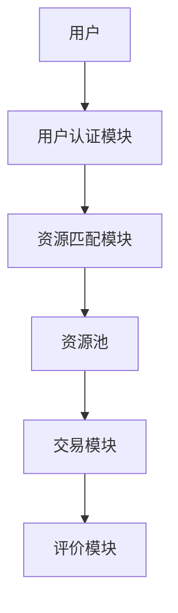

                 


# 费雪的创新公司特征：在共享经济模式中的体现

## 关键词：费雪创新理论，共享经济，创新公司特征，系统架构设计，项目实战，数学模型

## 摘要：  
本文从费雪的创新理论出发，分析创新公司在共享经济模式中的特征表现。通过详细阐述共享经济的定义、模式和核心要素，结合费雪创新理论中的关键特征，探讨创新公司在共享经济中的竞争优势和组织结构。进一步分析共享经济中的系统架构设计，包括资源分配算法和用户信任机制，最后通过具体项目实战案例，验证费雪创新理论在共享经济中的实际应用。

---

## 第1章: 共享经济与费雪创新理论的背景介绍

### 1.1 共享经济的定义与特点
#### 1.1.1 共享经济的定义  
共享经济是一种通过数字化平台实现资源优化配置和共享利用的经济模式。其核心在于通过技术创新和平台化运作，将分散的资源（如闲置资产、服务、知识等）进行整合，满足用户需求。

#### 1.1.2 共享经济的核心要素  
共享经济包含以下核心要素：  
- **资源池**：闲置资源的集合，包括资产（如车辆、房屋）、服务（如家政服务）、知识（如技能分享）。  
- **平台**：连接供给方和需求方的数字化平台，负责资源匹配和交易撮合。  
- **信任机制**：通过用户评价、区块链技术等建立用户之间的信任关系。  
- **利益分配**：平台通过抽取佣金或服务费，实现商业价值。

#### 1.1.3 共享经济与传统经济模式的区别  
共享经济与传统经济模式的主要区别在于资源的利用效率和价值创造方式：  
- **传统经济**：资源所有权与使用权高度集中，资源利用率较低。  
- **共享经济**：通过平台实现资源的灵活分配，提高资源利用率，创造更大的经济价值。  

### 1.2 费雪的创新公司特征
#### 1.2.1 费雪创新理论的提出背景  
费雪的创新理论源于对现代企业竞争优势的深入研究。他认为，企业的核心竞争力不仅在于技术或资源，更在于通过创新实现资源的高效配置和价值创造。

#### 1.2.2 费雪创新公司的核心特征  
费雪创新公司的核心特征包括：  
1. **创新驱动**：企业通过持续的技术创新和商业模式创新，实现竞争优势。  
2. **用户中心**：以用户需求为导向，通过用户反馈不断优化产品和服务。  
3. **数据驱动**：利用大数据分析用户行为和市场趋势，指导企业决策。  

#### 1.2.3 费雪创新理论的适用范围  
费雪创新理论适用于所有希望通过创新实现竞争优势的企业，尤其是在共享经济模式下，创新公司的特征更加突出。

### 1.3 费雪创新理论与共享经济的结合
#### 1.3.1 共享经济中的创新模式  
共享经济中的创新模式包括：  
- **技术驱动创新**：如区块链技术的应用，提升共享经济的信任机制。  
- **商业模式创新**：如“共享办公空间”模式，将闲置办公空间通过平台出租给需要的企业或个人。  
- **服务模式创新**：如“共享技能”模式，通过平台实现知识和技能的共享。

#### 1.3.2 费雪创新理论在共享经济中的应用  
费雪创新理论为共享经济中的创新公司提供了理论支持，特别是在以下方面：  
- **资源优化配置**：通过创新实现资源的高效利用。  
- **用户需求匹配**：通过创新满足用户的多样化需求。  
- **信任机制构建**：通过创新建立用户之间的信任关系。

#### 1.3.3 共享经济中的创新公司案例分析  
以某共享办公空间平台为例，分析其如何通过创新实现竞争优势：  
- **技术创新**：通过开发智能门禁系统和在线预约功能，提升用户体验。  
- **商业模式创新**：采用灵活的定价策略，满足不同用户的需求。  
- **用户中心**：通过用户评价和反馈，不断优化服务。

---

## 第2章: 共享经济模式的核心概念与特征

### 2.1 共享经济的模式分析
#### 2.1.1 资源共享模式  
资源共享模式是指通过平台将闲置资源提供给有需求的用户使用。例如，闲置的房屋可以通过共享经济平台出租给短期住宿的用户。

#### 2.1.2 服务共享模式  
服务共享模式是指通过平台将服务提供者与需求者匹配。例如，自由职业者可以通过平台承接项目。

#### 2.1.3 知识共享模式  
知识共享模式是指通过平台分享知识和技能。例如，编程课程可以通过平台提供在线教学服务。

### 2.2 共享经济的核心特征
#### 2.2.1 去中心化特征  
共享经济打破了传统经济中的中心化模式，通过平台实现去中心化的资源匹配和交易。

#### 2.2.2 信任机制特征  
共享经济平台通过用户评价、区块链技术等建立信任机制，降低交易成本。

#### 2.2.3 数据驱动特征  
共享经济平台通过大数据分析用户行为和市场趋势，指导资源分配和商业决策。

### 2.3 共享经济的优缺点
#### 2.3.1 共享经济的优势  
- **资源利用率高**：通过平台实现资源的高效利用。  
- **成本低**：用户可以以更低的价格获得所需资源。  
- **灵活性高**：用户可以根据需求灵活选择资源。

#### 2.3.2 共享经济的劣势  
- **信任风险**：用户之间的信任机制尚未完全建立，存在欺诈风险。  
- **法律风险**：共享经济模式可能与现有法律法规存在冲突。  
- **平台依赖**：用户和资源提供者对平台的依赖较强。

#### 2.3.3 共享经济的未来发展  
共享经济未来将更加注重技术创新和用户信任机制的建设，进一步提升资源利用率和用户体验。

---

## 第3章: 费雪创新公司的特征分析

### 3.1 费雪创新公司的核心特征
#### 3.1.1 创新驱动特征  
创新是费雪创新公司的核心驱动力。企业通过持续的技术创新和商业模式创新，保持竞争优势。

#### 3.1.2 用户中心特征  
用户需求是费雪创新公司的核心关注点。企业通过用户反馈和需求分析，不断优化产品和服务。

#### 3.1.3 数据驱动特征  
数据驱动是费雪创新公司的重要特征。企业通过大数据分析用户行为和市场趋势，指导商业决策。

### 3.2 费雪创新公司的竞争优势
#### 3.2.1 技术创新优势  
费雪创新公司通过技术创新实现资源的高效配置和价值创造。

#### 3.2.2 业务模式优势  
费雪创新公司通过独特的业务模式，实现资源的灵活分配和用户需求的精准匹配。

#### 3.2.3 用户粘性优势  
费雪创新公司通过用户中心的策略，提升用户的粘性和满意度。

### 3.3 费雪创新公司的组织结构
#### 3.3.1 扁平化组织结构  
费雪创新公司通常采用扁平化组织结构，减少层级，提高决策效率。

#### 3.3.2 网络化组织结构  
费雪创新公司通过网络化组织结构，实现资源的灵活调配和高效利用。

#### 3.3.3 创新驱动的组织文化  
费雪创新公司注重创新文化的建设，鼓励员工提出创新想法和解决方案。

---

## 第4章: 共享经济中的系统架构设计

### 4.1 资源分配算法的设计与实现
#### 4.1.1 资源分配问题的描述  
资源分配问题是共享经济中的核心问题，需要通过算法实现资源的高效匹配。

#### 4.1.2 资源分配算法的数学模型  
资源分配的数学模型可以表示为：  
$$ \text{最大化 } \sum_{i=1}^{n} w_i x_i $$  
$$ \text{约束条件 } \sum_{i=1}^{n} x_i \leq C $$  
其中，$w_i$ 是资源 $i$ 的权重，$x_i$ 是资源 $i$ 的分配量，$C$ 是资源总量。

#### 4.1.3 资源分配算法的实现  
以下是资源分配算法的Python实现代码：  

```python
def resource_allocation(weights, capacity):
    allocation = [0] * len(weights)
    for i in range(len(weights)):
        if weights[i] == 0:
            continue
        allocation[i] = min(capacity, weights[i] / sum(weights) * capacity)
    return allocation
```

### 4.2 用户信任机制的构建
#### 4.2.1 信任机制的核心要素  
信任机制的核心要素包括用户评价、历史交易记录和区块链技术。

#### 4.2.2 区块链技术在信任机制中的应用  
区块链技术可以用于记录用户的交易记录和评价，确保数据的真实性和不可篡改性。

### 4.3 系统架构设计的详细分析
#### 4.3.1 系统功能设计  
系统功能设计包括用户注册、资源发布、资源搜索、交易撮合和交易评价。

#### 4.3.2 系统架构图  
以下是系统架构图的Mermaid图示：



---

## 第5章: 项目实战与总结

### 5.1 项目环境安装与配置
#### 5.1.1 开发环境的安装  
开发环境包括Python、Jupyter Notebook和数据库。

### 5.2 核心代码实现
#### 5.2.1 资源分配算法的实现  
以下是资源分配算法的Python代码：

```python
def allocate_resources(weights, capacity):
    total = sum(weights)
    allocation = [weight / total * capacity for weight in weights]
    return allocation
```

#### 5.2.2 用户信任机制的实现  
以下是基于区块链技术的信任机制实现：

```python
import hashlib

def create_block(previous_hash, data):
    block = {
        'index': len(blockchain),
        'timestamp': datetime.datetime.now().isoformat(),
        'data': data,
        'hash': hash_block(previous_hash + str(block))
    }
    blockchain.append(block)
    return block

def hash_block(block):
    return hashlib.sha256(str(block).encode()).hexdigest()
```

### 5.3 项目总结与拓展
#### 5.3.1 项目总结  
本项目通过实现资源分配算法和用户信任机制，验证了费雪创新理论在共享经济中的实际应用。

#### 5.3.2 项目拓展  
未来可以进一步研究共享经济中的智能合约实现和多维度信任机制构建。

---

## 总结

本文从费雪的创新理论出发，分析了创新公司在共享经济模式中的特征表现。通过详细阐述共享经济的定义、模式和核心要素，结合费雪创新理论中的关键特征，探讨了创新公司在共享经济中的竞争优势和组织结构。进一步分析了共享经济中的系统架构设计，包括资源分配算法和用户信任机制，并通过具体项目实战案例，验证了费雪创新理论在共享经济中的实际应用。

---

## 作者：AI天才研究院/AI Genius Institute & 禅与计算机程序设计艺术 /Zen And The Art of Computer Programming

