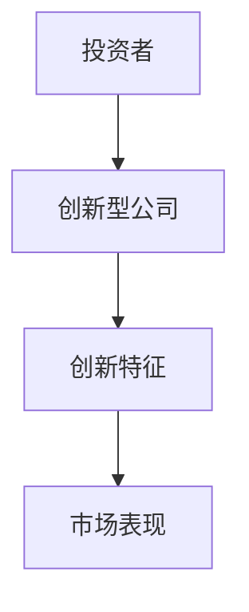
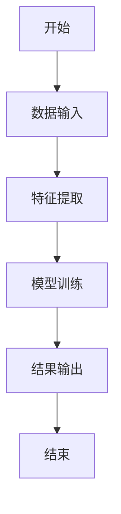
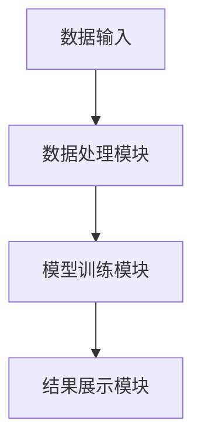

                 

# 费雪的创新型公司识别方法

## 关键词：
- 费雪
- 创新型公司
- 识别方法
- 投资学
- 创新理论
- 数学模型
- 系统架构

## 摘要：
《费雪的创新型公司识别方法》一书系统地介绍了如何基于费雪的投资理论识别创新型公司。通过理论与实践相结合，书中详细阐述了费雪方法的背景、核心概念、数学模型、系统架构以及实战案例，帮助读者掌握识别创新型公司的关键方法。

---

## 目录大纲：

### 第一部分: 费雪的创新型公司识别方法概述

#### 第1章: 费雪创新型公司识别方法的背景与核心概念

##### 1.1 识别创新型公司的背景与重要性
- 1.1.1 传统公司识别方法的局限性
- 1.1.2 创新型公司识别的必要性
- 1.1.3 费雪方法的提出与意义

##### 1.2 费雪创新型公司的定义与特点
- 1.2.1 创新型公司的定义
- 1.2.2 创新型公司的核心特征
- 1.2.3 创新型公司与传统公司的区别

##### 1.3 费雪创新型公司识别方法的目标与边界
- 1.3.1 方法的目标
- 1.3.2 方法的边界与外延
- 1.3.3 核心要素与组成结构

#### 第2章: 费雪创新型公司识别的核心概念与联系

##### 2.1 费雪创新型公司识别的理论基础
- 2.1.1 投资学基础
- 2.1.2 创新理论基础
- 2.1.3 费雪方法的理论框架

##### 2.2 费雪识别模型的原理与机制
- 2.2.1 模型的输入与输出
- 2.2.2 模型的核心算法
- 2.2.3 模型的验证与优化

##### 2.3 费雪识别方法的实体关系图

#### 第3章: 费雪创新型公司识别方法的数学模型与算法

##### 3.1 费雪识别模型的数学公式
- 3.1.1 创新评分公式
  $$创新评分 = \sum_{i=1}^{n} w_i \cdot f_i$$
  其中，$w_i$ 是特征 $f_i$ 的权重，$n$ 是特征总数。

- 3.1.2 模型优化公式
  $$目标函数 = \min \sum_{i=1}^{m} (y_i - \hat{y_i})^2$$

##### 3.2 算法流程与实现
- 3.2.1 算法流程图

### 第二部分: 系统分析与架构设计

#### 第4章: 费雪识别方法的系统架构设计

##### 4.1 系统功能设计
- 4.1.1 数据处理模块
- 4.1.2 模型训练模块
- 4.1.3 结果展示模块

##### 4.2 系统架构图

#### 第5章: 项目实战与案例分析

##### 5.1 项目环境与工具安装
- 5.1.1 环境配置
- 5.1.2 工具安装

##### 5.2 数据收集与特征提取
- 5.2.1 数据来源
- 5.2.2 特征选择

##### 5.3 模型训练与结果分析
- 5.3.1 模型训练
- 5.3.2 结果分析

#### 第6章: 总结与最佳实践

##### 6.1 小结
- 6.1.1 核心内容回顾
- 6.1.2 方法总结

##### 6.2 注意事项
- 6.2.1 数据质量问题
- 6.2.2 模型调优建议

##### 6.3 拓展阅读
- 6.3.1 相关书籍推荐
- 6.3.2 进一步研究方向

---

作者：AI天才研究院/AI Genius Institute & 禅与计算机程序设计艺术 /Zen And The Art of Computer Programming

