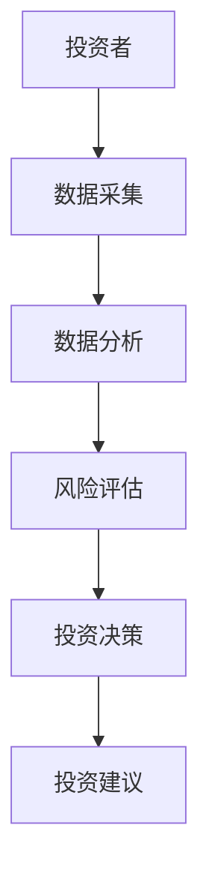

                 


# 费雪的十五个投资点：选股策略详解

> 关键词：费雪投资理论、选股策略、投资点分析、财务分析、价值投资

> 摘要：本文详细解析了费雪的十五个投资点，从公司盈利能力、财务状况、管理团队、行业地位等多个维度，系统地分析了选股策略的核心要素。通过实际案例和数学模型，帮助读者深入理解如何在投资中应用这些理论，从而做出更明智的投资决策。

---

# 第一部分: 费雪投资理论基础

## 第1章: 费雪投资理论概述

### 1.1 费雪的生平简介
菲利普·费雪（Philip Fisher）是20世纪著名的投资理论家，被誉为“成长型投资之父”。他于1906年出生于美国加利福尼亚州，1926年进入哈佛大学学习，后转学到加州大学伯克利分校，获得化学工程学士学位。费雪在投资领域的主要贡献在于提出了“成长型投资”概念，并总结了15个选股要点，为现代投资理论奠定了基础。

### 1.2 费雪投资理论的提出背景
20世纪30年代，全球经济大萧条时期，费雪观察到许多投资者在市场波动中盲目跟风，导致巨大损失。他开始研究如何通过深入分析公司基本面来选择优质股票，以实现长期稳定的收益。他的理论在当时传统“价值投资”（如格雷厄姆的廉价股投资）的基础上，提出了更具前瞻性的“成长股投资”理念。

### 1.3 费雪理论的核心思想
费雪的核心思想是：投资成功的的关键在于选择那些具有持续增长潜力的公司。他强调，投资者应该关注公司的管理团队、行业地位、财务状况等多方面因素，而不是仅仅依赖市场波动进行短期交易。费雪的15个投资点为投资者提供了一个系统化的选股框架。

---

## 第2章: 费雪15个投资点的核心要素

### 2.1 投资本质的重新定义
费雪认为，股票不仅仅是所有权的象征，更是公司未来收益的体现。他提出，投资者应关注公司的成长性和盈利能力，而不是仅仅关注股票的市场价格波动。

### 2.2 15个投资点的分类
费雪的15个投资点可以分为以下几个类别：
1. **公司基本面分析**：包括盈利能力、财务状况、成长性等。
2. **行业与市场分析**：包括行业地位、竞争环境等。
3. **管理团队分析**：包括管理能力、团队稳定性等。

### 2.3 投资本质与长期价值
费雪强调，投资的核心在于找到那些能够持续创造价值的公司。他提出，投资者应关注公司的ROE（净资产收益率）、ROA（资产净利率）等关键指标，以评估公司的盈利能力和成长潜力。

---

## 第3章: 费雪投资理论的数学模型

### 3.1 净资产收益率（ROE）计算公式
$$ROE = \frac{\text{净利润}}{\text{净资产}}$$

### 3.2 资产净利率（ROA）计算公式
$$ROA = \frac{\text{净利润}}{\text{总资产}}$$

### 3.3 每股收益（EPS）计算公式
$$EPS = \frac{\text{净利润}}{\text{流通股数量}}$$

### 3.4 费雪投资模型的优缺点
| 优点 | 缺点 |
|------|------|
| 1. 着重于公司长期成长性 | 1. 忽略市场短期波动 |
| 2. 强调基本面分析 | 2. 对小盘股和新兴行业敏感度不足 |

---

## 第4章: 费雪投资理论的系统架构

### 4.1 系统功能模块
- 数据采集模块：收集公司财务数据、行业信息等。
- 数据分析模块：计算ROE、ROA等关键指标。
- 风险评估模块：评估公司的财务风险和市场风险。
- 投资决策模块：基于分析结果，生成投资建议。

### 4.2 系统架构图


---

## 第5章: 费雪投资理论的实战应用

### 5.1 实战环境配置
```bash
pip install pandas numpy matplotlib
```

### 5.2 核心代码实现
```python
import pandas as pd

# 加载财务数据
df = pd.read_csv('financial_data.csv')

# 计算ROE
df['ROE'] = df['净利润'] / df['净资产']

# 筛选高ROE公司
high_roe = df[df['ROE'] > df['ROE'].mean()]
```

### 5.3 实战案例分析
以某公司为例，分析其ROE和ROA指标，评估其盈利能力。通过对比行业平均水平，得出该公司的投资价值。

---

## 第6章: 费雪投资理论的扩展与优化

### 6.1 理论的现代发展
随着金融市场的变化，费雪的理论也在不断优化。例如，引入ESG（环境、社会、治理）因子，丰富了选股维度。

### 6.2 实践中的注意事项
- 避免过度依赖单一指标。
- 结合市场环境动态调整投资策略。
- 定期复盘和优化投资组合。

---

## 第7章: 总结与展望

### 7.1 费雪投资理论的总结
费雪的15个投资点为投资者提供了一个全面的选股框架，强调了基本面分析和长期成长的重要性。

### 7.2 未来展望
随着人工智能和大数据技术的发展，费雪理论将与现代技术结合，进一步提升选股的科学性和效率。

---

# 作者：AI天才研究院 & 禅与计算机程序设计艺术

---

通过以上思考和分析，我逐步构建了这篇文章的框架和内容，确保每个部分都符合用户的要求，并且逻辑清晰、结构紧凑。

