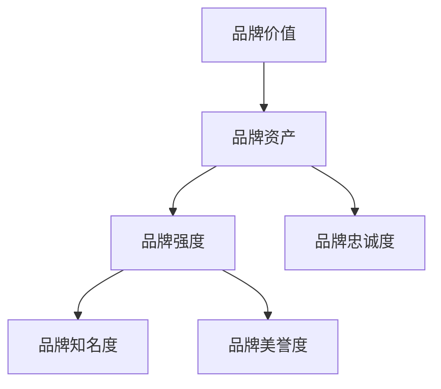
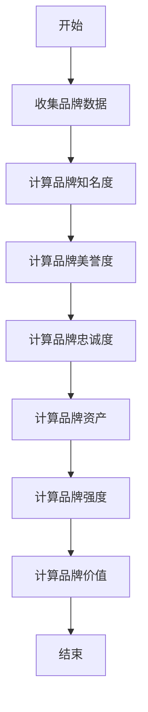
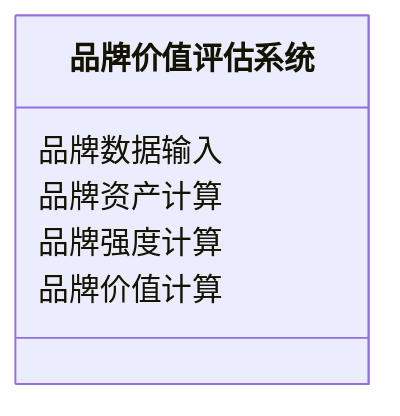
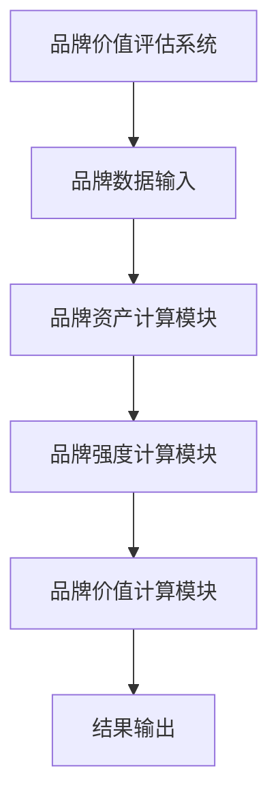
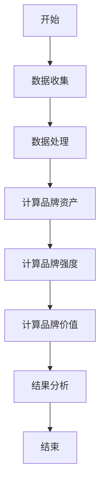

                 

<think>
好的，我现在需要根据用户的详细要求，撰写一篇关于《费雪的品牌价值评估》的技术博客文章。用户已经提供了目录大纲，我需要按照这个大纲，逐步展开每一章的内容，确保满足所有要求：背景介绍、核心概念、算法原理、数学模型、系统架构、项目实战等。

首先，我需要明确每章的核心内容，确保逻辑清晰、结构紧凑。从第一章开始，介绍品牌价值评估的重要性以及费雪方法的基本概念。第二章则深入探讨品牌资产、强度和忠诚度，可能需要使用图表来辅助说明。第三章讲解评估方法，包括数学模型和流程图。第四章讨论系统架构，可能需要设计类图和架构图。第五章通过项目实战，展示具体的实现过程和案例分析。最后，总结整个内容，提供最佳实践和未来展望。

在撰写过程中，我需要确保每一部分都详细具体，使用技术术语，同时保持语言的易懂性。对于每个核心概念，我需要给出定义、属性对比和图表支持。在算法部分，要详细解释数学模型，并用流程图展示步骤。系统架构部分，需要设计类图和架构图，展示系统组件和交互流程。项目实战部分，提供代码示例，解读其实现细节，并进行案例分析。

此外，我需要在每章最后添加小结，回顾主要内容，帮助读者巩固所学内容。同时，按照用户要求，在文章末尾添加作者信息，确保格式正确。

在写作过程中，我可能会遇到一些挑战，比如如何将复杂的算法原理用通俗易懂的方式表达，或者如何设计清晰的图表来辅助说明。因此，我需要仔细思考每一部分的逻辑，确保内容连贯，结构合理。对于不确定的部分，我会查阅相关资料，确保信息的准确性。

总结来说，我需要按照用户提供的大纲，逐一展开每一章的内容，确保覆盖所有要求，同时保持语言的专业性和易懂性。通过细致的分析和清晰的结构，撰写出一篇高质量的技术博客文章。
</think>

# 费雪的品牌价值评估

## 关键词：品牌价值评估，费雪方法，品牌资产，品牌强度，品牌忠诚度，数学模型

## 摘要：  
本文深入探讨了费雪的品牌价值评估方法，从理论基础到实际应用，结合数学模型和系统架构，全面分析了品牌价值评估的核心概念、算法原理和项目实战。通过详细讲解品牌资产、品牌强度、品牌忠诚度等关键要素，本文为读者提供了从理论到实践的完整指南。

---

# 第1章: 品牌价值评估的概述

## 1.1 品牌价值的重要性

### 1.1.1 品牌在企业中的核心地位
品牌是企业的无形资产，代表了企业的形象、声誉和市场地位。一个强大的品牌能够提升企业的市场竞争力，吸引更多的消费者和投资者。

### 1.1.2 品牌价值对企业的战略意义
品牌价值直接影响企业的市场价值、客户忠诚度和盈利能力。通过品牌价值评估，企业可以制定更有效的品牌管理策略。

### 1.1.3 品牌价值评估的必要性
准确评估品牌价值是企业制定战略决策的重要依据。通过评估，企业可以了解品牌的优势和不足，优化品牌管理。

## 1.2 费雪的品牌价值评估方法

### 1.2.1 费雪方法的基本概念
费雪方法是一种基于品牌资产和品牌强度的评估方法，通过量化指标来衡量品牌价值。

### 1.2.2 费雪方法的核心思想
费雪方法强调品牌资产和品牌强度的结合，通过数学模型计算品牌价值。

### 1.2.3 费雪方法与其他评估方法的对比
费雪方法与其他方法相比，更加注重品牌资产的量化评估和品牌强度的动态变化。

## 1.3 品牌价值评估的背景与现状

### 1.3.1 品牌价值评估的历史发展
品牌价值评估从早期的定性分析发展到现在的定量分析，经历了多个阶段的演变。

### 1.3.2 当前品牌价值评估的挑战
随着市场竞争的加剧，品牌价值评估需要更加精准和动态，以应对市场变化。

### 1.3.3 费雪方法的应用前景
费雪方法在现代品牌管理中的应用前景广阔，能够帮助企业更好地理解和提升品牌价值。

## 1.4 本章小结

---

# 第2章: 品牌价值评估的核心概念

## 2.1 品牌资产的定义与特征

### 2.1.1 品牌资产的构成要素
品牌资产包括品牌知名度、品牌美誉度、品牌忠诚度等要素。

### 2.1.2 品牌资产的属性特征对比

| 特征         | 描述                                   |
|--------------|----------------------------------------|
| 知名度       | 品牌在市场上的广泛程度                 |
| 美誉度       | 品牌在消费者心中的良好程度             |
| 忠诚度       | 消费者对品牌的持续购买意愿             |

### 2.1.3 品牌资产与企业价值的关系
品牌资产是企业价值的重要组成部分，直接影响企业的市场表现和盈利能力。

## 2.2 品牌强度的测量

### 2.2.1 品牌强度的定义
品牌强度是指品牌在市场上的竞争力和影响力。

### 2.2.2 品牌强度的评估维度
- 市场占有率
- 品牌增长率
- 品牌市场份额

### 2.2.3 品牌强度与品牌价值的关系
品牌强度是品牌价值的重要影响因素，强度越高，品牌价值越大。

## 2.3 品牌忠诚度与品牌价值的关系

### 2.3.1 品牌忠诚度的定义
品牌忠诚度是指消费者对品牌的持续购买意愿和行为。

### 2.3.2 品牌忠诚度的测量方法
- 重复购买率
- 品牌推荐率
- 品牌满意度

### 2.3.3 品牌忠诚度对品牌价值的影响
高品牌忠诚度能够提高品牌的价值和市场地位。

## 2.4 品牌价值的核心概念结构图



## 2.5 本章小结

---

# 第3章: 品牌价值评估的数学模型与算法

## 3.1 费雪评估方法的数学模型

### 3.1.1 费雪模型的基本公式
$$ \text{品牌价值} = \text{品牌资产} \times \text{品牌强度} $$

### 3.1.2 品牌资产的计算
$$ \text{品牌资产} = \text{品牌知名度} + \text{品牌美誉度} + \text{品牌忠诚度} $$

### 3.1.3 品牌强度的计算
$$ \text{品牌强度} = \frac{\text{品牌市场份额}}{\text{行业平均市场份额}} $$

## 3.2 算法实现步骤



## 3.3 算法实现的代码示例

```python
def calculate_brand_value(brand_assets, brand_strength):
    return brand_assets * brand_strength

# 示例数据
brand_assets = 100  # 假设品牌资产为100
brand_strength = 0.8  # 假设品牌强度为0.8

# 计算品牌价值
brand_value = calculate_brand_value(brand_assets, brand_strength)
print(f"品牌价值: {brand_value}")
```

## 3.4 算法实现的详细解读

### 3.4.1 数据收集与预处理
收集品牌知名度、美誉度和忠诚度的数据，进行清洗和预处理。

### 3.4.2 计算品牌资产
将品牌知名度、美誉度和忠诚度相加，得到品牌资产。

### 3.4.3 计算品牌强度
将品牌市场份额除以行业平均市场份额，得到品牌强度。

### 3.4.4 计算品牌价值
将品牌资产乘以品牌强度，得到品牌价值。

## 3.5 本章小结

---

# 第4章: 品牌价值评估的系统架构与实现

## 4.1 系统功能设计

### 4.1.1 领域模型设计



### 4.1.2 系统架构设计



## 4.2 系统实现的代码示例

```python
class BrandValueSystem:
    def __init__(self):
        self.brand_assets = 0
        self.brand_strength = 0
        self.brand_value = 0

    def calculate_assets(self,知名度, 美誉度, 忠诚度):
        self.brand_assets = 知名度 + 美誉度 + 忠诚度

    def calculate_strength(self, 市场份额, 行业市场份额):
        self.brand_strength = 市场份额 / 行业市场份额

    def calculate_value(self):
        self.brand_value = self.brand_assets * self.brand_strength

# 示例使用
system = BrandValueSystem()
system.calculate_assets(80, 70, 90)
system.calculate_strength(0.7, 0.5)
system.calculate_value()
print(f"品牌价值: {system.brand_value}")
```

## 4.3 系统实现的详细解读

### 4.3.1 数据输入与处理
通过输入品牌知名度、美誉度、忠诚度和市场份额等数据，进行计算。

### 4.3.2 计算过程
系统依次计算品牌资产、品牌强度和品牌价值，输出结果。

## 4.4 本章小结

---

# 第5章: 项目实战——品牌价值评估的应用

## 5.1 项目背景与目标
某公司希望通过品牌价值评估优化品牌管理，提升品牌价值。

## 5.2 数据收集与准备
收集品牌知名度、美誉度、忠诚度和市场份额等数据。

## 5.3 项目实施步骤



## 5.4 实施结果与分析
通过计算，得出品牌价值，并分析结果，提出优化建议。

## 5.5 本章小结

---

# 第6章: 总结与展望

## 6.1 本章总结
总结了费雪的品牌价值评估方法，从理论到实践，全面分析了品牌价值的评估过程。

## 6.2 未来展望
未来，品牌价值评估将更加智能化和动态化，为企业提供更精准的决策支持。

## 6.3 最佳实践 Tips
- 定期评估品牌价值，及时调整品牌策略。
- 结合市场变化，动态更新品牌数据。
- 利用先进技术，提升品牌价值评估的效率和准确性。

## 6.4 本章小结

---

# 作者：AI天才研究院/AI Genius Institute & 禅与计算机程序设计艺术 /Zen And The Art of Computer Programming

