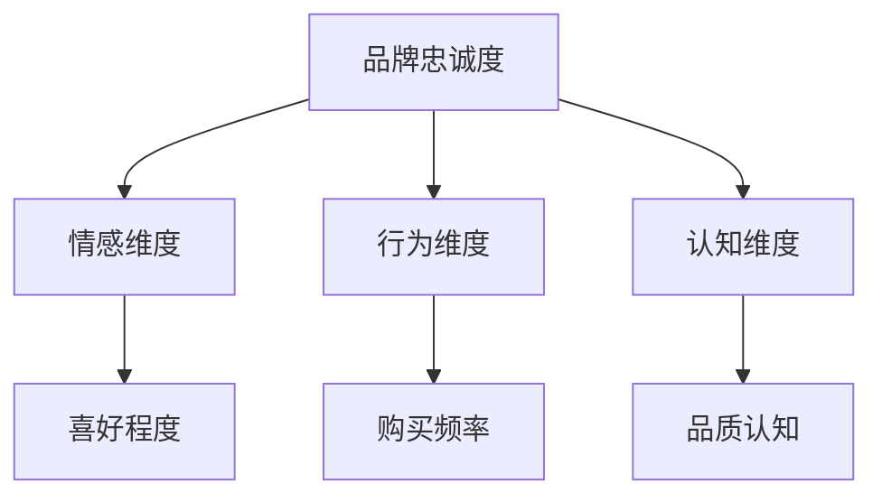
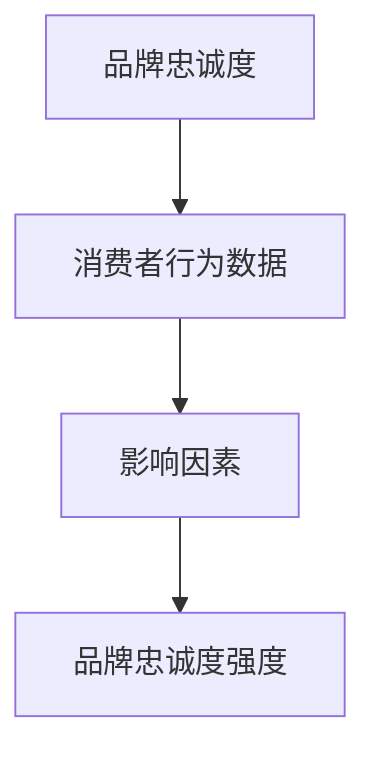
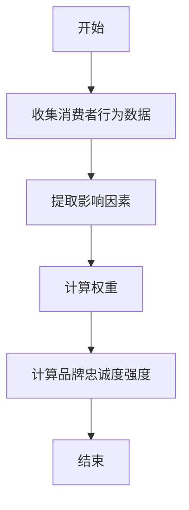
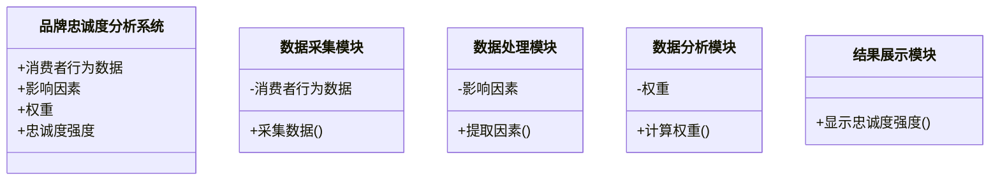
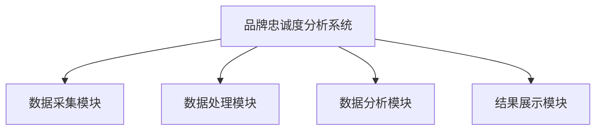
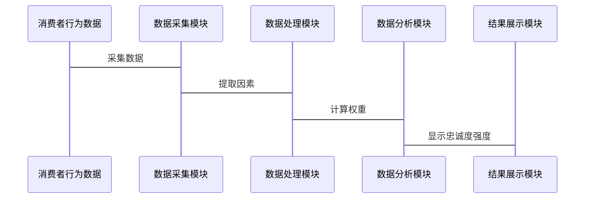

                 


# 费雪的品牌忠诚度分析：消费者行为的洞察

> **关键词**：品牌忠诚度，消费者行为，费雪分析方法，品牌忠诚度维度，费雪分析模型，消费者行为洞察

> **摘要**：  
本文将探讨费雪的品牌忠诚度分析方法在消费者行为研究中的应用。通过分析品牌忠诚度的核心概念、维度、影响因素以及费雪分析模型的原理和算法，结合实际案例，帮助读者理解如何通过消费者行为洞察提升品牌忠诚度。文章内容包括品牌忠诚度的定义与维度、费雪分析模型的数学公式、消费者行为与品牌忠诚度的关系，以及如何通过系统架构和项目实战来实现品牌忠诚度分析。

---

## 第1章: 品牌忠诚度与消费者行为的背景介绍

### 1.1 品牌忠诚度的定义与核心概念

#### 1.1.1 品牌忠诚度的定义
品牌忠诚度是指消费者对特定品牌的情感依赖和行为上的重复购买倾向。它不仅仅是对产品的偏好，还包括对品牌价值观和文化的认同。

#### 1.1.2 品牌忠诚度的核心要素
- **情感因素**：消费者对品牌的喜爱和信任。
- **行为因素**：消费者在购买决策中倾向于选择该品牌。
- **认知因素**：消费者对品牌质量、价值的认知。

#### 1.1.3 品牌忠诚度与消费者行为的关系
品牌忠诚度直接影响消费者的购买行为，表现为重复购买、推荐他人以及对品牌的高度敏感性。

### 1.2 消费者行为的背景介绍

#### 1.2.1 消费者行为的定义
消费者行为是指消费者在购买、使用和处置产品或服务的过程中表现出的各种行为。

#### 1.2.2 消费者行为的主要理论
- **理性决策理论**：消费者基于逻辑和事实做出决策。
- **情感驱动理论**：消费者基于情感和偏好做出决策。
- **社会影响理论**：消费者受社会群体和文化影响做出决策。

#### 1.2.3 品牌忠诚度与消费者行为的关联
品牌忠诚度高的消费者通常表现出更强的购买动机、更高的购买频率和更强的抗干扰能力。

### 1.3 费雪的品牌忠诚度分析方法

#### 1.3.1 费雪分析方法的概述
费雪分析方法是一种通过消费者行为数据来量化品牌忠诚度的分析方法。

#### 1.3.2 费雪分析方法的核心思想
- 通过消费者行为数据，识别品牌忠诚度的核心影响因素。
- 使用统计方法量化品牌忠诚度的强度。

#### 1.3.3 费雪分析方法的应用场景
- 市场调研
- 品牌定位
- 竞争分析

---

## 第2章: 品牌忠诚度的核心概念与联系

### 2.1 品牌忠诚度的维度与属性

#### 2.1.1 品牌忠诚度的维度分析
- **情感维度**：消费者对品牌的喜爱程度。
- **行为维度**：消费者的购买行为。
- **认知维度**：消费者对品牌的认知和评价。

#### 2.1.2 品牌忠诚度的属性特征对比表格
| 维度   | 属性             | 描述                                   |
|--------|------------------|--------------------------------------|
| 情感   | 喜好程度         | 消费者对品牌的喜爱程度               |
| 行为   | 购买频率         | 消费者购买该品牌的频率               |
| 认知   | 品质认知         | 消费者对品牌质量的认知               |

#### 2.1.3 品牌忠诚度的维度与属性关系图（Mermaid流程图）


### 2.2 费雪分析模型的核心原理

#### 2.2.1 费雪分析模型的原理概述
费雪分析模型通过量化消费者行为数据，评估品牌忠诚度的核心影响因素。

#### 2.2.2 费雪分析模型的数学公式
费雪分析模型的数学公式如下：
$$
L = \sum_{i=1}^{n} (w_i \cdot x_i)
$$
其中，\( L \) 表示品牌忠诚度，\( w_i \) 表示第 \( i \) 个影响因素的权重，\( x_i \) 表示第 \( i \) 个影响因素的强度。

#### 2.2.3 费雪分析模型的实体关系图（Mermaid流程图）


### 2.3 品牌忠诚度与消费者行为的关系

#### 2.3.1 品牌忠诚度与消费者行为的相互作用
- 品牌忠诚度高的消费者表现出更强的购买动机和购买频率。
- 消费者行为受到品牌忠诚度的影响，表现为对品牌的高度依赖。

#### 2.3.2 费雪分析方法在消费者行为中的应用
- 通过分析消费者行为数据，识别品牌忠诚度的核心影响因素。
- 通过消费者行为数据，量化品牌忠诚度的强度。

#### 2.3.3 品牌忠诚度与消费者行为的动态关系
- 品牌忠诚度的动态变化受消费者行为的影响。
- 消费者行为的变化反映品牌忠诚度的变化。

### 2.4 本章小结

---

## 第3章: 品牌忠诚度分析的算法原理

### 3.1 费雪分析方法的数学模型

#### 3.1.1 费雪分析方法的公式推导
费雪分析方法的数学公式如下：
$$
L = \sum_{i=1}^{n} (w_i \cdot x_i)
$$

#### 3.1.2 费雪分析方法的数学表达式
$$
L = \sum_{i=1}^{n} (w_i \cdot x_i)
$$

#### 3.1.3 费雪分析方法的算法流程图（Mermaid流程图）


### 3.2 品牌忠诚度分析的算法实现

#### 3.2.1 算法实现的步骤分解
1. 收集消费者行为数据。
2. 提取影响品牌忠诚度的因素。
3. 计算各因素的权重。
4. 计算品牌忠诚度强度。

#### 3.2.2 算法实现的Python源代码
```python
def fisher_brand Loyalty分析(消费者行为数据):
    影响因素 = 提取影响因素(消费者行为数据)
    权重 = 计算权重(影响因素)
    忠诚度强度 = 计算忠诚度强度(权重, 影响因素)
    return 忠诚度强度

def 提取影响因素(数据):
    # 提取影响因素的代码
    pass

def 计算权重(因素):
    # 计算权重的代码
    pass

def 计算忠诚度强度(权重, 因素):
    忠诚度强度 = sum(权重[i] * 因素[i] for i in range(len(权重)))
    return 忠诚度强度
```

#### 3.2.3 算法原理的数学模型和公式
$$
L = \sum_{i=1}^{n} (w_i \cdot x_i)
$$

### 3.3 算法原理的通俗解释与实例

#### 3.3.1 算法原理的通俗解释
费雪分析方法通过将影响品牌忠诚度的因素赋予不同的权重，计算品牌忠诚度的强度。

#### 3.3.2 算法实例
假设影响品牌忠诚度的因素有三个，权重分别为0.4、0.3和0.3，因素强度分别为0.8、0.6和0.5。则品牌忠诚度强度为：
$$
L = 0.4 \times 0.8 + 0.3 \times 0.6 + 0.3 \times 0.5 = 0.32 + 0.18 + 0.15 = 0.65
$$

---

## 第4章: 系统分析与架构设计

### 4.1 系统功能设计

#### 4.1.1 领域模型（Mermaid类图）


### 4.2 系统架构设计（Mermaid架构图）


### 4.3 系统接口设计
- 数据采集模块：负责采集消费者行为数据。
- 数据处理模块：负责提取影响品牌忠诚度的因素。
- 数据分析模块：负责计算各因素的权重和品牌忠诚度强度。
- 结果展示模块：负责显示品牌忠诚度强度。

### 4.4 系统交互设计（Mermaid序列图）


---

## 第5章: 项目实战

### 5.1 环境安装
需要安装Python和相关的数据分析库（如Pandas、NumPy）。

### 5.2 核心实现源代码
```python
import pandas as pd
import numpy as np

def fisher_brand_loyalty(behavior_data):
    factors = extract_factors(behavior_data)
    weights = calculate_weights(factors)
    loyalty = calculate_loyalty(weights, factors)
    return loyalty

def extract_factors(data):
    # 提取影响因素的代码
    return data[['购买频率', '推荐意愿', '满意度']]

def calculate_weights(factors):
    # 计算权重的代码
    return [0.4, 0.3, 0.3]

def calculate_loyalty(weights, factors):
    loyalty = 0
    for i in range(len(weights)):
        loyalty += weights[i] * factors[i]
    return loyalty

# 示例数据
behavior_data = pd.DataFrame({
    '购买频率': [0.8, 0.6, 0.5],
    '推荐意愿': [0.7, 0.6, 0.4],
    '满意度': [0.9, 0.8, 0.7]
})

# 计算品牌忠诚度
loyalty = fisher_brand_loyalty(behavior_data)
print("品牌忠诚度强度：", loyalty)
```

### 5.3 代码应用解读与分析
- 数据采集模块：采集消费者行为数据。
- 数据处理模块：提取影响品牌忠诚度的因素。
- 数据分析模块：计算各因素的权重和品牌忠诚度强度。
- 结果展示模块：显示品牌忠诚度强度。

### 5.4 实际案例分析
假设行为数据如下：
```python
behavior_data = pd.DataFrame({
    '购买频率': [0.8, 0.6, 0.5],
    '推荐意愿': [0.7, 0.6, 0.4],
    '满意度': [0.9, 0.8, 0.7]
})
```

计算结果为：
$$
L = 0.4 \times 0.8 + 0.3 \times 0.6 + 0.3 \times 0.5 = 0.32 + 0.18 + 0.15 = 0.65
$$

### 5.5 项目小结

---

## 第6章: 最佳实践与小结

### 6.1 最佳实践 tips
- 在实际应用中，建议结合具体的业务场景进行调整。
- 数据质量对品牌忠诚度分析结果的影响至关重要。

### 6.2 小结
本文详细介绍了费雪的品牌忠诚度分析方法，从核心概念到算法实现，再到系统设计和项目实战，帮助读者全面理解如何通过消费者行为洞察提升品牌忠诚度。

### 6.3 注意事项
- 数据采集和处理时，需确保数据的准确性和完整性。
- 在实际应用中，建议结合其他分析方法进行综合分析。

### 6.4 拓展阅读
- 品牌忠诚度的其他分析方法。
- 消费者行为的其他理论和模型。

---

## 作者：AI天才研究院/AI Genius Institute & 禅与计算机程序设计艺术/Zen And The Art of Computer Programming

