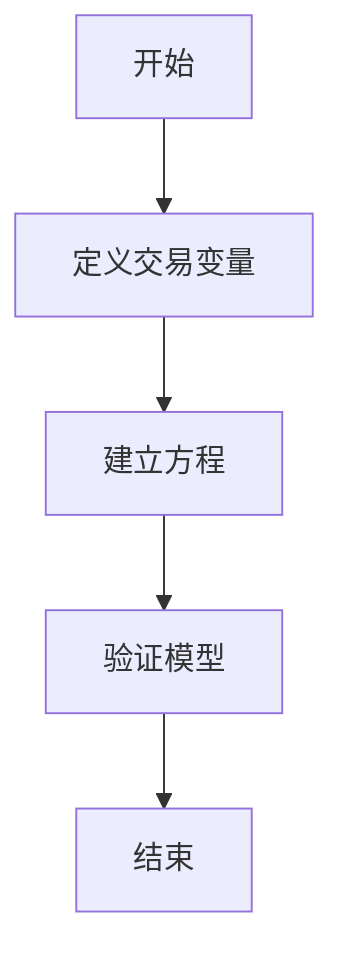
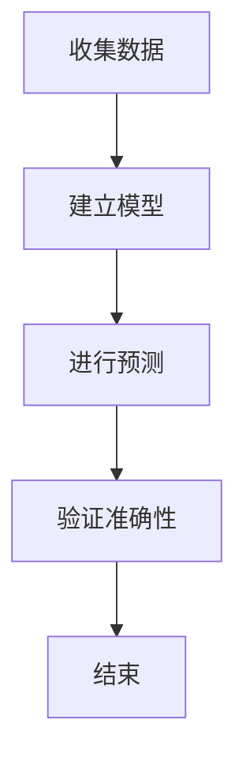

                 


# 费雪的宏观经济分析：把握大趋势

## 关键词

费雪，宏观经济分析，经济预测，货币政策，交易理论，利息理论，货币理论

## 摘要

费雪作为经济学领域的杰出贡献者，其宏观经济分析理论为现代经济学奠定了重要基础。本文系统地探讨了费雪的宏观经济理论，包括其核心概念、数学模型、系统架构以及实际应用。通过详细分析，读者能够深入理解费雪理论的内在逻辑及其在经济预测和政策制定中的应用价值。

---

## 第一部分: 费雪的宏观经济分析基础

### 第1章: 费雪宏观经济分析概述

#### 1.1 费雪的生平与贡献

##### 1.1.1 费雪的生平简介

 Irving Fisher（1867-1947），美国著名经济学家，以其在经济学领域的卓越贡献闻名。他不仅是计量经济学的先驱，还提出了许多具有深远影响的经济理论。

##### 1.1.2 费雪在经济学领域的贡献

 Fisher是现代经济学的重要奠基人之一，他的工作涵盖了金融、货币、利息等多个领域。他提出了著名的费雪方程式，为现代货币理论奠定了基础。

##### 1.1.3 费雪宏观经济理论的核心思想

 费雪的宏观经济理论强调市场机制的重要性，主张通过市场调节实现资源优化配置。他认为，利息是资本的时间价值，而货币供应量的变化会影响整体经济状况。

#### 1.2 费雪宏观经济分析的背景与问题背景

##### 1.2.1 宏观经济分析的基本概念

 宏观经济分析研究整个经济系统的运行，包括GDP、失业率、通货膨胀等指标。这些指标反映了经济的整体健康状况。

##### 1.2.2 费雪宏观经济分析的核心问题

 费雪关注的问题包括价格水平、货币供给和利率之间的关系。他试图通过数学模型解释这些变量之间的动态关系。

##### 1.2.3 费雪理论的边界与外延

 费雪的理论适用于市场经济环境，但在存在政府干预或计划经济的情况下，其适用性可能受限。

#### 1.3 费雪宏观经济分析的核心概念与联系

##### 1.3.1 费雪宏观经济分析的概念结构

 费雪的宏观经济分析包括价格水平、货币供给、利率和产出四个核心要素。

##### 1.3.2 核心要素组成与属性特征对比表格

 | 要素   | 属性       | 描述                           |
 |--------|------------|--------------------------------|
 | 价格水平 | 数值       | 反映整体价格变动              |
 | 货币供给 | 数值       | 经济中的货币总量              |
 | 利率     | 数值       | 资金的时间价值                  |
 | 产出     | 数值       | 经济活动的总成果              |

##### 1.3.3 ER实体关系图架构

```mermaid
erDiagram
    ECONOMY {
        entity PRICE_LEVEL
        entity MONEY_SUPPLY
        entity INTEREST_RATE
        entity OUTPUT
        PRICE_LEVEL --> MONEY_SUPPLY
        MONEY_SUPPLY --> INTEREST_RATE
        INTEREST_RATE --> OUTPUT
        OUTPUT --> PRICE_LEVEL
    }
```

---

### 第2章: 费雪宏观经济分析的核心理论

#### 2.1 费雪的交易理论

##### 2.1.1 交易理论的基本原理

 费雪认为，经济活动的核心是交易。交易的效率直接影响经济的整体运行。

##### 2.1.2 交易理论的数学模型

 费雪提出了交易方程：$$ TV = P \times Q $$，其中T为交易量，V为速度，P为价格水平，Q为实际交易量。

#### 2.2 费雪的利息理论

##### 2.2.1 利息理论的核心观点

 费雪认为，利息是资本的时间价值，反映了资金的稀缺性。

##### 2.2.2 利息理论的数学模型

 费雪的利息理论可以用公式表示为：$$ i = \frac{E}{P} $$，其中i为利率，E为预期收益，P为本金。

#### 2.3 费雪的货币理论

##### 2.3.1 货币理论的基本框架

 费雪提出，货币供应量的变化直接影响价格水平。他的货币需求理论为现代货币分析提供了基础。

##### 2.3.2 货币理论的数学模型

 费雪方程式：$$ M \times V = P \times Q $$，其中M为货币供给，V为货币流通速度，P为价格水平，Q为实际产出。

#### 2.4 费雪宏观经济理论的综合分析

##### 2.4.1 费雪理论的综合框架

 费雪的宏观经济理论整合了交易、利息和货币三个方面的关系，形成了一个完整的分析框架。

##### 2.4.2 费雪理论与其他宏观经济理论的联系

 费雪的理论为凯恩斯的需求侧分析和货币主义的供给侧分析提供了基础，两者共同构建了现代宏观经济分析的框架。

---

### 第3章: 费雪宏观经济分析的数学模型与算法

#### 3.1 费雪方程的数学模型

##### 3.1.1 费雪方程的公式推导

 费雪方程的推导基于交易的均衡条件，假设经济处于稳定状态。

##### 3.1.2 费雪方程的mermaid流程图



#### 3.2 宏观经济预测的算法原理

##### 3.2.1 宏观经济预测的数学模型

 使用费雪方程进行预测，需要收集和分析历史数据，建立回归模型。

##### 3.2.2 宏观经济预测的mermaid流程图



#### 3.3 费雪理论在经济预测中的应用

##### 3.3.1 经济预测的基本方法

 通过分析价格水平和货币供给的变化，预测未来的经济走势。

##### 3.3.2 费雪理论在经济预测中的具体应用

 结合费雪方程和实际数据，预测通货膨胀率和利率变化。

---

### 第4章: 宏观经济分析的系统架构与设计

#### 4.1 宏观经济分析的系统架构

##### 4.1.1 系统架构的总体设计

 系统包括数据采集、模型建立、预测分析和结果展示四个模块。

##### 4.1.2 系统架构的mermaid架构图


#### 4.2 宏观经济分析的接口设计

##### 4.2.1 系统接口的设计原则

 接口设计应遵循标准化、模块化和可扩展性原则。

##### 4.2.2 系统接口的详细设计

 包括数据接口、模型接口和结果接口三部分。

#### 4.3 宏观经济分析的交互设计

##### 4.3.1 系统交互的mermaid序列图

```mermaid
graph LR
    user->A[输入数据]
    A->B[处理数据]
    B->C[生成结果]
    C->user[显示结果]
```

##### 4.3.2 系统交互的具体实现

 用户输入数据，系统处理后生成预测结果并展示。

---

### 第5章: 费雪宏观经济分析的项目实战

#### 5.1 环境安装与配置

##### 5.1.1 开发环境的搭建

 需要安装Python、Jupyter Notebook和相关库（如pandas、numpy、matplotlib）。

##### 5.1.2 数据集的获取与处理

 从公开数据源获取经济数据，清洗和整理后用于分析。

#### 5.2 系统核心实现

##### 5.2.1 核心代码实现

```python
import pandas as pd
import numpy as np

# 定义费雪方程
def fisher_equation(M, V):
    return M * V

# 数据处理
data = pd.read_csv('economic_data.csv')
```

##### 5.2.2 代码应用解读与分析

 通过费雪方程，分析货币供给和流通速度对价格水平的影响。

#### 5.3 实际案例分析和详细讲解剖析

##### 5.3.1 案例分析

 使用历史数据，预测未来的价格水平变化。

##### 5.3.2 详细讲解

 分析预测结果，解释经济政策的影响。

#### 5.4 项目小结

 通过实战项目，验证了费雪理论的实用性和准确性，展示了其在经济预测中的应用价值。

---

## 第六部分: 总结与展望

### 6.1 费雪宏观经济分析的核心要点回顾

 本文系统地介绍了费雪的宏观经济理论，包括其核心概念、数学模型和实际应用。

### 6.2 费雪宏观经济分析的未来展望

 随着大数据和人工智能的发展，费雪理论将得到更广泛的应用，推动宏观经济分析的进一步发展。

### 6.3 小结

 通过本文的学习，读者能够深入理解费雪宏观经济分析的理论和方法，掌握其在实际中的应用。

### 6.4 注意事项

 在实际应用中，需注意数据的准确性和模型的适用性，避免误用。

### 6.5 拓展阅读

 推荐阅读《利息理论》和《货币需求的理论》等书籍，以进一步深入学习。

---

## 作者

作者：AI天才研究院 & 禅与计算机程序设计艺术

