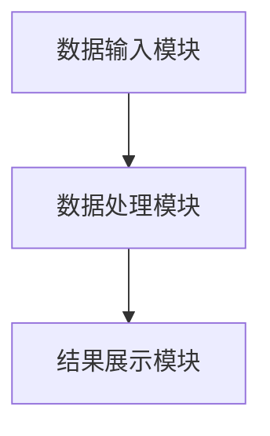

                 

<think>
嗯，用户希望我撰写一篇关于费雪的市场份额增长分析方法的技术博客。首先，我需要理解费雪的理论，特别是他如何分析市场份额增长。费雪的方法可能涉及到市场分析、投资策略等方面。

用户要求文章结构清晰，分为几个部分，每个部分下有章节，甚至三级目录。我需要确保每个部分都涵盖必要的内容，比如背景介绍、核心概念、算法原理、系统架构设计、项目实战等。

首先，我会从背景介绍开始，解释什么是股权投资，市场份额增长的重要性，以及费雪方法的应用场景。这部分需要让读者明白为什么市场份额增长对企业如此重要，以及费雪方法在其中的作用。

接下来是核心概念与联系。我需要详细解释费雪方法的原理，可能包括概念属性对比表格和ER实体关系图。使用mermaid流程图来展示这些内容，帮助读者理解概念之间的联系。

然后是算法原理讲解。这部分需要使用mermaid流程图和Python代码来说明。我得确保算法的数学模型和公式用latex格式呈现，比如$$1+1=2$$，并且有详细的讲解和例子，帮助读者理解。

系统分析与架构设计方案部分，可能需要介绍项目场景，设计系统功能，使用mermaid类图展示领域模型，架构图展示系统结构，以及接口和交互设计。这部分需要详细规划，确保系统设计合理。

项目实战部分，需要指导读者如何安装环境，实现核心代码，并进行案例分析。这部分要具体，让读者能够跟着步骤操作。

最后，我会包括最佳实践、小结、注意事项和拓展阅读等内容，帮助读者巩固知识，扩展视野。

现在，我需要将这些思考转化为具体的目录结构，确保每个部分都符合用户的要求，并且逻辑清晰，层次分明。
</think>

# 费雪的市场份额增长分析方法

## 关键词：
- 股权投资
- 市场份额增长
- 费雪分析方法
- 股权价值评估
- 市场增长潜力预测

## 摘要：
费雪的市场份额增长分析方法是一种经典的股权投资分析工具，它通过对企业市场份额增长潜力的深入分析，帮助投资者评估企业的长期价值。本文将详细介绍费雪分析方法的核心概念、算法原理、系统架构设计以及实际项目中的应用，帮助读者掌握这一强大的分析工具。

---

# 第一部分：费雪的市场份额增长分析方法概述

## 第1章：股权投资与市场份额增长的背景

### 1.1 股权投资的基本概念
#### 1.1.1 股权投资的定义
股权投资是指通过购买企业的股权，成为企业的一部分所有者，并通过企业价值的增值来实现投资收益。股权投资的核心在于选择具有长期增长潜力的企业，通过持有其股权获得资本增值和分红收益。

#### 1.1.2 股权投资的核心要素
- **企业价值**：企业的内在价值，包括资产、收入、利润等因素。
- **市场地位**：企业在市场中的竞争地位，包括市场份额、品牌影响力等。
- **成长潜力**：企业未来增长的可能性，包括市场需求、技术创新等。
- **财务状况**：企业的财务健康状况，包括资产负债表、利润表等。

#### 1.1.3 股权投资的分类与特点
股权投资可以分为短期投资和长期投资，短期投资注重资本增值，长期投资注重企业的持续发展。费雪的分析方法更偏向于长期投资，注重企业市场份额的增长潜力。

### 1.2 市场份额增长的重要性
#### 1.2.1 市场份额的定义
市场份额是指企业在某个市场中销售产品的比例。市场份额的增长意味着企业在市场中的竞争力增强，能够获得更多客户和收入。

#### 1.2.2 市场份额增长对企业的影响
- **收入增长**：市场份额的增加直接带来收入的增长。
- **竞争优势**：市场份额的增加意味着企业在市场中具有更强的竞争力。
- **品牌价值**：市场份额的增加能够提升企业的品牌价值。

#### 1.2.3 股权投资与市场份额增长的关系
企业市场份额的增长直接影响其收入和利润，从而影响企业的内在价值和股票价格。因此，投资者通过分析企业的市场份额增长潜力，可以更好地评估其投资价值。

### 1.3 费雪投资理论的提出背景
#### 1.3.1 费雪投资理论的起源
费雪的投资理论起源于20世纪初，他通过长期观察市场和企业的发展，提出了一套以企业市场份额增长为核心的分析方法。

#### 1.3.2 费雪投资理论的核心思想
费雪认为，企业的长期价值取决于其市场份额的增长潜力。投资者应该选择那些能够持续扩大市场份额的企业进行投资。

#### 1.3.3 费雪投资理论的现实意义
在现代市场中，费雪的分析方法仍然具有重要的现实意义。通过分析企业的市场份额增长潜力，投资者可以更好地评估企业的长期价值。

---

## 第2章：费雪市场份额增长分析方法的核心概念

### 2.1 费雪分析方法的原理
#### 2.1.1 费雪分析方法的基本原理
费雪分析方法通过对企业市场份额增长的潜力进行分析，评估企业的长期价值。其核心在于识别那些能够持续扩大市场份额的企业。

#### 2.1.2 费雪分析方法的数学模型
费雪分析方法的数学模型包括市场份额增长的计算公式和股权价值的评估公式。

#### 2.1.3 费雪分析方法的适用范围
费雪分析方法适用于对具有持续增长潜力的企业进行分析，特别适合于那些在市场中占据领先地位的企业。

### 2.2 费雪分析方法的核心要素
#### 2.2.1 市场份额的计算公式
市场份额 = (企业销售额 / 市场总销售额) × 100%

#### 2.2.2 市场增长的驱动因素
- **市场需求**：市场对产品的需求量。
- **竞争状况**：企业在市场中的竞争地位。
- **技术创新**：企业通过技术创新提升市场竞争力。

#### 2.2.3 股权价值的评估方法
股权价值 = 企业价值 / 股权数量

### 2.3 费雪分析方法与传统分析方法的对比
#### 2.3.1 传统市场份额分析方法的局限性
传统方法通常只关注企业的财务指标，忽视了市场份额增长的潜力。

#### 2.3.2 费雪分析方法的创新点
费雪分析方法将市场份额增长与企业价值评估结合起来，提供了一种更全面的分析方法。

#### 2.3.3 费雪分析方法的优势与不足
优势：能够全面评估企业的市场份额增长潜力，帮助投资者做出更明智的投资决策。不足：需要大量的市场数据和企业信息支持。

---

## 第3章：费雪分析方法的数学模型与算法原理

### 3.1 费雪分析方法的数学公式
#### 3.1.1 市场份额增长的计算公式
$$\text{市场份额增长} = \frac{\text{未来市场份额} - \text{当前市场份额}}{\text{当前市场份额}} \times 100\%$$

#### 3.1.2 股权价值的评估公式
$$\text{股权价值} = \text{企业价值} \times \text{股权比例}$$

#### 3.1.3 市场增长潜力的预测公式
$$\text{市场增长潜力} = \text{市场需求增长率} \times \text{企业市场份额}$$

### 3.2 费雪分析方法的算法流程
#### 3.2.1 数据收集与整理
- 收集企业的历史销售数据和市场数据。
- 整理企业的财务报表和市场竞争对手的数据。

#### 3.2.2 数据分析与计算
- 计算企业的当前市场份额和未来市场份额。
- 评估企业的股权价值。
- 预测企业的市场增长潜力。

#### 3.2.3 结果验证与优化
- 对分析结果进行验证，确保数据的准确性和合理性。
- 根据市场变化对模型进行优化。

### 3.3 费雪分析方法的实现代码
#### 3.3.1 Python代码实现
```python
def calculate_market_share(current_sales, market_sales):
    return (current_sales / market_sales) * 100

def calculate_growth_potential(current_share, future_share):
    return ((future_share - current_share) / current_share) * 100

def calculate_equity_value(enterprise_value, equity_percentage):
    return enterprise_value * equity_percentage
```

#### 3.3.2 代码功能说明
- `calculate_market_share`：计算当前市场份额。
- `calculate_growth_potential`：计算市场份额增长潜力。
- `calculate_equity_value`：计算股权价值。

#### 3.3.3 代码运行示例
```python
current_sales = 100
market_sales = 500
current_share = calculate_market_share(current_sales, market_sales)
print("当前市场份额：", current_share)
```

---

## 第4章：费雪分析方法的系统架构设计

### 4.1 系统功能模块划分
#### 4.1.1 数据输入模块
- 收集企业的销售数据和市场数据。
- 整理企业的财务报表和竞争对手数据。

#### 4.1.2 数据处理模块
- 计算企业的市场份额。
- 评估企业的股权价值。
- 预测企业的市场增长潜力。

#### 4.1.3 结果展示模块
- 显示企业的市场份额增长潜力。
- 展示企业的股权价值评估结果。

### 4.2 系统架构设计
#### 4.2.1 模块之间的关系
- 数据输入模块向数据处理模块提供数据。
- 数据处理模块向结果展示模块输出结果。

#### 4.2.2 系统架构图


#### 4.2.3 系统接口设计
- 数据输入接口：接收企业的销售数据和市场数据。
- 数据处理接口：计算市场份额和股权价值。
- 结果展示接口：显示分析结果。

### 4.3 系统交互流程
#### 4.3.1 用户输入流程
- 用户输入企业的销售数据和市场数据。
- 系统接收数据并进行处理。

#### 4.3.2 系统处理流程
- 系统计算企业的市场份额和股权价值。
- 系统预测企业的市场增长潜力。

#### 4.3.3 结果输出流程
- 系统将分析结果展示给用户。

---

## 第5章：费雪分析方法的项目实战

### 5.1 项目背景与目标
#### 5.1.1 项目背景
某企业希望评估其市场份额增长潜力，选择具有长期增长潜力的企业进行投资。

#### 5.1.2 项目目标
通过费雪分析方法，评估企业的市场份额增长潜力和股权价值，为投资决策提供依据。

### 5.2 项目实施步骤
#### 5.2.1 数据收集与整理
- 收集企业的销售数据和市场数据。
- 整理企业的财务报表和竞争对手数据。

#### 5.2.2 数据分析与计算
- 计算企业的当前市场份额和未来市场份额。
- 评估企业的股权价值。
- 预测企业的市场增长潜力。

#### 5.2.3 结果展示与解读
- 展示企业的市场份额增长潜力。
- 展示企业的股权价值评估结果。

### 5.3 实际案例分析
#### 5.3.1 案例背景
某企业当前市场份额为20%，市场总销售额为1000万元，企业销售额为200万元。

#### 5.3.2 数据分析
- 当前市场份额 = 20%
- 未来市场份额 = 25%
- 市场份额增长潜力 = 25%

#### 5.3.3 结果解读
- 企业的市场份额增长潜力为25%，具有较大的增长空间。
- 企业的股权价值具有较高的增长潜力。

### 5.4 项目小结
通过费雪分析方法，企业可以更好地评估其市场份额增长潜力和股权价值，为投资决策提供依据。

---

## 第6章：费雪分析方法的最佳实践与注意事项

### 6.1 最佳实践 tips
- 数据的准确性和完整性是分析结果的关键。
- 定期更新市场数据和企业信息，确保分析结果的有效性。

### 6.2 小结
费雪的市场份额增长分析方法是一种经典的股权投资分析工具，通过对企业市场份额增长潜力的深入分析，帮助投资者评估企业的长期价值。

### 6.3 注意事项
- 分析结果仅供参考，实际投资需结合市场变化和企业实际情况。
- 分析过程中需注意数据的准确性和模型的合理性。

### 6.4 拓展阅读
- 《股票作手回忆录》：彼得·林奇的投资哲学。
- 《投资学原理》：现代投资组合理论与实践。

---

# 作者：AI天才研究院/AI Genius Institute & 禅与计算机程序设计艺术 /Zen And The Art of Computer Programming

