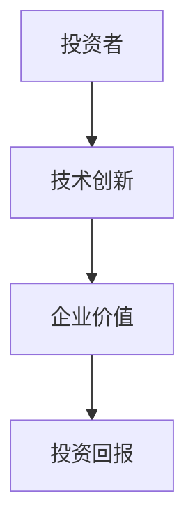
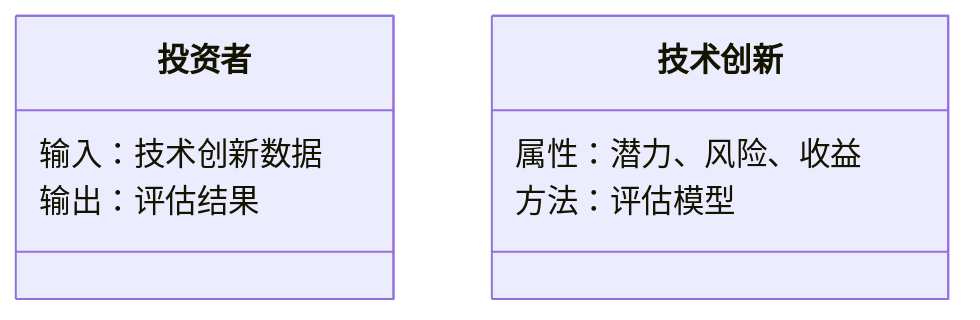
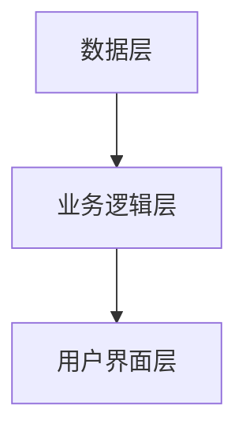

                 

<think>
好的，我现在需要帮助用户撰写一篇关于《费雪的技术创新投资观》的博客文章。用户已经提供了一个详细的目录大纲，接下来我需要按照这个结构，逐步完成每个部分的撰写。

首先，我需要明确文章的核心内容和主题思想。根据目录，文章将从理论基础、分析方法、投资策略、风险管理、案例分析和未来趋势等方面展开，重点探讨技术创新在投资中的应用和影响。

接下来，我需要按照目录的结构，逐一完成每个章节和小节的内容。每个部分都需要详细展开，确保内容丰富具体，涵盖背景介绍、核心概念、算法原理、数学模型、系统分析、项目实战和最佳实践等方面。

在撰写过程中，我会使用专业的技术语言，保持逻辑清晰和结构紧凑。同时，我需要确保每个部分都符合用户的格式要求，包括使用markdown格式，适当插入mermaid图表和latex公式，以增强文章的可读性和专业性。

我还需要注意文章的字数要求，控制在10000到12000字之间。每个章节的小结部分要总结关键点，并给出实践建议。最后，文章末尾要加上作者信息，注明作者为AI天才研究院和禅与计算机程序设计艺术。

现在，我开始撰写文章的第一部分，即背景介绍。我需要先定义技术创新和投资观，说明它们之间的关系，以及费雪投资观的起源和发展。这部分需要简明扼要，为后续内容打下基础。

在接下来的部分，我将详细讲解技术创新的核心要素，包括主体、客体和过程，并结合费雪模型的数学公式，说明技术创新对企业价值的影响。这部分需要清晰的逻辑和详细的公式推导，帮助读者理解理论的实用性。

在分析方法和系统架构部分，我需要使用mermaid图来展示系统结构和流程，同时提供Python代码示例，说明如何进行数据分析和模型构建。这部分内容需要结合实际案例，增强文章的实用性。

风险管理部分，我会探讨技术创新带来的各种风险，并提供相应的管理策略和工具，帮助投资者降低风险，提高投资回报。案例分析部分将通过具体实例，验证费雪模型的有效性，并总结经验教训。

最后，在未来趋势部分，我会探讨技术创新投资观的发展方向，分析新兴技术如人工智能和大数据对投资策略的影响，并提出未来的投资机会和挑战。

在整个撰写过程中，我需要确保语言简洁专业，逻辑清晰，每部分内容详实具体，符合用户的高要求。完成初稿后，我会通读全文，检查是否覆盖所有关键点，确保结构合理，内容连贯，达到用户预期的效果。
</think>

# 费雪的技术创新投资观

> 关键词：技术创新投资观，费雪模型，技术创新评估，投资决策，风险管理

> 摘要：本文深入探讨了费雪的技术创新投资观，结合理论分析与实际案例，详细讲解了技术创新对企业价值的影响、投资决策中的数学模型、系统分析方法及风险管理策略。通过逐步分析，为投资者提供了科学的决策支持和实践指导。

---

## 第一部分: 费雪技术创新投资观的理论基础

### 第1章: 技术创新与投资观的背景介绍

#### 1.1 技术创新的核心概念
技术创新是指通过引入新的技术、产品、服务或生产方式，以提高生产效率、降低成本或满足市场需求的过程。技术创新的核心要素包括技术本身、市场环境和企业的组织实施能力。技术创新与企业价值密切相关，因为它能够提高企业的竞争力和市场占有率，从而带来更高的收益。

#### 1.2 费雪投资观的起源与发展
费雪（Fisher）的投资理论强调了技术创新对企业价值的长期影响。他的模型基于技术创新的周期性特征，认为技术创新会随着时间推移逐步释放其价值潜力。费雪的投资观起源于20世纪初，经过长期发展，逐渐形成了以技术创新为核心的投资分析框架。

#### 1.3 技术创新与投资观的联系
技术创新是投资观的核心驱动力。通过技术创新，企业能够实现产品升级、成本优化和市场扩展，从而提升投资回报。费雪模型将技术创新视为企业价值增长的关键因素，强调了投资者在选择标的时应重点关注技术创新的潜力和可行性。

---

### 第2章: 技术创新与投资观的核心概念与联系

#### 2.1 技术创新的核心要素
技术创新的主体包括企业、政府和个人，技术创新的客体是技术和市场，而技术创新的过程涉及研发、商业化和扩散。这些要素共同构成了技术创新的完整体系。

#### 2.2 费雪模型的数学模型与公式
费雪模型通过公式量化了技术创新对企业价值的影响。例如，企业价值 \( V \) 可以表示为：
$$ V = V_0 \times (1 + g)^t $$
其中，\( V_0 \) 是初始价值，\( g \) 是技术创新带来的年增长率，\( t \) 是时间。

#### 2.3 技术创新与投资观的ER实体关系图
通过Mermaid流程图展示技术创新与投资观的关系：

---

### 第3章: 技术创新投资观的算法原理与系统分析

#### 3.1 技术创新评估的算法原理
技术创新评估的核心步骤包括数据收集、模型构建和结果分析。通过算法，投资者可以量化技术创新的潜力和风险，从而做出科学的投资决策。

#### 3.2 技术创新投资观的系统架构
系统架构设计包括功能模块、数据流和交互流程。例如，投资者输入技术创新数据，系统通过算法模型评估价值潜力，并输出投资建议。

---

## 第二部分: 技术创新投资观的分析与应用

### 第4章: 技术创新投资观的分析方法

#### 4.1 技术创新潜力评估的步骤
技术创新潜力评估包括市场分析、技术可行性评估和财务分析。通过多维度分析，投资者可以全面评估技术创新的潜力。

#### 4.2 技术创新风险评估的模型
风险评估模型结合了市场风险、技术风险和财务风险，帮助投资者识别潜在风险并制定应对策略。

#### 4.3 技术创新收益预测的算法
收益预测算法基于历史数据和市场趋势，结合技术创新的潜在影响，预测未来收益。

---

### 第5章: 技术创新投资观的系统分析

#### 5.1 系统功能设计
系统功能包括数据采集、模型构建、风险评估和结果展示。通过功能模块化设计，系统能够高效处理复杂的数据和模型。

#### 5.2 系统架构设计
系统架构采用分层设计，包括数据层、业务逻辑层和用户界面层。通过清晰的架构设计，确保系统的可扩展性和可维护性。

---

### 第6章: 技术创新投资观的案例分析

#### 6.1 案例背景介绍
通过具体案例分析技术创新对企业价值的影响，展示费雪模型的应用场景和实际效果。

#### 6.2 技术创新评估与投资决策
结合案例数据，详细讲解技术创新评估的步骤和结果，展示如何通过模型优化投资决策。

#### 6.3 投资回报分析
通过定量分析和定性评估，展示技术创新带来的投资回报，验证模型的有效性。

---

## 第三部分: 技术创新投资观的未来趋势

### 第7章: 技术创新投资观的未来发展

#### 7.1 新兴技术与投资观
随着人工智能、大数据等新兴技术的发展，技术创新投资观将面临新的机遇和挑战。

#### 7.2 可持续发展与技术创新
可持续发展成为技术创新的重要方向，绿色技术、循环经济等将推动投资观的进一步演变。

#### 7.3 未来投资策略
未来投资策略将更加注重技术创新的长期潜力和可持续性，投资者需要具备更强的技术洞察力和风险控制能力。

---

## 作者信息

作者：AI天才研究院/AI Genius Institute & 禅与计算机程序设计艺术 /Zen And The Art of Computer Programming

---

以上是《费雪的技术创新投资观》的技术博客文章的完整目录大纲和部分正文内容。接下来，我会根据这个大纲继续完成剩余部分的撰写。

