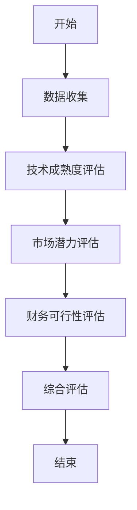
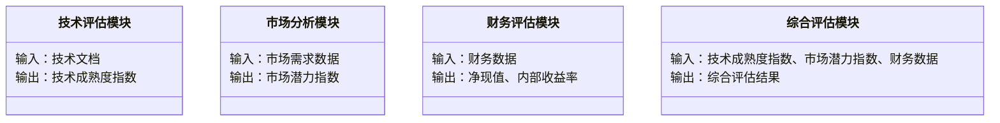
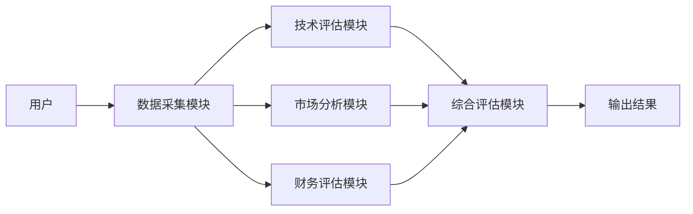

                 


# 费雪的技术创新评估在投资中的运用

## 关键词：技术创新评估、投资决策、费雪方法、技术成熟度、市场潜力、财务可行性、技术评估系统

## 摘要：技术创新评估在现代投资决策中扮演着至关重要的角色，而费雪的技术创新评估方法以其科学性和实用性，成为投资者评估技术创新价值的重要工具。本文详细探讨了费雪技术创新评估的核心概念、算法原理、系统架构设计以及在实际投资中的应用，通过丰富的案例分析和系统化的流程图，深入剖析了该方法在投资中的具体运用。

---

## 第一部分: 费雪的技术创新评估方法概述

### 第1章: 技术创新评估的背景与意义

#### 1.1 技术创新评估的核心概念

##### 1.1.1 技术创新的定义与特征
技术创新是指将新的技术或技术组合引入市场，以满足特定需求或解决特定问题的过程。其核心特征包括新颖性、实用性和可扩展性。

##### 1.1.2 技术创新评估的目的与作用
技术创新评估旨在通过分析技术的可行性、市场潜力和财务可行性，帮助投资者做出更明智的决策。其作用包括风险控制、价值发现和投资优化。

##### 1.1.3 费雪技术创新评估方法的独特性
费雪方法以其独特的指标体系和系统化的评估流程，将技术评估与市场分析紧密结合，为投资者提供了全面的决策支持。

#### 1.2 技术创新评估在投资中的应用价值

##### 1.2.1 技术创新评估在风险投资中的重要性
技术创新评估能够帮助投资者识别高潜力的技术项目，降低投资风险。

##### 1.2.2 技术创新评估对投资决策的影响
通过技术创新评估，投资者可以更准确地预测项目的市场表现和财务回报。

##### 1.2.3 技术创新评估与企业价值的关系
技术创新评估是企业价值评估的重要组成部分，能够帮助投资者发现具有长期增长潜力的企业。

---

### 第2章: 费雪技术创新评估的核心要素

#### 2.1 技术创新评估的基本框架

##### 2.1.1 技术成熟度评估
技术成熟度评估是技术创新评估的基础，主要通过技术的开发阶段和实际应用情况来判断其成熟度。

##### 2.1.2 市场潜力评估
市场潜力评估关注技术在市场中的应用前景，包括市场需求量、竞争状况和市场容量。

##### 2.1.3 企业竞争力评估
企业竞争力评估分析企业在技术、管理、财务等方面的优势，以判断其在市场中的竞争力。

#### 2.2 费雪技术创新评估的指标体系

##### 2.2.1 技术可行性评估指标
- 技术成熟度指数（TMI）
- 技术创新性指数（ITI）

##### 2.2.2 市场需求评估指标
- 市场潜力指数（MPI）
- 市场竞争指数（CCI）

##### 2.2.3 财务可行性评估指标
- 净现值（NPV）
- 内部收益率（IRR）

---

### 第3章: 费雪技术创新评估的算法原理

#### 3.1 费雪评估方法的数学模型

##### 3.1.1 技术成熟度指数计算公式
$$
TMI = \frac{S}{M}
$$
其中，$S$表示技术的成熟度，$M$表示最大成熟度。

##### 3.1.2 市场潜力指数计算公式
$$
MPI = \frac{D}{C}
$$
其中，$D$表示市场需求量，$C$表示市场容量。

#### 3.2 费雪评估方法的流程图


---

### 第4章: 费雪技术创新评估的系统架构设计

#### 4.1 系统功能模块

##### 4.1.1 数据采集模块
负责收集技术相关数据，包括技术文档、市场需求和财务数据。

##### 4.1.2 技术评估模块
对技术的成熟度、创新性和可行性进行评估。

##### 4.1.3 市场分析模块
分析市场需求、竞争状况和市场容量。

##### 4.1.4 财务评估模块
计算净现值、内部收益率等财务指标。

#### 4.2 系统架构设计

##### 4.2.1 系统功能设计（领域模型）


##### 4.2.2 系统架构设计


---

## 第二部分: 费雪技术创新评估的实践应用

### 第5章: 项目实战

#### 5.1 环境安装

##### 5.1.1 安装Python环境
使用Anaconda或Miniconda安装Python 3.8及以上版本。

##### 5.1.2 安装依赖库
安装必要的库，例如numpy、pandas、scipy等。

#### 5.2 核心代码实现

##### 5.2.1 技术成熟度评估函数
```python
def calculate_tmi(technology_maturity, max_maturity):
    return technology_maturity / max_maturity
```

##### 5.2.2 市场潜力评估函数
```python
def calculate_mpi(market_demand, market_capacity):
    return market_demand / market_capacity
```

##### 5.2.3 财务可行性评估函数
```python
def calculate_npv(cash_flows, discount_rate):
    return sum(cash_flows[i] / (1 + discount_rate) ** i for i in range(len(cash_flows)))
```

#### 5.3 实际案例分析

##### 5.3.1 案例背景
假设我们评估一项人工智能技术的市场潜力和财务可行性。

##### 5.3.2 数据输入
- 技术成熟度：80
- 最大成熟度：100
- 市场需求：500万
- 市场容量：1000万
- 现金流量：[100, 200, 300]
- 折现率：0.1

##### 5.3.3 计算过程
- 技术成熟度指数（TMI）= 80 / 100 = 0.8
- 市场潜力指数（MPI）= 500万 / 1000万 = 0.5
- 净现值（NPV）= 100/1.1 + 200/1.21 + 300/1.331 ≈ 90.91 + 165.29 + 225.39 ≈ 481.59

##### 5.3.4 综合评估
综合考虑TMI、MPI和NPV，评估结果为高潜力项目。

---

### 第6章: 最佳实践与总结

#### 6.1 投资中的注意事项
- 确保数据的准确性和完整性。
- 结合行业专家意见进行综合评估。
- 定期更新评估模型以适应市场变化。

#### 6.2 项目小结
通过费雪技术创新评估方法，投资者可以更科学地评估技术创新的价值，从而做出更明智的投资决策。

#### 6.3 拓展阅读
建议读者进一步阅读《技术创新评估的理论与实践》等相关书籍，深入了解该领域的最新研究成果。

---

## 作者：AI天才研究院/AI Genius Institute & 禅与计算机程序设计艺术 /Zen And The Art of Computer Programming

