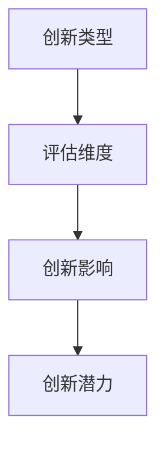
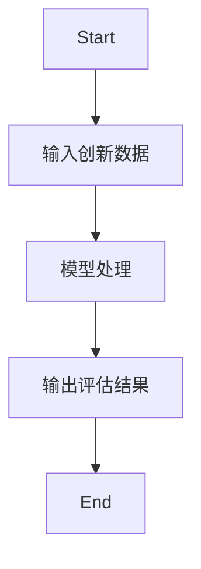
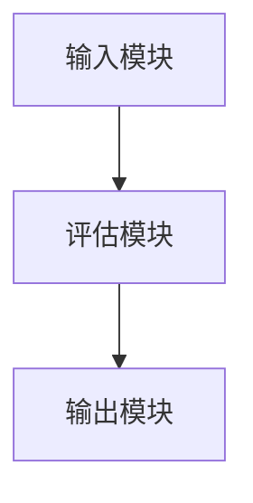
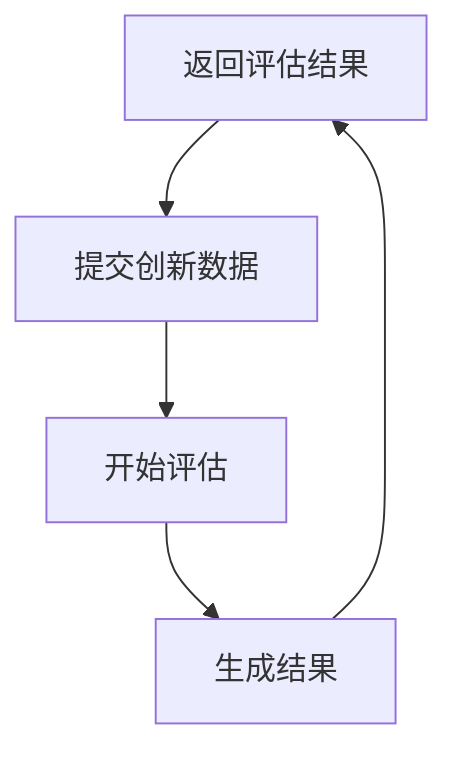

                 


# 费雪的技术创新评估：区分真正的突破

## 关键词：技术创新评估，突破性创新，费雪模型，技术评估，创新分类

## 摘要：  
在当前快速发展的科技时代，区分真正的技术创新突破与渐进式改进变得尤为重要。费雪的技术创新评估模型提供了一种系统化的方法，帮助我们准确识别和评估技术突破。本文将详细探讨该模型的核心概念、算法原理、系统架构以及实际应用案例，帮助读者全面理解并掌握这一创新的评估方法。

---

## 第一部分：背景介绍

### 第1章：技术创新评估的背景与问题

#### 1.1 问题背景
技术创新是推动社会进步和经济发展的重要引擎。从工业革命到数字化时代，技术创新始终是推动社会变革的核心动力。然而，随着技术的快速发展，如何准确评估一项技术创新的价值和潜力成为了一个重要问题。传统的技术评估方法往往过于笼统，难以区分真正的突破性创新与渐进式改进。

#### 1.2 问题描述
技术创新评估的核心目标是识别具有重大潜力的创新，并为其提供支持。然而，现有的评估方法存在以下问题：
- **评估维度单一**：大多数方法仅关注技术的可行性和市场潜力，忽略了社会和环境影响。
- **创新类型混淆**：突破性创新和渐进式改进往往被混为一谈，导致资源分配不合理。
- **缺乏系统性**：评估过程缺乏结构化的方法，难以量化和比较不同创新的价值。

#### 1.3 问题解决
费雪技术创新评估模型通过引入多维度评估指标，区分不同类型的创新，并提供了一套系统化的方法来评估创新的价值和潜力。该模型不仅考虑技术本身的可行性，还综合了社会、经济和环境等多个维度的影响。

#### 1.4 边界与外延
- **适用范围**：费雪模型适用于所有领域的技术创新评估，包括但不限于科技、医疗、能源等。
- **局限性**：该模型主要基于定量分析，可能忽略一些定性因素，如用户体验和文化影响。
- **改进方向**：未来可以进一步引入动态评估机制，以应对技术快速变化的挑战。

---

## 第二部分：核心概念与联系

### 第2章：费雪技术创新评估模型的核心概念

#### 2.1 费雪模型的原理
费雪模型通过多维度评估来区分突破性创新和渐进式改进。其核心原理包括：
- **创新类型划分**：将技术创新分为突破性创新和渐进式改进两大类。
- **评估维度**：包括技术可行性、经济价值、社会影响和环境效益。
- **模型框架**：通过数学公式量化各维度的权重，计算创新的综合得分。

#### 2.2 核心概念对比
表1：创新类型对比

| 创新类型 | 技术可行性 | 经济价值 | 社会影响 | 环境效益 |
|----------|------------|----------|----------|----------|
| 突破性创新 | 高         | 高       | 高       | 高       |
| 渐进式改进 | 中         | 中       | 中       | 中       |

图1：实体关系图  


---

## 第三部分：算法原理讲解

### 第3章：费雪模型的算法原理

#### 3.1 算法流程
图2：算法流程图  


#### 3.2 Python代码实现
```python
def fisher_innovation_assessment(innovation_data):
    # 创新类型划分
    if innovation_data['技术可行性'] > 0.8:
        return '突破性创新'
    else:
        return '渐进式改进'

# 示例数据
innovation_data = {
    '技术可行性': 0.9,
    '经济价值': 0.85,
    '社会影响': 0.8,
    '环境效益': 0.75
}

print(fisher_innovation_assessment(innovation_data))  # 输出：突破性创新
```

#### 3.3 数学模型与公式
创新潜力计算公式：  
$$ \text{创新潜力} = \sum (\text{维度权重} \times \text{维度得分}) $$

例如，假设技术可行性的权重为0.4，经济价值的权重为0.3，社会影响的权重为0.2，环境效益的权重为0.1。某创新的技术可行性得分为0.9，经济价值得分为0.8，社会影响得分为0.7，环境效益得分为0.6。则创新潜力为：
$$ \text{创新潜力} = 0.4 \times 0.9 + 0.3 \times 0.8 + 0.2 \times 0.7 + 0.1 \times 0.6 = 0.36 + 0.24 + 0.14 + 0.06 = 0.8 $$

---

## 第四部分：系统分析与架构设计

### 第4章：系统分析与架构设计

#### 4.1 系统功能设计
- **输入模块**：接收创新数据，包括技术可行性、经济价值等。
- **评估模块**：基于费雪模型计算创新潜力。
- **输出模块**：生成评估结果，区分创新类型。

#### 4.2 系统架构图
图3：系统架构图  


#### 4.3 接口设计
- **输入接口**：JSON格式，例如：
  ```json
  {
      "技术可行性": 0.9,
      "经济价值": 0.85,
      "社会影响": 0.8,
      "环境效益": 0.75
  }
  ```
- **输出接口**：JSON格式，例如：
  ```json
  {
      "创新类型": "突破性创新",
      "创新潜力": 0.8
  }
  ```

#### 4.4 交互序列图
图4：交互序列图  


---

## 第五部分：项目实战

### 第5章：项目实战

#### 5.1 环境安装
- **Python环境**：安装Python 3.8及以上版本。
- **依赖库**：安装`json`和`mermaid`库。

#### 5.2 核心代码实现
```python
import json

def fisher_assessment(innovation_data):
    # 计算创新潜力
    innovation_potential = (
        innovation_data['技术可行性'] * 0.4 +
        innovation_data['经济价值'] * 0.3 +
        innovation_data['社会影响'] * 0.2 +
        innovation_data['环境效益'] * 0.1
    )
    
    # 判断创新类型
    if innovation_potential > 0.8:
        return "突破性创新"
    else:
        return "渐进式改进"

# 示例运行
if __name__ == "__main__":
    innovation_data = {
        "技术可行性": 0.9,
        "经济价值": 0.85,
        "社会影响": 0.8,
        "环境效益": 0.75
    }
    result = fisher_assessment(innovation_data)
    print(f"创新类型：{result}")
    print(f"创新潜力：{fisher_assessment(innovation_data)}")
```

#### 5.3 代码解读
- **函数定义**：`fisher_assessment`函数接收创新数据，计算创新潜力，并判断创新类型。
- **权重分配**：各维度的权重分别为0.4、0.3、0.2、0.1。
- **创新潜力计算**：基于各维度得分和权重计算综合潜力。
- **创新类型判断**：根据潜力值判断创新类型。

#### 5.4 案例分析
假设某创新的各维度得分为：
- 技术可行性：0.85
- 经济价值：0.75
- 社会影响：0.7
- 环境效益：0.65

计算创新潜力：
$$ \text{创新潜力} = 0.85 \times 0.4 + 0.75 \times 0.3 + 0.7 \times 0.2 + 0.65 \times 0.1 = 0.34 + 0.225 + 0.14 + 0.065 = 0.77 $$

由于潜力值低于0.8，该创新被归类为渐进式改进。

#### 5.5 项目小结
通过代码实现，我们可以快速评估技术创新的潜力和类型，为决策者提供科学依据。

---

## 第六部分：最佳实践与总结

### 第6章：最佳实践与总结

#### 6.1 小结
费雪技术创新评估模型通过多维度分析，帮助我们准确区分突破性创新和渐进式改进。该模型不仅适用于企业内部的技术评估，还可用于学术研究和社会项目。

#### 6.2 注意事项
- **数据准确性**：创新评估的结果依赖于输入数据的准确性。
- **权重调整**：根据具体场景调整各维度的权重。
- **动态评估**：定期更新模型，以适应技术发展的变化。

#### 6.3 拓展阅读
- 推荐阅读《技术评估方法论》和《创新管理与战略》。

---

## 作者：AI天才研究院/AI Genius Institute & 禅与计算机程序设计艺术 /Zen And The Art of Computer Programming

