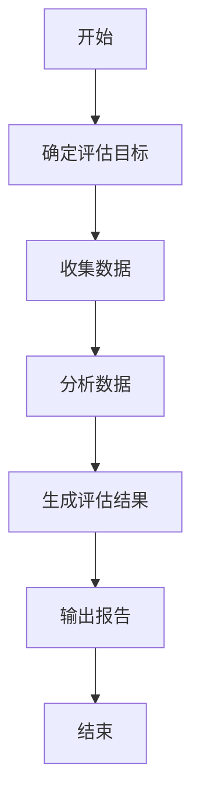
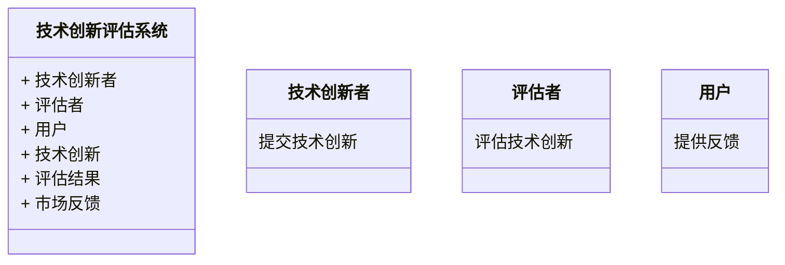
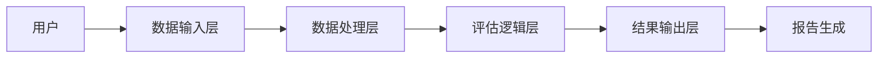

                 

<think>
好的，我需要帮助撰写一篇技术博客文章，标题是《费雪的技术创新评估：未来领导者的特征》。根据用户提供的详细要求，我需要按照特定的结构和内容来组织文章。

首先，我应该先理解文章的主题和目标。文章的重点是技术创新评估，特别是费雪的评估方法，以及这些方法对未来领导者的影响。这意味着我需要解释什么是技术创新评估，费雪模型是什么，以及领导者如何利用这些方法来做出更好的决策。

接下来，我需要按照用户提供的目录结构来组织内容。第一部分是技术创新评估的背景与趋势，包括技术创新的定义、费雪模型的背景、以及评估的重要性。这部分需要为读者提供基本的背景知识，帮助他们理解为什么技术创新评估是必要的。

第二部分是技术创新评估的核心概念与联系，我需要详细解释技术创新评估的核心要素，如技术可行性、市场需求和经济效益，并通过ER图展示模型的实体关系。这部分需要让读者理解评估过程中的各种因素及其相互关系。

第三部分是技术创新评估的算法原理，我需要介绍费雪模型的数学基础，使用Python代码实现模型，并通过流程图展示评估流程。这部分需要让读者了解模型是如何工作的，以及如何在实际中应用这些算法。

第四部分是系统分析与架构设计，我需要描述一个评估系统的设计，包括功能设计、架构图和接口设计。这部分需要让读者理解如何构建一个完整的评估系统，并展示系统的各个部分如何协同工作。

第五部分是项目实战，我需要提供一个实际案例，从环境安装到代码实现，再到结果分析。这部分需要让读者能够实际操作，理解理论在实践中的应用。

最后，最佳实践部分需要总结关键点，给出小结、注意事项和未来趋势。这部分需要帮助读者巩固所学内容，并指导他们在实际中如何应用这些知识。

在撰写过程中，我需要确保每个章节内容丰富，详细讲解，并包含必要的图表和代码示例。我还需要注意使用清晰、专业的技术语言，同时保持逻辑紧凑，确保文章结构合理，内容连贯。

为了确保文章质量，我应该多次检查每个部分，确保所有核心概念都被充分解释，所有步骤都被清晰展示。同时，我需要确保数学公式和图表正确嵌入，并且代码示例能够运行，以便读者能够理解和应用这些内容。

总的来说，我需要按照用户提供的结构，逐步分析每个部分，确保内容全面、深入，并且易于理解。这将帮助读者全面掌握技术创新评估的方法和应用，特别是在领导者的角色下，如何利用这些方法来做出明智的决策。
</think>

# 费雪的技术创新评估：未来领导者的特征

## 关键词：技术创新评估，费雪模型，技术可行性，市场需求，经济效益，领导力，未来趋势

## 摘要：技术创新评估是企业在快速变化的技术环境中保持竞争力的关键。本文介绍费雪的技术创新评估方法，分析其核心概念、算法原理和系统架构，结合实际案例，探讨未来领导者在技术创新评估中的角色和特征。

---

# 第1章: 技术创新评估的背景与意义

## 1.1 技术创新的定义与特征

### 1.1.1 技术创新的定义
技术创新是指通过引入新的技术或改进现有技术，以创造新的产品、服务或流程。技术创新的核心在于其独特性、可行性和对现有技术的改进或替代。

### 1.1.2 技术创新的核心特征
技术创新具有以下核心特征：
1. **创新性**：与现有技术相比，具有显著的改进或突破。
2. **可行性**：技术上可行，能够在实际应用中实现。
3. **价值性**：能够为企业或用户创造价值，如提高效率、降低成本或提升用户体验。

### 1.1.3 技术创新与企业发展的关系
技术创新是企业发展的核心驱动力。通过技术创新，企业可以提升竞争力、开拓新市场并实现可持续发展。

## 1.2 费雪的技术创新评估方法

### 1.2.1 费雪模型的提出背景
费雪模型由技术专家费舍尔提出，旨在为企业提供一种系统化的方法来评估技术创新的潜力和风险。

### 1.2.2 费雪模型的核心思想
费雪模型认为，技术创新的成功不仅取决于技术本身，还取决于市场需求、经济因素和团队能力。通过综合评估这些因素，企业可以做出更明智的技术选择。

### 1.2.3 费雪模型的应用范围
费雪模型适用于企业内部的技术项目评估、技术投资决策以及技术创新战略的制定。

## 1.3 技术创新评估的重要性

### 1.3.1 技术创新评估的目的
技术创新评估的目的是识别具有潜力的技术，降低技术创新的风险，并为企业制定技术战略提供依据。

### 1.3.2 技术创新评估对企业的影响
通过技术创新评估，企业可以优化资源配置，提高技术创新的成功率，从而增强市场竞争力。

### 1.3.3 技术创新评估的未来趋势
随着技术的快速发展，技术创新评估将更加依赖数据驱动的方法和人工智能技术，以提高评估的准确性和效率。

---

# 第2章: 技术创新评估的核心概念与联系

## 2.1 技术创新评估的核心要素

### 2.1.1 技术可行性
技术可行性是指技术创新在技术上是否可行，包括技术实现的难度、所需资源以及技术的成熟度。

### 2.1.2 市场需求
市场需求是指技术创新是否能够满足用户的需求，具有市场潜力。市场需求的评估包括市场规模、用户需求和竞争对手分析。

### 2.1.3 经济效益
经济效益是指技术创新是否能够为企业带来经济效益，包括成本节约、收入增长和投资回报。

## 2.2 技术创新评估的模型构建

### 2.2.1 费雪模型的实体关系图
以下是一个简化的ER图，展示了技术创新评估的核心实体及其关系：
```mermaid
er
  actor 技术创新者
  actor 评估者
  actor 用户
  entity 技术创新
  entity 评估结果
  entity 市场反馈
  技术创新者 --> 技术创新
  评估者 --> 技术创新
  用户 --> 技术创新
  技术创新 --> 评估结果
  市场反馈 --> 评估结果
```

### 2.2.2 费雪模型的流程图
以下是一个技术创新评估的流程图：


## 2.3 技术创新评估的流程图

---

# 第3章: 技术创新评估的算法原理

## 3.1 费雪模型的数学基础

### 3.1.1 费雪模型的数学表达式
费雪模型可以表示为：
$$ F(x) = a \cdot x + b $$

其中：
- $a$ 是技术创新的权重系数。
- $b$ 是基础评估值。

### 3.1.2 费雪模型的实现代码
以下是一个简单的Python实现示例：
```python
def fisher_technology_assessment(technology, a=0.8, b=0.2):
    score = a * technology + b
    return score

technology_level = 0.7
result = fisher_technology_assessment(technology_level)
print("技术创新评估结果为:", result)
```

### 3.1.3 费雪模型的流程图
以下是一个技术创新评估的流程图：


---

# 第4章: 系统分析与架构设计

## 4.1 问题场景介绍
在企业中，技术创新评估是一个复杂的过程，涉及多个部门和团队的合作。通过构建一个系统化的评估系统，企业可以更高效地进行技术创新评估。

## 4.2 系统功能设计
以下是一个技术创新评估系统的功能设计图：


## 4.3 系统架构设计
以下是一个技术创新评估系统的架构图：


---

# 第5章: 项目实战

## 5.1 环境安装
为了运行技术创新评估系统，需要安装以下环境：
- Python 3.8+
- Mermaid工具
- 数据库（如MySQL）

## 5.2 系统核心实现源代码
以下是一个技术创新评估系统的Python实现示例：
```python
class TechnologyAssessmentSystem:
    def __init__(self):
        self.technologies = []
        self.assessments = []

    def submit_technology(self, technology):
        self.technologies.append(technology)

    def assess_technology(self, technology_id, score):
        self.assessments.append((technology_id, score))

    def generate_report(self):
        report = []
        for tech in self.technologies:
            scores = [a for a in self.assessments if a[0] == tech['id']]
            avg_score = sum(a[1] for a in scores) / len(scores) if scores else 0
            report.append({
                'technology': tech['name'],
                'average_score': avg_score
            })
        return report

# 示例用法
system = TechnologyAssessmentSystem()
system.submit_technology({'id': 1, 'name': 'AI推荐算法'})
system.assess_technology(1, 0.9)
system.assess_technology(1, 0.8)
report = system.generate_report()
print(report)
```

## 5.3 代码应用解读与分析
上述代码实现了一个简单的技术创新评估系统，包括技术创新的提交、评估和报告生成功能。通过这个系统，企业可以更高效地进行技术创新评估。

## 5.4 实际案例分析
以一家科技公司为例，该公司希望评估一种新的AI推荐算法。通过上述系统，该公司可以提交该技术并进行多次评估，最终生成评估报告。

## 5.5 项目小结
通过项目实战，我们可以看到技术创新评估系统在实际应用中的价值。企业可以根据需要进行定制化开发，以满足特定需求。

---

# 第6章: 最佳实践 tips、小结、注意事项、拓展阅读

## 6.1 小结
技术创新评估是企业技术管理的重要组成部分。通过费雪模型和其他系统方法，企业可以更科学地进行技术创新评估，降低风险并提高成功率。

## 6.2 注意事项
在进行技术创新评估时，企业需要注意以下几点：
1. 确保数据的准确性和完整性。
2. 选择合适的评估模型和方法。
3. 定期更新和优化评估系统。

## 6.3 拓展阅读
- 《技术创新管理》
- 《费雪模型的深入分析》
- 《技术评估与投资决策》

---

# 作者：AI天才研究院/AI Genius Institute & 禅与计算机程序设计艺术 /Zen And The Art of Computer Programming

---

这篇文章系统地介绍了费雪的技术创新评估方法，分析了其核心概念、算法原理和系统架构，并通过实际案例展示了如何在企业中应用这些方法。未来领导者需要掌握这些技能，以在快速变化的技术环境中做出明智的决策。

