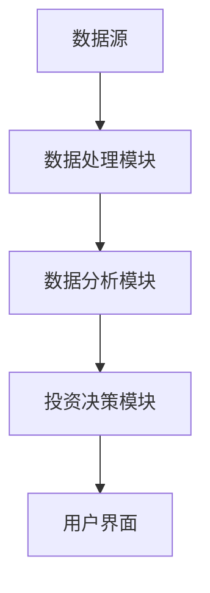
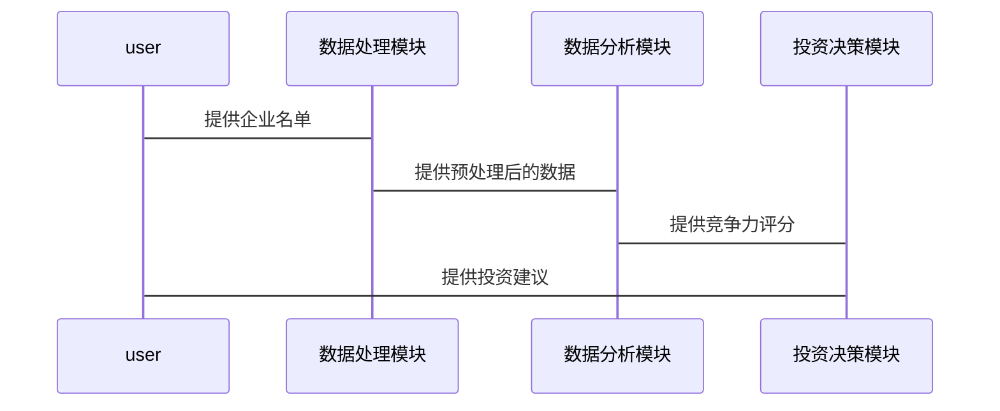

                 

<think>
好的，我需要根据用户提供的《费雪的探照灯理论：深入研究公司的方法》的书籍目录，撰写一篇符合要求的长篇技术博客文章。首先，我需要理解探照灯理论的核心内容，包括其背景、核心概念、数学模型、系统设计以及实际应用案例。

首先，我会从背景介绍开始，解释探照灯理论的起源及其在投资分析中的重要性。接下来，我会详细阐述探照灯理论的核心概念，如企业分析框架和财务指标筛选标准，并通过对比表格和ER图来展示这些概念。然后，我会讨论探照灯理论的数学模型，推导出评分系统，并用公式来量化公司的吸引力。

在系统分析部分，我会设计一个基于探照灯理论的投资分析系统，包括功能设计、架构图和交互流程。最后，我会通过一个实际项目案例，展示如何应用探照灯理论进行企业分析和投资决策，确保读者能够理解并实际应用这些理论。

在整个过程中，我需要确保文章逻辑清晰，结构紧凑，语言专业且易于理解。同时，我需要按照要求，使用Mermaid流程图和Python代码来详细讲解算法实现，并在适当的位置插入数学公式，确保文章的深度和专业性。

通过逐步分析和详细讲解，我希望能够撰写一篇全面而深入的技术博客，帮助读者全面理解并掌握费雪的探照灯理论在投资分析中的应用。
</think>

# 费雪的探照灯理论：深入研究公司的方法

## 关键词：
- 费雪探照灯理论
- 投资分析
- 企业研究
- 数学模型
- 投资决策

## 摘要：
费雪的探照灯理论是一种通过系统性分析公司基本面来做出投资决策的方法。该理论强调通过对企业的财务状况、竞争优势和市场地位的深入研究，筛选出具有长期增长潜力的优质企业。本文将详细探讨探照灯理论的核心概念、数学模型、系统设计以及实际应用案例，帮助读者理解并掌握这一理论在投资分析中的应用。

---

## 第1章: 费雪的探照灯理论背景

### 1.1 投资理论的演进与费雪的贡献
#### 1.1.1 投资理论的历史发展
投资理论的发展经历了从基本面分析到量化分析的演变。20世纪初， Benjamin Graham 和 David Dodd 提出了价值投资理论，强调通过分析企业的内在价值来判断投资机会。然而，随着市场的复杂化，投资者需要更系统化的方法来分析企业。

#### 1.1.2 费雪的探照灯理论的提出背景
Philip Fisher 是20世纪中期著名的投资家，他在 Graham 和 Dodd 的价值投资理论基础上提出了探照灯理论。该理论强调通过深入研究企业的基本面，尤其是企业的竞争优势和管理层质量，来选择具有长期增长潜力的企业。

#### 1.1.3 费雪理论在现代投资中的地位
在现代投资理论中，探照灯理论依然具有重要的地位。它结合了基本面分析和长期投资策略，为投资者提供了一种系统化的公司研究方法。

### 1.2 费雪探照灯理论的核心思想
#### 1.2.1 探照灯理论的基本概念
探照灯理论的核心思想是，通过系统性地研究企业的财务状况、竞争优势和市场地位，找到那些具有长期增长潜力的企业进行投资。

#### 1.2.2 探照灯理论的核心假设
- 企业的长期增长潜力是投资的关键因素。
- 企业的竞争优势是决定其长期盈利能力的核心。
- 管理层的质量和战略决策能力对企业的发展至关重要。

#### 1.2.3 探照灯理论的适用范围
探照灯理论适用于对成长型企业进行投资分析，尤其适合那些希望长期持有优质企业的投资者。

---

## 第2章: 探照灯理论的核心概念与联系

### 2.1 探照灯理论的核心要素
#### 2.1.1 投资目标的定义
探照灯理论的目标是通过深入分析企业的基本面，找到那些具有强大竞争优势和长期增长潜力的企业。

#### 2.1.2 企业竞争优势的分析
竞争优势是企业能够在市场中长期获得超额利润的关键。探照灯理论强调从多个维度分析企业的竞争优势，包括产品差异化、成本优势和市场进入壁垒。

#### 2.1.3 财务指标的筛选标准
探照灯理论通过分析企业的财务指标，评估其财务健康状况和盈利能力。关键的财务指标包括净利润率、ROE（净资产收益率）和现金流。

### 2.2 探照灯理论与企业分析框架
#### 2.2.1 企业生命周期与投资阶段的匹配
探照灯理论认为，企业的生命周期与其投资阶段密切相关。例如，处于成长期的企业更适合长期投资，而处于衰退期的企业则需要谨慎评估。

#### 2.2.2 企业财务健康状况的评估方法
探照灯理论通过分析企业的财务报表，评估其财务健康状况。这包括对资产负债表、利润表和现金流量表的详细分析。

#### 2.2.3 企业竞争优势的多维度分析
探照灯理论强调从多个维度分析企业的竞争优势，包括产品差异化、成本优势和市场进入壁垒。通过对比分析，投资者可以更好地识别企业的核心竞争力。

---

## 第3章: 探照灯理论的数学模型与算法原理

### 3.1 探照灯理论的数学模型
#### 3.1.1 投资评分系统的构建
探照灯理论通过构建一个投资评分系统，对企业的竞争力和财务状况进行量化评估。评分系统包括以下几个维度：
- 企业竞争优势（权重：40%）
- 财务健康状况（权重：30%）
- 管理层质量（权重：20%）
- 市场地位（权重：10%）

#### 3.1.2 企业竞争力的量化公式
企业的竞争力可以通过以下公式量化：
$$
\text{竞争力评分} = \sum_{i=1}^{n} w_i \times s_i
$$
其中，\( w_i \) 是第 \( i \) 个指标的权重，\( s_i \) 是第 \( i \) 个指标的评分。

#### 3.1.3 财务指标权重的分配方法
财务指标的权重分配需要根据企业的行业特点和投资目标进行调整。例如，对于成长型企业，现金流的权重可能更高；而对于成熟型企业，ROE的权重可能更大。

### 3.2 探照灯理论的算法实现
#### 3.2.1 数据预处理与特征提取
- 数据清洗：去除无效数据，处理缺失值。
- 特征提取：从企业的财务报表中提取关键指标，如净利润率、ROE和现金流。

#### 3.2.2 投资评分的计算流程
1. 收集企业的财务数据。
2. 根据权重分配计算每个指标的评分。
3. 综合各指标评分，计算企业的综合竞争力评分。

#### 3.2.3 算法的优化与改进
探照灯理论的评分系统可以通过机器学习算法进一步优化，例如使用回归分析或聚类分析来提高评分的准确性。

---

## 第4章: 探照灯理论的系统分析与架构设计

### 4.1 系统分析
#### 4.1.1 问题场景介绍
投资者需要通过分析企业的基本面，筛选出具有长期增长潜力的企业进行投资。

#### 4.1.2 项目目标与范围
- 目标：构建一个基于探照灯理论的投资分析系统。
- 范围：包括数据收集、分析和投资决策支持。

#### 4.1.3 系统功能需求
- 数据收集：从公开数据源获取企业的财务数据。
- 数据分析：计算企业的竞争力评分。
- 投资决策：根据评分结果推荐投资标的。

### 4.2 系统架构设计
#### 4.2.1 系统架构图


#### 4.2.2 模块划分与功能分配
- 数据处理模块：负责数据的清洗和预处理。
- 数据分析模块：计算企业的竞争力评分。
- 投资决策模块：根据评分结果推荐投资标的。
- 用户界面：展示分析结果和投资建议。

#### 4.2.3 系统接口设计
- 数据接口：从数据源获取企业的财务数据。
- 用户接口：展示分析结果和投资建议。

#### 4.2.4 系统交互流程


---

## 第5章: 探照灯理论的项目实战

### 5.1 项目环境安装与配置
#### 5.1.1 开发环境的选择
推荐使用Python作为开发语言，使用Jupyter Notebook进行数据分析和可视化。

#### 5.1.2 必要工具的安装
- 安装Python和相关库（如Pandas、NumPy、Scikit-learn）。
- 安装Mermaid工具用于绘制流程图和架构图。

#### 5.1.3 数据源的获取与处理
从公开数据源（如Yahoo Finance）获取企业的财务数据，并进行清洗和预处理。

### 5.2 核心代码实现
#### 5.2.1 数据清洗与特征工程
```python
import pandas as pd
import numpy as np

# 从数据源获取财务数据
df = pd.read_csv('financial_data.csv')

# 处理缺失值
df.dropna(inplace=True)

# 标准化处理
from sklearn.preprocessing import StandardScaler
scaler = StandardScaler()
df_scaled = pd.DataFrame(scaler.fit_transform(df), columns=df.columns)
```

#### 5.2.2 投资评分系统的实现
```python
# 定义评分函数
def calculate_score(features, weights):
    score = 0
    for i in range(len(features)):
        score += features[i] * weights[i]
    return score

# 计算企业竞争力评分
features = [0.8, 0.7, 0.9]  # 示例特征
weights = [0.4, 0.3, 0.2]    # 示例权重
score = calculate_score(features, weights)
print(f"企业竞争力评分：{score}")
```

#### 5.2.3 算法优化与调优
使用机器学习算法（如随机森林）对评分系统进行优化，提高评分的准确性。

### 5.3 代码应用解读与分析
通过代码实现探照灯理论的评分系统，投资者可以根据企业的财务数据和竞争优势进行评分，并据此做出投资决策。

### 5.4 实际案例分析和详细讲解剖析
以某个具体企业为例，展示如何应用探照灯理论进行企业分析和投资决策。例如，分析苹果公司的财务数据和竞争优势，计算其竞争力评分，并根据评分结果推荐是否投资。

### 5.5 项目小结
通过本项目，读者可以掌握探照灯理论的核心思想，并能够将其应用于实际投资分析中。

---

## 第6章: 探照灯理论的最佳实践

### 6.1 小结
探照灯理论通过系统性分析企业的基本面，帮助投资者找到具有长期增长潜力的企业。

### 6.2 注意事项
- 数据的准确性和完整性对评分结果至关重要。
- 投资决策需要结合市场环境和宏观经济因素。
- 定期更新和优化评分系统以适应市场变化。

### 6.3 拓展阅读
建议读者进一步阅读Philip Fisher的原著《Common Stocks and Uncommon Profits》，深入理解探照灯理论的精髓。

---

## 作者：AI天才研究院/AI Genius Institute & 禅与计算机程序设计艺术 /Zen And The Art of Computer Programming

---

通过以上章节的详细讲解，读者可以全面理解探照灯理论的核心思想和实际应用，并能够将其应用于实际投资分析中。

