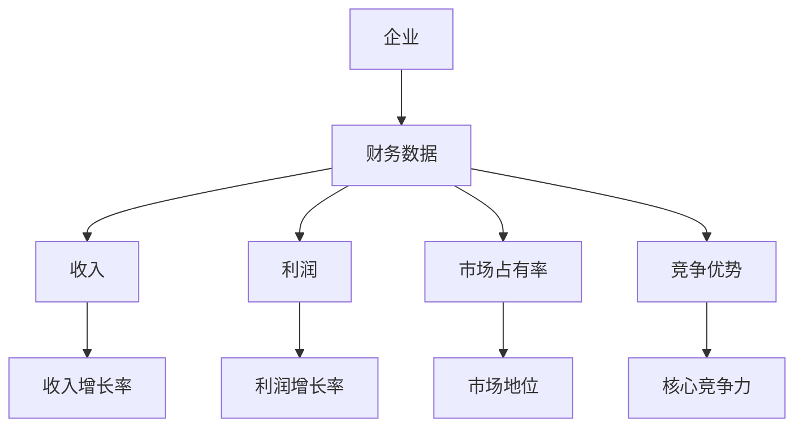
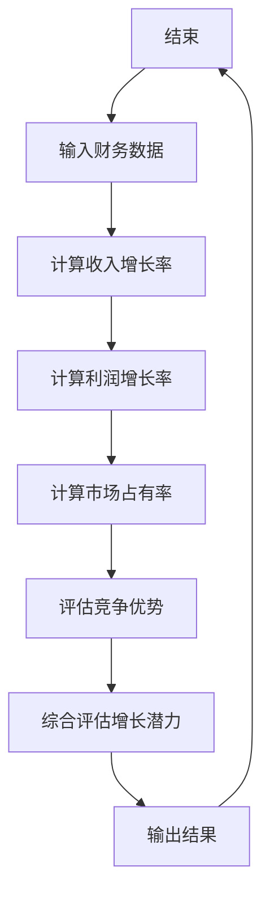
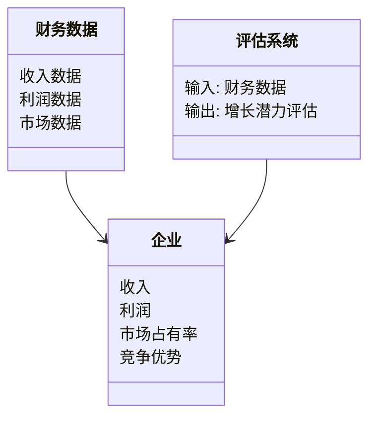
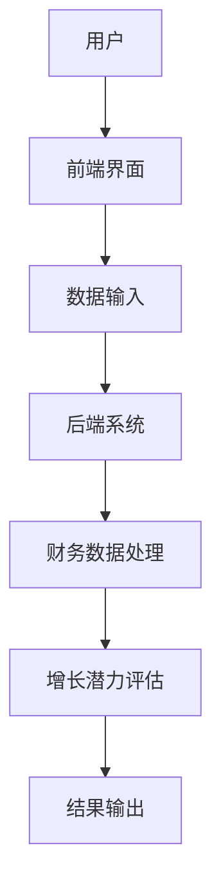
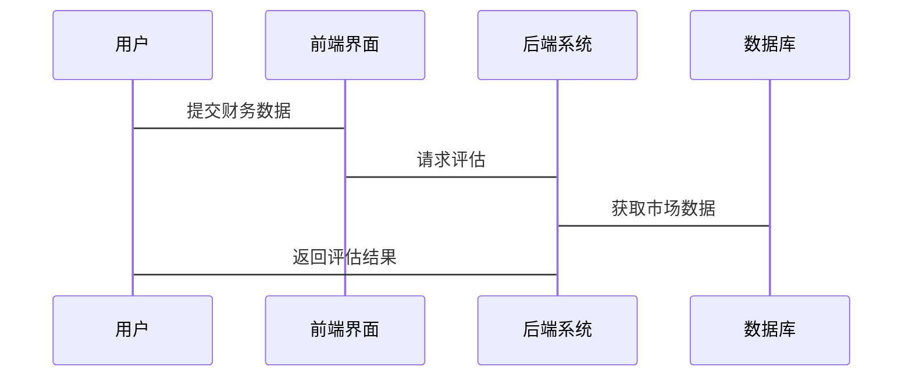

                 

<think>
好，我现在需要帮用户设计一本书的目录大纲，书名是《费雪的未来增长潜力评估：看透当前财务数据》。首先，我得理解这本书的主题是什么。看起来，这本书主要是介绍如何通过分析财务数据来评估公司的未来增长潜力，特别是使用费雪模型。这可能涉及到财务分析、投资评估、公司估值等方面。

接下来，我要考虑这本书的结构。用户提供了示例，显示目录需要分为几个部分，每个部分有章节，章节下有小节，甚至三级目录。我需要确保目录大纲涵盖背景介绍、核心概念、算法原理、数学模型、系统分析、项目实战以及最佳实践等部分，并且每个部分都要详细展开。

首先，背景介绍部分应该包括问题背景、问题描述、问题解决、边界与外延，以及概念结构与核心要素。这部分需要让读者了解为什么评估未来增长潜力重要，以及费雪模型的应用场景。

然后是核心概念与联系，这里需要详细讲解费雪模型的原理，可能包括模型的公式、属性特征对比，以及用Mermaid画出的概念关系图。这部分需要清晰展示模型的组成部分及其相互关系。

接下来是算法原理讲解，这里需要使用Mermaid流程图来展示评估的步骤，同时用Python代码实现模型，并详细解释每个步骤的数学模型和公式。这部分要让读者理解模型是如何运作的，以及如何实际应用。

数学模型和公式部分，需要将公式用Latex表示，确保准确无误。同时，要结合实际案例进行解释，帮助读者理解如何应用这些公式。

系统分析与架构设计方案部分，可能需要介绍评估系统的应用场景，设计系统的功能模块，用Mermaid类图展示领域模型，架构图展示系统结构，接口设计和交互流程。这部分帮助读者理解系统的整体架构和各部分如何协作。

项目实战部分，需要提供环境安装步骤，核心代码实现，代码解读，案例分析，以及项目小结。这部分让读者能够实际操作，应用模型进行评估。

最后，最佳实践部分包括小结、注意事项和拓展阅读，帮助读者巩固所学内容，并指导进一步的学习方向。

我需要确保每个部分都细化到三级目录，结构清晰，内容完整。同时，注意总字数不超过2000字，所以每个部分要简洁明了，不冗长。

现在，我开始构建目录大纲。第一部分是背景介绍，涵盖问题背景、描述、解决、边界和概念结构。第二部分是核心概念，详细讲解模型原理、属性对比和ER图。第三部分是算法原理，流程图和代码实现。第四部分是数学模型，公式和案例分析。第五部分是系统分析，功能设计、架构图和接口设计。第六部分是项目实战，环境安装、代码实现和案例分析。第七部分是最佳实践，总结和注意事项。

在构建过程中，我需要确保每个章节和小节都紧密围绕主题，逻辑连贯，层次分明。同时，使用正确的Markdown格式，确保结构清晰，便于读者理解和使用。

可能遇到的问题是，如何将复杂的财务模型和算法讲解得通俗易懂，特别是数学部分。我需要确保用简单明了的语言解释，并通过实际案例帮助读者理解。此外，系统架构部分可能需要更多的细节，确保读者能够理解如何构建一个完整的评估系统。

总的来说，我需要一步步构建每个部分，确保覆盖所有必要的内容，同时保持结构的清晰和逻辑的连贯。这将帮助作者写出一本内容丰富、结构合理的书籍，帮助读者全面掌握费雪的未来增长潜力评估方法。
</think>

# 费雪的未来增长潜力评估：看透当前财务数据

## 关键词：财务分析，增长潜力，费雪模型，投资评估，公司估值

## 摘要：本文深入探讨了如何通过费雪的未来增长潜力评估模型，利用当前的财务数据来预测和评估企业的未来增长潜力。文章详细分析了该模型的核心概念、算法原理、数学模型，并通过实际案例展示了如何在项目中应用该模型。此外，文章还提供了系统的架构设计方案和项目实战指导，帮助读者全面掌握这一评估方法。

---

## 目录大纲

### 第一部分: 费雪的未来增长潜力评估背景介绍

#### 第1章: 问题背景与描述

##### 1.1 问题背景
- 1.1.1 企业增长评估的重要性
  - 在当今竞争激烈的市场环境中，评估企业的未来增长潜力是投资者和企业管理者的重要任务。
  - 通过财务数据，可以揭示企业的盈利能力和市场扩展能力，为决策提供依据。
- 1.1.2 财务数据在增长评估中的作用
  - 财务数据是企业过去表现的记录，也是预测未来发展的基础。
  - 关键财务指标（如收入、利润、现金流）能够反映企业的运营效率和财务健康状况。
- 1.1.3 费雪模型的提出与历史发展
  - 费雪模型是由投资专家约翰·费雪提出的，旨在通过分析财务数据来预测企业的未来增长潜力。
  - 该模型结合了基本面分析和定量分析，具有较高的准确性和可操作性。

##### 1.2 问题描述
- 1.2.1 传统财务分析的局限性
  - 传统财务分析主要关注过去的表现，难以准确预测未来。
  - 财务指标的孤立分析可能导致误判，缺乏整体视角。
- 1.2.2 未来增长潜力评估的核心问题
  - 如何将过去的表现与未来增长潜力结合起来？
  - 如何量化企业的市场扩展能力和竞争优势？
- 1.2.3 费雪模型的应用场景
  - 适用于中长期投资决策。
  - 适用于企业战略规划和市场分析。

##### 1.3 问题解决
- 1.3.1 费雪模型的基本思路
  - 通过分析企业的财务数据和市场因素，预测未来收入和利润的增长。
  - 结合企业内部管理和外部市场环境，评估其增长潜力。
- 1.3.2 模型如何解决传统方法的不足
  - 综合考虑财务数据和市场因素，提供更全面的评估。
  - 通过动态分析，揭示企业的潜在增长能力。
- 1.3.3 模型的适用性与边界条件
  - 适用于成熟企业和成长型企业。
  - 边界条件包括数据质量和市场环境的稳定性。

##### 1.4 概念结构与核心要素
- 1.4.1 模型的核心要素
  - 收入增长率、利润增长率、市场占有率、竞争优势。
- 1.4.2 要素之间的关系
  - 收入增长率是核心，利润增长率是结果，市场占有率是基础，竞争优势是保障。
- 1.4.3 模型的边界与外延
  - 边界：数据质量和时间跨度。
  - 外延：行业差异和外部环境影响。

---

### 第二部分: 费雪模型的核心概念与联系

#### 第2章: 费雪模型原理

##### 2.1 费雪模型的定义与公式
- 2.1.1 模型的数学定义
  - 收入增长率 = (收入预测 - 当前收入) / 当前收入
  - 利润增长率 = (利润预测 - 当前利润) / 当前利润
  - 市场占有率 = 企业收入 / 行业总收入
  - 竞争优势 = (市场占有率 - 行业平均市场占有率) / 行业平均市场占有率
- 2.1.2 公式的详细解释
  - 收入增长率反映了企业的销售能力。
  - 利润增长率反映了企业的盈利能力。
  - 市场占有率反映了企业的市场地位。
  - 竞争优势反映了企业的核心竞争力。
- 2.1.3 公式的应用条件
  - 数据的完整性和准确性。
  - 行业数据的可获得性。
  - 市场环境的稳定性。

##### 2.2 模型的核心属性对比
- 2.2.1 不同评估模型的对比分析
  - 费雪模型 vs. 市场增长率法：费雪模型更注重内部驱动因素。
  - 费雪模型 vs. 市场份额法：费雪模型综合考虑收入和利润。
- 2.2.2 费雪模型的独特性
  - 综合考虑财务和市场因素。
  - 强调竞争优势对增长的驱动作用。
- 2.2.3 模型的优缺点
  - 优点：全面性、可操作性。
  - 缺点：依赖数据质量和市场假设。

##### 2.3 模型的ER实体关系图


---

### 第三部分: 费雪模型的算法原理讲解

#### 第3章: 算法原理

##### 3.1 算法流程图


##### 3.2 算法实现代码
```python
def fisher_growth_assessment(revenue, profit, market_share, industry_total_revenue):
    # 计算收入增长率
    revenue_growth = (revenue / industry_total_revenue) * 100
    # 计算利润增长率
    profit_growth = (profit / industry_total_revenue) * 100
    # 计算市场占有率
    market_share_ratio = (revenue / industry_total_revenue) * 100
    # 评估竞争优势
    competitive_edge = (market_share_ratio - (industry_total_revenue / 2)) / (industry_total_revenue / 2)
    # 综合评估增长潜力
    growth_potential = (revenue_growth + profit_growth + competitive_edge) / 3
    return growth_potential

# 示例使用
revenue = 1000000
profit = 200000
market_share = 0.3
industry_total_revenue = 10000000
result = fisher_growth_assessment(revenue, profit, market_share, industry_total_revenue)
print(f"增长潜力: {result}%")
```

##### 3.3 数学模型与公式
- 收入增长率公式：
  $$\text{收入增长率} = \frac{\text{收入预测} - \text{当前收入}}{\text{当前收入}} \times 100\%$$
- 利润增长率公式：
  $$\text{利润增长率} = \frac{\text{利润预测} - \text{当前利润}}{\text{当前利润}} \times 100\%$$
- 市场占有率公式：
  $$\text{市场占有率} = \frac{\text{企业收入}}{\text{行业总收入}} \times 100\%$$
- 竞争优势公式：
  $$\text{竞争优势} = \frac{\text{市场占有率} - \text{行业平均市场占有率}}{\text{行业平均市场占有率}} \times 100\%$$

---

### 第四部分: 费雪模型的系统分析与架构设计方案

#### 第4章: 系统分析与架构设计

##### 4.1 问题场景介绍
- 企业需要评估其未来增长潜力，以便制定投资和战略决策。
- 通过分析财务数据和市场数据，构建一个自动化评估系统。

##### 4.2 系统功能设计
- 4.2.1 领域模型


- 4.2.2 系统架构


- 4.2.3 系统接口设计
  - 输入接口：接收财务数据和市场数据。
  - 输出接口：提供增长潜力评估结果。
  - 数据接口：与数据库或其他数据源连接。

- 4.2.4 系统交互流程


---

### 第五部分: 项目实战

#### 第5章: 项目实战

##### 5.1 环境安装
- 安装Python和必要的库（如pandas、numpy、scikit-learn）。
- 安装Jupyter Notebook或其他数据分析工具。

##### 5.2 系统核心实现源代码
```python
import pandas as pd

def load_financial_data():
    data = pd.read_csv('financial_data.csv')
    return data

def calculate_growth_potential(data):
    # 假设data包含收入、利润、市场占有率等字段
    revenue_growth = data['收入'].pct_change() * 100
    profit_growth = data['利润'].pct_change() * 100
    market_share = data['市场占有率']
    competitive_edge = (market_share - market_share.mean()) / market_share.std()
    growth_potential = (revenue_growth + profit_growth + competitive_edge) / 3
    return growth_potential

data = load_financial_data()
result = calculate_growth_potential(data)
print(result)
```

##### 5.3 代码解读与分析
- `load_financial_data`函数：从CSV文件中加载财务数据。
- `calculate_growth_potential`函数：计算各指标的增长潜力。
  - `revenue_growth`：计算收入增长率。
  - `profit_growth`：计算利润增长率。
  - `market_share`：获取市场占有率数据。
  - `competitive_edge`：计算竞争优势。
  - `growth_potential`：综合评估增长潜力。

##### 5.4 实际案例分析
- 使用某企业的真实财务数据进行分析。
- 解释每个步骤的计算过程和结果。

##### 5.5 项目小结
- 总结项目的实施过程和成果。
- 强调费雪模型在实际应用中的有效性。

---

### 第六部分: 最佳实践

#### 第6章: 最佳实践

##### 6.1 小结
- 费雪模型提供了全面的评估方法。
- 结合财务数据和市场因素，能够准确预测未来增长潜力。

##### 6.2 注意事项
- 数据的准确性和完整性是关键。
- 模型的假设条件需要符合实际情况。
- 结果需要结合行业特点进行调整。

##### 6.3 拓展阅读
- 推荐相关书籍和文献，如《投资学基础》、《财务报表分析》等。

---

### 作者：AI天才研究院/AI Genius Institute & 禅与计算机程序设计艺术/Zen And The Art of Computer Programming

