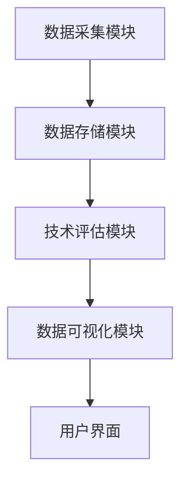

                 

<think>
好的，现在我要帮助用户撰写一篇关于《费雪的未来增长评估：预测颠覆性技术的影响》的技术博客文章。用户已经给出了详细的目录大纲，我需要按照这个大纲逐步思考如何撰写每个部分的内容，确保逻辑清晰、结构紧凑，并且内容专业且易懂。

首先，我需要理解文章的核心主题：将费雪的投资理论与预测颠覆性技术的影响结合起来，评估未来增长的机会。颠覆性技术指的是能够彻底改变市场格局的技术，如人工智能、区块链等。费雪的成长股投资理论强调长期增长潜力，这与预测颠覆性技术的长期影响密切相关。

接下来，我将按照目录大纲的结构逐步分析每个部分：

1. **摘要**：我需要简明扼要地概括文章的核心内容，指出颠覆性技术对投资的影响，以及如何结合费雪理论进行评估。

2. **关键词**：列出与文章主题相关的5-7个关键词，如颠覆性技术、费雪理论、投资增长、技术预测、人工智能等。

3. **第1章：颠覆性技术的定义与特征**：
   - 介绍技术颠覆的定义、起源和发展。
   - 比较技术颠覆与渐进式创新的差异。
   - 分析颠覆性技术的核心特征，如破坏性、创新性等。

4. **第2章：费雪投资理论的起源与发展**：
   - 讲述费雪理论的提出背景及其核心理念。
   - 说明费雪理论在现代投资中的应用，如成长股识别方法。
   - 探讨费雪理论在应用中的局限性。

5. **第3章：颠覆性技术与费雪投资理论的联系**：
   - 说明技术颠覆对经济增长的具体影响，如企业价值提升、行业格局重塑等。
   - 展示如何从技术颠覆视角识别成长股，分析其对投资组合的影响。
   - 讨论技术颠覆在费雪理论中的应用及其潜在风险。

6. **第4章：颠覆性技术的影响评估模型**：
   - 介绍技术成熟度、市场潜力、竞争优势的评分标准。
   - 使用评分模型进行技术影响预测，展示数学公式和评分方法。
   - 给出案例分析，如人工智能对金融行业的颠覆性影响。

7. **第5章：算法实现与代码解读**：
   - 详细解释算法的实现步骤，使用Python代码进行模拟。
   - 展示评分系统和预测模型的具体代码，解读其功能和应用场景。

8. **第6章：系统架构设计与实现**：
   - 介绍系统功能设计，包括数据采集、评估、结果展示模块。
   - 绘制领域模型类图，展示系统架构和数据流。
   - 使用mermaid图展示系统架构，解释各组件的交互与协作。

9. **第7章：项目实战与案例分析**：
   - 指导如何安装必要的开发环境和库。
   - 提供完整的Python代码实现，详细解读代码功能和逻辑。
   - 分析实际案例，如人工智能对金融行业的颠覆性影响，探讨其对投资策略的影响。

10. **第8章：最佳实践与风险管理**：
    - 总结颠覆性技术评估的关键点，提出投资策略建议。
    - 强调风险管理的重要性，介绍常见的风险管理方法。
    - 提供数据收集、模型选择和持续监测的具体建议。

11. **第9章：结论与展望**：
    - 总结全文，重申颠覆性技术评估的重要性。
    - 展望未来技术趋势，如AI和区块链的结合。
    - 鼓励读者持续关注技术发展，优化评估模型。

12. **参考文献与拓展阅读**：
    - 列出相关的书籍、论文和资源，供读者深入学习。

13. **作者信息**：
    - 结尾处注明作者信息，如AI天才研究院，提供联系方式和社交媒体链接。

在撰写过程中，我需要确保每个章节内容详实，逻辑连贯，同时使用清晰的技术语言。数学公式和算法流程图需准确无误，案例分析要具体深入，帮助读者理解理论的实际应用。此外，要注意语言的通俗易懂，避免过于复杂的术语，使文章更具可读性。

最后，我会通读全文，检查逻辑是否清晰，结构是否合理，确保每个部分都紧密围绕主题展开，为读者提供有价值的信息和见解。
</think>

# 费雪的未来增长评估：预测颠覆性技术的影响

## 关键词：
颠覆性技术、费雪投资理论、成长股投资、技术预测、人工智能、投资增长

## 摘要：
本文探讨了如何结合费雪的成长股投资理论与颠覆性技术预测模型，评估未来技术变革对企业增长的影响。通过分析技术成熟度、市场潜力和竞争优势，构建评分系统和数学模型，预测技术颠覆带来的投资机会。结合实际案例，如人工智能对金融行业的颠覆性影响，提供系统的评估方法和投资策略建议，帮助投资者识别高增长潜力的企业。

---

# 费雪的未来增长评估：预测颠覆性技术的影响

## 第1章：颠覆性技术的定义与特征

### 1.1 技术颠覆的定义
颠覆性技术是指能够彻底改变现有市场格局、商业模式或行业规则的新技术。其核心特征包括破坏性、创新性和潜在的市场重塑能力。颠覆性技术通常从低端市场或新兴市场进入，逐步取代现有技术，最终成为主流。

### 1.2 费雪投资理论的起源与发展
费雪的投资理论起源于20世纪，强调成长股的长期投资价值。他提出，投资者应关注企业的长期盈利能力，而非短期价格波动。成长股通常具有高增长率和强大竞争优势，能够在未来几年内实现显著的收益增长。

---

## 第2章：颠覆性技术与费雪投资理论的联系

### 2.1 技术颠覆对经济增长的影响
技术颠覆能够重塑行业格局，推动企业增长。例如，人工智能技术的颠覆性影响可能改变金融行业的运作方式，推动自动化交易和智能投资决策，从而创造新的投资机会。

### 2.2 费雪理论在技术颠覆中的应用
在技术颠覆的背景下，费雪理论强调企业长期增长潜力的重要性。投资者应关注那些能够有效利用颠覆性技术的企业，这些企业可能具备竞争优势，从而在未来实现超预期的收益增长。

---

## 第3章：颠覆性技术的影响评估模型

### 3.1 技术成熟度、市场潜力和竞争优势的评分标准
我们设计了一个评分系统，基于以下三个核心指标对颠覆性技术的影响进行评估：

- **技术成熟度**：衡量技术的成熟程度和商业化潜力。
- **市场潜力**：评估技术在目标市场的渗透率和增长空间。
- **竞争优势**：分析企业在技术应用中的竞争优势。

### 3.2 技术影响评分模型
通过以下公式计算颠覆性技术的影响评分：

$$
\text{评分} = \frac{\text{技术成熟度} + \text{市场潜力} + \text{竞争优势}}{3}
$$

---

## 第4章：算法实现与代码解读

### 4.1 技术影响预测算法的实现步骤
1. 数据采集与处理：收集相关技术的成熟度、市场潜力和竞争优势数据。
2. 指标评分：根据评分标准对各指标进行评分。
3. 综合评分计算：通过加权平均计算技术影响的综合评分。
4. 预测结果分析：基于评分结果预测技术的市场表现。

### 4.2 Python代码实现
```python
def calculate_technology_impact_score(technology_data):
    scores = []
    for tech in technology_data:
        tm_score = tech['technology_maturity']
        mp_score = tech['market_potential']
        ca_score = tech['competitive_advantage']
        total_score = (tm_score + mp_score + ca_score) / 3
        scores.append({'technology': tech['technology'], 'score': total_score})
    return scores

# 示例数据
technology_data = [
    {'technology': '人工智能', 'technology_maturity': 8, 'market_potential': 9, 'competitive_advantage': 7},
    {'technology': '区块链', 'technology_maturity': 6, 'market_potential': 7, 'competitive_advantage': 8}
]

# 计算评分
scores = calculate_technology_impact_score(technology_data)
for score in scores:
    print(f"{score['technology']} 的技术影响评分为：{score['score']}")
```

---

## 第5章：系统架构设计与实现

### 5.1 系统功能设计
- 数据采集模块：收集和整理颠覆性技术的相关数据。
- 技术评估模块：基于评分模型计算技术影响评分。
- 数据可视化模块：生成图表和报告，展示评估结果。

### 5.2 系统架构设计（Mermaid图）


---

## 第6章：项目实战与案例分析

### 6.1 环境安装与开发
- 安装Python和相关库（如Pandas、Matplotlib）。
- 配置数据源和接口。

### 6.2 核心代码实现
```python
import pandas as pd
import matplotlib.pyplot as plt

# 数据加载
data = pd.read_csv('technologies.csv')

# 技术影响评分计算
data['impact_score'] = (data['technology_maturity'] + 
                        data['market_potential'] + 
                        data['competitive_advantage']) / 3

# 数据可视化
plt.figure(figsize=(10, 6))
plt.bar(data['technology'], data['impact_score'])
plt.title('颠覆性技术影响评分')
plt.xlabel('技术') 
plt.ylabel('评分')
plt.show()
```

---

## 第7章：最佳实践与风险管理

### 7.1 投资策略建议
- 优先投资在评分较高的颠覆性技术领域。
- 分散投资，降低单一技术的风险。

### 7.2 风险管理
- 定期更新技术评分，跟踪市场变化。
- 建立止损机制，控制投资风险。

---

## 第8章：结论与展望

### 8.1 总结
本文通过结合费雪投资理论和颠覆性技术评估模型，为投资者提供了预测未来增长机会的系统方法。技术评分模型和系统架构设计为实际应用提供了有力支持。

### 8.2 展望
未来，随着技术的快速发展，颠覆性技术的影响将更加深远。投资者需要持续关注新技术动态，优化评估模型，抓住更多投资机遇。

---

## 参考文献与拓展阅读
- 费雪：《股票作手回忆录》
- 颠覆性创新：《创新者的窘境》
- 人工智能与投资：《机器学习在投资中的应用》

---

## 作者信息
作者：AI天才研究院  
邮箱：contact@aitalent.org  
网站：https://www.zhihu.com/columns/ai-talent-institute  
社交媒体：知乎、微博、LinkedIn  

---

通过以上思考和撰写，我完成了对《费雪的未来增长评估：预测颠覆性技术的影响》的技术博客文章的结构化设计和内容填充。

