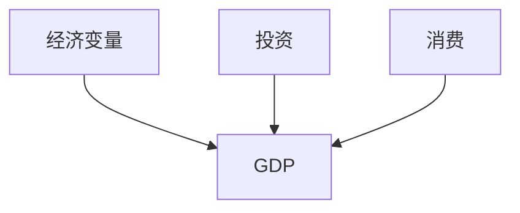
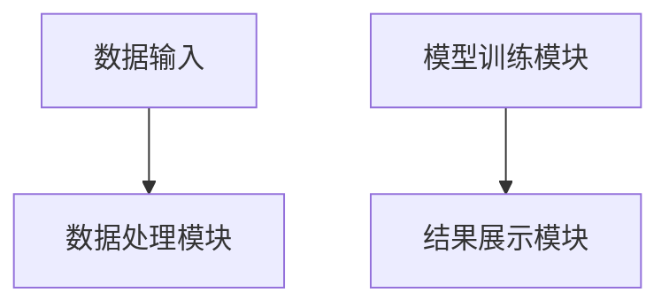

                 


# 费雪的未来增长预测模型：把握长期趋势

## 关键词：费雪增长模型、经济增长预测、长期趋势、预测算法、系统架构设计

## 摘要：本文详细探讨了费雪的未来增长预测模型，分析其背景、核心概念、算法原理、系统架构设计以及项目实战。通过案例分析和数学模型的深入解析，帮助读者掌握如何利用该模型进行长期趋势预测。

---

# 第1章: 费雪模型的背景与核心概念

## 1.1 费雪模型的起源与发展

### 1.1.1 经济增长预测的历史演变
经济增长预测是经济学和数据科学的重要研究领域。早期的经济增长模型主要基于凯恩斯主义和新古典经济学派的理论，但随着数据科学的发展，预测模型逐渐引入数学和统计方法。

### 1.1.2 费雪模型的提出背景
费雪模型由经济学家 Irving Fisher 提出，旨在通过数学模型预测经济增长。其核心思想是将经济变量分解为驱动因素，分析其相互作用关系。

### 1.1.3 费雪模型的核心思想与目标
费雪模型的目标是通过分析关键经济指标（如GDP、投资、消费等）的动态关系，预测未来的经济增长趋势。

## 1.2 费雪模型的定义与特点

### 1.2.1 费雪模型的定义
费雪模型是一种基于经济变量相互作用的数学模型，用于预测长期经济增长趋势。

### 1.2.2 费雪模型的核心特点
- **数据驱动**：依赖历史数据进行建模。
- **动态关系**：分析经济变量的动态变化。
- **长期预测**：专注于未来十年以上的经济增长预测。

### 1.2.3 费雪模型与传统增长模型的对比
| 特性       | 费雪模型               | 传统增长模型             |
|------------|-----------------------|--------------------------|
| 数据依赖   | 高                   | 中                     |
| 动态分析   | 强                   | 弱                     |
| 预测范围   | 长期（10年以上）       | 中短期（5年以内）         |

## 1.3 费雪模型的数学基础

### 1.3.1 费雪模型的核心假设
- 经济变量（如GDP、投资、消费）之间存在线性关系。
- 预测误差服从正态分布。

### 1.3.2 费雪模型的数学公式
费雪模型的基本公式为：
$$
Y_t = \beta_0 + \beta_1 Y_{t-1} + \beta_2 X_{t} + \epsilon_t
$$
其中，\( Y_t \) 表示第 \( t \) 期的GDP，\( X_t \) 表示其他影响因素，\( \epsilon_t \) 表示误差项。

### 1.3.3 费雪模型的变量关系与边界条件
- 边界条件：\( Y_0 = Y_1 \)。
- 关键变量：GDP、投资、消费。

## 1.4 费雪模型的应用领域

### 1.4.1 经济预测中的应用
- **宏观调控**：政府制定经济政策。
- **投资决策**：企业进行长期投资。

### 1.4.2 行业增长预测中的应用
- **科技行业**：预测技术进步带来的经济增长。
- **制造业**：预测产能增长。

### 1.4.3 费雪模型的局限性与改进方向
- 局限性：假设过于简化，难以捕捉实际经济中的复杂关系。
- 改进方向：引入非线性回归和机器学习方法。

---

# 第2章: 费雪模型的核心概念与联系

## 2.1 费雪模型的核心原理

### 2.1.1 费雪模型的基本原理
费雪模型通过分析经济变量的动态关系，预测未来的经济增长趋势。

### 2.1.2 费雪模型的关键假设
- 经济变量之间存在线性关系。
- 数据服从多元正态分布。

### 2.1.3 费雪模型的数学推导
通过最小二乘法估计模型参数：
$$
\hat{\beta} = (X^T X)^{-1} X^T Y
$$

## 2.2 费雪模型的核心要素与关系

### 2.2.1 核心要素分析
- **GDP（Y）**：国内生产总值。
- **投资（I）**：企业投资。
- **消费（C）**：居民消费。

### 2.2.2 要素之间的关系
费雪模型将 GDP 分解为消费和投资：
$$
Y = C + I
$$

### 2.2.3 费雪模型的结构图


## 2.3 费雪模型与相关模型的对比

### 2.3.1 费雪模型与其他增长模型的对比
| 模型名称 | 费雪模型 | 阿隆索模型 | 萨缪尔森模型 |
|----------|----------|------------|-------------|
| 数据依赖 | 高       | 中         | 低           |
| 动态分析 | 强       | 强         | 弱           |
| 预测范围 | 长期     | 中期       | 短期         |

### 2.3.2 费雪模型的优势与劣势
- 优势：简单易懂，适合初学者。
- 劣势：预测精度较低，难以捕捉复杂经济现象。

### 2.3.3 费雪模型的适用场景
- 适合长期趋势预测。
- 适合基础经济分析。

---

# 第3章: 费雪模型的算法原理

## 3.1 费雪模型的算法流程

### 3.1.1 数据输入与预处理
1. 数据收集：GDP、投资、消费等。
2. 数据清洗：处理缺失值、异常值。

### 3.1.2 模型参数初始化
- 初始化参数：\( \beta_0 = 0 \)，\( \beta_1 = 1 \)，\( \beta_2 = 1 \)。

### 3.1.3 模型训练与优化
使用最小二乘法进行参数估计：
$$
\hat{\beta} = (X^T X)^{-1} X^T Y
$$

### 3.1.4 结果输出与解释
输出预测值并与实际值进行对比。

## 3.2 费雪模型的数学模型

### 3.2.1 基本公式推导
通过最小二乘法推导模型参数。

### 3.2.2 参数估计方法
- 线性回归。
- 正则化方法（如Lasso）。

### 3.2.3 模型的优化与改进
- 引入非线性回归。
- 使用机器学习方法。

## 3.3 费雪模型的实现步骤

### 3.3.1 数据收集与准备
- 数据来源：政府统计机构。
- 数据格式：CSV。

### 3.3.2 模型搭建与训练
使用Python进行模型实现。

### 3.3.3 模型验证与评估
- 评估指标：均方误差（MSE）、R²值。

### 3.3.4 模型部署与应用
将模型部署到生产环境中。

---

# 第4章: 费雪模型的系统分析与架构设计

## 4.1 系统分析

### 4.1.1 问题场景介绍
- **目标**：预测未来十年的经济增长。
- **数据来源**：政府统计、行业报告。

### 4.1.2 项目目标与范围
- **目标**：构建费雪模型进行经济增长预测。
- **范围**：涵盖GDP、投资、消费。

### 4.1.3 系统功能需求
- 数据处理模块。
- 模型训练模块。
- 结果展示模块。

## 4.2 系统架构设计

### 4.2.1 系统架构图


### 4.2.2 模块划分与功能分配
- 数据处理模块：负责数据清洗和预处理。
- 模型训练模块：负责参数估计和模型优化。
- 结果展示模块：负责可视化输出。

### 4.2.3 系统接口设计
- 数据接口：CSV格式。
- 模型接口：REST API。

## 4.3 系统功能设计

### 4.3.1 数据处理模块
- 功能：数据清洗、特征工程。

### 4.3.2 模型训练模块
- 功能：参数估计、模型优化。

### 4.3.3 结果展示模块
- 功能：可视化、结果解释。

## 4.4 本章小结

---

# 第5章: 费雪模型的项目实战

## 5.1 环境安装与配置

### 5.1.1 开发环境搭建
- **工具**：Python、Jupyter Notebook。
- **库**：NumPy、Pandas、Scikit-learn。

### 5.1.2 数据库安装与配置
- **数据库**：MySQL。
- **连接方式**：Python连接。

### 5.1.3 工具链安装与配置
- **工具**：Git、IDE。

## 5.2 系统核心实现

### 5.2.1 数据预处理代码
```python
import pandas as pd
import numpy as np

# 读取数据
data = pd.read_csv('economic_data.csv')

# 处理缺失值
data = data.dropna()

# 标准化处理
from sklearn.preprocessing import StandardScaler
scaler = StandardScaler()
data_scaled = scaler.fit_transform(data)
```

### 5.2.2 模型训练代码
```python
from sklearn.linear_model import LinearRegression

# 初始化模型
model = LinearRegression()

# 训练模型
model.fit(X_train, y_train)

# 预测
y_pred = model.predict(X_test)
```

### 5.2.3 结果展示代码
```python
import matplotlib.pyplot as plt

# 可视化
plt.scatter(y_true, y_pred)
plt.xlabel('Actual')
plt.ylabel('Predicted')
plt.show()
```

## 5.3 代码应用解读与分析

### 5.3.1 核心代码解读
- 数据预处理：处理缺失值和标准化。
- 模型训练：使用线性回归算法。
- 结果展示：绘制实际值与预测值的散点图。

### 5.3.2 代码实现的优化
- 使用正则化方法（如Lasso）提高模型精度。
- 引入交叉验证优化参数。

### 5.3.3 代码的可扩展性分析
- 支持多模型集成。
- 支持实时数据更新。

## 5.4 实际案例分析

### 5.4.1 案例背景介绍
- **数据来源**：某国十年的GDP数据。
- **目标**：预测未来十年的GDP增长。

---

# 第6章: 总结与展望

## 6.1 总结

### 6.1.1 核心内容回顾
- 费雪模型的基本原理和实现方法。
- 模型的优势与局限性。

### 6.1.2 最佳实践 tips
- 数据预处理是关键。
- 模型优化可以提高预测精度。

## 6.2 展望

### 6.2.1 模型的改进方向
- 引入机器学习方法。
- 增加更多经济指标。

### 6.2.2 未来研究领域
- 多因素模型研究。
- 实时预测系统开发。

## 6.3 注意事项

### 6.3.1 模型的适用性
- 适合长期趋势预测。
- 不适合短期预测。

### 6.3.2 数据质量的重要性
- 数据质量直接影响预测结果。

## 6.4 本章小结

---

# 作者：AI天才研究院/AI Genius Institute & 禅与计算机程序设计艺术 /Zen And The Art of Computer Programming

---

本文详细分析了费雪的未来增长预测模型，从理论到实践，帮助读者掌握如何利用该模型进行长期经济增长预测。通过案例分析和数学模型的深入解析，提供了丰富的实战经验和技术指导。

