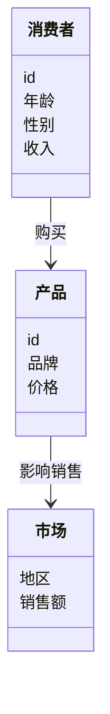

                 


# 费雪的消费者行为分析在投资中的应用

---

## 关键词：
1. 费雪消费者行为分析
2. 投资决策
3. 数据分析
4. 投资策略
5. 理论应用

---

## 摘要：
本文详细探讨了费雪的消费者行为分析在投资中的应用，通过分析消费者行为的核心概念、算法原理、数学模型和系统架构，结合实际项目案例，展示了如何利用费雪理论优化投资决策。文章从背景介绍、理论基础、算法实现、系统设计到项目实战，层层递进，帮助读者深入理解消费者行为分析在投资中的重要性，并提供实际操作的指导。

---

## 第1章: 费雪的消费者行为分析概述

### 1.1 费雪的消费者行为理论
#### 1.1.1 消费者行为分析的定义
消费者行为分析是研究消费者在购买、使用和处置产品或服务时的决策过程和行为模式。

#### 1.1.2 费雪理论的核心观点
费雪提出，消费者行为受到心理、社会和文化因素的影响，这些因素通过影响消费者需求来驱动市场变化。

#### 1.1.3 费雪理论在投资中的应用
在投资中，理解消费者行为可以帮助投资者预测市场趋势，优化投资组合，并抓住市场机会。

### 1.2 消费者行为分析的核心概念
#### 1.2.1 消费者决策过程
消费者决策过程包括需求识别、信息收集、评估、购买和使用后行为。

#### 1.2.2 消费者心理与行为特征
消费者心理包括认知、情感和动机，行为特征包括购买频率、品牌忠诚度等。

#### 1.2.3 费雪理论的数学模型
费雪的消费者行为模型可以通过回归分析等方法进行量化。

---

## 第2章: 费雪分析法的算法原理

### 2.1 数据收集与预处理
#### 2.1.1 数据来源
数据来源包括消费者调查、销售数据和市场报告。

#### 2.1.2 数据清洗
清洗数据包括处理缺失值和异常值。

#### 2.1.3 数据转换
数据转换包括标准化和特征提取。

### 2.2 数据分析与建模
#### 2.2.1 费雪分析法的流程
数据收集 → 数据清洗 → 数据分析 → 模型构建 → 预测与验证。

#### 2.2.2 模型实现
使用Python的pandas和scikit-learn库进行数据处理和建模。

#### 2.2.3 代码示例
```python
import pandas as pd
from sklearn.model_selection import train_test_split
from sklearn.linear_model import LinearRegression

# 加载数据
data = pd.read_csv('consumer_behavior.csv')

# 分割数据
X = data[['price', 'advertisement']]
y = data['sales']
X_train, X_test, y_train, y_test = train_test_split(X, y, test_size=0.2, random_state=42)

# 建立模型
model = LinearRegression()
model.fit(X_train, y_train)

# 预测与评估
print(model.score(X_test, y_test))
```

### 2.3 模型解释
#### 2.3.1 回归分析
回归分析用于预测消费者需求，模型系数表示变量对目标变量的影响程度。

#### 2.3.2 模型验证
通过R²值和残差分析验证模型的准确性。

---

## 第3章: 系统架构与设计

### 3.1 系统功能设计
#### 3.1.1 领域模型
构建消费者行为分析的领域模型，包括消费者、产品、市场等实体。

#### 3.1.2 功能模块
功能模块包括数据采集、分析模块、预测模块和结果展示。

#### 3.1.3 领域模型的Mermaid图


### 3.2 系统架构设计
#### 3.2.1 分层架构
系统架构分为数据层、业务逻辑层和表现层。

#### 3.2.2 系统架构的Mermaid图


### 3.3 系统接口设计
#### 3.3.1 API接口
提供RESTful API接口，供其他系统调用。

#### 3.3.2 接口测试
使用Postman进行接口测试，确保功能正常。

---

## 第4章: 项目实战

### 4.1 项目背景与目标
目标是利用费雪理论分析消费者行为，优化投资决策。

### 4.2 核心代码实现
```python
import pandas as pd
from sklearn.metrics import mean_squared_error

# 加载数据
data = pd.read_csv('consumer_behavior.csv')

# 数据预处理
data = data.dropna()

# 建立模型
model = LinearRegression()
model.fit(X_train, y_train)

# 预测与评估
y_pred = model.predict(X_test)
print(mean_squared_error(y_test, y_pred))
```

### 4.3 代码解读
代码实现数据加载、预处理、建模和评估，展示了如何将费雪理论应用于实际投资决策。

### 4.4 实际案例分析
通过实际案例分析，展示如何利用费雪理论预测销售趋势，优化投资组合。

---

## 第5章: 最佳实践与小结

### 5.1 小结
费雪的消费者行为分析在投资中具有重要作用，能够帮助投资者做出更科学的决策。

### 5.2 注意事项
在实际应用中，需注意数据质量、模型选择和结果验证。

### 5.3 拓展阅读
建议阅读相关书籍和文献，深入学习消费者行为分析的理论与应用。

---

## 作者：
AI天才研究院/AI Genius Institute & 禅与计算机程序设计艺术 /Zen And The Art of Computer Programming

