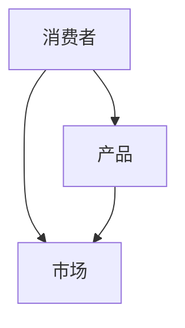
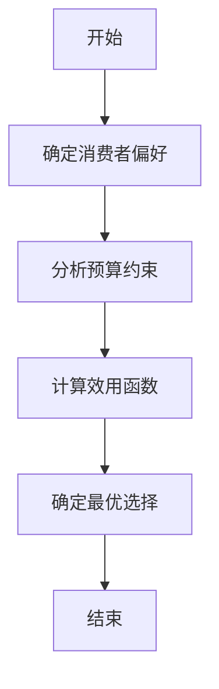
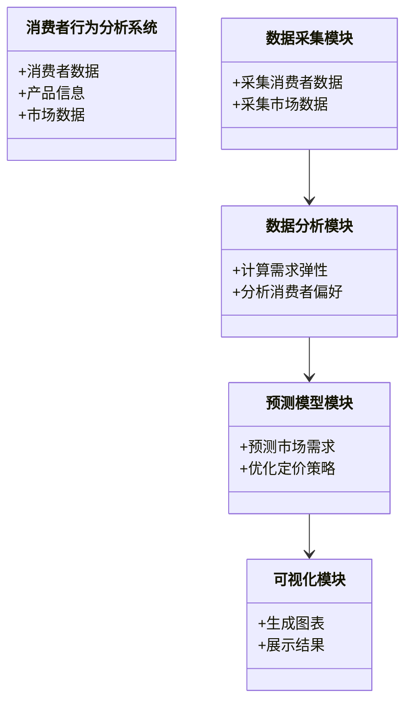
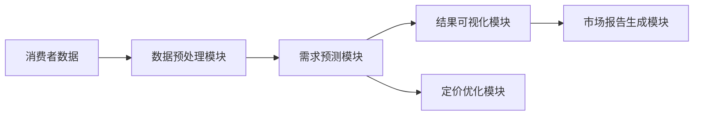

                 


# 费雪的消费者行为分析：把握市场需求变化

> 关键词：费雪需求理论、消费者行为分析、市场需求预测、效用函数、价格弹性、收入弹性

> 摘要：本文深入分析了费雪的消费者行为理论及其数学模型，结合实际案例展示了如何利用这些理论进行市场需求预测和分析。通过系统化的分析方法和算法实现，帮助读者更好地理解消费者行为的核心概念和应用价值。

---

## 第1章: 费雪的消费者行为分析概述

### 1.1 费雪的消费者行为理论背景

#### 1.1.1 消费者行为分析的定义与研究意义
消费者行为分析是研究消费者在市场中的决策过程及其行为模式的学科。它通过分析消费者的需求、偏好、购买决策等因素，帮助企业更好地理解市场需求，制定有效的市场策略。

#### 1.1.2 费雪的学术贡献与研究方法
费雪（Irving Fisher）是消费者行为理论的重要奠基人之一。他提出了消费者效用函数的概念，并通过数学模型描述了消费者选择的优化过程。他的研究方法以严谨的数学推导和实证分析为基础，为现代消费者行为分析奠定了理论基础。

#### 1.1.3 消费者行为分析的核心问题与边界
消费者行为分析的核心问题是研究消费者如何在有限的预算下实现效用的最大化。其研究边界包括个体消费者的选择行为、市场需求的变化规律以及外部环境对消费者行为的影响。

### 1.2 消费者行为的核心概念

#### 1.2.1 需求、效用与偏好的基本概念
- **需求**：消费者在特定价格和收入水平下愿意购买的数量。
- **效用**：消费者从消费中获得的满足感或价值。
- **偏好**：消费者对不同商品或服务的偏爱程度。

#### 1.2.2 消费者选择的理性假设
消费者在选择商品时，通常基于理性的决策过程，追求效用最大化。这一假设是消费者行为分析的基础。

#### 1.2.3 市场需求与个体需求的关系
市场需求是所有消费者个体需求的总和，反映了整个市场的购买行为。

### 1.3 费雪需求理论的数学模型

#### 1.3.1 需求函数的定义与形式
费雪的需求函数描述了消费者在不同价格和收入水平下的需求量。其基本形式如下：
$$ Q_d = a - bP + cM $$
其中：
- \( Q_d \) 表示需求量
- \( P \) 表示价格
- \( M \) 表示收入
- \( a, b, c \) 为常数参数

#### 1.3.2 需求的价格弹性与收入弹性
- **价格弹性**：衡量需求量对价格变化的敏感程度。
- **收入弹性**：衡量需求量对收入变化的敏感程度。

---

## 第2章: 消费者行为的核心概念与联系

### 2.1 核心概念的原理与属性特征

#### 2.1.1 需求与供给的对比分析
| 属性 | 需求 | 供给 |
|------|------|------|
| 驱动因素 | 消费者偏好、价格、收入 | 生产成本、技术、市场预期 |
| 方向 | 购买行为 | 销售行为 |
| 影响因素 | 价格弹性、收入弹性 | 供给弹性 |

#### 2.1.2 效用与偏好的关系
效用是偏好的量化表示，偏好决定了消费者的需求选择。

#### 2.1.3 预算约束与消费者选择的相互作用
预算约束限制了消费者的购买能力，而消费者选择则基于效用最大化的原则。

### 2.2 消费者行为的ER实体关系图


### 2.3 消费者选择的算法原理



---

## 第3章: 消费者行为分析的数学模型与公式

### 3.1 需求函数的数学模型
$$ Q_d = a - bP + cM + \epsilon $$
其中：
- \( Q_d \) 表示需求量
- \( P \) 表示价格
- \( M \) 表示收入
- \( a, b, c \) 为常数参数
- \( \epsilon \) 表示随机误差项

### 3.2 效用函数的优化模型
$$ \max_{x} U(x) = U(x_1, x_2, ..., x_n) $$
$$ \text{subject to } \sum_{i=1}^{n} p_i x_i = M $$

### 3.3 需求弹性

---

## 第4章: 消费者行为分析的系统设计与实现

### 4.1 问题场景介绍
以快消品市场为例，分析消费者行为对市场需求的影响。

### 4.2 系统功能设计


### 4.3 系统架构设计


### 4.4 系统接口设计
- 数据接口：与数据库或API对接，获取消费者数据和市场数据。
- 模型接口：与机器学习框架（如Python的scikit-learn）对接，实现需求预测。

### 4.5 系统交互设计
```mermaid
sequenceDiagram
    消费者数据 --> 数据预处理模块
    数据预处理模块 --> 需求预测模块
    需求预测模块 --> 结果可视化模块
    结果可视化模块 --> 市场报告生成模块
```

---

## 第5章: 项目实战与案例分析

### 5.1 环境安装与数据准备
- 安装Python、Pandas、Scikit-learn等工具。
- 数据来源：公开市场数据或企业内部数据。

### 5.2 系统核心实现源代码
```python
import pandas as pd
from sklearn.linear_model import LinearRegression

# 数据加载
data = pd.read_csv('consumer_data.csv')

# 特征与目标变量分离
X = data[['price', 'income']]
y = data['quantity']

# 模型训练
model = LinearRegression()
model.fit(X, y)

# 预测与评估
predictions = model.predict(X)
print('预测结果:', predictions)
print('系数:', model.coef_)
print('截距:', model.intercept_)
```

### 5.3 代码应用解读与分析
- 使用线性回归模型预测需求量。
- 系数和截距分别表示价格和收入对需求的影响。

### 5.4 实际案例分析
以快消品市场为例，分析需求预测结果，并提出优化定价策略。

### 5.5 项目小结
总结项目实现的关键步骤和成果，强调理论与实践的结合。

---

## 第6章: 总结、注意事项与未来研究方向

### 6.1 总结
本文通过费雪的消费者行为理论，结合数学模型和实际案例，展示了如何分析和预测市场需求。消费者行为分析是企业制定市场策略的重要工具。

### 6.2 注意事项
- 数据质量对模型结果影响重大，需确保数据的准确性和完整性。
- 模型假设与实际可能存在偏差，需结合实际情况进行调整。

### 6.3 未来研究方向
- 结合人工智能技术，提升需求预测的精度。
- 探索消费者行为的动态变化，优化市场应对策略。

---

## 作者：AI天才研究院/AI Genius Institute & 禅与计算机程序设计艺术 /Zen And The Art of Computer Programming

