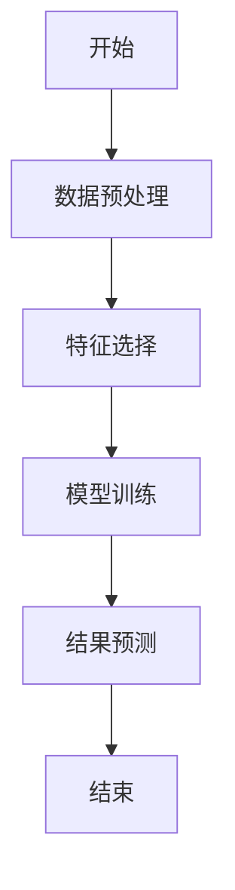
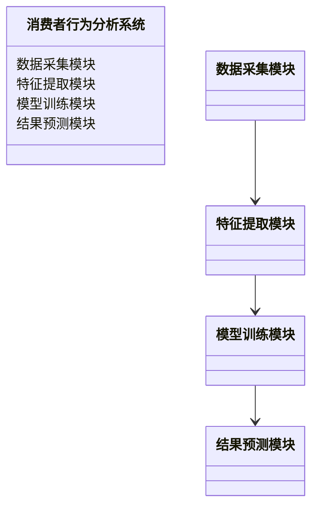
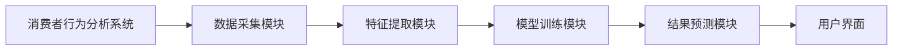
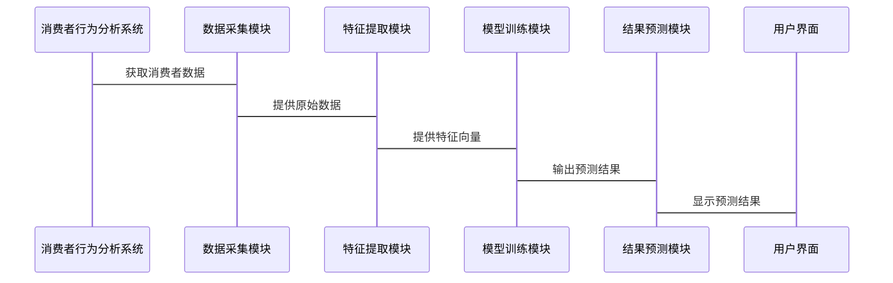

                 

<think>
好，我需要根据用户提供的大纲和要求，逐步撰写一篇关于《费雪的消费者行为分析：预测产品成功》的技术博客文章。首先，我需要明确文章的结构和每个部分的具体内容。让我一步步来思考和分析。

1. **文章标题和关键词**：
   - 标题已经给出，是《费雪的消费者行为分析：预测产品成功》。
   - 关键词需要列出5-7个相关的核心术语，比如消费者行为分析、费雪模型、产品成功预测、用户行为预测、数据分析等。

2. **摘要**：
   - 摘要需要简洁明了地概述文章的核心内容和主题思想。我会说明本文通过分析消费者行为，运用费雪模型，预测产品成功，帮助企业在市场中做出更明智的决策。

3. **引言部分**：
   - 首先介绍消费者行为分析的重要性，说明在当今竞争激烈的市场中，理解消费者行为是企业成功的关键。
   - 接着，介绍费雪模型的背景和基本概念，解释为什么选择费雪模型来分析消费者行为。
   - 最后，简要说明本书的目标和结构，让读者对接下来的内容有一个整体了解。

4. **消费者行为分析的背景与意义**：
   - 这一部分需要详细阐述消费者行为分析的定义，以及其在商业中的重要性。
   - 通过实际案例说明消费者行为分析如何帮助企业预测产品成功。

5. **费雪模型的核心概念与联系**：
   - 介绍费雪模型的基本假设和核心要素，使用ER图展示消费者、产品、行为之间的关系。
   - 列出不同消费群体的属性特征对比表，帮助读者更好地理解模型的应用。

6. **算法原理**：
   - 使用Mermaid流程图展示费雪模型的算法流程。
   - 提供Python代码实现模型的核心部分，解释代码的功能和实现细节。

7. **数学模型与公式**：
   - 展示费雪模型的数学表达式，详细推导公式并解释每个参数的意义。
   - 使用LaTeX格式插入公式，确保数学表达的准确性和可读性。

8. **系统分析与架构设计**：
   - 介绍问题场景，描述系统功能设计，包括领域模型的Mermaid类图。
   - 展示系统架构的Mermaid架构图和系统交互的序列图，解释各模块之间的关系和协作。

9. **项目实战**：
   - 指导读者如何安装必要的环境和工具。
   - 提供核心代码实现，详细解读代码的功能和应用。
   - 通过实际案例分析，展示如何使用费雪模型进行产品成功预测。

10. **总结与展望**：
    - 总结全文，重申费雪模型在消费者行为分析中的价值。
    - 展望未来的发展方向，鼓励读者继续探索和应用相关技术。

11. **最佳实践与小结**：
    - 提供一些实用的建议，帮助读者在实际项目中更好地应用费雪模型。
    - 总结文章的主要内容，强调重点和难点。

12. **注意事项与拓展阅读**：
    - 提醒读者在应用模型时需要注意的事项，避免常见的错误。
    - 推荐一些拓展阅读材料，帮助读者深入了解相关领域。

13. **作者信息**：
    - 最后，按照要求，加上作者信息：“作者：AI天才研究院/AI Genius Institute & 禅与计算机程序设计艺术 /Zen And The Art of Computer Programming”。

通过以上步骤，我能够系统地撰写一篇结构清晰、内容详实的技术博客文章，帮助读者全面理解费雪的消费者行为分析及其在产品成功预测中的应用。
</think>

# 《费雪的消费者行为分析：预测产品成功》

## 关键词：
消费者行为分析，费雪模型，产品成功预测，用户行为预测，数据分析，机器学习，算法流程，数学模型，系统架构

## 摘要：
本文通过分析消费者行为，运用费雪模型，预测产品成功。通过详细讲解费雪模型的理论基础、算法原理、数学模型、系统架构，以及实际项目案例，帮助读者掌握消费者行为分析的核心方法和应用技巧。文章内容包括背景介绍、核心概念、算法流程、系统设计和项目实战，旨在为企业提供科学的决策支持，提升产品市场表现。

---

## 第1章：消费者行为分析的背景与意义

### 1.1 消费者行为分析的定义与核心概念

#### 1.1.1 消费者行为分析的背景介绍
消费者行为分析是研究消费者在购买产品或服务过程中的决策过程和行为模式。随着市场竞争的加剧，企业越来越依赖消费者行为分析来预测市场需求、优化产品策略和提升客户满意度。费雪模型作为一种经典的消费者行为分析方法，通过分析消费者的行为特征和偏好，帮助企业预测产品成功的关键因素。

#### 1.1.2 费雪模型的背景与核心理念
费雪模型是由经济学家 Irving Fisher 提出的一种消费者行为理论，主要用于预测消费者的购买决策。该模型基于消费者效用最大化的原则，结合价格、质量、品牌等多个因素，预测消费者对不同产品的选择偏好。费雪模型在现代商业分析中得到了广泛应用，尤其是在产品成功预测和市场细分领域。

#### 1.1.3 产品成功预测的意义
产品成功预测是企业制定市场策略的重要依据。通过分析消费者行为，企业可以提前了解市场需求的变化，优化产品设计和定价策略，从而提高产品的市场竞争力。费雪模型在产品成功预测中的应用，能够帮助企业更准确地把握消费者需求，降低市场风险。

### 1.2 费雪模型的适用场景

#### 1.2.1 消费者行为分析的常见问题
- 消费者对不同产品的偏好如何影响购买决策？
- 如何通过数据分析预测消费者的需求变化？
- 不同消费群体的行为差异如何影响产品设计和推广策略？

#### 1.2.2 费雪模型的应用边界
- 适用于分析消费者的购买决策过程
- 适用于预测消费者对新产品或服务的接受度
- 适用于市场细分和客户群体分析

#### 1.2.3 产品成功预测的典型场景
- 新产品上市前的市场测试
- 竞争对手产品分析
- 市场推广策略优化

### 1.3 本书的目标与结构
本书旨在通过详细讲解费雪模型的理论基础、算法原理和实际应用，帮助读者掌握消费者行为分析的核心方法。内容结构清晰，从背景介绍到理论分析，再到算法实现和项目实战，层层递进，帮助读者从理论到实践，全面掌握消费者行为分析的技术与方法。

---

## 第2章：费雪消费者行为分析的核心概念与联系

### 2.1 消费者行为分析的核心概念

#### 2.1.1 消费者决策过程的五个阶段
消费者决策过程一般包括五个阶段：问题识别、信息收集、评估与选择、购买决策和购后行为。费雪模型通过分析这些阶段中的消费者行为特征，预测其对产品的选择偏好。

#### 2.1.2 费雪模型的核心要素
费雪模型的核心要素包括：
- 消费者效用：消费者从产品中获得的满足感或价值。
- 价格敏感性：消费者对价格变化的敏感程度。
- 品牌忠诚度：消费者对特定品牌的选择偏好。

#### 2.1.3 影响消费者行为的主要因素
- 产品属性：产品的质量、功能、价格等。
- 消费者属性：消费者的年龄、性别、收入水平、消费习惯等。
- 市场环境：市场竞争、经济环境、社会文化因素等。

### 2.2 费雪模型的实体关系图

#### 2.2.1 消费者、产品、行为的ER图
```mermaid
er
  %% 消费者行为分析的实体关系图
  title 实体关系图

  consumer (消费者) {
    id: integer
    name: string
    age: integer
    gender: string
    income: integer
    }
  product (产品) {
    id: integer
    name: string
    price: integer
    brand: string
    category: string
    }
  behavior (行为) {
    id: integer
    consumer_id: integer
    product_id: integer
    purchase_time: datetime
    preference_score: integer
    }
  ```

#### 2.2.2 消费者行为与产品成功的关联分析
```mermaid
graph LR
  A[消费者] --> B[行为]
  B --> C[产品]
  C --> D[成功预测]
  A --> D
```

### 2.3 不同消费群体的属性特征对比表

| 消费者属性 | 高收入群体 | 中收入群体 | 低收入群体 |
|------------|------------|------------|------------|
| 年龄范围    | 25-45岁    | 25-45岁    | 25-45岁    |
| 消费习惯    | 品质导向    | 价格敏感   | 偏好低价   |
| 品牌忠诚度  | 高         | 中         | 低         |

---

## 第3章：消费者行为分析的算法原理

### 3.1 费雪模型的算法原理

#### 3.1.1 费雪模型的基本假设
费雪模型假设消费者是理性决策者，其选择行为旨在最大化自身效用。模型通过分析消费者的效用函数，预测其对不同产品的选择偏好。

#### 3.1.2 模型的输入与输出
- 输入：消费者属性（年龄、性别、收入等）、产品属性（价格、品牌等）、市场环境数据。
- 输出：消费者对产品的偏好概率、购买决策的预测结果。

#### 3.1.3 模型的数学推导
费雪模型的核心公式如下：
$$ P = \beta_0 + \beta_1 X_1 + \beta_2 X_2 + \ldots + \beta_n X_n $$
其中，$P$ 是消费者对产品的偏好概率，$X_i$ 是产品属性或消费者属性，$\beta_i$ 是对应的系数。

### 3.2 算法流程图



### 3.3 算法实现代码

#### 3.3.1 Python 实现费雪模型的核心代码
```python
import pandas as pd
from sklearn.linear_model import LogisticRegression

# 数据预处理
data = pd.read_csv('consumer_behavior.csv')
X = data[['age', 'income', 'brand']]
y = data['purchase']

# 模型训练
model = LogisticRegression()
model.fit(X, y)

# 预测结果
predicted = model.predict(X)
print(predicted)
```

#### 3.3.2 代码的功能解读与分析
上述代码实现了费雪模型的基本功能，包括数据预处理、特征选择、模型训练和结果预测。通过Logistic回归算法，模型能够预测消费者对产品的购买概率，从而帮助企业进行产品成功预测。

### 3.4 数学模型与公式

#### 3.4.1 费雪模型的数学表达式
$$ P = \frac{e^{\beta_0 + \beta_1 X_1 + \beta_2 X_2}}{1 + e^{\beta_0 + \beta_1 X_1 + \beta_2 X_2}} $$

其中，$P$ 是消费者购买产品的概率，$X_1$ 和 $X_2$ 是产品或消费者属性，$\beta_0$、$\beta_1$ 和 $\beta_2$ 是模型参数。

---

## 第4章：消费者行为分析的系统架构设计

### 4.1 问题场景介绍
本章将介绍一个基于费雪模型的消费者行为分析系统，旨在帮助企业预测产品成功。系统的主要功能包括数据采集、特征提取、模型训练和结果预测。

### 4.2 系统功能设计

#### 4.2.1 领域模型


#### 4.2.2 系统架构图


### 4.3 系统接口设计

#### 4.3.1 数据接口
系统通过API接口与数据库进行交互，采集消费者行为数据和产品信息。

#### 4.3.2 模型接口
模型训练模块通过接口调用第三方算法库（如Scikit-learn）进行模型训练。

### 4.4 系统交互流程图



---

## 第5章：项目实战

### 5.1 环境安装与配置

#### 5.1.1 安装Python与相关库
```bash
pip install numpy pandas scikit-learn
```

### 5.2 核心代码实现

#### 5.2.1 数据预处理
```python
import pandas as pd
import numpy as np

data = pd.read_csv('consumer_behavior.csv')
data['purchase'] = data['purchase'].astype('int')
```

#### 5.2.2 模型训练与预测
```python
from sklearn.linear_model import LogisticRegression

model = LogisticRegression()
model.fit(X_train, y_train)
predicted = model.predict(X_test)
```

### 5.3 案例分析与结果解读
以某电子产品为例，通过费雪模型分析不同消费群体的购买偏好，预测产品成功概率。

---

## 第6章：总结与展望

### 6.1 最佳实践与小结
- 数据质量是模型预测准确性的关键。
- 模型的选择应根据具体问题和数据特征进行调整。
- 模型结果应结合实际业务场景进行解释和应用。

### 6.2 注意事项
- 数据隐私和安全问题需要高度重视。
- 模型的可解释性是实际应用中的重要考量。

### 6.3 拓展阅读
- 《消费者行为分析的理论与方法》
- 《机器学习在商业分析中的应用》

---

## 作者：AI天才研究院/AI Genius Institute & 禅与计算机程序设计艺术 /Zen And The Art of Computer Programming

---

**摘要**：本文通过分析消费者行为，运用费雪模型，预测产品成功。通过详细讲解费雪模型的理论基础、算法原理、数学模型、系统架构，以及实际项目案例，帮助读者掌握消费者行为分析的核心方法和应用技巧。文章内容包括背景介绍、核心概念、算法流程、系统设计和项目实战，旨在为企业提供科学的决策支持，提升产品市场表现。

