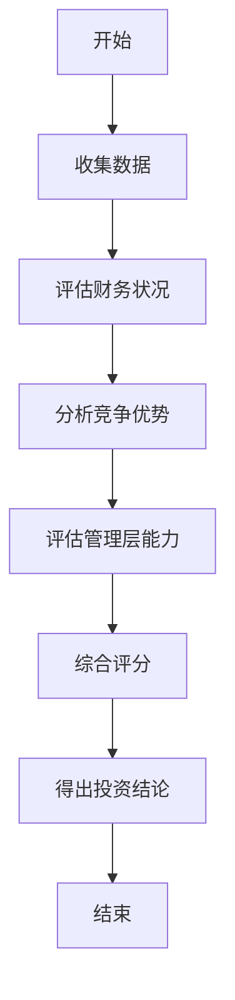
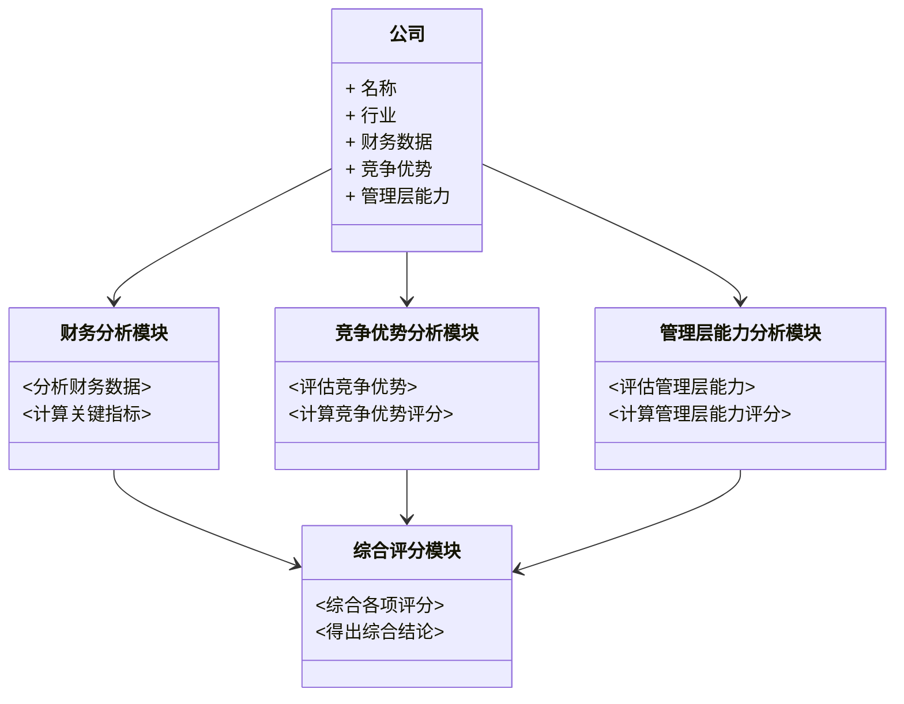

                 

<think>
嗯，用户让我详细解释一下费雪的深度研究方法，特别是如何了解公司内部。我得先理解什么是费雪的深度研究方法。好像是投资大师费雪提出的，注重长期成长股，深入研究公司基本面。那我得从他的背景和核心理念开始讲。

首先，我应该介绍一下费雪是谁，他的投资哲学是什么。然后，详细讲解他的选股标准，比如公司的竞争优势、管理层质量、财务健康状况等。接下来，需要讲讲如何进行深入的公司分析，包括财务报表分析、行业分析、管理层访谈等。

然后，我需要把整个过程系统化，可能用一个框架来展示。比如，先评估公司的财务状况，再分析行业竞争情况，最后结合管理层的战略规划，综合判断公司的长期潜力。

还要举个实际案例，比如苹果公司，具体分析他们的财务数据、行业地位和管理层决策，说明如何应用费雪的方法来评估投资价值。

最后，总结一下这种方法的好处和注意事项，比如长期投资的重要性，避免短期波动干扰，同时提醒读者要注意公司的财务造假风险。

可能还需要画个图表，比如财务报表分析的关键指标对比，或者公司竞争优势的评估框架。这样读者能更直观地理解。

总之，我得一步步来，先介绍背景，再分解方法，最后用案例巩固，确保读者能理解并应用这种方法。
</think>

# 费雪的深度研究方法：了解公司内部

## 关键词：费雪深度研究方法, 公司内部分析, 投资策略, 财务分析, 竞争优势

## 摘要：  
本文详细探讨了菲利普·费雪（Philip Fisher）的深度研究方法，重点分析如何通过深入了解公司内部情况来评估其投资价值。文章从费雪的投资哲学出发，详细解读其选股标准和分析框架，并结合实际案例，展示如何通过财务分析、竞争优势评估等方法，全面解析公司的内在价值。通过本文的学习，读者能够掌握费雪的深度研究方法的核心思想和实际应用。

---

## 第1章：费雪深度研究方法的背景与核心思想

### 1.1 费雪深度研究方法的背景  
#### 1.1.1 投资分析的演变  
现代投资分析起源于20世纪初，经历了从简单市盈率分析到全面基本面分析的演变。费雪的方法是这一演变过程中的重要里程碑。  

#### 1.1.2 费雪方法的起源与核心思想  
菲利普·费雪是20世纪的投资大师，提出了“成长股投资”的概念。他认为，投资的成功不仅取决于价格，更取决于公司本身的长期增长潜力。费雪的核心思想是：  
- 投资于具有强大竞争优势和成长潜力的公司。  
- 通过深入研究公司的财务状况、管理层能力和行业地位，评估其长期价值。  

#### 1.1.3 深度研究方法的定义与目标  
深度研究方法是指通过细致分析公司的财务数据、行业地位、竞争优势和管理层质量，来评估其内在价值和投资潜力。其目标是帮助投资者发现那些具有持续增长能力的优秀公司。  

---

## 第2章：费雪深度研究方法的核心概念与联系  

### 2.1 费雪方法的核心原理  
#### 2.1.1 公司基本面分析的重要性  
费雪认为，公司的基本面是决定其长期价值的核心因素。基本面分析包括以下几个方面：  
- **财务状况**：利润表、资产负债表和现金流量表的分析。  
- **竞争优势**：公司在市场中的独特优势，例如品牌、技术或成本优势。  
- **管理层能力**：管理层的决策能力和战略眼光。  

#### 2.1.2 费雪选股标准的详细解读  
费雪提出了15个选股标准，包括：  
1. 公司是否具有持续的盈利能力。  
2. 公司是否具有强大的竞争优势。  
3. 管理层是否具备诚信和能力。  

#### 2.1.3 深度研究与长期投资的关系  
深度研究是长期投资的基础。通过深入分析公司，投资者可以更好地判断其未来的增长潜力，从而做出更明智的投资决策。  

### 2.2 核心概念的属性特征对比表  
以下是费雪深度研究方法中几个核心概念的属性特征对比：  

| 概念 | 属性 | 特征 |  
|------|------|------|  
| 财务状况 | 盈利能力 | 净利润增长率、ROE（股东权益收益率） |  
| 竞争优势 | 市场地位 | 市场占有率、品牌影响力 |  
| 管理层能力 | 专业性 | 管理层背景、战略决策能力 |  

### 2.3 ER实体关系图  
以下是费雪深度研究方法的ER实体关系图，展示了公司内部分析的核心要素：  

```mermaid
erDiagram  
    company {
        key id
        string 名称
        string 行业
        decimal 市盈率
        decimal 市净率
        decimal 净利润
    }
    竞争优势 {
        key id
        string 类型
        decimal 竞争优势评分
        company 公司
    }
    管理层能力 {
        key id
        string 评分
        company 公司
    }
    竞争优势 --> 公司
    管理层能力 --> 公司
```

---

## 第3章：费雪深度研究方法的算法原理  

### 3.1 算法概述  
费雪的深度研究方法可以看作是一种基于基本面分析的投资策略，其算法主要包括以下几个步骤：  

1. **收集数据**：获取公司的财务报表、行业报告和管理层访谈记录。  
2. **评估财务状况**：计算关键财务指标（如市盈率、ROE等）。  
3. **分析竞争优势**：评估公司在市场中的竞争优势。  
4. **评估管理层能力**：分析管理层的背景和决策能力。  
5. **综合评分**：根据各项指标对公司在多个维度进行评分，得出综合得分。  

### 3.2 算法的数学模型  
以下是费雪深度研究方法中常用的几个关键公式：  

- **市盈率（P/E）**：  
  $$ P/E = \frac{股价}{每股净利润} $$  

- **股东权益收益率（ROE）**：  
  $$ ROE = \frac{净利润}{股东权益} $$  

- **竞争优势评分**：  
  $$ 竞争优势评分 = 市场占有率 \times 品牌影响力 \times 技术创新能力 $$  

### 3.3 算法流程图  
以下是费雪深度研究方法的流程图：  



---

## 第4章：费雪深度研究方法的系统分析与架构设计  

### 4.1 系统分析的背景与目标  
费雪的深度研究方法是一种基于公司基本面分析的投资策略，其系统分析的目标是通过数据化、系统化的分析，帮助投资者做出更明智的投资决策。  

### 4.2 系统架构设计  
以下是费雪深度研究方法的系统架构图：  


### 4.3 系统功能设计  
以下是系统功能模块的类图：  



---

## 第5章：费雪深度研究方法的项目实战  

### 5.1 环境安装与数据准备  
为了实践费雪的深度研究方法，我们需要准备以下工具和数据：  
- 数据源：公司财务报表、行业报告、管理层访谈记录。  
- 工具：Excel或Python（用于数据处理和分析）。  

### 5.2 核心实现源代码  
以下是Python代码示例，用于计算市盈率和ROE：  

```python
import pandas as pd

# 假设df是公司财务数据 dataframe
# 计算市盈率
df['PE'] = df['股价'] / df['每股净利润']

# 计算股东权益收益率
df['ROE'] = df['净利润'] / df['股东权益']

# 打印结果
print(df[['公司名称', 'PE', 'ROE']])
```

### 5.3 实际案例分析  
以苹果公司为例，我们可以通过以下步骤进行分析：  
1. **收集数据**：获取苹果公司最近5年的财务报表和行业报告。  
2. **评估财务状况**：计算苹果的市盈率和ROE。  
3. **分析竞争优势**：评估苹果的市场占有率和品牌影响力。  
4. **评估管理层能力**：分析库克的领导能力和战略决策能力。  
5. **综合评分**：根据各项指标对苹果进行综合评分，得出投资结论。  

---

## 第6章：最佳实践与小结  

### 6.1 最佳实践  
- **持续学习**：不断更新对公司和行业的理解。  
- **分散投资**：避免过度集中，降低风险。  
- **长期视角**：关注公司的长期增长潜力，而非短期波动。  

### 6.2 小结  
费雪的深度研究方法是一种基于基本面分析的投资策略，通过深入研究公司的财务状况、竞争优势和管理层能力，评估其长期投资价值。本文详细解读了费雪方法的核心思想和实际应用，并通过案例分析展示了其在投资决策中的重要性。

---

## 作者：AI天才研究院/AI Genius Institute & 禅与计算机程序设计艺术 /Zen And The Art of Computer Programming

