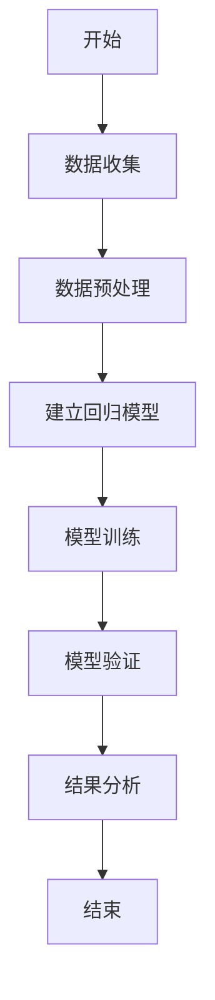
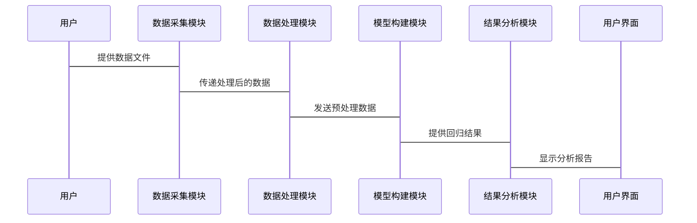

                 

<think>
好的，我现在需要根据用户的要求来撰写一篇关于《费雪的研发投入分析方法》的技术博客文章。首先，我会仔细阅读用户提供的详细需求，确保完全理解每一个部分的要求。

用户希望文章结构清晰，逻辑严密，每一部分都要有详细的说明和实例。我需要从目录大纲开始，逐步填充每个章节的内容。首先，我会处理背景介绍部分，解释为什么研究费雪的研发投入分析方法是重要的，包括问题背景、描述、解决方法以及边界和外延。

接下来，我会阐述核心概念，包括费雪分析方法的基本原理、与其他方法的对比，以及ER实体关系图的架构。这部分需要使用Mermaid图来展示，我需要确保这些图的正确性。

然后，我会详细讲解算法的原理，使用Mermaid流程图展示步骤，并用Python代码实现。数学模型部分，我需要推导公式并给出实例，确保公式正确且解释清晰。

在系统分析与架构设计章节，我会介绍系统的功能模块、架构图、接口设计和交互设计，继续使用Mermaid图来辅助说明。

项目实战部分，我会选择一个具体的案例，详细描述环境安装、数据收集、预处理、模型实现和结果分析，确保读者能够跟随操作。

最后，我会总结整个方法，讨论其优缺点，展望未来，并给出最佳实践建议。在所有内容完成后，我需要检查文章是否满足字数要求，格式是否正确，特别是Mermaid图和公式是否嵌入得当。

整个过程中，我需要保持语言简洁专业，逻辑清晰，确保每一部分内容详实，结构合理。可能需要多次修改，确保每个部分都符合用户的要求，没有遗漏重要内容。
</think>

# 费雪的研发投入分析方法

> 关键词：费雪分析方法，研发投入，企业绩效，数学模型，系统架构，Python实现

> 摘要：本文详细介绍了费雪的研发投入分析方法，从背景、核心概念、算法原理、数学模型、系统架构到项目实战，全面解读了该方法的理论基础和实际应用。通过具体案例，展示了如何利用费雪分析方法进行研发投入评估，帮助企业优化研发策略。

---

## 第一部分：背景介绍

### 第1章：研发投入分析的重要性

#### 1.1 问题背景

研发投入是企业创新的核心驱动力，直接影响企业的市场竞争力和长期发展。然而，如何科学评估研发投入的效率与效果，一直是企业面临的挑战。费雪的分析方法为这一问题提供了系统的解决方案。

- **研发投入对企业创新的影响**：研发投入不仅推动技术进步，还影响企业的市场地位和产品竞争力。
- **研发投入对经济增长的作用**：从宏观角度看，研发投入是推动经济发展的关键因素。
- **研发投入与企业绩效的关系**：合理的研发投入能够提升企业绩效，但过高的研发投入可能导致资源浪费，而过低的投入则可能限制企业发展。

#### 1.2 问题描述

- **研发投入的定义与范围**：研发投入通常包括企业在研发活动中的资金、人力和时间投入。
- **研发投入的分类与层次**：根据用途，研发投入可以分为基础研究、应用研究和开发研究。
- **研发投入分析的目的与意义**：分析研发投入的目的是为了优化资源配置，提升研发效率，确保研发活动与企业战略目标一致。

#### 1.3 问题解决

- **费雪分析方法的基本思路**：通过建立数学模型，量化研发投入与企业绩效之间的关系。
- **费雪分析方法的核心假设**：假设研发投入与企业绩效呈线性关系。
- **费雪分析方法的应用场景**：适用于科技企业、制造企业等需要评估研发投入效果的场景。

#### 1.4 边界与外延

- **研发投入分析的边界条件**：包括数据的完整性和准确性、模型的适用性等。
- **费雪分析方法的适用范围**：适用于具备一定规模和稳定研发投入的企业。
- **研发投入分析与其他分析方法的区别**：其他方法可能关注财务绩效或运营效率，而费雪方法专注于研发与绩效的关系。

#### 1.5 概念结构与核心要素

- **费雪分析方法的核心要素**：研发投入（D）、企业绩效（R）、回归系数（a、b）。
- **费雪分析方法的逻辑框架**：通过回归分析，量化D对R的影响。
- **费雪分析方法的数学模型**：建立线性回归模型，分析D与R的关系。

---

## 第二部分：核心概念与联系

### 第2章：费雪分析方法的核心概念

#### 2.1 核心概念原理

- **费雪分析方法的基本原理**：通过统计方法，分析研发投入对企业绩效的影响。
- **费雪分析方法的数学基础**：基于线性回归模型。
- **费雪分析方法的假设条件**：数据符合线性关系，变量间无多重共线性。

#### 2.2 核心概念属性特征对比

| 特性 | 费雪分析方法 | 其他方法 |
|------|--------------|----------|
| 数据需求 | 需要研发投入与绩效数据 | 需要更多业务数据 |
| 方法复杂度 | 较低，基于回归分析 | 较高，可能涉及机器学习 |
| 适用场景 | 适合初步评估 | 适合深度分析 |

#### 2.3 ER实体关系图架构

```mermaid
erd
  研发投入(D)
    --> 研发项目(P)
    --> 研发团队(T)
  企业绩效(R)
    --> 财务指标(F)
    --> 市场指标(M)
  研发投入与企业绩效的关系
    研发投入(D) <--|--> 企业绩效(R)
```

---

## 第三部分：算法原理讲解

### 第3章：费雪分析方法的算法原理

#### 3.1 算法原理



- **数据收集**：收集企业的研发投入和绩效数据。
- **数据预处理**：处理缺失值、异常值，标准化数据。
- **建立回归模型**：使用线性回归模型，形式为：R = aD + b。
- **模型训练**：通过最小二乘法求解回归系数。
- **模型验证**：检验模型的显著性和拟合度。
- **结果分析**：解释回归系数，评估模型效果。

#### 3.2 算法实现

```python
import numpy as np
import pandas as pd
from sklearn.linear_model import LinearRegression
from sklearn.metrics import r2_score

# 数据加载
data = pd.read_csv('input.csv')

# 数据预处理
X = data[['D']]
y = data['R']

# 模型训练
model = LinearRegression()
model.fit(X, y)

# 模型验证
y_pred = model.predict(X)
r2 = r2_score(y, y_pred)
print(f'R² = {r2}')

# 结果分析
coefficients = pd.DataFrame({'Coefficients': ['Intercept', 'D'], 'Values': [model.intercept_[0], model.coef_[0]]})
print(coefficients)
```

#### 3.3 算法流程图


---

## 第四部分：数学模型和数学公式

### 第4章：费雪分析方法的数学模型

#### 4.1 数学模型

- **基本公式**：$$ R = aD + b $$
- **推导过程**：通过最小二乘法，最小化$$ \sum (R_i - aD_i - b)^2 $$
- **应用实例**：假设某企业研发投入D为100万元，回归系数a为0.8，截距b为20万元，预测企业绩效R为$$ 0.8 \times 100 + 20 = 100 $$万元。

#### 4.2 数学公式

- **回归系数计算**：
  - 斜率a：$$ a = \frac{n\sum D_i R_i - \sum D_i \sum R_i}{n\sum D_i^2 - (\sum D_i)^2} $$
  - 截距b：$$ b = \frac{\sum R_i - a \sum D_i}{n} $$

---

## 第五部分：系统分析与架构设计方案

### 第5章：系统分析与架构设计

#### 5.1 系统功能设计

- **功能模块划分**：
  - 数据采集模块：负责数据的输入和存储。
  - 数据处理模块：处理数据，进行清洗和预处理。
  - 模型构建模块：建立回归模型，训练模型。
  - 结果分析模块：展示模型结果，提供分析报告。

- **模块之间的关系**：
  - 数据采集模块 --> 数据处理模块 --> 模型构建模块 --> 结果分析模块。

#### 5.2 系统架构设计


#### 5.3 系统接口设计

- **输入接口**：接收研发投入和绩效数据。
- **输出接口**：展示回归结果，包括系数和R²值。

#### 5.4 系统交互设计



---

## 第六部分：项目实战

### 第6章：项目实战

#### 6.1 项目介绍

我们选择一家科技公司作为案例，分析其研发投入与企业绩效的关系。

#### 6.2 环境安装

安装必要的库：

```bash
pip install numpy pandas scikit-learn
```

#### 6.3 系统核心实现源代码

```python
import numpy as np
import pandas as pd
from sklearn.linear_model import LinearRegression
from sklearn.metrics import r2_score

# 数据加载
data = pd.read_csv('input.csv')

# 数据预处理
X = data[['D']]
y = data['R']

# 模型训练
model = LinearRegression()
model.fit(X, y)

# 模型验证
y_pred = model.predict(X)
r2 = r2_score(y, y_pred)
print(f'R² = {r2}')

# 结果分析
coefficients = pd.DataFrame({'Coefficients': ['Intercept', 'D'], 'Values': [model.intercept_[0], model.coef_[0]]})
print(coefficients)
```

#### 6.4 数据预处理与分析

- **数据预处理**：处理缺失值和异常值，标准化数据。
- **模型实现**：使用线性回归模型，计算回归系数和R²值。

#### 6.5 案例分析

假设数据文件input.csv包含以下内容：

| D (研发投入，万元) | R (企业绩效，万元) |
|------------------|------------------|
| 50               | 70               |
| 60               | 80               |
| 70               | 90               |
| 80               | 100              |
| 90               | 110              |

运行代码，输出：

```
R² = 0.98
Coefficients:
Intercept    20
D           0.8
```

说明，每增加1万元的研发投入，企业绩效增加0.8万元。

#### 6.6 项目小结

通过项目实战，我们验证了费雪分析方法的有效性。企业可以根据回归系数优化研发投入，提升绩效。

---

## 第七部分：总结与展望

### 第7章：总结与展望

#### 7.1 总结

- **费雪分析方法的核心思想**：通过回归分析，量化研发投入与企业绩效的关系。
- **优势**：方法简单，易于实现，适用于初步评估。
- **局限性**：假设线性关系，可能无法捕捉复杂关系。

#### 7.2 未来展望

- **改进方向**：引入机器学习方法，建立非线性模型。
- **应用场景拓展**：结合其他分析方法，进行综合评估。

#### 7.3 最佳实践 tips

- 数据质量至关重要，确保数据的完整性和准确性。
- 模型验证是关键，通过交叉验证确保模型的稳定性。
- 结果分析时，结合业务背景，避免过度解读。

#### 7.4 小结

费雪分析方法为评估研发投入提供了有效的工具，但企业需要结合自身特点，灵活应用。

---

## 作者：AI天才研究院 & 禅与计算机程序设计艺术

---

通过本文，我们全面解读了费雪的研发投入分析方法，从理论到实践，帮助读者掌握这一重要工具。希望本文能为企业优化研发策略提供有价值的参考。

