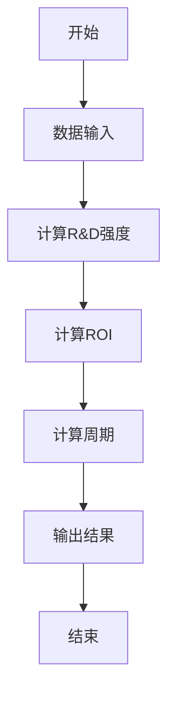
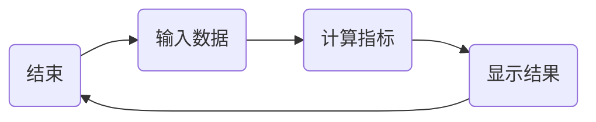

                 


# 费雪的研发投入分析：创新能力的指标

> 关键词：费雪分析法、研发投入分析、创新能力、数学模型、企业创新管理、技术指标

> 摘要：本文深入探讨了费雪分析法在企业研发投入分析中的应用，通过构建数学模型和分析指标体系，揭示了研发投入与创新能力之间的关系。文章结合实际案例，详细介绍了分析方法的实现过程，为企业管理者提供了科学的决策依据。

---

# 第1章: 费雪研发投入分析概述

## 1.1 研发投入分析的背景与意义

### 1.1.1 研发投入的定义与分类
研发投入（R&D，Research and Development）是企业在创新活动中投入的人力、物力和财力的总和。根据投入阶段，可以分为基础研究、应用研究和开发阶段投入。不同类型的研发投入在企业创新中的作用不同，例如基础研究注重长期积累，而开发阶段更注重短期产出。

| 研发投入类型 | 特征 |
|--------------|------|
| 基础研究     | 长期性、不确定性高 |
| 应用研究     | 实用性较强，周期适中 |
| 开发阶段     | 确定性高，周期短 |

### 1.1.2 研发投入在企业创新中的作用
研发投入是企业技术创新的核心驱动力。通过合理的研发投入，企业可以提升技术领先性，增强市场竞争力。例如，一家科技企业在研发投入上的增长往往与其新产品推出速度呈正相关。

### 1.1.3 研发投入分析的边界与外延
研发投入分析需要明确其边界，例如区分内部研发与外部采购技术。同时，分析的外延包括研发投入的效率、周期和产出等多个维度。

### 1.1.4 费雪分析法的核心概念
费雪分析法是一种基于数学模型的分析方法，通过量化研发投入与创新能力的关系，为企业提供科学的决策支持。其核心在于构建投入-产出模型，量化分析研发投入对企业创新能力的影响。

### 1.1.5 研发投入与创新能力的关系
研发投入是创新能力的重要组成部分，但并非唯一因素。企业需要结合市场需求、管理能力等因素，将研发投入转化为实际的创新能力。

### 1.1.6 本节小结
本节介绍了研发投入的定义与分类，分析了其在企业创新中的作用，并提出了费雪分析法的核心概念。

---

# 第2章: 研发投入分析的理论基础

## 2.1 研发投入的分类与特征

### 2.1.1 研发投入的分类维度
研发投入可以从时间、金额、人员等多个维度进行分类。例如，按时间维度可分为年度投入和累计投入。

| 分类维度   | 分类标准         |
|------------|------------------|
| 时间维度   | 年度、累计       |
| 金额维度   | 占收比、绝对值   |
| 人员维度   | 全职、兼职       |

### 2.1.2 不同类型研发投入的特征对比
不同类型的研发投入在企业创新中的作用不同，例如基础研究投入注重长期积累，而开发阶段投入更注重短期产出。

### 2.1.3 研发投入与创新能力的关系
研发投入是创新能力的必要条件，但不是充分条件。企业需要将研发投入与市场需求相结合，才能真正提升创新能力。

## 2.2 费雪分析模型的构建

### 2.2.1 费雪分析模型的基本框架
费雪分析模型通过量化研发投入与创新能力的关系，构建了投入-产出模型。其基本框架如下：

1. 确定研发投入的类型和金额。
2. 计算研发投入强度（R&D Intensity）。
3. 分析研发投入的产出效率（ROI）。
4. 评估研发投入的周期和阶段分布。

### 2.2.2 模型的输入变量与输出变量
- **输入变量**：研发投入金额、营业收入、新产品销售额、研发项目周期。
- **输出变量**：研发投入强度、产出效率、周期分布。

### 2.2.3 模型的假设条件与限制
- 数据准确性：模型假设研发投入数据准确无误。
- 企业类型：适用于技术创新型企业，不适用于服务型或传统制造企业。

## 2.3 研发投入分析的指标体系

### 2.3.1 研发投入强度指标
研发投入强度（R&D Intensity）是衡量企业研发投入规模的重要指标，计算公式为：
$$ \text{R&D强度} = \frac{\text{研发投入金额}}{\text{营业收入}} $$

### 2.3.2 研发投入产出效率指标
研发投入产出效率（ROI）是衡量研发投入转化为实际价值的能力，计算公式为：
$$ \text{ROI} = \frac{\text{新产品销售额}}{\text{研发投入金额}} $$

### 2.3.3 研发投入周期与阶段分布指标
研发投入周期反映了研发项目从启动到商业化的时间长短，周期越短，效率越高。

---

# 第3章: 研发投入分析的算法与数学模型

## 3.1 费雪分析法的数学模型

### 3.1.1 研发投入强度计算公式
$$ \text{研发投入强度} = \frac{\text{研发投入金额}}{\text{营业收入}} $$

### 3.1.2 研发投入产出效率计算公式
$$ \text{研发投入产出效率} = \frac{\text{新产品销售额}}{\text{研发投入金额}} $$

### 3.1.3 研发投入周期计算公式
$$ \text{研发投入周期} = \frac{\text{研发项目总周期}}{\text{研发阶段数}} $$

### 3.1.4 投入-产出模型
$$ \text{创新能力} = \alpha \cdot \text{R&D强度} + \beta \cdot \text{ROI} + \gamma \cdot \text{周期} $$

其中，$\alpha$、$\beta$、$\gamma$为模型参数，需通过实证确定。

### 3.1.5 模型实现代码
```python
def calculate_rdi(revenue, r_d_expense):
    return r_d_expense / revenue

def calculate_roi(new_product_sales, r_d_expense):
    return new_product_sales / r_d_expense

def calculate_cycle(total_cycle, stages):
    return total_cycle / stages
```

### 3.1.6 算法流程图


---

# 第4章: 研发投入分析的系统架构设计

## 4.1 系统功能设计

### 4.1.1 系统功能模块
- 数据采集模块：收集研发投入数据。
- 分析计算模块：实现R&D强度、ROI等指标的计算。
- 可视化展示模块：生成图表，直观展示分析结果。

### 4.1.2 系统架构设计


## 4.2 系统接口设计

### 4.2.1 数据接口
- 数据输入接口：接收研发投入、营业收入等数据。
- 数据输出接口：返回分析结果，如R&D强度、ROI等。

## 4.3 系统交互设计

### 4.3.1 交互流程图


---

# 第5章: 研发投入分析的实战与案例

## 5.1 实际案例分析

### 5.1.1 案例背景
某科技企业2022年的研发投入为10亿元，营业收入为100亿元，新产品销售额为20亿元，研发项目周期为3年，分为基础研究、应用研究和开发三个阶段。

### 5.1.2 分析步骤
1. 计算R&D强度：
$$ \text{R&D强度} = \frac{10}{100} = 0.1 $$
2. 计算ROI：
$$ \text{ROI} = \frac{20}{10} = 2 $$
3. 计算周期：
$$ \text{周期} = \frac{3}{3} = 1 \text{年/阶段} $$

### 5.1.3 结果解读
该企业的R&D强度为10%，ROI为2，周期为1年/阶段。这表明企业的研发投入强度适中，产出效率较高，研发周期合理。

## 5.2 案例应用与拓展

### 5.2.1 行业对比分析
通过对比同行业其他企业的R&D强度和ROI，可以发现该企业的研发投入效率处于行业领先水平。

### 5.2.2 战略调整建议
建议企业在基础研究阶段增加投入，以提升长期创新能力。

---

# 第6章: 研发投入分析的总结与展望

## 6.1 本章小结
本章通过对费雪分析法的深入探讨，构建了研发投入分析的数学模型，并结合实际案例进行了分析。研究表明，研发投入是创新能力的重要指标，企业应合理配置研发投入，以实现最大化的创新产出。

## 6.2 未来研究方向
1. 研究不同类型企业研发投入分析的差异。
2. 探索大数据技术在研发投入分析中的应用。
3. 结合人工智能技术，提升分析模型的准确性和实时性。

## 6.3 注意事项与最佳实践
- 数据准确性是分析的基础，需确保研发投入数据的完整性。
- 分析结果需结合企业实际情况，避免机械套用模型。
- 建议企业定期进行研发投入分析，及时调整创新战略。

## 6.4 拓展阅读
推荐阅读《创新的 Engines》、《技术分析指标与企业绩效》等书籍，以深入理解研发投入与创新能力的关系。

---

# 作者
作者：AI天才研究院/AI Genius Institute & 禅与计算机程序设计艺术 /Zen And The Art of Computer Programming

---

通过以上结构和内容，文章全面而系统地探讨了费雪分析法在研发投入分析中的应用，为企业管理者提供了科学的决策依据。

