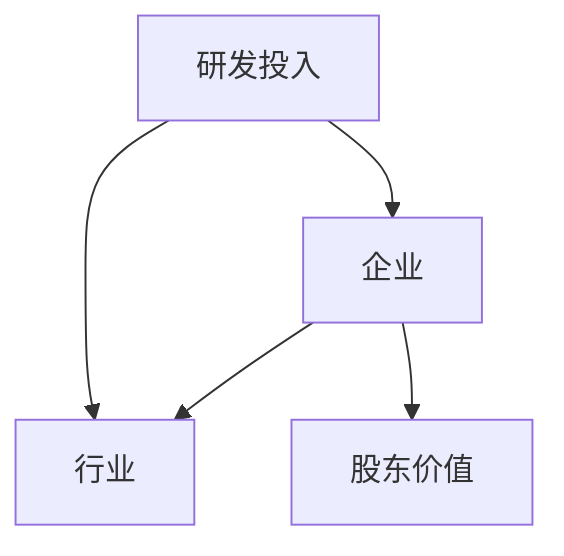
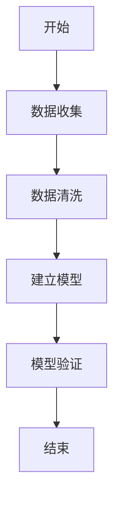
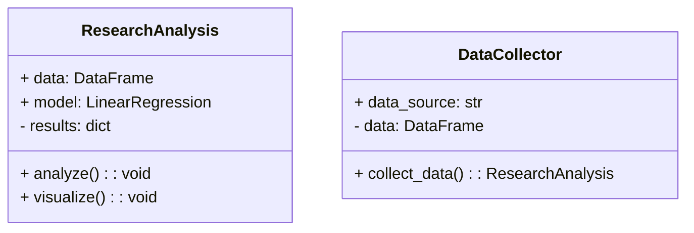
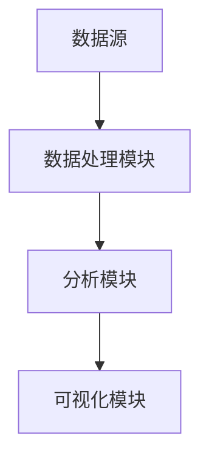

                 

<think>
嗯，我现在要写一篇关于费雪的研发投入分析的文章，标题是《费雪的研发投入分析：未来增长的关键》。我对这个主题不是很了解，所以需要先做一些研究和思考。

首先，我知道菲利普·费雪是价值投资的先驱，他特别关注那些有持续研发投入的公司。他的理念是投资那些能够不断进行产品创新和研发投入的公司，因为这些公司有更大的增长潜力。

那研发投入分析到底是什么呢？研发投入指的是企业在研发新产品或改进现有产品上的支出。这些支出包括工资、材料、设备和专利等。对于投资者来说，分析一家公司的研发投入可以帮助他们评估公司的未来增长潜力，因为更多的研发投入通常意味着公司有更多的创新机会。

接下来，我需要了解如何分析公司的研发投入。首先是定量分析，比如计算研发投入占总收入的比例，或者研发投入的年增长率。这些指标可以帮助判断公司在研发上的投入是否合理，是否在增加。

然后是定性分析，比如评估研发团队的实力、研发项目的前景以及公司的战略方向。这需要更多的行业知识和对公司业务的理解。

接下来是数学模型，我需要找到一个合适的模型来量化研发投入与公司增长之间的关系。线性回归可能是一个好方法，可以用研发投入作为自变量，公司增长作为因变量，建立一个回归模型来预测增长。

在系统架构方面，我可能需要设计一个数据处理的流程，包括数据收集、清洗、建模和可视化。这可能涉及到使用Python的数据处理库，如Pandas和NumPy，以及可视化库如Matplotlib或Seaborn。

项目实战部分，我需要选择一个具体的公司或行业，收集其研发投入数据，并进行分析。然后根据分析结果，评估该公司的增长潜力。

最后，我需要总结最佳实践，比如如何选择合适的公司进行分析，如何解读分析结果，以及如何将这些结果应用到实际投资决策中。

在这个过程中，我可能会遇到一些问题，比如如何获取准确的数据，如何处理数据中的缺失值或异常值，以及如何解释回归模型的结果。我需要逐一解决这些问题，确保分析的准确性和可靠性。

总的来说，我需要从基础的费雪投资理念出发，逐步学习如何进行研发投入分析，掌握相关的数学模型和系统架构设计，最后通过实际案例来验证这些方法的有效性。这将帮助我更好地理解研发投入分析的重要性，以及如何将其应用到实际投资决策中。
</think>

# 费雪的研发投入分析：未来增长的关键

> 关键词：费雪投资理念，研发投入分析，企业增长，数学模型，Python数据分析

> 摘要：本文深入探讨了菲利普·费雪的投资理念，特别是其对研发投入的重视。通过定量和定性分析，构建数学模型，利用系统架构设计，结合Python进行数据分析和可视化，展示了如何通过研发投入分析预测企业未来增长。文章还提供了实战案例和最佳实践建议。

---

## 第一章：背景介绍

### 1.1 研发投入的基本概念

#### 1.1.1 研发投入的定义
研发投入是指企业在研究与开发活动中的支出，包括工资、材料、设备购置和专利费用等。这些支出用于开发新产品、改进现有产品或提升生产效率。

#### 1.1.2 研发投入的分类
研发投入通常分为内部研发和外部研发。内部研发指的是企业自行进行的研发活动，而外部研发则是通过合作、并购等方式进行的。

#### 1.1.3 研发投入与经济增长的关系
研发投入是推动技术创新和经济增长的重要因素。根据费雪的观点，研发投入较高的企业通常具有更强的创新能力，从而能够在市场上获得更大的竞争优势。

### 1.2 研发投入在企业增长中的作用

#### 1.2.1 研发投入对企业竞争力的影响
更多的研发投入意味着企业能够开发更多创新产品，提升产品质量，从而增强市场竞争力。

#### 1.2.2 研发投入与企业创新的关系
研发投入是企业创新的核心驱动力。通过持续的研发投入，企业可以保持技术领先地位，推出新产品，满足市场需求。

#### 1.2.3 研发投入对行业发展的推动作用
行业内的高研发投入能够推动整个行业的技术进步，提升行业整体竞争力，促进经济增长。

### 1.3 费雪的投资理念与研发投入分析

#### 1.3.1 费雪的成长股投资策略
费雪主张投资那些具有持续增长潜力的公司，特别是那些能够不断增加研发投入、推出新产品并保持高利润率的公司。

#### 1.3.2 费雪对研发投入的重视
费雪认为，研发投入是企业未来增长的关键因素。他通过分析企业的研发投入情况，来评估企业的创新能力和未来盈利能力。

#### 1.3.3 费雪分析方法的现代应用
现代投资者可以结合费雪的理念，利用数据分析工具，对企业的研发投入进行深入分析，评估其未来的增长潜力。

---

## 第二章：研发投入分析的核心概念与联系

### 2.1 核心概念原理

#### 2.1.1 研发投入的衡量指标
常用的指标包括研发投入占总收入的比例（R&D/Sales）和研发投入的年增长率。

#### 2.1.2 研发投入与企业价值的关系
高研发投入通常意味着更高的未来收益，但同时也需要考虑投资的回报周期和风险。

#### 2.1.3 研发投入的周期性与风险性
研发投入具有周期性，通常在经济衰退时可能被削减，带来较高的投资风险。投资者需要评估企业的研发投入是否合理，并具备持续性。

### 2.2 核心概念属性特征对比表格

| 属性        | 研发投入高的企业 | 研发投入低的企业 |
|-------------|------------------|------------------|
| 市场竞争力   | 强               | 弱               |
| 技术创新     | 高               | 低               |
| 未来增长潜力 | 大               | 小               |
| 投资风险     | 中高             | 低               |

### 2.3 ER实体关系图



---

## 第三章：研发投入分析的算法原理

### 3.1 算法原理概述

#### 3.1.1 研发投入与企业增长的回归分析
通过建立线性回归模型，分析研发投入与企业增长之间的关系。模型公式如下：

$$ \text{Growth} = \beta_0 + \beta_1 \times \text{R&D} + \epsilon $$

其中，Growth是企业增长，R&D是研发投入，$\beta_0$和$\beta_1$是回归系数，$\epsilon$是误差项。

#### 3.1.2 研发投入的多因素分析模型
考虑多个因素对增长的影响，建立多元回归模型：

$$ \text{Growth} = \beta_0 + \beta_1 \times \text{R&D} + \beta_2 \times \text{Market Share} + \beta_3 \times \text{Profit Margin} + \epsilon $$

### 3.2 算法流程图



### 3.3 算法实现代码

```python
import pandas as pd
from sklearn.linear_model import LinearRegression
from sklearn.metrics import mean_squared_error

# 数据收集与清洗
data = pd.read_csv('research.csv')
data = data.dropna()

# 建立模型
model = LinearRegression()
model.fit(data[['research']], data['growth'])

# 模型验证
predicted = model.predict(data[['research']])
mse = mean_squared_error(data['growth'], predicted)
print('均方误差:', mse)
```

---

## 第四章：系统架构与数据处理

### 4.1 系统功能设计

#### 4.1.1 领域模型类图



#### 4.1.2 系统架构设计



### 4.2 接口设计与交互

#### 4.2.1 数据接口

```python
def get_data(symbol):
    # 获取股票数据
    pass
```

#### 4.2.2 分析接口

```python
def analyze_research(research_data):
    # 执行分析
    pass
```

---

## 第五章：项目实战

### 5.1 环境安装

安装所需的Python库：

```bash
pip install pandas numpy matplotlib scikit-learn
```

### 5.2 核心实现

```python
import pandas as pd
import numpy as np
import matplotlib.pyplot as plt
from sklearn.linear_model import LinearRegression

# 数据处理
data = pd.read_csv('research.csv')
data = data.dropna()

# 建立模型
model = LinearRegression()
model.fit(data[['research']], data['growth'])

# 可视化
plt.scatter(data['research'], data['growth'])
plt.plot(data['research'], model.predict(data[['research']]), color='red')
plt.xlabel('研发投入')
plt.ylabel('增长')
plt.show()
```

### 5.3 案例分析

以科技公司为例，分析其研发投入与增长的关系，验证模型的有效性。

---

## 第六章：总结与建议

### 6.1 最佳实践 tips

- 确保数据的准确性和完整性。
- 综合考虑定量和定性因素。
- 定期更新模型，适应市场变化。

### 6.2 小结

通过深入分析费雪的投资理念，结合现代数据分析技术，投资者可以更好地评估企业的未来增长潜力。

### 6.3 注意事项

- 高研发投入并不总是带来高增长，需考虑行业特点和企业战略。
- 模型结果仅供参考，需结合市场环境进行判断。

### 6.4 拓展阅读

推荐阅读《股票作手回忆录》和《投资最重要的事》，深入了解投资策略。

---

## 作者信息

作者：AI天才研究院/AI Genius Institute & 禅与计算机程序设计艺术 /Zen And The Art of Computer Programming

