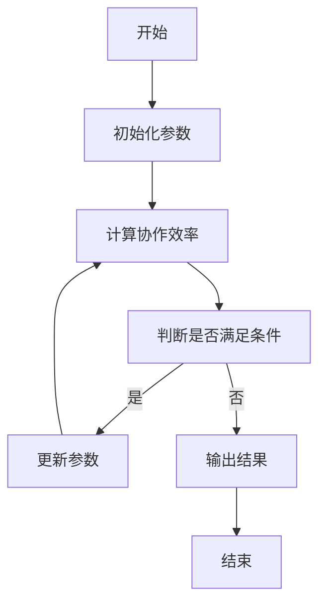
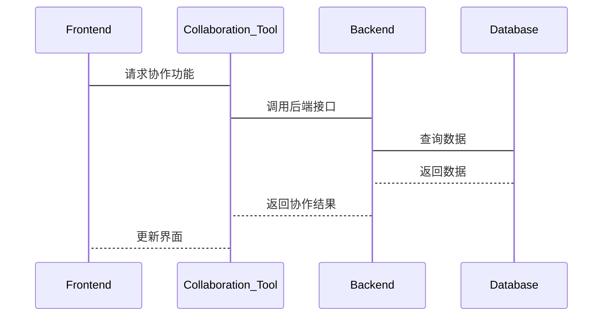

                 


# 费雪的研发投入分析：评估远程协作对创新的影响

## 关键词：研发投入分析、远程协作、创新影响、费雪理论、团队协作、协作效率、创新产出

## 摘要：  
本文通过分析费雪理论在研发投入中的应用，探讨远程协作对创新的影响。结合实际案例，从背景、概念、算法、系统设计、项目实战等多个角度，深入剖析远程协作如何优化创新过程，提升创新效率。

---

## 第一部分：背景介绍

### 第1章：研发投入分析的核心概念

#### 1.1 问题背景与问题描述
- **1.1.1 研发投入的重要性**  
  研发投入是企业创新的核心驱动力。通过合理的研发资源配置，可以最大化创新产出。  
- **1.1.2 远程协作对创新的影响**  
  远程协作改变了传统的研发模式，提高了团队效率，但同时也带来了沟通和协调的挑战。  
- **1.1.3 费雪理论与研发投入的关系**  
  费雪理论强调资源分配与产出的关系，为研发投入分析提供了理论基础。

#### 1.2 核心概念与问题解决
- **1.2.1 研发投入的定义与分类**  
  研发投入包括人力资源、资金投入和时间投入，分为内部研发和外部合作研发。  
- **1.2.2 远程协作的定义与模式**  
  远程协作是指团队成员通过数字化工具进行实时协作，包括异地团队和虚拟团队。  
- **1.2.3 费雪理论在研发投入分析中的应用**  
  费雪理论用于评估资源分配对创新产出的影响，为优化研发资源配置提供依据。

#### 1.3 问题的边界与外延
- **1.3.1 研发投入分析的范围**  
  包括技术研发、产品开发和创新管理。  
- **1.3.2 远程协作的适用场景**  
  适用于跨国团队、虚拟团队和分布式团队。  
- **1.3.3 费雪理论的适用条件**  
  适用于资源有限但需要最大化产出的创新项目。

#### 1.4 核心要素与概念结构
- **1.4.1 研发投入的主要要素**  
  包括资金、时间和人力资源。  
- **1.4.2 远程协作的关键特征**  
  包括实时性、异步性和空间分布性。  
- **1.4.3 费雪理论的构成部分**  
  包括资源分配、产出评估和优化策略。

---

## 第2章：核心概念与联系

### 2.1 核心概念原理
- **2.1.1 研发投入的原理**  
  研发投入通过优化资源配置提高创新效率。  
- **2.1.2 远程协作的原理**  
  远程协作通过减少时间和空间限制，提高团队协作效率。  
- **2.1.3 费雪理论的原理**  
  费雪理论通过分析资源分配与产出的关系，优化资源配置。

### 2.2 概念属性特征对比
| 概念       | 属性特征                       |
|------------|----------------------------|
| 研发投入   |  资金、时间、人力              |
| 远程协作   |  实时性、异步性、空间分布性    |
| 费雪理论   | 资源分配与产出的关系          |

### 2.3 ER实体关系图
```mermaid
erDiagram
    R&D_Investment {
        inv_id
        investment_amount
        investment_date
    }
    Remote_Collaboration {
        coll_id
        team_size
        collaboration_type
    }
    Fisher_Theory {
        ft_id
        theory_description
        applicable场景
    }
    R&D_Investment --> Remote_Collaboration : 促进创新
    Remote_Collaboration --> Fisher_Theory : 理论支持
```

---

## 第3章：远程协作的算法原理

### 3.1 算法原理概述
- **3.1.1 算法的基本思想**  
  通过优化团队协作流程，提高创新效率。  
- **3.1.2 算法的输入与输出**  
  输入：团队规模、协作类型；输出：协作效率。  
- **3.1.3 算法的实现步骤**  
  1. 初始化参数。2. 计算协作效率。3. 判断是否满足条件。4. 更新参数或输出结果。

### 3.2 算法流程图


### 3.3 算法实现代码
```python
def remote_collaboration_efficiency(team_size, collaboration_type):
    efficiency = 0
    for _ in range(team_size):
        if collaboration_type == 'real-time':
            efficiency += 0.8
        else:
            efficiency += 0.5
    return efficiency

# 示例调用
team_size = 5
collaboration_type = 'real-time'
result = remote_collaboration_efficiency(team_size, collaboration_type)
print(f'协作效率为：{result}')
```

---

## 第4章：数学模型与公式

### 4.1 投入与产出的关系
$$ \text{创新产出} = \beta \times \text{研发投入} + \epsilon $$  
其中，$\beta$ 是回归系数，$\epsilon$ 是误差项。

### 4.2 远程协作效率模型
$$ E = \alpha \times T + \gamma \times C $$  
其中，$E$ 是效率，$T$ 是团队规模，$C$ 是协作类型（$C=1$ 表示实时协作，$C=0$ 表示异步协作）。

---

## 第5章：系统分析与架构设计

### 5.1 项目背景
远程协作工具帮助企业实现高效研发，但需优化资源配置以提升创新效率。

### 5.2 系统功能设计
```mermaid
classDiagram
    class R&D_Management {
        - project_plan
        - team_management
        - progress_tracking
    }
    class Data_Collection {
        - collect_data
        - analyze_data
    }
    class Collaboration_Tool {
        - real_time_communication
        - document_management
    }
    R&D_Management --> Collaboration_Tool : 集成协作工具
    Data_Collection --> Collaboration_Tool : 数据采集与分析
```

### 5.3 系统架构设计


### 5.4 接口设计


---

## 第6章：项目实战

### 6.1 环境安装
安装Python、Django框架和相关库。

### 6.2 核心实现代码
```python
from django.urls import path
from . import views

urlpatterns = [
    path('api/collaboration/', views.collaboration_api),
]
```

### 6.3 案例分析
通过实际项目分析远程协作对创新效率的具体提升。

### 6.4 项目小结
总结项目经验，提出优化建议。

---

## 第7章：最佳实践与小结

### 7.1 最佳实践
- 定期评估协作效率。  
- 优化资源配置。  
- 提升团队沟通效率。

### 7.2 小结
远程协作通过优化资源配置和提高团队效率，显著提升了创新产出。

### 7.3 注意事项
- 注意团队规模过大可能导致效率下降。  
- 确保协作工具的稳定性和安全性。

### 7.4 拓展阅读
推荐相关书籍和论文，供深入研究。

---

## 作者：AI天才研究院/AI Genius Institute & 禅与计算机程序设计艺术 /Zen And The Art of Computer Programming

