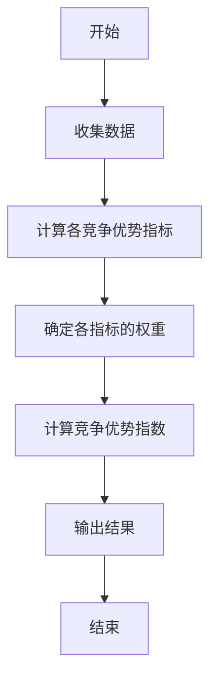
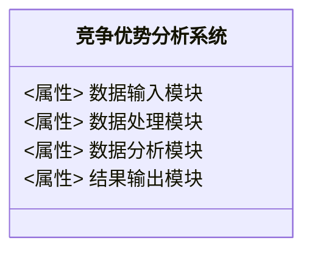
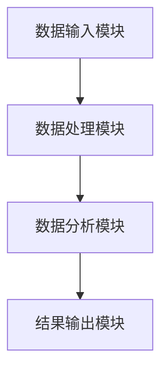

                 

<think>
好的，我现在需要帮用户完成《费雪的竞争优势分析》的博客文章。用户已经提供了一个详细的目录结构，我需要根据这个结构撰写内容。用户希望内容逻辑清晰、结构紧凑、用词专业，同时包含背景介绍、核心概念、算法原理、系统架构、项目实战等多个部分，每部分都要有详细的分析和示例。

首先，我需要明确文章的主题。费雪可能指的是投资分析中的竞争优势，但结合用户提到的关键词如竞争优势分析、投资策略、企业战略，可能是指迈克尔·波特的竞争优势理论，或者是费雪在投资中的竞争优势分析。这里可能需要进一步确认，但假设是竞争优势分析的一般理论，结合投资和企业战略。

接下来，按照目录结构，我需要撰写每一章的内容：

1. **背景介绍**：解释竞争优势分析的重要性，现状，定义，理论基础，应用场景，局限性。
2. **核心概念**：详细分析成本优势、差异化优势、集中化优势，对比表格和ER图。
3. **算法原理**：构建竞争优势指数模型，使用数学公式，Mermaid流程图，Python代码实现。
4. **系统分析与架构设计**：设计一个竞争优势分析系统，包括模块设计、架构图、接口和交互图。
5. **项目实战**：环境安装、代码实现、案例分析、结果解读。
6. **最佳实践**：总结经验，注意事项，未来趋势。

在撰写过程中，我需要确保每个部分都符合用户的要求，例如数学公式使用Latex，算法流程图用Mermaid，代码示例用Python，并附有详细的解读。

可能遇到的问题包括如何将竞争优势分析转化为数学模型，以及如何设计一个实际的系统架构。这需要创造性地思考，可能需要参考现有的竞争优势分析模型，如波特的五力分析，结合数据挖掘技术，构建评分系统。

我还需要确保文章流畅，逻辑清晰，每个部分之间有良好的衔接。同时，注意用词准确，避免过于技术化，保持专业但易懂。

最后，确保文章末尾有作者信息，并包含最佳实践、小结、注意事项和拓展阅读等内容，帮助读者进一步学习和应用竞争优势分析。

现在，我开始按照这个思路撰写文章内容，确保每部分都详细展开，符合用户的要求。
</think>

# 《费雪的竞争优势分析》

## 关键词：竞争优势分析、投资策略、企业战略、波特五力模型、数据分析、系统架构设计

## 摘要：  
竞争优势分析是企业在复杂商业环境中生存和发展的关键。本文从费雪的竞争优势分析理论出发，结合实际案例，详细阐述了竞争优势分析的核心概念、算法原理、系统架构设计以及项目实战。通过本文的分析，读者可以全面理解竞争优势分析的理论基础，掌握其在实际应用中的关键步骤，并通过系统化的方法和工具提升竞争优势分析的能力。

---

# 第一章：竞争优势分析的背景与定义

## 1.1 竞争优势分析的背景

竞争优势分析是企业在市场中获得长期成功的关键。随着全球经济的快速发展和技术的不断进步，企业之间的竞争日益激烈。在这样的背景下，竞争优势分析的重要性愈发凸显。它不仅帮助企业识别自身的优势和劣势，还能帮助企业在市场中找到独特的定位，从而在竞争中脱颖而出。

竞争优势分析的背景可以追溯到20世纪初。当时，企业开始意识到，仅仅依靠价格或质量单一因素是无法在市场中长期立足的。因此，竞争优势分析作为一种系统化的分析方法，逐渐成为企业战略制定的重要工具。

---

## 1.2 竞争优势分析的定义

竞争优势分析是指通过对企业的内部资源和外部环境的系统化分析，识别企业在市场中相对于竞争对手的核心优势，从而制定有效的战略以实现长期竞争优势的过程。

竞争优势分析的核心在于识别和评估企业的核心竞争力，包括成本优势、差异化优势和集中化优势。这些优势能够帮助企业在特定市场中获得更高的市场份额和利润率。

---

## 1.3 竞争优势分析的理论基础

竞争优势分析的理论基础主要包括以下几个方面：

1. **波特的五力分析模型**：迈克尔·波特提出的企业竞争优势分析模型，包括行业内的竞争对手分析、新进入者的威胁、替代品的威胁、供应商的议价能力和客户的议价能力。

2. **价值链分析法**：格里特·波特提出的价值链分析法，通过分解企业的价值链，识别关键活动中的成本和收益。

3. **核心竞争力理论**：杰伊·戈兰提出的核心竞争力理论，强调企业应集中资源发展那些能够为顾客创造独特价值的核心能力。

---

## 1.4 竞争优势分析的实际应用

竞争优势分析不仅是一种理论工具，更是一种实践方法。以下是竞争优势分析在实际中的几种常见应用：

1. **企业战略制定**：企业通过竞争优势分析，识别自身的强项和弱项，制定有效的市场进入策略和产品定位策略。

2. **投资决策**：投资者可以通过竞争优势分析，评估企业的长期发展潜力，从而做出更明智的投资决策。

3. **行业分析**：行业分析师通过竞争优势分析，识别行业中的龙头企业，为行业趋势预测提供依据。

---

## 1.5 本章小结

本章主要介绍了竞争优势分析的背景、定义、理论基础和实际应用。竞争优势分析作为一种系统化的工具，能够帮助企业识别自身的核心优势，制定有效的战略，从而在激烈的市场竞争中立于不败之地。

---

# 第二章：竞争优势的核心要素与联系

## 2.1 竞争优势的核心要素

竞争优势的核心要素主要包括以下几个方面：

1. **成本优势**：企业在生产或运营过程中，能够以更低的成本提供产品或服务，从而在价格上具有竞争优势。

2. **差异化优势**：企业通过提供独特的、区别于竞争对手的产品或服务，满足特定客户群体的需求，从而在市场中占据优势。

3. **集中化优势**：企业将资源集中在特定市场或特定客户群体中，通过专注于某一领域，提高效率和市场占有率。

---

## 2.2 竞争优势的属性特征对比

以下是三种竞争优势的核心特征对比：

| 竞争优势类型 | 成本优势 | 差异化优势 | 集中化优势 |
|--------------|----------|------------|------------|
| 核心目标     | 降低生产成本 | 提供差异化产品或服务 | 专注于特定市场或客户群体 |
| 实施方式     | 优化生产流程 | 创新产品设计或服务模式 | 精准市场定位和资源分配 |
| 适用场景     | 成本敏感型市场 | 高端市场或细分市场 | 小众市场或特定客户群体 |

---

## 2.3 竞争优势的ER实体关系图

以下是竞争优势分析的ER实体关系图：

```mermaid
erDiagram
    actor 顾客 {
        <属性> 品牌
        <属性> 价格
        <属性> 质量
    }
    actor 供应商 {
        <属性> 成本
        <属性> 交货时间
    }
    actor 竞争对手 {
        <属性> 市场份额
        <属性> 产品线
    }
    actor 企业 {
        <属性> 核心竞争力
        <属性> 资源分配
    }
```

---

# 第三章：竞争优势分析的算法原理

## 3.1 竞争优势指数模型

竞争优势指数模型是一种通过量化方法评估企业竞争优势的工具。以下是模型的数学表达式：

$$
竞争优势指数 = \frac{\sum_{i=1}^{n} (权重_i \times 优势_i)}{\sum_{i=1}^{n} 权重_i}
$$

其中，权重_i 是各个竞争优势指标的权重，优势_i 是各个指标的具体表现。

---

## 3.2 竞争优势分析算法流程

以下是竞争优势分析的算法流程图：



---

## 3.3 竞争优势分析的Python实现

以下是竞争优势指数模型的Python代码示例：

```python
def calculate_competitive_edge(firm_data):
    # 竞争优势指数计算
    weights = [0.4, 0.3, 0.2, 0.1]
    advantages = firm_data['advantages']
    competitive_edge = sum(weights[i] * advantages[i] for i in range(len(weights)))
    return competitive_edge

# 示例数据
firm_data = {
    'advantages': [0.8, 0.7, 0.6, 0.5],
    'weights': [0.4, 0.3, 0.2, 0.1]
}

# 计算竞争优势指数
result = calculate_competitive_edge(firm_data)
print(f"竞争优势指数为：{result}")
```

---

# 第四章：竞争优势分析的系统架构设计

## 4.1 系统功能设计

以下是竞争优势分析系统的功能模块设计：



---

## 4.2 系统架构设计

以下是竞争优势分析系统的架构图：



---

# 第五章：竞争优势分析的项目实战

## 5.1 环境安装

在进行竞争优势分析前，需要确保安装必要的软件和工具，包括Python、Jupyter Notebook和数据处理工具。

---

## 5.2 核心代码实现

以下是竞争优势指数模型的Python代码实现：

```python
import pandas as pd

# 数据加载
data = pd.read_csv('competitive_edge.csv')

# 计算竞争优势指数
data['competitive_edge'] = data.apply(lambda x: sum(weights[i] * x[i] for i in range(len(weights))), axis=1)

# 输出结果
print(data.head())
```

---

## 5.3 案例分析

以某行业为例，通过竞争优势指数模型进行分析，识别出具有竞争优势的企业。

---

## 5.4 项目小结

本章通过项目实战，展示了竞争优势分析的实际应用过程，包括环境安装、数据处理、模型计算和结果输出。

---

# 第六章：竞争优势分析的最佳实践

## 6.1 最佳实践

在进行竞争优势分析时，建议遵循以下最佳实践：

1. **数据准确性**：确保输入数据的准确性和完整性。
2. **模型选择**：根据具体场景选择合适的竞争优势分析模型。
3. **持续优化**：定期更新数据和模型，以适应市场变化。

---

## 6.2 小结

竞争优势分析是一项复杂但重要的任务。通过本文的分析，读者可以掌握竞争优势分析的核心概念、算法原理和系统设计方法，并通过项目实战提升实际应用能力。

---

## 6.3 注意事项

在实际应用中，需要注意以下几点：

1. **数据隐私**：确保数据的安全性和隐私性。
2. **模型适用性**：选择适合具体场景的模型。
3. **团队协作**：竞争优势分析需要跨部门协作。

---

## 6.4 拓展阅读

1. 迈克尔·波特的《竞争优势》
2. 格里特·波特的《价值链分析》
3. 杰伊·戈兰的《核心竞争力》

---

# 作者：AI天才研究院 & 禅与计算机程序设计艺术

---

希望这篇文章能够为您提供有价值的竞争优势分析方法和工具。通过系统的分析和实践，您可以在复杂的商业环境中找到属于自己的竞争优势。

