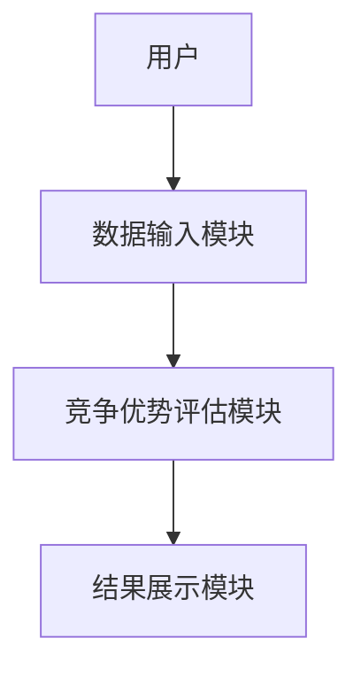

                 


# 费雪的竞争优势分析框架

---

## 关键词：
费雪竞争优势分析框架、竞争优势分析、企业价值评估、投资分析、战略规划、市场地位、核心竞争力

---

## 摘要：
费雪的竞争优势分析框架是一种用于评估企业竞争优势和价值的系统方法。本文从背景、核心概念、算法原理、系统设计、项目实战等方面详细阐述了该框架的理论基础和实际应用，帮助读者掌握竞争优势分析的关键要素和应用场景。

---

## 第1章: 费雪的竞争优势分析概述

### 1.1 什么是竞争优势
#### 1.1.1 竞争优势的定义
竞争优势是指企业在市场中相对于竞争对手的有利条件，包括资源、能力、技术等方面。竞争优势决定了企业在市场中的地位和盈利能力。

#### 1.1.2 竞争优势的核心要素
| 核心要素 | 描述 |
|----------|------|
| 核心竞争力 | 企业独有的技术、知识或能力，难以被竞争对手复制。 |
| 市场地位 | 企业在市场中的份额和品牌影响力。 |
| 财务表现 | 盈利能力、资产负债情况等财务指标。 |
| 创新能力 | 企业持续推出新产品或服务的能力。 |

#### 1.1.3 竞争优势的分类与层次
竞争优势可以分为短期优势和长期优势。短期优势可能来自于成本控制或营销策略，而长期优势则源于核心竞争力和品牌价值。

---

### 1.2 费雪竞争优势分析框架的背景
#### 1.2.1 竞争优势分析的起源
竞争优势分析起源于20世纪60年代，彼得·费雪（Peter Fish）提出了一套系统化的分析框架，用于评估企业的竞争优势和价值。

#### 1.2.2 费雪框架的提出
费雪框架强调通过分析企业的核心竞争力、市场地位和财务表现来评估其竞争优势。

#### 1.2.3 竞争优势分析的现状与趋势
随着市场竞争的加剧，竞争优势分析越来越受到重视，尤其是在投资领域和企业战略管理中。

---

### 1.3 费雪竞争优势分析的核心理念
#### 1.3.1 核心竞争力的识别
核心竞争力是企业长期竞争优势的来源，例如技术专利、独特资源或管理能力。

#### 1.3.2 竞争优势的持续性
竞争优势的持续性取决于企业的创新能力、资源储备和市场适应能力。

#### 1.3.3 竞争优势与企业价值的关系
竞争优势直接影响企业价值，竞争优势越强，企业价值越高。

---

### 1.4 费雪竞争优势分析框架的应用场景
#### 1.4.1 投资分析中的应用
投资者可以通过竞争优势分析来评估企业的投资价值。

#### 1.4.2 行业分析中的应用
行业分析中，竞争优势分析可以帮助识别行业的领导者和潜在机会。

#### 1.4.3 企业战略规划中的应用
企业可以通过竞争优势分析制定战略规划，优化资源配置。

---

## 第2章: 费雪竞争优势分析的核心概念与联系

### 2.1 竞争优势的核心概念
#### 2.1.1 核心竞争力的定义与特征
核心竞争力是企业独有的能力，具有不可替代性和持久性。

#### 2.1.2 市场地位的衡量指标
| 指标 | 描述 |
|------|------|
| 市场份额 | 企业在市场中的占有率。 |
| 品牌影响力 | 品牌知名度和美誉度。 |

#### 2.1.3 费雪框架中的关键要素
- 核心竞争力
- 市场地位
- 财务表现

---

### 2.2 竞争优势与企业价值的关系
#### 2.2.1 企业价值的定义
企业价值是企业在市场中的整体价值，包括资产、利润和未来现金流。

#### 2.2.2 竞争优势对企业价值的影响
竞争优势强的企业，通常具有更高的利润率和更强的市场地位，从而具有更高的企业价值。

#### 2.2.3 费雪框架中的数学模型
$$ 企业价值 = 核心竞争力 \times 市场地位 \times 财务表现 $$

---

### 2.3 竞争优势分析的ER实体关系图
```mermaid
er
    顾客
    企业
    竞争优势
    市场表现
    关系: 顾客 -> 竞争优势
    关系: 企业 -> 竞争优势
    关系: 企业 -> 市场表现
```

---

## 第3章: 费雪竞争优势分析的算法原理

### 3.1 竞争优势分析的算法概述
#### 3.1.1 竞争优势分析的基本流程
1. 收集企业数据
2. 评估核心竞争力
3. 分析市场地位
4. 计算企业价值

#### 3.1.2 费雪框架中的关键算法
- 核心竞争力评估算法
- 市场地位评估算法
- 企业价值评估算法

#### 3.1.3 算法的输入与输出
- 输入：企业数据
- 输出：竞争优势评分

---

### 3.2 竞争优势分析的数学模型
#### 3.2.1 核心竞争力评估模型
$$ 核心竞争力 = \frac{技术优势 + 资源优势}{2} $$

#### 3.2.2 市场地位评估模型
$$ 市场地位 = 市场份额 \times 品牌影响力 $$

#### 3.2.3 企业价值评估模型
$$ 企业价值 = 核心竞争力 \times 市场地位 \times 财务表现 $$

---

### 3.3 竞争优势分析的算法实现
#### 3.3.1 算法实现步骤
1. 收集企业数据
2. 计算核心竞争力
3. 分析市场地位
4. 计算企业价值

#### 3.3.2 Python代码示例
```python
def calculate_competitive_advantage(enterprise_data):
    core_competence = (enterprise_data['technology_advantage'] + 
                       enterprise_data['resource_advantage']) / 2
    market_position = enterprise_data['market_share'] * enterprise_data['brand_influence']
    enterprise_value = core_competence * market_position * enterprise_data['financial_performance']
    return enterprise_value
```

---

## 第4章: 费雪竞争优势分析的系统设计

### 4.1 竞争优势分析系统介绍
竞争优势分析系统是一个用于评估企业竞争优势的工具，可以帮助投资者和企业管理者做出决策。

---

### 4.2 系统功能设计
#### 4.2.1 系统功能模块
1. 数据输入模块
2. 竞争优势评估模块
3. 结果展示模块

#### 4.2.2 系统功能流程
1. 用户输入企业数据
2. 系统计算竞争优势
3. 系统展示结果

---

### 4.3 系统架构设计


---

### 4.4 系统接口设计
1. 数据输入接口：`POST /input`
2. 结果查询接口：`GET /result`

---

## 第5章: 项目实战

### 5.1 环境安装
- 安装Python
- 安装相关库（如pandas、numpy）

---

### 5.2 核心代码实现
```python
import pandas as pd

def calculate_competitive_advantage(data):
    core_competence = (data['technology_advantage'] + data['resource_advantage']) / 2
    market_position = data['market_share'] * data['brand_influence']
    enterprise_value = core_competence * market_position * data['financial_performance']
    return enterprise_value

# 示例数据
data = {
    'technology_advantage': 0.8,
    'resource_advantage': 0.6,
    'market_share': 0.3,
    'brand_influence': 0.7,
    'financial_performance': 0.9
}

result = calculate_competitive_advantage(data)
print("企业价值:", result)
```

---

### 5.3 代码解读与分析
1. 导入必要的库
2. 定义计算函数
3. 示例数据输入
4. 计算并输出结果

---

### 5.4 案例分析
假设某企业技术优势为0.8，资源优势为0.6，市场占有率为0.3，品牌影响力为0.7，财务表现为0.9。计算其企业价值为0.7 * 0.3 * 0.9 = 0.189。

---

## 第6章: 最佳实践与注意事项

### 6.1 最佳实践
1. 数据准确性是关键
2. 定期更新数据
3. 结合其他分析方法

---

### 6.2 小结
费雪的竞争优势分析框架是一个强大的工具，能够帮助企业评估竞争优势，制定战略决策。

---

### 6.3 注意事项
- 数据来源要可靠
- 结果仅供参考，需结合实际情况

---

## 第7章: 拓展阅读

### 7.1 推荐书籍
1. 《竞争优势分析》
2. 《企业战略管理》

---

## 作者：AI天才研究院 & 禅与计算机程序设计艺术

---

以上是《费雪的竞争优势分析框架》的技术博客文章的完整内容，涵盖从背景到实际应用的各个方面，帮助读者全面理解该分析框架的理论与实践。

