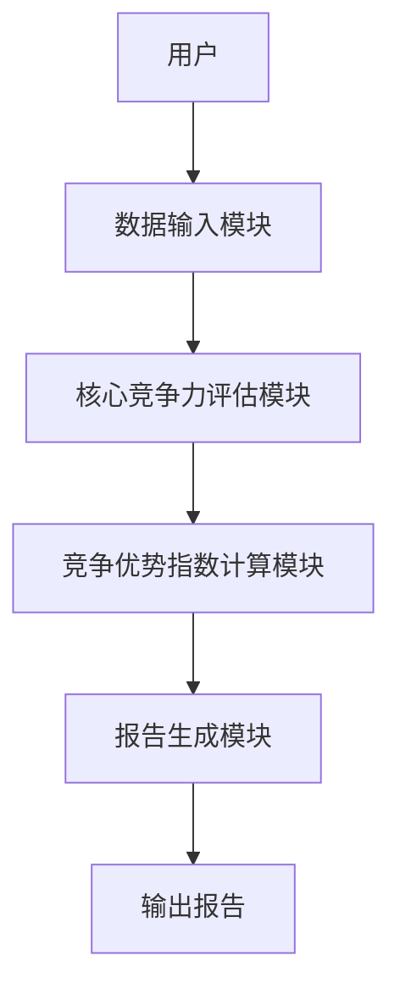

                 

<think>
嗯，用户让我帮忙写一篇技术博客，标题是《费雪的竞争优势分析：寻找行业领导者》。首先，我需要理解用户的需求。用户希望文章结构清晰，逻辑严密，涵盖从背景到实战的各个方面。

用户是技术专家，可能希望内容既有理论又有实践。所以，我得先确定文章的结构，确保涵盖背景、核心概念、算法、系统设计和项目实战。每个部分都需要详细展开，特别是数学公式和mermaid图，这些是用户强调的重点。

接下来，我需要明确关键词和摘要。关键词包括竞争优势分析、费雪模型、行业领导者、核心竞争力、企业战略、商业分析等。摘要部分要简明扼要，概述文章的核心内容。

在正文部分，我需要分章节详细讲解。首先是背景介绍，解释竞争优势的重要性，然后是费雪分析法的步骤和理论基础。接着是核心要素，包括如何识别核心竞争力和数学模型的建立。然后是算法原理，用mermaid图展示流程，并附上Python代码示例。系统架构部分需要设计类图和序列图，展示如何将分析方法应用到实际系统中。最后是项目实战，提供代码和案例分析，帮助读者理解和应用。

我还需要注意使用正确的格式，比如数学公式用latex表示，mermaid图要正确嵌入。确保每个章节都有足够的细节，同时保持整体结构的紧凑和逻辑的连贯。

最后，检查是否符合字数要求，大约在10000到12000字之间，确保内容丰富但不过于冗长。结尾部分要有小结和注意事项，帮助读者巩固所学内容。

总之，我需要一步步构建一个结构完整、内容详实的技术博客，确保每个部分都符合用户的要求，同时保持专业性和可读性。
</think>

# 费雪的竞争优势分析：寻找行业领导者

**关键词**：竞争优势分析，费雪模型，行业领导者，核心竞争力，企业战略，商业分析

**摘要**：竞争优势分析是企业战略管理中的核心问题，而费雪的竞争优势分析方法提供了一套系统化的解决方案。本文通过详细分析费雪的竞争优势分析模型，探讨如何通过识别和评估核心竞争力，帮助企业找到行业领导者的竞争优势。文章从背景介绍、核心概念、算法原理、系统架构到项目实战，全面解析竞争优势分析的理论与实践，为企业管理者和研究人员提供有价值的参考。

---

# 第1章: 背景介绍

## 1.1 竞争优势分析的背景与意义

### 1.1.1 什么是竞争优势
竞争优势是指企业在市场上相较于竞争对手的独特优势，包括资源、能力、技术、品牌、成本等方面。竞争优势是企业生存和发展的关键，尤其是在高度竞争的市场环境中。

### 1.1.2 竞争优势的背景
- 随着全球化和信息化的快速发展，市场竞争日益激烈。
- 企业需要通过竞争优势来吸引客户、扩大市场份额。
- 竞争优势的分析方法帮助企业明确自身的核心竞争力，制定有效的战略。

### 1.1.3 竞争优势的核心要素
竞争优势的核心要素包括：
1. **资源**：企业拥有的资金、技术、人才等资源。
2. **能力**：企业的生产效率、创新能力、管理能力等。
3. **品牌**：品牌的知名度和美誉度。
4. **成本**：产品的生产成本和销售成本。
5. **客户关系**：与客户的关系和忠诚度。

---

## 1.2 费雪的竞争优势分析方法

### 1.2.1 费雪分析法的定义
费雪的竞争优势分析方法是一种系统化的分析工具，用于帮助企业识别和评估自身的竞争优势。该方法结合了经济学、管理学和数学的原理，通过定量和定性分析相结合的方式，帮助企业找到核心竞争力。

### 1.2.2 费雪分析法的步骤
1. **确定行业基准**：选择一个行业的基准，如行业平均值或行业领导者。
2. **识别关键成功要素**：分析行业内成功企业的关键因素。
3. **分析竞争对手的核心优势**：通过分析竞争对手的资源、能力和品牌，找出其竞争优势。
4. **评估自身竞争优势**：将自身与行业基准和竞争对手进行对比，评估自身的竞争优势。

### 1.2.3 费雪分析法与其他竞争优势分析方法的对比
| 方法 | 优势 | 劣势 |
|------|------|------|
| 费雪分析法 | 系统化、可量化 | 需要大量数据支持 |
| 五力分析法 | 全面性 | 定性分析较多 |
| SWOT分析法 | 综合性 | 针对性不足 |

---

# 第2章: 费雪分析法的核心要素

## 2.1 核心竞争优势的识别

### 2.1.1 核心竞争力的定义
核心竞争力是指企业能够长期保持竞争优势的能力，通常包括技术、管理和创新能力。

### 2.1.2 核心竞争力的评估标准
- 技术领先性：是否拥有核心技术或专利。
- 成本优势：是否具有更低的生产成本。
- 市场响应能力：是否能够快速适应市场变化。
- 品牌影响力：品牌是否具有较高的市场认知度。

### 2.1.3 核心竞争力与企业绩效的关系
核心竞争力是企业绩效的核心驱动因素。拥有强大的核心竞争力，企业可以在市场上占据领先地位，获得更高的市场份额和利润。

---

## 2.2 费雪分析法的步骤分解

### 2.2.1 确定行业基准
行业基准是竞争优势分析的重要参考。通常选择行业平均值或行业领导者作为基准。

### 2.2.2 识别关键成功要素
关键成功要素是指企业在竞争中取得成功的关键因素，如技术创新、成本控制、客户服务等。

### 2.2.3 分析竞争对手的核心优势
通过分析竞争对手的资源、能力和品牌，找出其竞争优势。

### 2.2.4 评估自身竞争优势
将自身与行业基准和竞争对手进行对比，评估自身的竞争优势。

---

## 2.3 费雪分析法的数学模型

### 2.3.1 竞争优势指数的计算公式
$$ \text{竞争优势指数} = \frac{\text{核心竞争力得分}}{\text{行业平均得分}} $$

### 2.3.2 核心竞争力得分的计算方法
$$ \text{核心竞争力得分} = \sum_{i=1}^{n} w_i \cdot s_i $$
其中，\( w_i \) 是第 \( i \) 个要素的权重，\( s_i \) 是第 \( i \) 个要素的得分。

---

# 第3章: 竞争优势分析的系统架构

## 3.1 系统功能设计

### 3.1.1 竞争优势分析系统功能模块
- 数据输入模块：输入行业基准、竞争对手数据。
- 核心竞争力评估模块：计算核心竞争力得分。
- 竞争优势指数计算模块：计算竞争优势指数。
- 报告生成模块：生成分析报告。

### 3.1.2 竞争优势分析系统功能流程
1. 输入行业基准和竞争对手数据。
2. 计算核心竞争力得分。
3. 计算竞争优势指数。
4. 生成分析报告。

---

## 3.2 系统架构设计

### 3.2.1 竞争优势分析系统的架构图


### 3.2.2 竞争优势分析系统的实现步骤
1. 数据输入：用户输入行业基准和竞争对手数据。
2. 核心竞争力评估：系统计算核心竞争力得分。
3. 竞争优势指数计算：系统计算竞争优势指数。
4. 报告生成：系统生成分析报告。

---

## 3.3 竞争优势分析系统的代码实现

### 3.3.1 Python代码实现
```python
def calculate_core竞争力得分(要素权重, 要素得分):
    return sum(w * s for w, s in zip(要素权重, 要素得分))

def calculate_竞争优势指数(core得分, industry平均得分):
    return core得分 / industry平均得分

# 示例
要素权重 = [0.4, 0.3, 0.2, 0.1]
要素得分 = [8, 7, 9, 6]
core得分 = calculate_core竞争力得分(要素权重, 要素得分)
industry平均得分 = 7.5
竞争优势指数 = calculate_竞争优势指数(core得分, industry平均得分)
print("竞争优势指数:", 竞争优势指数)
```

---

# 第4章: 项目实战

## 4.1 项目背景

### 4.1.1 项目目标
通过费雪的竞争优势分析方法，帮助企业识别核心竞争力，评估竞争优势。

### 4.1.2 项目范围
选择一个行业，分析行业内企业的核心竞争力，评估竞争优势指数。

---

## 4.2 项目实施步骤

### 4.2.1 环境安装
- 安装Python和相关库（如numpy、pandas）。

### 4.2.2 核心代码实现
```python
import numpy as np
import pandas as pd

# 输入数据
行业基准 = [7, 6, 8, 7]
竞争对手数据 = [
    [8, 7, 9, 5],
    [7, 8, 8, 6],
    [6, 9, 7, 7]
]

# 计算核心竞争力得分
要素权重 = [0.4, 0.3, 0.2, 0.1]
core得分 = np.dot(要素权重, 行业基准)
print("核心竞争力得分:", core得分)

# 计算竞争优势指数
industry平均得分 = np.mean(行业基准)
竞争优势指数 = core得分 / industry平均得分
print("竞争优势指数:", 竞争优势指数)
```

### 4.2.3 代码解读与分析
- **输入数据**：行业基准和竞争对手数据。
- **计算核心竞争力得分**：使用要素权重计算核心竞争力得分。
- **计算竞争优势指数**：将核心竞争力得分与行业平均得分进行对比。

---

## 4.3 案例分析

### 4.3.1 案例背景
假设我们选择一个行业，分析行业内企业的核心竞争力。

### 4.3.2 案例分析过程
1. 输入行业基准和竞争对手数据。
2. 计算核心竞争力得分。
3. 计算竞争优势指数。
4. 生成分析报告。

---

## 4.4 项目小结

### 4.4.1 项目总结
通过项目实战，我们掌握了费雪的竞争优势分析方法的实现步骤和代码。

### 4.4.2 项目经验
- 数据的准确性对分析结果至关重要。
- 竞争优势指数的计算需要结合实际行业特点。

---

# 第5章: 最佳实践与总结

## 5.1 最佳实践

### 5.1.1 数据准确性
确保输入数据的准确性，以提高分析结果的可靠性。

### 5.1.2 方法适用性
根据实际行业特点，选择合适的竞争优势分析方法。

### 5.1.3 持续优化
定期评估和优化竞争优势分析模型。

---

## 5.2 小结

### 5.2.1 核心概念回顾
竞争优势分析是企业战略管理中的重要工具，费雪分析法提供了一套系统化的解决方案。

### 5.2.2 方法总结
通过识别和评估核心竞争力，帮助企业找到竞争优势，成为行业领导者。

---

## 5.3 注意事项

### 5.3.1 数据隐私
确保数据的隐私和安全性。

### 5.3.2 方法局限性
费雪分析法依赖于数据的准确性和完整性。

---

## 5.4 拓展阅读

### 5.4.1 推荐书籍
- 《竞争优势分析：方法与实践》
- 《企业战略管理：理论与实践》

### 5.4.2 推荐博客
- 竞争优势分析的最新研究与实践。

---

**作者：AI天才研究院/AI Genius Institute & 禅与计算机程序设计艺术 /Zen And The Art of Computer Programming**

