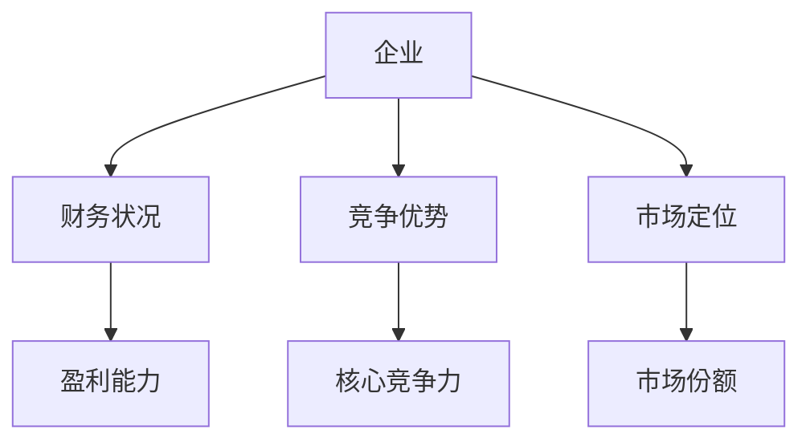
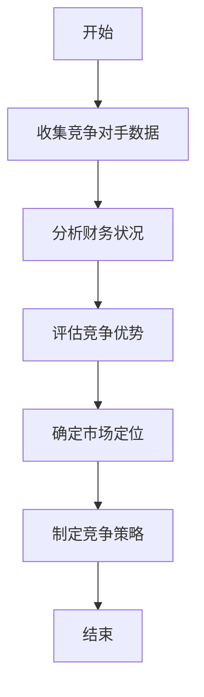

                 


# 费雪的竞争对手分析方法

> 关键词：竞争对手分析，费雪方法，企业战略，竞争优势，市场定位，投资策略

> 摘要：本文系统地介绍了费雪的竞争对手分析方法，从基础概念到实际应用，详细阐述了如何通过分析竞争对手的核心要素来制定有效的竞争策略。文章内容包括背景介绍、核心概念、算法原理、系统设计、项目实战及最佳实践等，旨在为读者提供一个全面而深入的分析框架。

---

## 第一部分: 费雪的竞争对手分析方法基础

### 第1章: 竞争对手分析的背景与意义

#### 1.1 竞争对手分析的定义与重要性
- **1.1.1 什么是竞争对手分析**  
  竞争对手分析是指通过研究市场上与自己企业有竞争关系的其他企业，分析其优势和劣势，从而制定有效的竞争策略。
  
- **1.1.2 竞争对手分析的意义**  
  - 识别市场机会与威胁。
  - 提高企业的竞争优势。
  - 制定有效的市场进入策略。

- **1.1.3 竞争对手分析的常见应用场景**  
  - 投资决策。
  - 市场定位。
  - 竞争策略制定。

#### 1.2 费雪竞争对手分析方法的起源
- **1.2.1 彼得·费雪的成长型投资理念**  
  彼得·费雪是成长型投资的倡导者，他强调通过研究企业的基本面来寻找具有长期增长潜力的企业。

- **1.2.2 费雪方法的核心思想**  
  费雪认为，成功的投资不仅要看企业的财务数据，还要分析其竞争优势和市场定位。

- **1.2.3 费雪方法与其他竞争对手分析方法的区别**  
  费雪方法更注重企业的长期发展潜力和竞争优势，而不仅仅是短期财务表现。

#### 1.3 费雪竞争对手分析方法的核心框架
- **1.3.1 费雪分析框架的构成**  
  - 企业战略。
  - 竞争优势。
  - 市场定位。

- **1.3.2 费雪分析框架的特点**  
  - 以企业核心竞争力为核心。
  - 强调长期发展潜力。

- **1.3.3 费雪分析框架的适用范围**  
  - 适用于企业战略制定。
  - 适用于投资决策。

### 第2章: 费雪竞争对手分析的核心概念与联系

#### 2.1 竞争对手分析的核心概念
- **2.1.1 企业战略**  
  企业战略是指企业在市场中如何定位自己，如何与竞争对手区分开。

- **2.1.2 竞争优势**  
  竞争优势是指企业在市场上相对于竞争对手的独特优势。

- **2.1.3 市场定位**  
  市场定位是指企业在目标市场中如何定位自己的产品或服务。

#### 2.2 费雪分析方法的核心要素
- **2.2.1 企业财务状况**  
  企业的财务状况是分析其竞争力的重要指标。

- **2.2.2 企业经营状况**  
  包括企业的市场份额、增长率、产品创新等。

- **2.2.3 企业未来发展前景**  
  企业的未来发展前景是分析其长期竞争力的关键因素。

#### 2.3 费雪分析框架的实体关系图


---

## 第二部分: 费雪竞争对手分析的算法原理

### 第3章: 费雪竞争对手分析的算法原理

#### 3.1 费雪分析方法的数学模型
- **3.1.1 费雪分析的核心公式**  
  $$ \text{竞争优势} = \frac{\text{企业利润}}{\text{行业平均利润}} $$

- **3.1.2 费雪分析的指标权重计算**  
  $$ \text{权重} = \frac{\text{指标重要性}}{\sum \text{所有指标重要性}} $$

#### 3.2 费雪分析方法的流程图


#### 3.3 费雪分析方法的Python实现
```python
import pandas as pd

def fisher_competitor_analysis(competitor_data):
    # 计算行业平均利润
    industry_avg_profit = competitor_data['行业平均利润']
    
    # 计算竞争优势
    competitor_advantage = competitor_data['企业利润'] / industry_avg_profit
    
    # 计算指标权重
    competitor_data['权重'] = competitor_data['指标重要性'] / sum(competitor_data['指标重要性'])
    
    return competitor_advantage, competitor_data

# 示例数据
data = {
    '企业利润': [10, 15, 20],
    '行业平均利润': [5, 5, 5],
    '指标重要性': [0.3, 0.4, 0.3]
}
df = pd.DataFrame(data)

# 调用函数
advantage, weighted_data = fisher_competitor_analysis(df)
print("竞争优势:", advantage)
print("\n权重计算结果:", weighted_data)
```

---

## 第三部分: 费雪竞争对手分析的系统分析与架构设计

### 第4章: 系统分析与架构设计

#### 4.1 竞争对手分析系统的功能设计
- **4.1.1 系统功能模块**  
  - 数据收集模块。
  - 数据分析模块。
  - 竞争策略制定模块。

- **4.1.2 系统功能流程图**  
  ```mermaid
  graph TD
  A[用户输入] --> B[数据收集]
  B --> C[数据清洗]
  C --> D[数据分析]
  D --> E[竞争策略制定]
  E --> F[结果输出]
  ```

#### 4.2 竞争对手分析系统的架构设计
- **4.2.1 系统架构图**  
  ```mermaid
  graph LR
  A[前端] --> B[后端]
  B --> C[数据库]
  B --> D[分析模块]
  D --> C
  ```

#### 4.3 竞争对手分析系统的接口设计
- **4.3.1 数据接口**  
  - 输入接口：接收竞争对手数据。
  - 输出接口：输出分析结果。

- **4.3.2 API接口**  
  ```python
  def analyze_competitor(data):
      # 数据分析逻辑
      return result
  ```

#### 4.4 竞争对手分析系统的交互设计
- **4.4.1 交互流程图**  
  ```mermaid
  graph LR
  A[用户] --> B[系统]
  B --> C[分析结果]
  C --> D[用户]
  ```

---

## 第四部分: 费雪竞争对手分析的项目实战

### 第5章: 项目实战

#### 5.1 项目环境安装
- **5.1.1 安装Python环境**  
  ```bash
  python --version
  pip install numpy pandas matplotlib
  ```

- **5.1.2 安装数据分析库**  
  ```bash
  pip install seaborn scikit-learn
  ```

#### 5.2 核心代码实现
```python
import pandas as pd
import numpy as np

def fisher_analysis(dataframe):
    industry_avg = dataframe['行业平均利润'].mean()
    advantage = dataframe['企业利润'] / industry_avg
    return advantage

# 示例数据
data = {
    '企业利润': [15, 20, 25],
    '行业平均利润': [10, 10, 10],
    '市场份额': [30, 40, 35]
}
df = pd.DataFrame(data)

# 调用函数
result = fisher_analysis(df)
print("竞争优势:", result)
```

#### 5.3 实际案例分析
- **5.3.1 案例背景**  
  某科技公司与竞争对手在市场份额和产品创新上的对比分析。

- **5.3.2 案例分析步骤**  
  1. 收集竞争对手数据。
  2. 计算竞争优势。
  3. 制定竞争策略。

#### 5.4 项目总结
- **5.4.1 项目成果**  
  成功分析竞争对手的核心优势，并制定出有效的竞争策略。

- **5.4.2 项目经验**  
  数据的准确性和分析方法的选择对结果影响重大。

---

## 第五部分: 费雪竞争对手分析的最佳实践

### 第6章: 最佳实践与小结

#### 6.1 应用费雪分析方法的注意事项
- **6.1.1 数据的准确性**  
  数据来源必须可靠。

- **6.1.2 分析方法的适用性**  
  根据具体场景选择合适的分析方法。

#### 6.2 费雪分析方法的未来趋势
- **6.2.1 数据分析技术的进步**  
  AI和大数据技术将推动竞争对手分析的进一步发展。

- **6.2.2 多维度分析的融合**  
  结合财务、市场、技术等多方面因素进行综合分析。

#### 6.3 总结与展望
- 总结：费雪分析方法为企业提供了一种系统化的竞争对手分析框架。
- 展望：随着技术的进步，竞争对手分析将更加智能化和精准化。

---

## 作者：AI天才研究院 & 禅与计算机程序设计艺术

---

通过以上目录大纲，我们可以看到《费雪的竞争对手分析方法》将从基础到实际应用，全面系统地讲解如何运用费雪的方法进行竞争对手分析，帮助读者在投资和商业决策中做出更明智的选择。

