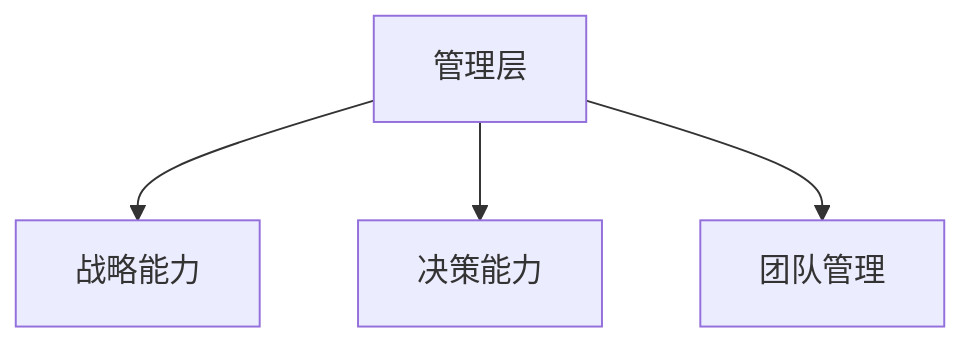
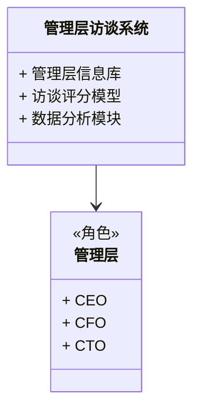
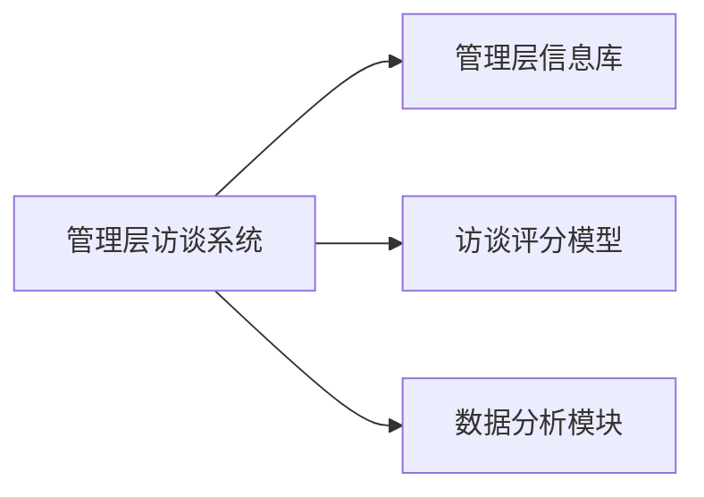
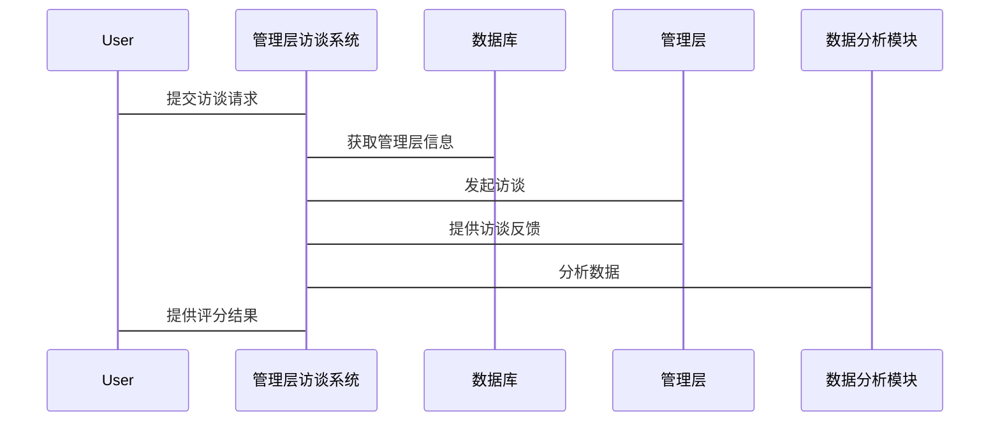

                 


# 管理层访谈技巧：费雪的投资智慧

> 关键词：费雪，管理层访谈，价值投资，投资技巧，沟通技巧

> 摘要：本文深入探讨了菲利普·费雪在投资过程中使用的管理层访谈技巧，分析了其核心概念、理论基础、实践应用和系统架构。通过详细讲解，展示了如何通过有效的访谈识别优质企业，做出明智的投资决策。

---

## 第一章：引言

### 1.1 费雪的背景与投资理念

#### 1.1.1 费雪的生平简介
菲利普·费雪（Philip Fisher）是价值投资的先驱之一，被誉为“成长股之父”。他于1907年进入斯坦福大学，毕业后进入投资银行工作，并在1934年成为注册投资顾问。费雪的投资理念强调长期增长，关注企业的基本面和管理层质量。

#### 1.1.2 费雪的价值投资理论
费雪提出了“成长股”概念，认为投资者应选择那些具有持续增长潜力的企业。他强调企业的管理团队、产品创新能力和财务健康状况。

#### 1.1.3 费雪与管理层访谈的关系
费雪认为，通过与管理层的深入交流，可以评估其能力、判断力和企业战略，从而识别出优质的投资标的。

### 1.2 管理层访谈的重要性
#### 1.2.1 访谈在投资决策中的作用
管理层访谈是了解企业内部运作的关键手段，能够揭示财务数据之外的信息，帮助投资者做出更准确的判断。

#### 1.2.2 访谈与其他分析方法的对比
与财务分析和市场研究相比，访谈提供了更直接的内部信息，但需要结合其他方法才能全面评估企业。

#### 1.2.3 费雪访谈技巧的核心价值
费雪的访谈技巧注重提问和倾听，帮助投资者深入理解企业的潜力和管理层的能力。

### 1.3 本书的目的与结构
#### 1.3.1 本书的目标读者
本书适合投资者、金融分析师和企业管理者阅读。

#### 1.3.2 本书的章节安排
文章将从引言、核心概念、理论基础、实践应用、系统设计和总结六个部分展开。

#### 1.3.3 学习本书的方法与建议
读者应结合实际案例，深入理解费雪的访谈技巧，并在实践中不断优化。

---

## 第二章：管理层访谈的核心概念

### 2.1 管理层访谈的目的与重要性
#### 2.1.1 访谈的主要目的
通过访谈获取企业内部信息，评估管理层的能力和企业的发展潜力。

#### 2.1.2 访谈在投资中的独特价值
揭示企业的真实情况，帮助投资者做出明智决策。

### 2.2 管理层访谈的核心要素
#### 2.2.1 访谈对象的选择
优先选择关键人物，如CEO、 CFO和CTO。

#### 2.2.2 访谈的时间与地点安排
选择合适的时机和地点，营造良好的访谈氛围。

#### 2.2.3 访谈的准备与执行步骤
准备阶段包括信息收集和问题设计，执行阶段注重提问和倾听。

### 2.3 管理层访谈的类型与流程
#### 2.3.1 初次访谈与后续访谈的区别
初次访谈用于初步了解，后续访谈用于深入挖掘信息。

#### 2.3.2 一对一访谈与小组访谈的优缺点
一对一访谈更深入，小组访谈能获取多方面的信息。

---

## 第三章：管理层访谈的理论基础

### 3.1 费雪的访谈方法论
#### 3.1.1 费雪的“三问”法则
- 什么是企业的核心竞争力？
- 企业的未来发展方向是什么？
- 管理层如何应对挑战？

#### 3.1.2 费雪的“黄金降落伞”理论
评估管理层在压力下的应对能力。

#### 3.1.3 费雪的“管理层能力评估”框架
从战略思维、决策能力和团队管理三方面评估管理层。

### 3.2 访谈中的心理学与沟通技巧
#### 3.2.1 沟通中的倾听技巧
主动倾听，理解对方的意图。

#### 3.2.2 有效提问的策略
开放式提问，引导对方深入探讨问题。

#### 3.2.3 管理层心理分析的应用
了解管理层的心理状态，判断其真实性。

### 3.3 费雪访谈技巧的数学模型
#### 3.3.1 访谈评分模型的构建
$$\text{评分} = 0.4 \times \text{战略能力} + 0.3 \times \text{决策能力} + 0.3 \times \text{团队管理}$$

#### 3.3.2 核心要素对比表格
| 要素        | 战略能力 | 决策能力 | 团队管理 |
|------------|----------|----------|----------|
| 评分权重    | 40%      | 30%      | 30%      |
| 评估标准    | 长期规划 | 应对措施 | 团队建设 |

#### 3.3.3 实体关系图


---

## 第四章：管理层访谈的实践应用

### 4.1 管理层能力的评估
#### 4.1.1 评估方法
通过提问和观察，评估管理层的战略思维和执行能力。

#### 4.1.2 案例分析
某科技公司CEO在访谈中表现出对市场趋势的敏锐洞察，评估其战略能力高。

### 4.2 管理层判断力的识别
#### 4.2.1 识别方法
观察管理层在面对问题时的反应速度和决策质量。

#### 4.2.2 案例分析
某制造企业CFO在财务问题上的专业性和判断力得到认可。

### 4.3 企业战略的识别
#### 4.3.1 战略识别方法
通过访谈了解企业的长期目标和市场定位。

#### 4.3.2 案例分析
某互联网公司CEO提出清晰的战略规划，显示出良好的战略能力。

---

## 第五章：管理层访谈的系统架构

### 5.1 系统功能设计
#### 5.1.1 领域模型


#### 5.1.2 核心功能模块
- 访谈信息收集模块
- 数据分析模块
- 评分系统模块

### 5.2 系统架构设计
#### 5.2.1 系统架构图


#### 5.2.2 接口设计
- API接口用于数据传输
- 用户界面用于信息输入和输出

### 5.3 系统交互流程
#### 5.3.1 交互流程图


---

## 第六章：项目实战

### 6.1 项目环境与工具安装
- 安装Python和相关库（pandas、numpy、matplotlib）

### 6.2 核心实现代码
```python
import pandas as pd
import numpy as np

def interview_score(strategy, decision, team_management):
    return 0.4 * strategy + 0.3 * decision + 0.3 * team_management

# 示例数据
strategies = [85, 70, 90]
decisions = [75, 80, 65]
team_managements = [80, 85, 70]

# 计算评分
scores = [interview_score(s, d, tm) for s, d, tm in zip(strategies, decisions, team_managements)]
print(scores)
```

### 6.3 案例分析
- 数据收集与分析
- 评分模型的应用
- 投资决策的制定

### 6.4 项目小结
通过案例分析，验证了费雪访谈技巧的有效性，帮助投资者识别优质企业。

---

## 第七章：总结与展望

### 7.1 总结
费雪的管理层访谈技巧结合了理论与实践，为投资者提供了有效的工具和方法。

### 7.2 展望
未来，随着技术的发展，访谈技巧将更加智能化和数据化。

---

## 附录

### 附录A：访谈提纲
- 公司概况
- 产品与市场
- 管理层能力

### 附录B：工具方法
- 数据分析工具
- 评分模型代码

### 附录C：参考文献
- 费雪的投资著作
- 相关学术研究

---

## 作者：AI天才研究院 & 禅与计算机程序设计艺术

通过以上章节的详细讲解，我们系统地探讨了费雪的管理层访谈技巧，从理论到实践，从方法到系统，为投资者提供了实用的指导。

