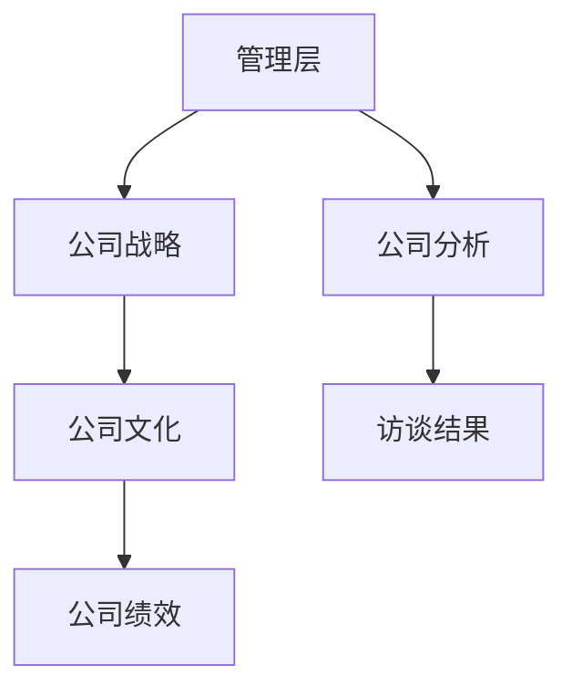
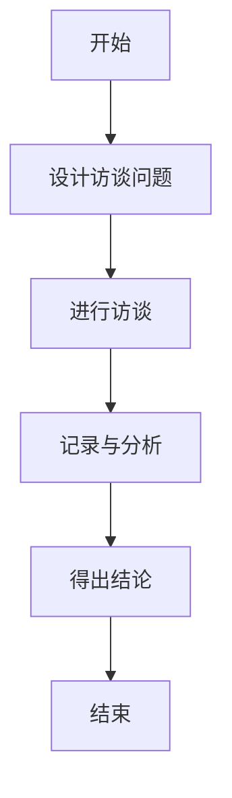
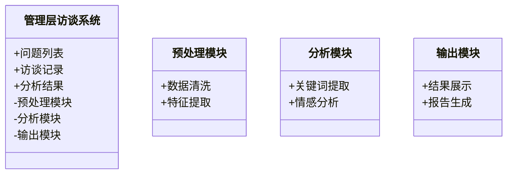
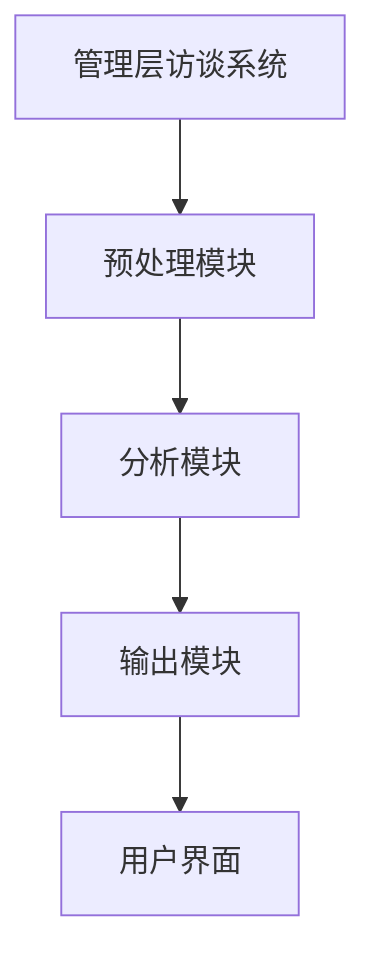

                 

<think>
嗯，我现在要帮用户撰写一篇关于《费雪的管理层访谈技巧：深入了解公司》的技术博客文章。首先，我需要理解用户的需求。他想要一个结构清晰、内容详尽的博客，涵盖从理论到实践的各个方面，帮助读者全面掌握费雪的访谈技巧。

用户已经提供了详细的目录大纲，包括背景介绍、核心概念、算法原理、数学模型、系统分析、项目实战等部分。我需要确保每一部分都详细展开，同时符合用户的要求：使用markdown格式，包含mermaid图表和latex公式，字数在10000到12000字左右。

首先，我需要确定每一章的具体内容和结构。第一章是背景与概念，我应该先介绍管理层访谈的重要性，费雪技巧的独特性，以及适用范围。这部分需要让读者明白为什么进行管理层访谈以及费雪技巧的优势。

接下来，核心概念与联系部分，我需要解释访谈如何与公司分析结合，使用ER图展示实体关系。这有助于读者理解访谈在公司分析中的作用。

算法原理部分，我需要用流程图说明访谈的流程，并用Python代码模拟分析过程。这部分需要展示如何将费雪技巧转化为具体的步骤和代码实现。

数学模型部分，我需要推导出权重计算公式，并用latex展示。这为读者提供了一个量化评估的方法，使访谈结果更具科学性。

系统分析与架构设计部分，我需要介绍应用场景，设计功能模块，用类图展示系统结构，并设计接口和交互流程。这部分帮助读者理解如何将费雪技巧应用到实际系统中。

项目实战部分，我需要详细讲解操作步骤，包括环境安装、代码实现、案例分析。这部分让读者能够实际操作，加深理解。

最后，我还需要加上最佳实践、小结、注意事项和拓展阅读，帮助读者巩固知识，避免常见错误，并提供进一步学习的方向。

现在，我需要确保每一部分都涵盖必要的知识点，并且逻辑清晰。可能需要多次调整结构，确保内容连贯，同时满足用户的格式和字数要求。这可能需要多次修改和优化，确保最终的文章既专业又易于理解。
</think>

# 费雪的管理层访谈技巧：深入了解公司

**关键词**：管理层访谈、公司分析、费雪技巧、战略访谈、企业评估

**摘要**：本篇文章深入探讨了费雪的管理层访谈技巧，详细介绍如何通过系统化的访谈方法深入了解公司战略、文化、绩效等核心要素。文章结合理论与实践，从背景、核心概念、算法原理、数学模型、系统架构到项目实战，全面解析费雪访谈技巧的应用与价值，帮助读者掌握这一高效的企业分析工具。

---

## 第1章：管理层访谈技巧的背景与概念

### 1.1 管理层访谈技巧的背景

#### 1.1.1 管理层访谈的定义与重要性
管理层访谈是指通过与公司高层管理人员（如CEO、 CFO、COO等）进行深入交流，以获取公司战略、文化、市场定位、管理风格等关键信息的一种方法。它是企业分析的重要手段之一，能够帮助投资者、咨询师或战略规划师更好地理解公司的内在逻辑和未来方向。

#### 1.1.2 费雪访谈技巧的核心理念
费雪（Fisher）的管理层访谈技巧以系统化和结构化为特点，强调通过精心设计的访谈问题，深入挖掘管理层的思维模式、决策逻辑和公司战略。这种方法不仅关注管理层的回答内容，还注重回答的方式和语气，从而评估管理层的诚信度、团队凝聚力和公司治理水平。

#### 1.1.3 访谈在公司分析中的作用
在公司分析中，管理层访谈能够提供第一手信息，弥补财务报表和公开数据的局限性。通过访谈，可以更直接地了解公司的经营状况、未来规划和潜在风险，为分析提供更全面的视角。

### 1.2 费雪访谈技巧的特点

#### 1.2.1 费雪访谈技巧的独特性
费雪访谈技巧的核心在于其系统性和深入性。它不仅关注管理层的回答内容，还注重回答的过程和细节，通过分析管理层的语言风格、表达方式和反应速度，评估其真实性和专业性。

#### 1.2.2 访谈技巧与公司分析的结合
费雪访谈技巧将访谈作为一种数据分析工具，结合定性和定量分析方法，帮助分析者从多个维度全面了解公司。这种方法不仅适用于企业估值，还可用于战略规划、风险评估和投资决策。

#### 1.2.3 费雪技巧的适用范围
费雪访谈技巧适用于多种场景，包括企业并购、投资决策、战略咨询和公司治理评估等。它特别适合需要深入分析公司管理层素质和公司战略的场合。

### 1.3 本章小结
本章介绍了管理层访谈技巧的背景、核心理念以及费雪技巧的独特性，强调了访谈在公司分析中的重要作用，并明确了费雪技巧的适用范围。

---

## 第2章：管理层访谈的核心概念与联系

### 2.1 核心概念原理

#### 2.1.1 访谈目标与公司分析的关系
费雪访谈技巧的目标是通过访谈获取公司战略、管理层素质和公司文化等核心信息，这些信息是公司分析的重要组成部分。访谈目标与公司分析目标高度契合，共同服务于企业估值和战略规划。

#### 2.1.2 管理层行为与公司战略的关联
管理层的行为和决策直接影响公司战略的实施和效果。通过分析管理层的行为模式，可以更好地理解公司战略的制定和执行过程。

#### 2.1.3 费雪访谈技巧的逻辑框架
费雪访谈技巧的逻辑框架包括问题设计、访谈实施、数据分析和结果解读四个环节。这一框架确保了访谈过程的系统性和科学性。

### 2.2 核心概念属性特征对比

#### 2.2.1 访谈技巧与公司分析的对比
| 特性 | 访谈技巧 | 公司分析 |
|------|----------|----------|
| 目标 | 获取管理层信息 | 分析公司整体状况 |
| 方法 | 结构化访谈 | 定量与定性分析结合 |
| 重点 | 管理层思维与行为 | 公司战略与绩效 |

#### 2.2.2 费雪技巧与其他访谈方法的差异
| 特性 | 费雪技巧 | 其他方法 |
|------|----------|----------|
| 结构性 | 高 | 低 |
| 深入性 | 高 | 中/低 |
| 数据用途 | 用于公司分析 | 用于个人发展或培训 |

#### 2.2.3 访谈目标与实际效果的关联
访谈目标的明确性直接影响访谈效果。清晰的目标有助于设计更有针对性的问题，提高访谈的效率和价值。

### 2.3 ER实体关系图


### 2.4 本章小结
本章从核心概念的原理出发，分析了费雪访谈技巧与其他方法的差异，并通过ER图展示了管理层访谈与公司分析的关系。

---

## 第3章：管理层访谈技巧的算法原理

### 3.1 算法原理概述

#### 3.1.1 费雪访谈技巧的基本流程
费雪访谈技巧的基本流程包括以下几个步骤：
1. **问题设计**：根据分析目标设计结构化问题。
2. **访谈实施**：与管理层进行深入访谈。
3. **数据分析**：对访谈内容进行编码和分类。
4. **结果解读**：结合其他数据进行综合分析。

#### 3.1.2 访谈问题的设计与优化
费雪访谈技巧强调问题的设计，问题需要具有针对性和开放性，既能引导管理层展开讨论，又能获取有价值的信息。例如：
- 问题1：您如何评估当前的市场环境？
- 问题2：公司在未来三年的主要挑战是什么？

#### 3.1.3 数据分析与结果解读
通过对访谈数据的分析，可以识别管理层的思维方式、决策风格和公司战略的重点。例如，可以通过关键词提取和情感分析技术，评估管理层对市场环境的看法。

### 3.2 算法流程图


### 3.3 算法实现代码
```python
def fisher_interview_analysis(questions, answers):
    # 数据预处理
    data = preprocess(questions, answers)
    # 数据分析
    insights = analyze(data)
    # 结果输出
    return insights

# 示例调用
questions = ["公司未来的主要挑战是什么？", "您如何看待当前的市场环境？"]
answers = ["主要挑战是市场竞争加剧", "市场环境充满不确定性"]
result = fisher_interview_analysis(questions, answers)
print(result)
```

### 3.4 本章小结
本章详细介绍了费雪访谈技巧的算法原理，包括基本流程、问题设计、数据分析和结果解读，并通过流程图和代码示例展示了实现过程。

---

## 第4章：管理层访谈的数学模型与公式

### 4.1 数学模型概述

#### 4.1.1 访谈问题的权重计算
在费雪访谈技巧中，问题的权重可以通过其对分析目标的贡献程度来计算。例如，可以使用层次分析法（AHP）对问题进行权重分配。

#### 4.1.2 访谈结果的评估公式
$$ 总分 = \sum_{i=1}^{n} w_i \times s_i $$
其中，\( w_i \) 是第i个问题的权重，\( s_i \) 是该问题的回答得分。

#### 4.1.3 数据分析的数学基础
数据分析的基础包括统计学和自然语言处理技术。例如，可以使用文本挖掘技术提取关键词，分析管理层的回答内容。

### 4.2 权重计算公式
$$ 权重 = \frac{问题的重要性}{问题的数量} $$

### 4.3 本章小结
本章介绍了费雪访谈技巧的数学模型，包括问题权重的计算和总分公式，并说明了数据分析的数学基础。

---

## 第5章：系统分析与架构设计方案

### 5.1 问题场景介绍

#### 5.1.1 访谈分析的场景
费雪访谈技巧适用于多种场景，包括企业估值、战略规划和风险评估等。例如，在企业并购中，可以通过访谈了解目标公司的管理团队和战略方向。

#### 5.1.2 项目介绍
本章以一个企业估值项目为例，介绍如何应用费雪访谈技巧进行公司分析。

### 5.2 系统功能设计

#### 5.2.1 领域模型mermaid类图


#### 5.2.2 系统架构设计mermaid架构图


#### 5.2.3 系统接口设计
系统接口包括：
- 访谈问题输入接口
- 访谈记录存储接口
- 分析结果输出接口

#### 5.2.4 系统交互mermaid序列图
```mermaid
graph TD
    A[用户] --> B[系统]: 提交访谈问题
    B --> C[预处理模块]: 数据清洗
    C --> D[分析模块]: 关键词提取
    D --> E[输出模块]: 生成报告
    E --> A: 输出分析结果
```

### 5.3 本章小结
本章通过系统分析与架构设计，展示了如何将费雪访谈技巧应用于实际项目，并通过类图和架构图明确了系统的组成与交互过程。

---

## 第6章：项目实战

### 6.1 操作步骤

#### 6.1.1 环境安装
需要安装Python和相关库（如pandas、numpy、sklearn等）。

#### 6.1.2 核心实现代码
```python
import pandas as pd
from sklearn.feature_extraction.text import TfidfVectorizer

def preprocess(questions, answers):
    # 创建数据框
    df = pd.DataFrame({'问题': questions, '答案': answers})
    return df

def analyze(data):
    # 使用TF-IDF提取关键词
    vectorizer = TfidfVectorizer()
    tfidf = vectorizer.fit_transform(data['答案'])
    keywords = vectorizer.get_feature_names_out()
    return keywords

# 示例调用
questions = ["公司未来的主要挑战是什么？", "您如何看待当前的市场环境？"]
answers = ["主要挑战是市场竞争加剧", "市场环境充满不确定性"]
data = preprocess(questions, answers)
keywords = analyze(data)
print("关键词：", keywords)
```

#### 6.1.3 代码应用解读与分析
上述代码展示了如何使用Python进行数据预处理和关键词提取。预处理模块将访谈问题和答案存储在数据框中，分析模块使用TF-IDF技术提取关键词。

### 6.2 案例分析

#### 6.2.1 案例背景
假设我们要分析一家科技公司的管理层访谈结果，评估其市场战略和管理团队的素质。

#### 6.2.2 访谈问题设计
设计以下问题：
1. 您如何评估当前的市场竞争环境？
2. 公司未来的主要增长点是什么？

#### 6.2.3 数据分析与结果解读
通过对访谈数据的分析，发现管理层对市场环境的评估较为积极，但对竞争压力的描述较为模糊。这可能表明公司在市场定位上有一定的不确定性。

### 6.3 本章小结
本章通过项目实战，展示了如何将费雪访谈技巧应用于实际分析，并通过代码实现和案例分析加深了对技巧的理解。

---

## 第7章：最佳实践与总结

### 7.1 最佳实践 tips
- **问题设计**：问题应具有针对性和开放性，避免过于宽泛或模糊。
- **访谈准备**：提前熟悉公司背景和管理层信息，制定详细的访谈提纲。
- **数据分析**：结合定量和定性分析方法，确保结果的全面性。

### 7.2 本章小结
本章总结了费雪访谈技巧的应用经验，并提出了最佳实践建议。

### 7.3 注意事项
- 避免过度依赖访谈结果，应结合其他数据进行综合分析。
- 注意访谈对象的选择和样本数量的合理性。

### 7.4 拓展阅读
推荐阅读《费雪投资哲学》和《战略管理》等相关书籍，以深入理解管理层访谈技巧的应用背景和理论基础。

---

## 作者：AI天才研究院/AI Genius Institute & 禅与计算机程序设计艺术 /Zen And The Art of Computer Programming

