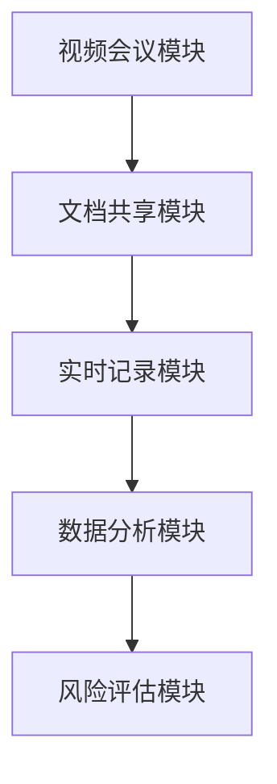
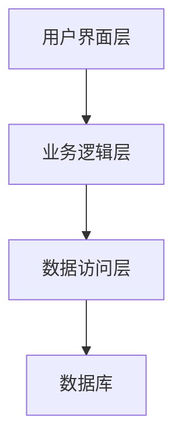
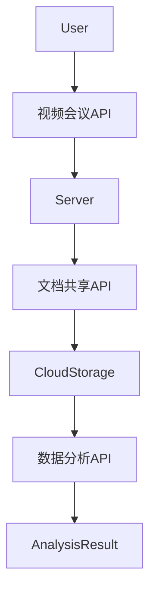

                 


# 费雪的管理层访谈技巧：远程尽职调查的新方法

> **关键词**：费雪访谈法、远程尽职调查、管理层访谈技巧、风险管理、系统架构设计、数学模型

> **摘要**：本文探讨了费雪的管理层访谈技巧在远程尽职调查中的应用，分析了传统尽职调查的局限性，提出了远程环境下的访谈方法和系统架构设计，结合数学模型和实际案例，详细讲解了如何通过远程访谈实现高效的信息收集与风险评估。

---

## 第一部分：背景与核心概念

### 第1章：远程尽职调查的背景与必要性

#### 1.1 远程尽职调查的背景

随着全球化的加速和疫情的影响，远程工作模式成为常态。传统尽职调查依赖面对面的访谈，但在远程环境下，这种方法的效率和准确性受到挑战。远程尽职调查的需求日益增加，尤其是在企业并购、风险投资等领域，如何在远程环境下高效、准确地进行尽职调查成为亟待解决的问题。

#### 1.2 费雪访谈法的起源

菲利普·费雪（Philip Fisher）是投资界的重要人物，他提出的管理层访谈法是一种通过与公司高管深入交流来评估企业价值的方法。费雪认为，管理层的能力和战略对企业成功至关重要，因此访谈是评估企业的重要手段。这种方法的核心在于通过深入的对话，发现企业的潜在问题和机会。

#### 1.3 远程环境下的费雪访谈法

在远程环境下，费雪访谈法的应用面临新的挑战。传统的面对面访谈可以观察肢体语言和现场氛围，而远程访谈则需要依赖视频会议和电话沟通。为了克服这些挑战，我们需要对访谈技巧和方法进行调整，确保在远程环境中依然能够有效收集信息并评估管理层的能力。

---

### 第2章：管理层访谈的核心技巧

#### 2.1 访谈前的准备工作

在进行管理层访谈之前，准备工作至关重要。首先，需要明确访谈的目标，例如评估企业的财务状况、管理团队的能力等。其次，制定详细的访谈提纲，包括开放式和封闭式问题，确保访谈内容覆盖所有关键领域。最后，确保访谈团队的分工明确，每位成员负责不同的部分，如信息收集、记录和分析。

#### 2.2 远程访谈中的非语言线索识别

在远程访谈中，非语言线索的识别尤为重要。视频会议中的肢体语言、面部表情和语音语调都可能传递重要的信息。例如，管理层的肢体语言可能反映出他们的自信程度，而语音语调则可能暗示他们的压力水平。通过识别这些非语言线索，可以更准确地评估管理层的真实意图和情绪状态。

#### 2.3 访谈中的问题设计与应对策略

问题设计是访谈成功的关键。开放式问题可以激发管理层的深入讨论，而封闭式问题则有助于快速获取具体信息。在访谈过程中，可能会遇到管理层回避或模糊回答的情况，此时需要灵活应对，通过追问或引导性问题进一步探查真相。同时，记录和分析访谈内容的能力也至关重要，确保后续的评估工作能够顺利进行。

---

## 第二部分：远程尽职调查的方法论

### 第3章：远程尽职调查的系统化方法

#### 3.1 费雪访谈法的远程应用框架

费雪访谈法的远程应用框架包括三个阶段：信息收集、信息验证和风险评估。在信息收集阶段，通过视频会议和电话访谈收集初步数据；在信息验证阶段，通过交叉验证和多维度评估确保数据的准确性；在风险评估阶段，利用数学模型和风险矩阵对潜在问题进行分析，制定相应的应对策略。

#### 3.2 信息交叉验证的多维度评估

信息交叉验证是远程尽职调查的重要环节。通过收集不同来源的信息，例如公司财报、行业报告和第三方评估，可以对管理层提供的信息进行多维度验证。这种方法能够有效减少信息偏差，提高评估的准确性。例如，通过对比公司财报和管理层的口头陈述，可以发现潜在的不一致之处。

#### 3.3 流程优化与效率提升

远程尽职调查的流程优化需要从多个方面入手。首先，访谈前的准备工作要细致，确保访谈内容的高效性。其次，利用技术工具（如视频会议软件和数据分析工具）提高工作效率。最后，建立实时反馈机制，及时调整访谈策略，确保信息收集的全面性和准确性。

---

## 第三部分：算法与数学模型

### 第4章：费雪访谈法的数学模型

#### 4.1 访谈信息的权重计算

在数学模型中，信息权重是评估管理层能力的重要指标。通过计算每个信息的权重，可以更准确地评估其对整体风险的影响。例如，企业的财务状况可能比管理团队的稳定性具有更高的权重，因为财务状况直接影响企业的生存能力。

**信息权重计算公式：**
$$ w_i = \frac{f_i}{\sum_{j=1}^{n} f_j} $$
其中，\( w_i \) 是第 \( i \) 个信息的权重，\( f_i \) 是第 \( i \) 个信息的重要性评分，\( n \) 是信息总数。

#### 4.2 风险评估的数学模型

风险评估模型是远程尽职调查的核心工具之一。通过综合评估各风险因素的影响程度和发生概率，可以制定有效的风险管理策略。例如，利用风险矩阵模型，将风险分为低、中、高三个等级，并根据权重进行排序，优先处理高风险因素。

**风险评估公式：**
$$ R = \sum_{i=1}^{n} (w_i \times p_i) $$
其中，\( R \) 是总风险值，\( w_i \) 是第 \( i \) 个风险因素的权重，\( p_i \) 是第 \( i \) 个风险因素的发生概率。

---

## 第四部分：系统架构设计

### 第5章：远程尽职调查系统的架构设计

#### 5.1 系统功能设计

远程尽职调查系统需要具备以下核心功能：视频会议支持、文档共享、实时记录、数据分析和风险评估。这些功能能够满足访谈、信息收集和评估的需求，确保远程尽职调查的高效性。

**系统功能模块图：**


#### 5.2 系统架构设计

系统架构设计采用分层结构，包括数据层、业务逻辑层和用户界面层。数据层负责存储和管理信息，业务逻辑层处理数据的分析和计算，用户界面层提供直观的操作界面，方便用户进行访谈和评估。

**系统架构图：**


#### 5.3 系统接口设计

系统接口设计包括视频会议接口、文档共享接口和数据分析接口。这些接口需要与其他系统（如云存储、第三方数据分析工具）进行集成，确保系统的兼容性和扩展性。

**系统接口流程图：**


---

## 第五部分：项目实战

### 第6章：远程尽职调查的项目实战

#### 6.1 环境安装与配置

在进行远程尽职调查之前，需要安装并配置视频会议软件（如Zoom、Microsoft Teams）、文档共享工具（如Google Drive、Dropbox）和数据分析工具（如Excel、Python库）。确保所有工具能够正常运行，并进行必要的测试。

#### 6.2 核心代码实现

以下是Python代码示例，用于数据分析和风险评估：

```python
import pandas as pd
import numpy as np

# 示例数据加载
data = pd.read_csv('interview_notes.csv')

# 计算信息权重
def calculate_weight(data):
    importance_scores = data['重要性评分']
    total = sum(importance_scores)
    weights = [score / total for score in importance_scores]
    return weights

# 风险评估
def assess_risk(data, weights):
    risks = data[['风险因素', '发生概率']]
    weighted_risks = risks.copy()
    weighted_risks['权重'] = weights
    weighted_risks['加权概率'] = weighted_risks['发生概率'] * weighted_risks['权重']
    return weighted_risks.sort_values('加权概率', ascending=False)

# 示例应用
weights = calculate_weight(data)
risk_assessment = assess_risk(data, weights)
print(risk_assessment)
```

#### 6.3 案例分析与解读

通过实际案例分析，验证远程尽职调查方法的有效性。例如，在一次企业并购中，通过远程访谈发现目标企业存在财务造假的潜在风险。利用数学模型进行风险评估后，评估结果确认了这一风险，并提出了相应的风险管理策略。

---

## 第六部分：总结与展望

### 第7章：总结与未来展望

#### 7.1 总结

本文详细探讨了费雪的管理层访谈技巧在远程尽职调查中的应用，分析了远程环境下的访谈方法和系统架构设计，并结合数学模型和实际案例，展示了如何通过远程访谈实现高效的信息收集与风险评估。

#### 7.2 最佳实践 tips

- **访谈准备**：制定详细的访谈提纲，明确目标和分工。
- **非语言线索**：注意视频会议中的肢体语言和语音语调。
- **信息验证**：通过多维度信息交叉验证确保准确性。
- **系统工具**：利用技术工具提高工作效率和准确性。

#### 7.3 未来展望

随着技术的进步，远程尽职调查将更加智能化和高效化。未来的研究方向包括开发更先进的数据分析算法、优化系统架构设计以及探索更多应用场景，如跨国并购、风险投资等领域。

---

## 作者

作者：AI天才研究院/AI Genius Institute & 禅与计算机程序设计艺术/Zen And The Art of Computer Programming

