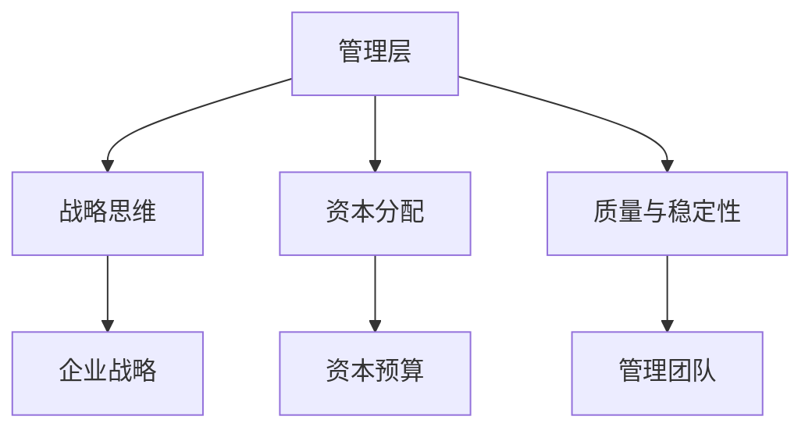
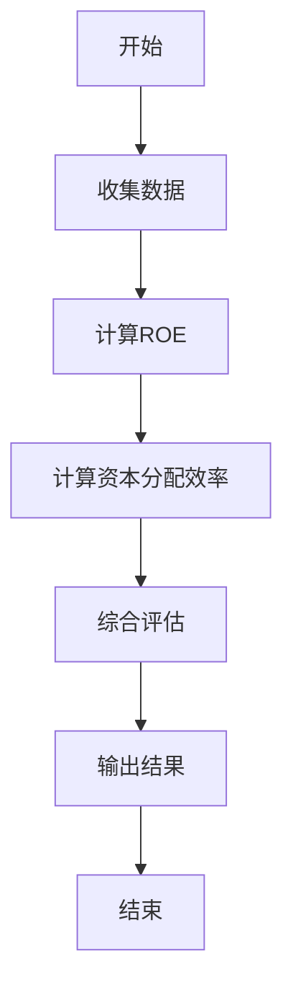

                 


# 费雪的管理层评估标准

## 关键词：费雪，管理层评估，投资标准，资本分配，战略思维

## 摘要：  
菲德烈·费雪（Philip Fisher）是投资界的重要人物，他提出了一套独特的管理层评估标准，这些标准帮助投资者识别出具备优秀管理能力的企业。本文将详细探讨费雪的管理层评估标准，包括其核心概念、算法原理、系统分析、项目实战以及最佳实践。通过逐步分析和详细讲解，帮助读者理解如何运用这些标准来评估企业管理层的能力，从而做出更明智的投资决策。

---

# 第一部分：费雪的管理层评估标准背景介绍

## 第1章：费雪投资理念概述

### 1.1 费雪投资方法的核心思想

#### 1.1.1 费雪的投资哲学
费雪的投资哲学建立在他对企业的深刻理解之上。他认为，企业的价值不仅仅取决于其当前的财务状况，还取决于其管理层的质量和战略思维能力。费雪强调，投资的本质是选择一家能够持续创造价值的企业，并长期持有。

#### 1.1.2 费雪的长期投资策略
费雪主张长期投资，而非短期交易。他认为，市场波动是不可避免的，但优秀的企业管理层能够通过持续改进和创新，为股东创造长期价值。

#### 1.1.3 费雪与价值投资的联系与区别
费雪的投资理念与价值投资有相似之处，但也有显著区别。价值投资者通常关注企业的内在价值，而费雪则更关注企业的成长性和管理层的能力。两者的共同点在于，都认为企业基本面分析是投资的核心。

### 1.2 管理层评估的重要性
#### 1.2.1 管理层在企业中的核心作用
管理层是企业的决策者和执行者，其能力和决策直接影响企业的绩效和未来发展。优秀的管理层能够制定出有效的战略，优化资本分配，提高企业的竞争力。

#### 1.2.2 管理层评估对企业价值的影响
管理层评估是企业价值评估的重要组成部分。一个优秀的管理层能够带领企业实现持续增长，从而为投资者带来超额回报。

#### 1.2.3 费雪对管理层评估的独特见解
费雪认为，管理层评估不仅仅是对企业当前表现的评价，更是对未来潜力的预测。他提出了一套具体的评估标准，以帮助企业识别出具备优秀管理能力的企业。

### 1.3 费雪管理层评估标准的背景
#### 1.3.1 费雪提出标准的时代背景
费雪在20世纪中期提出了他的管理层评估标准，这一时期正值美国企业快速发展的阶段。他的标准在当时具有重要意义，也为现代投资理论奠定了基础。

#### 1.3.2 标准的理论基础
费雪的评估标准基于他对企业成长和管理的深入研究，结合了财务分析、市场分析和管理能力评估。

#### 1.3.3 标准的适用范围
费雪的标准适用于各种类型的企业，但特别适用于那些具有持续增长潜力的成长型企业。

---

## 第2章：费雪管理层评估标准的核心概念

### 2.1 标准的核心要素

#### 2.1.1 战略思维能力
战略思维能力是管理层的核心能力之一。费雪认为，优秀的管理层能够制定出清晰的企业战略，并能够在复杂多变的市场环境中调整战略以应对挑战。

#### 2.1.2 资本分配能力
资本分配能力是管理层的另一项重要能力。费雪认为，管理层如何分配资本直接影响企业的成长和价值创造。优秀的管理层能够在资本分配上做出明智的决策，确保资本的高效利用。

#### 2.1.3 管理层质量与稳定性
管理层的质量和稳定性是企业长期发展的关键。费雪认为，管理层应当具备高度的专业性和稳定性，能够在企业面临挑战时保持冷静并做出正确的决策。

### 2.2 标准的属性特征对比

| 标准属性 | 特征描述 |
|----------|----------|
| 战略思维能力 | 管理层能否制定清晰的战略，并灵活调整以应对市场变化 |
| 资本分配能力 | 管理层是否能够有效分配资本，确保企业成长和价值创造 |
| 管理层质量与稳定性 | 管理层的专业性、稳定性和应对挑战的能力 |

### 2.3 标准的ER实体关系图


---

## 第3章：费雪管理层评估标准的算法原理

### 3.1 评估算法的步骤

#### 3.1.1 数据收集与整理
评估管理层能力的第一步是收集相关数据，包括企业的财务数据、管理层的背景信息以及企业的市场表现等。

#### 3.1.2 数据分析与评估
通过对收集到的数据进行分析，评估管理层的战略思维能力、资本分配能力和质量与稳定性。

#### 3.1.3 评估结果的输出
根据分析结果，输出对管理层的综合评估，并给出相应的投资建议。

### 3.2 评估算法的Python实现

#### 3.2.1 算法步骤
```python
def fisher_management_assessment(financial_data):
    # 计算ROE（净资产收益率）
    roe = financial_data['net_profit'] / financial_data['average_equity']
    # 计算资本分配效率
    capital_efficiency = financial_data['capital_expenditure'] / financial_data['operating_cash_flow']
    # 综合评估
    assessment_score = (roe + capital_efficiency) / 2
    return assessment_score
```

#### 3.2.2 算法流程图


---

## 第4章：费雪管理层评估标准的数学模型

### 4.1 核心数学公式

#### 4.1.1 净资产收益率（ROE）
$$ \text{ROE} = \frac{\text{净利润}}{\text{平均股东权益}} $$

#### 4.1.2 资本分配效率
$$ \text{资本分配效率} = \frac{\text{资本支出}}{\text{经营现金流}} $$

#### 4.1.3 综合评估得分
$$ \text{综合评估得分} = \frac{\text{ROE} + \text{资本分配效率}}{2} $$

### 4.2 公式应用举例

假设某企业的财务数据如下：
- 净利润：$100万
- 平均股东权益：$500万
- 资本支出：$80万
- 经营现金流：$200万

计算ROE和资本分配效率：
$$ \text{ROE} = \frac{100}{500} = 0.2 \text{（即20%）} $$
$$ \text{资本分配效率} = \frac{80}{200} = 0.4 \text{（即40%）} $$

综合评估得分：
$$ \text{综合评估得分} = \frac{0.2 + 0.4}{2} = 0.3 \text{（即30%）} $$

---

## 第5章：费雪管理层评估标准的系统分析

### 5.1 系统分析与架构设计

#### 5.1.1 系统功能设计
- 数据采集模块：收集企业的财务数据和管理层信息。
- 数据分析模块：计算ROE和资本分配效率，评估管理层能力。
- 评估报告生成模块：输出综合评估报告。

#### 5.1.2 系统架构图


---

## 第6章：费雪管理层评估标准的项目实战

### 6.1 项目实战

#### 6.1.1 项目背景
选择一家成长型企业，例如科技公司，进行管理层评估。

#### 6.1.2 代码实现
```python
# 示例代码：读取财务数据并计算评估得分
import pandas as pd

# 读取财务数据
financial_data = pd.read_csv('financial_data.csv')

# 计算ROE
financial_data['ROE'] = financial_data['net_profit'] / financial_data['average_equity']

# 计算资本分配效率
financial_data['capital_efficiency'] = financial_data['capital_expenditure'] / financial_data['operating_cash_flow']

# 计算综合评估得分
financial_data['assessment_score'] = (financial_data['ROE'] + financial_data['capital_efficiency']) / 2

# 输出结果
print(financial_data[['company_name', 'assessment_score']])
```

---

## 第7章：最佳实践、小结、注意事项与拓展阅读

### 7.1 最佳实践
- 定期更新财务数据，持续评估管理层表现。
- 结合市场环境和行业特点，灵活调整评估标准。

### 7.2 小结
费雪的管理层评估标准为投资者提供了一套科学的方法，帮助识别具备优秀管理能力的企业。通过本文的详细讲解，读者可以更好地理解和应用这些标准。

### 7.3 注意事项
- 数据的准确性和完整性是评估的基础。
- 评估结果仅供参考，需结合其他因素进行综合判断。

### 7.4 拓展阅读
- 《投资最重要的事》——格雷厄姆
- 《巴菲特的管理智慧》——巴菲特

---

# 小结

通过本文的详细讲解，我们全面探讨了费雪的管理层评估标准，包括其背景、核心概念、算法原理、系统设计和项目实战。希望读者能够通过本文，掌握如何运用这些标准来评估企业管理层的能力，并在实际投资中取得更好的效果。

---

# 作者

作者：AI天才研究院/AI Genius Institute & 禅与计算机程序设计艺术 /Zen And The Art of Computer Programming

