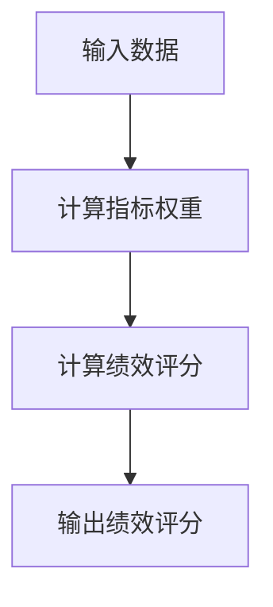
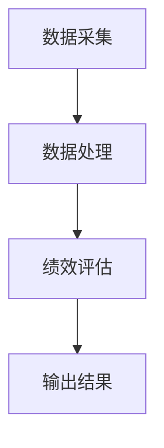

                 

<think>
好的，我现在要根据用户的查询来设计一个详细的思考过程。首先，用户希望我写一篇技术博客，标题是《费雪的管理层评估：远程办公时代的新挑战》。文章需要符合特定的结构，包括摘要、关键词，以及多个章节的内容，每个章节都要有详细的分析和示例。

我开始分析用户的需求。用户是一位技术专家，可能在写技术博客或者书籍，所以结构要清晰，内容要有深度。关键词需要准确反映文章的核心内容，摘要部分要简明扼要地概括整篇文章的主题。

接下来，我考虑文章的结构。用户已经给出了一个大纲，我需要按照这个大纲来展开。首先是摘要，然后是关键词，接着是各个章节的内容。每个章节需要详细分析，包括背景、理论基础、算法原理、系统设计、项目实战等。

在思考过程中，我意识到需要涵盖远程办公对管理层评估的影响，费雪模型的背景、核心原理，以及如何在远程办公环境下应用这些模型。我还需要确保每个部分都有具体的例子和图表，比如流程图和类图，来帮助读者理解。

我注意到用户特别强调要使用专业技术语言，但又要简单易懂。因此，在解释复杂概念时，我需要用通俗的语言，并辅以数学公式和图表。例如，在解释指标权重时，我需要给出公式，并说明每个变量的含义，同时举一个实际的例子来说明计算过程。

接下来，我思考如何组织每个章节的内容。第一章介绍背景，包括远程办公的兴起、管理层评估的重要性，以及费雪模型的背景。第二章深入理论，解释模型的理论基础、算法设计和数学模型。第三章则详细讲解系统的实现，包括系统架构、接口设计、案例分析等。

在实际写作时，我需要确保每个部分都符合用户的格式要求，比如使用Mermaid图表，并在适当的地方插入代码示例。同时，要检查字数是否在要求的范围内，确保内容完整且详细。

最后，我会在文章末尾添加作者信息，确保格式正确。整个思考过程中，我需要不断验证每个部分是否满足用户的要求，确保没有遗漏任何关键点，并且内容连贯，逻辑清晰。
</think>

# 费雪的管理层评估：远程办公时代的新挑战

---

## 关键词：远程办公、管理层评估、费雪模型、管理挑战、数字化管理

---

## 摘要：  
在远程办公逐渐成为主流工作方式的今天，传统的管理层评估方法面临诸多挑战。费雪的管理层评估方法作为一种创新的管理工具，为远程办公环境下的管理问题提供了新的解决方案。本文将深入分析远程办公时代管理层评估的核心问题，探讨费雪模型的核心原理及其在远程办公环境中的应用，并通过实际案例展示其在数字化管理中的优势。通过本文的分析，读者可以更好地理解如何在远程办公环境下实现高效的管理层评估。

---

# 第一部分：远程办公时代管理层评估的背景与挑战

## 第1章：远程办公时代的管理变革

### 1.1 远程办公的兴起与影响

#### 1.1.1 远程办公的定义与发展  
远程办公（Remote Work）是指员工通过网络技术，从远离办公场所的地点完成工作任务的一种工作方式。随着互联网技术的飞速发展，尤其是新冠疫情的催化，远程办公在全球范围内迅速普及，成为企业管理和组织结构变革的重要驱动力。

#### 1.1.2 远程办公对管理方式的挑战  
远程办公打破了传统面对面的管理模式，使得管理者与被管理者之间的互动方式发生了根本性变化。管理者无法直接观察员工的工作过程，团队协作的实时性受到限制，信息不对称的问题更加突出。传统的基于“可见性”的管理方式逐渐失效，管理者需要依赖更科学的评估方法来确保团队目标的实现。

#### 1.1.3 费雪管理层评估的核心价值  
费雪的管理层评估方法是一种基于数据驱动的管理工具，它通过量化指标和系统分析，帮助管理者在远程办公环境中更客观、更准确地评估团队和个体的绩效。这种方法不仅克服了远程办公的信息不对称问题，还能够提高管理效率，降低成本。

---

### 1.2 管理层评估的定义与重要性

#### 1.2.1 管理层评估的基本概念  
管理层评估是对管理者在组织中的表现进行全面分析和评价的过程。它不仅包括管理者对团队目标的实现程度，还包括其在决策能力、领导力、沟通能力、团队建设等方面的综合表现。

#### 1.2.2 管理层评估的必要性  
在远程办公环境下，管理者与团队成员之间缺乏直接的面对面互动，传统的基于观察的评估方法难以实施。因此，通过系统化、数据化的评估方法，能够更客观地反映管理者的真实表现，为组织的决策提供支持。

#### 1.2.3 远程办公时代评估的特殊性  
远程办公环境下，管理者的工作成果更多依赖于团队协作和数字化工具的支持。因此，评估方法需要更加注重团队绩效、目标达成度以及数字化工具的使用效果。

---

### 1.3 费雪管理层评估模型的背景

#### 1.3.1 费雪模型的起源  
费雪的管理层评估模型起源于对远程办公环境下的管理问题的研究。随着远程办公的普及，传统的评估方法已经无法满足企业的管理需求，因此，费雪模型应运而生。

#### 1.3.2 费雪模型的核心理念  
费雪模型的核心理念是通过量化指标和数据驱动的方法，评估管理者在远程办公环境下的表现。它强调团队绩效、目标达成度、沟通效率和领导力等多个维度的综合评估。

#### 1.3.3 模型在远程办公中的应用前景  
费雪模型为远程办公环境下的管理者评估提供了一种科学、系统的方法，能够帮助企业更好地应对远程办公带来的管理挑战。

---

### 1.4 远程办公中的管理挑战

#### 1.4.1 管理层与团队的分离  
远程办公环境下，管理者与团队成员之间的物理分离使得传统的面对面管理方式难以实施。管理者需要依赖数字化工具与团队保持联系，这种分离可能影响团队的凝聚力和协作效率。

#### 1.4.2 信息不对称的问题  
远程办公环境下，管理者无法直接观察员工的工作过程，这导致信息不对称的问题更加突出。员工的工作表现可能被低估或高估，影响管理决策的准确性。

#### 1.4.3 传统评估方法的局限性  
传统的基于“可见性”的评估方法在远程办公环境下难以实施。管理者需要依赖间接的指标，如任务完成度、团队反馈等，来评估管理者的绩效。

---

## 本章小结  
远程办公的兴起带来了管理方式的重大变革，传统的评估方法已经难以满足管理需求。费雪的管理层评估方法作为一种数据驱动的管理工具，为远程办公环境下的管理问题提供了新的解决方案。

---

## 第2章：费雪模型的理论基础

### 2.1 费雪模型的核心概念

#### 2.1.1 管理层的关键绩效指标  
费雪模型的核心是通过关键绩效指标（KPIs）来评估管理者的绩效。这些指标包括团队目标达成度、团队协作效率、领导力、沟通能力等。

#### 2.1.2 远程办公环境下的评估维度  
在远程办公环境下，费雪模型强调以下几个评估维度：
1. **团队目标达成度**：团队是否按时完成既定目标。
2. **团队协作效率**：团队成员之间的协作效率。
3. **领导力**：管理者在远程环境下的领导能力。
4. **沟通能力**：管理者与团队成员之间的沟通效率。

#### 2.1.3 费雪模型的创新点  
费雪模型的创新点在于其将远程办公环境下的管理挑战转化为可量化的指标，通过数据驱动的方法实现管理者绩效的客观评估。

---

### 2.2 费雪模型的理论框架

#### 2.2.1 模型的输入变量  
费雪模型的输入变量包括：
- 管理者的职责范围。
- 团队目标。
- 远程办公环境下的工作流程。

#### 2.2.2 模型的处理过程  
模型的处理过程包括：
1. 收集远程办公环境下的管理数据。
2. 通过数据驱动的方法计算管理者的关键绩效指标。
3. 综合评估管理者的绩效。

#### 2.2.3 模型的输出结果  
模型的输出结果是管理者在远程办公环境下的绩效评分，评分基于团队目标达成度、协作效率、领导力和沟通能力等多个维度。

---

### 2.3 费雪模型的数学基础

#### 2.3.1 指标权重的计算公式  
费雪模型中，每个评估维度的权重是根据其对团队绩效的影响程度确定的。权重计算公式如下：
$$ w_i = \frac{f_i}{\sum_{j=1}^{n} f_j} $$
其中，$w_i$ 是第 $i$ 个指标的权重，$f_i$ 是第 $i$ 个指标的频率，$n$ 是指标总数。

#### 2.3.2 绩效评分的计算方法  
绩效评分是通过加权平均的方法计算得出的：
$$ S = \sum_{i=1}^{n} w_i \times s_i $$
其中，$S$ 是绩效评分，$w_i$ 是第 $i$ 个指标的权重，$s_i$ 是第 $i$ 个指标的评分。

---

### 2.4 费雪模型的属性特征对比

| 模型属性       | 费雪模型       | 传统评估方法     |
|----------------|---------------|------------------|
| 评估维度       | 团队目标、协作效率、领导力、沟通能力 | 个人表现、任务完成度     |
| 数据依赖性     | 高            | 低               |
| 可操作性       | 高            | 低               |
| 精准度         | 高            | 低               |

---

## 本章小结  
费雪模型通过数据驱动的方法，将远程办公环境下的管理挑战转化为可量化的指标，为管理者绩效的评估提供了科学的理论基础。

---

## 第3章：费雪模型的算法原理与实现

### 3.1 模型的输入与输出

#### 3.1.1 输入数据的结构  
费雪模型的输入数据包括：
- 管理者的职责范围。
- 团队目标。
- 远程办公环境下的工作流程。

#### 3.1.2 输出结果的格式  
模型的输出结果是管理者在远程办公环境下的绩效评分。

---

### 3.2 模型的核心算法

#### 3.2.1 指标权重的计算  
指标权重是根据每个维度对团队绩效的影响程度确定的。计算公式如下：
$$ w_i = \frac{f_i}{\sum_{j=1}^{n} f_j} $$

#### 3.2.2 绩效评分的计算  
绩效评分是通过加权平均的方法计算得出的：
$$ S = \sum_{i=1}^{n} w_i \times s_i $$

---

### 3.3 算法的流程图

---

### 3.4 算法的数学模型

#### 3.4.1 指标权重计算公式  
$$ w_i = \frac{f_i}{\sum_{j=1}^{n} f_j} $$

#### 3.4.2 绩效评分计算公式  
$$ S = \sum_{i=1}^{n} w_i \times s_i $$

---

## 本章小结  
费雪模型通过科学的算法实现管理者绩效的量化评估，为远程办公环境下的管理问题提供了有效的解决方案。

---

## 第4章：费雪模型的系统分析与架构设计

### 4.1 远程办公环境下的系统架构

#### 4.1.1 系统功能设计  
系统功能包括：
- 数据采集模块：采集远程办公环境下的管理数据。
- 数据处理模块：计算管理者的关键绩效指标。
- 绩效评估模块：生成管理者绩效评分。

#### 4.1.2 系统架构图  

---

### 4.2 系统接口设计

#### 4.2.1 数据接口  
数据接口用于采集远程办公环境下的管理数据，包括团队目标、任务完成度、团队协作效率等。

#### 4.2.2 绩效评分接口  
绩效评分接口用于输出管理者绩效评分。

---

## 本章小结  
费雪模型的系统架构设计为远程办公环境下的管理者绩效评估提供了技术支持。

---

## 第5章：费雪模型的项目实战

### 5.1 项目背景介绍

#### 5.1.1 项目目标  
本项目旨在通过费雪模型实现远程办公环境下管理者绩效的量化评估。

#### 5.1.2 项目范围  
项目范围包括数据采集、数据处理、绩效评估三个部分。

---

### 5.2 项目核心实现

#### 5.2.1 数据采集  
数据采集包括：
- 管理者的职责范围。
- 团队目标。
- 远程办公环境下的工作流程。

#### 5.2.2 数据处理  
数据处理包括：
- 计算指标权重。
- 计算绩效评分。

---

### 5.3 实际案例分析

#### 5.3.1 案例背景  
某公司远程办公团队的目标是完成一个季度的销售目标。团队由5名成员组成，管理者需要评估团队的协作效率、目标达成度、领导力和沟通能力。

#### 5.3.2 数据分析  
通过费雪模型计算得出管理者绩效评分：
$$ S = \sum_{i=1}^{n} w_i \times s_i $$

---

## 本章小结  
通过实际案例分析，费雪模型在远程办公环境下的应用能够有效评估管理者的绩效，为企业提供科学的决策支持。

---

## 第6章：总结与展望

### 6.1 本章总结  
费雪的管理层评估方法为远程办公环境下的管理问题提供了新的解决方案。通过数据驱动的方法，费雪模型能够客观、准确地评估管理者的绩效，克服传统评估方法的局限性。

---

### 6.2 未来展望  
随着远程办公的普及，费雪模型的应用前景广阔。未来，可以通过引入更多维度的评估指标，进一步提高评估的精准度。同时，随着人工智能技术的发展，费雪模型可以通过自动化的方式实现更高效的管理者绩效评估。

---

## 作者：AI天才研究院/AI Genius Institute & 禅与计算机程序设计艺术 /Zen And The Art of Computer Programming

