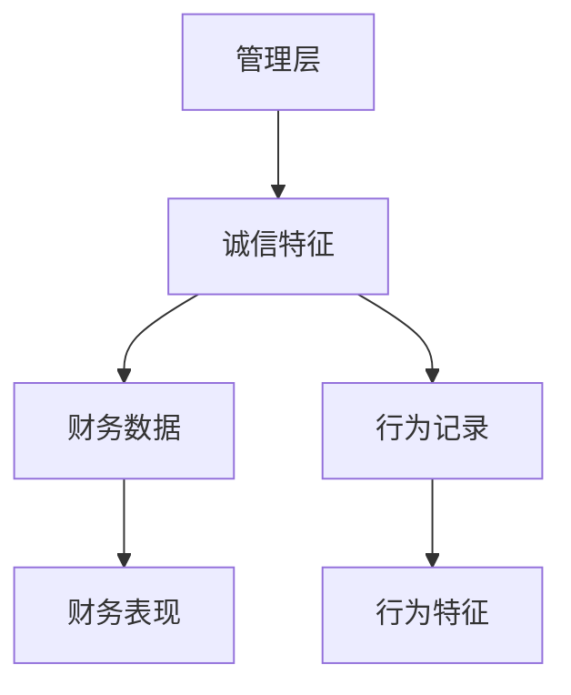
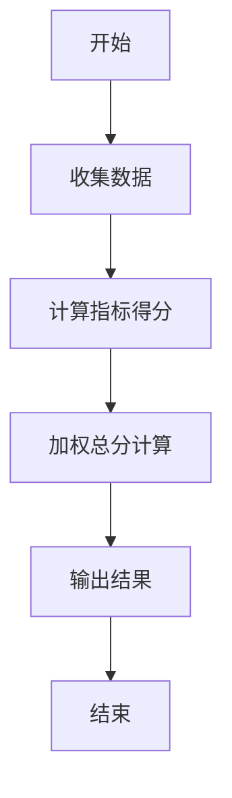
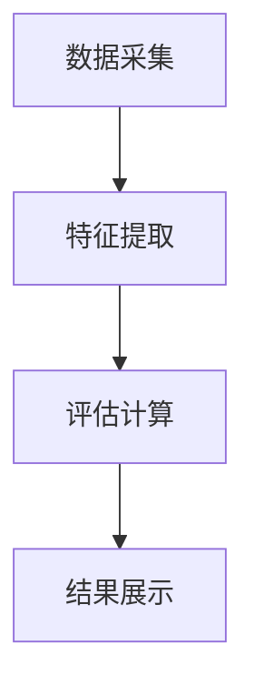
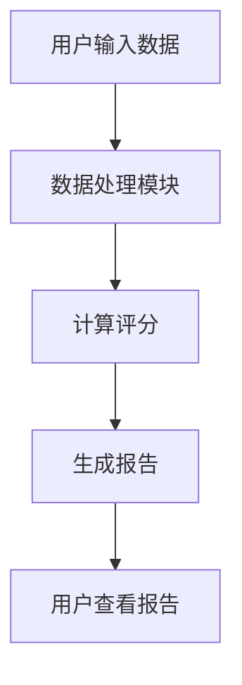

                 


# 费雪的管理层诚信评估

> 关键词：管理层诚信评估，投资决策，费雪理论，企业治理，风险控制，财务分析，投资策略

> 摘要：本文深入探讨了费雪提出的管理层诚信评估方法，分析其核心原理、算法设计、系统架构及实际应用。通过对管理层诚信评估的背景、核心概念、评估模型、系统实现及项目实战的详细阐述，帮助投资者和企业更好地理解和应用这一评估方法。文章最后总结了最佳实践和注意事项，并为读者提供了进一步学习和研究的方向。

---

## 第一章：管理层诚信评估的背景与重要性

### 1.1 管理层诚信评估的定义

管理层诚信评估是一种通过分析公司管理层的行为、动机和财务表现，来评估其诚信程度的方法。其核心在于通过数据化、系统化的手段，判断管理层是否具备诚信经营的能力和动机。

**关键概念解释：**
- **诚信经营**：管理层在经营过程中遵循道德规范，避免短期利益诱惑，专注于长期价值创造。
- **诚信评估**：通过量化方法，评估管理层的诚信水平，为投资决策提供依据。

### 1.2 管理层诚信评估的重要性

在投资领域，管理层的诚信是决定企业长期价值的关键因素之一。诚信缺失的管理层可能通过财务造假、关联交易等手段谋取私利，导致企业价值下降甚至崩盘。

**诚信评估的三大作用：**
1. **降低投资风险**：通过提前识别诚信风险，避免投资于管理层诚信不足的企业。
2. **提升企业治理**：推动企业建立透明、规范的治理机制。
3. **优化投资决策**：基于诚信评估结果，优化投资组合配置。

### 1.3 管理层诚信评估的演变

传统财务分析主要关注企业的财务数据，忽视了管理层行为的内在逻辑。费雪提出的管理层诚信评估方法，弥补了这一缺陷，通过行为分析与财务数据相结合，构建了一个更为全面的评估体系。

---

## 第二章：费雪管理层诚信评估的核心概念

### 2.1 核心概念与属性

费雪的管理层诚信评估方法基于以下几个核心概念：
1. **管理层动机**：管理层追求短期利益还是长期价值。
2. **行为特征**：管理层是否频繁进行重大资产重组、关联交易等。
3. **财务表现**：企业的财务数据是否稳健，是否符合长期发展战略。

**核心概念对比表：**

| 概念         | 属性一：短期行为 | 属性二：长期价值 | 属性三：财务数据 |
|--------------|------------------|------------------|------------------|
| 管理层动机   | 高               | 低               | -                |
| 行为特征     | 频繁             | 偶然             | -                |
| 财务表现     | 不稳定           | 稳定             | 高               |

### 2.2 核心概念的ER实体关系图



---

## 第三章：费雪管理层诚信评估的算法原理

### 3.1 算法原理概述

费雪提出的管理层诚信评估方法，通过量化分析管理层的行为特征、财务表现和市场反应，构建了一个多维度的评估模型。具体步骤如下：

1. **数据收集**：收集企业的财务数据、管理层行为记录和市场数据。
2. **特征提取**：提取关键特征，如ROE（净资产收益率）、关联交易频率等。
3. **指标评分**：对每个特征进行评分，计算加权总分。
4. **结果输出**：输出诚信评估结果，分为优秀、良好、一般和较差四个等级。

### 3.2 算法流程图



### 3.3 算法实现代码

```python
def fisher_integrity_score(management_data):
    # 计算各项指标得分
    honesty_score = management_data['honesty']/10
    behavior_score = management_data['behavior']/10
    financial_score = management_data['financial']/10
    
    # 计算加权总分
    total_score = (honesty_score * 0.4 + 
                   behavior_score * 0.3 + 
                   financial_score * 0.3)
    
    return total_score
```

### 3.4 数学模型与公式

**加权总分计算公式：**
$$
\text{total\_score} = 0.4 \times \text{honesty\_score} + 0.3 \times \text{behavior\_score} + 0.3 \times \text{financial\_score}
$$

---

## 第四章：系统分析与架构设计

### 4.1 系统功能设计

- **数据采集模块**：收集企业的财务数据、管理层行为记录和市场数据。
- **特征提取模块**：提取关键特征，如ROE、关联交易频率等。
- **评估计算模块**：计算各项指标得分和加权总分。
- **结果展示模块**：输出评估结果，提供可视化报告。

### 4.2 系统架构设计



### 4.3 接口设计与交互流程

- **接口设计**：
  - 输入接口：接受企业的财务数据和行为数据。
  - 输出接口：输出诚信评估结果和详细报告。
- **交互流程图**：



---

## 第五章：项目实战与案例分析

### 5.1 项目实战

#### 5.1.1 环境安装

```bash
pip install pandas numpy matplotlib
```

#### 5.1.2 核心代码实现

```python
import pandas as pd
import numpy as np

def calculate_honesty_score(roa, roe):
    return (roa + roe) / 2

def calculate_behavior_score(share_issuance, merger_count):
    return (share_issuance + merger_count) / 2

def calculate_financial_score(current_ratio, quick_ratio):
    return (current_ratio + quick_ratio) / 2

def fisher_integrity_score(roa, roe, share_issuance, merger_count, current_ratio, quick_ratio):
    honesty = calculate_honesty_score(roa, roe)
    behavior = calculate_behavior_score(share_issuance, merger_count)
    financial = calculate_financial_score(current_ratio, quick_ratio)
    
    return (0.4 * honesty + 0.3 * behavior + 0.3 * financial)
```

#### 5.1.3 案例分析

假设某公司财务数据如下：
- ROA = 15%
- ROE = 20%
- 三年内未发生重大资产重组
- 当前比率 = 2
- 快速比率 = 1.5

计算其诚信评估得分：
$$
\text{total\_score} = 0.4 \times \frac{15+20}{2} + 0.3 \times \frac{0+0}{2} + 0.3 \times \frac{2+1.5}{2}
$$
$$
\text{total\_score} = 0.4 \times 17.5 + 0.3 \times 0 + 0.3 \times 1.75 = 7 + 0 + 0.525 = 7.525
$$

---

## 第六章：总结与最佳实践

### 6.1 总结

费雪提出的管理层诚信评估方法，通过量化分析管理层的行为特征、财务表现和市场反应，构建了一个多维度的评估模型。这一方法不仅帮助投资者降低投资风险，还能推动企业建立透明、规范的治理机制。

### 6.2 最佳实践

1. **动态调整评估**：定期更新企业数据，动态调整评估结果。
2. **结合其他指标**：将诚信评估与其他财务指标结合使用，提高决策的准确性。
3. **关注异常情况**：对异常的财务数据和行为记录保持警惕。

### 6.3 注意事项

- 评估结果仅供参考，需结合实际情况进行判断。
- 数据来源需可靠，确保评估结果的准确性。
- 模型需定期更新，适应市场变化。

### 6.4 拓展阅读

- 《投资最重要的事》——本杰明·格雷厄姆
- 《价值投资实战策略》—— Warren Buffett

---

## 作者：AI天才研究院/AI Genius Institute & 禅与计算机程序设计艺术 /Zen And The Art of Computer Programming

