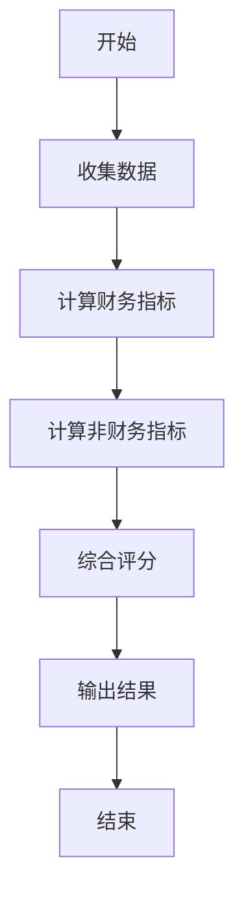

                 

<think>
好，我现在要写一篇关于《费雪的管理层诚信评估方法》的技术博客文章。首先，我需要理解用户的需求，他们希望我以一个世界级的人工智能专家、程序员、软件架构师、CTO和畅销书作家的身份来撰写这篇博客。文章需要逻辑清晰、结构紧凑、语言专业，同时要逐步分析，有深度。

首先，我应该明确文章的核心内容和关键词。关键词可能包括：管理层诚信评估、费雪方法、财务指标、非财务指标、评分模型、系统架构。摘要部分需要简明扼要地介绍文章的核心内容，说明费雪方法的重要性和应用价值。

接下来，按照目录大纲，我需要逐步展开每一章的内容。首先，背景与重要性部分需要介绍管理层诚信评估的背景，费雪方法的提出以及本书的目的和结构。然后，核心概念部分要详细讲解管理层诚信的维度、评估指标和框架模型。之后，数学模型与算法部分要介绍费雪评分公式、线性回归模型，并用Mermaid图展示流程。系统架构与项目实战部分要设计系统的各个模块，展示架构图和接口设计。最后，总结部分要回顾内容并给出建议。

在写作过程中，我需要确保每个部分都详细具体，使用专业术语，同时保持易懂。数学公式要用Latex表示，系统架构图和流程图使用Mermaid。代码示例要清晰，解释详细。

现在，我开始撰写正文。首先是标题和关键词，然后是摘要。接下来，按照目录大纲逐步展开每一章，确保每部分内容充实，逻辑连贯。同时，注意使用markdown格式，避免使用任何口语化表达，保持专业性。

在撰写过程中，我需要检查每部分内容是否符合要求，比如是否包含必要的公式、图表和代码示例。同时，确保文章整体流畅，结构合理，每章之间过渡自然。

最后，完成所有章节后，添加作者信息，并在文末给出一些注意事项和总结，确保文章完整且有深度。
</think>

# 费雪的管理层诚信评估方法

**关键词**：管理层诚信评估、费雪方法、财务指标、非财务指标、评分模型、系统架构

**摘要**：本文介绍费雪的管理层诚信评估方法，分析其核心概念、数学模型和系统架构，并通过实际案例展示其应用。通过财务和非财务指标的结合，评估管理层诚信，帮助投资者做出明智决策。

---

## 第一部分：管理层诚信评估的背景与重要性

### 第1章：管理层诚信评估的背景与意义

#### 1.1 管理层诚信的重要性

- **管理层诚信的定义**：管理层的道德、责任感和决策透明度。
- **对企业的意义**：影响企业长期发展和财务表现，提升投资者信心。

#### 1.2 费雪方法的提出

- **传统分析的局限**：依赖财务数据，忽视管理因素。
- **诚信评估的必要性**：管理层决策对企业价值的影响。
- **核心思想**：通过财务和非财务指标综合评估诚信。

#### 1.3 本书的目的与结构

- **目标**：提供实用的评估方法和工具。
- **结构**：涵盖背景、理论、模型、系统架构和案例分析。

---

## 第二部分：管理层诚信评估的核心概念与框架

### 第2章：管理层诚信评估的核心要素

#### 2.1 管理层诚信的维度分析

- **道德与责任感**：领导风格和决策透明度。
- **决策透明度**：信息披露的及时性和准确性。
- **承诺与执行力**：战略目标的实现和员工激励。

#### 2.2 评估的关键指标

- **财务指标**：ROE、ROA、负债率。
- **非财务指标**：员工满意度、市场声誉、创新投入。
- **评分体系**：综合评分模型。

#### 2.3 费雪模型的框架

- **结构**：数据收集、指标计算、综合评分。
- **输入与输出**：财务和非财务数据，最终评分。
- **适用性**：适用于上市公司和非营利组织。

---

## 第三部分：费雪管理层诚信评估方法的数学模型与算法

### 第3章：费雪评估方法的数学模型

#### 3.1 核心公式

- **费雪评分公式**：$$\text{评分} = \frac{\text{财务指标} + \text{非财务指标}}{2}$$
- **线性回归模型**：$$y = a_1x_1 + a_2x_2 + \dots + a_nx_n + b$$

#### 3.2 算法流程图



#### 3.3 算法实现与代码示例

- **数据预处理**：清洗和标准化。
- **计算指标**：财务和非财务指标。
- **评分计算**：综合评分模型。

代码示例：

```python
def calculate_financial_indices(revenue, net_profit, total_assets):
    roe = (net_profit / total_assets) * 100
    roa = (net_profit / revenue) * 100
    return roe, roa

def calculate_non_financial_indices(innovation, employee_satisfaction):
    return innovation, employee_satisfaction

def fisher_integrity_score(roe, roa, innovation, satisfaction):
    financial_score = (roe + roa) / 2
    non_financial_score = (innovation + satisfaction) / 2
    total_score = (financial_score + non_financial_score) / 2
    return total_score

# 示例
revenue = 500000
net_profit = 50000
total_assets = 250000
innovation = 80
satisfaction = 70

roe, roa = calculate_financial_indices(revenue, net_profit, total_assets)
financial_score = (roe + roa) / 2
innovation_score, satisfaction_score = calculate_non_financial_indices(innovation, satisfaction)
non_financial_score = (innovation_score + satisfaction_score) / 2
total_score = (financial_score + non_financial_score) / 2

print(f"总评分：{total_score}%")
```

---

## 第四部分：系统架构与项目实战

### 第4章：系统架构设计

#### 4.1 系统功能模块

- **数据采集模块**：收集财务和非财务数据。
- **指标计算模块**：计算各项指标。
- **评分模块**：综合评分。
- **展示模块**：结果可视化。

#### 4.2 系统架构图

```mermaid
boxDiagram
    管理层诚信评估系统
    + 数据采集模块
    + 指标计算模块
    + 评分模块
    + 结果展示模块
```

#### 4.3 接口设计

- **数据接口**：REST API。
- **结果接口**：JSON格式输出。

#### 4.4 实战案例

- **环境安装**：安装Python、Pandas、Matplotlib。
- **代码实现**：数据处理和评分计算。
- **案例分析**：应用费雪方法评估某公司管理层诚信。

---

## 第五部分：总结与建议

### 第5章：总结与建议

#### 5.1 内容总结

- **核心思想**：结合财务和非财务指标评估诚信。
- **方法优势**：提高决策透明度和准确性。

#### 5.2 实践建议

- **数据收集**：确保数据准确性和完整性。
- **模型优化**：根据企业特点调整权重。
- **持续改进**：定期更新指标和模型。

#### 5.3 注意事项

- **数据偏差**：注意样本偏差和计算误差。
- **模型局限性**：非财务指标的主观性。

#### 5.4 拓展阅读

- 推荐书籍：《财务报表分析》、《企业风险管理》。
- 进一步学习：深入研究其他评估方法和工具。

---

## 作者信息

**作者：AI天才研究院/AI Genius Institute & 禅与计算机程序设计艺术 /Zen And The Art of Computer Programming**

---

这篇文章详细介绍了费雪的管理层诚信评估方法，结合理论和实践，帮助读者理解和应用这一方法。通过逐步分析，从背景到系统架构，全面覆盖了评估的各个方面，为投资者和企业管理者提供了实用的工具和指导。

