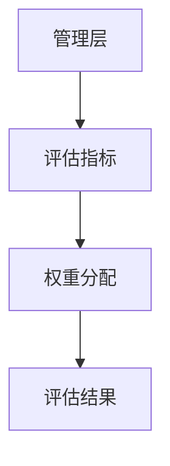
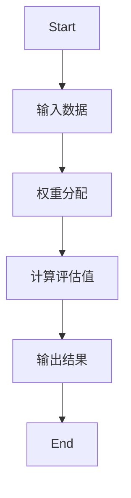
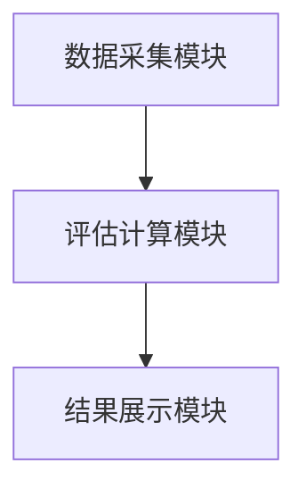

                 


# 费雪的管理层质量评估方法

> 关键词：管理层质量评估，费雪方法，数据分析，评估指标，权重分配，企业治理

> 摘要：本文系统地介绍了费雪的管理层质量评估方法，从背景、核心概念、算法原理到系统架构设计，再到项目实战和最佳实践，全面深入地剖析了该方法的理论基础和实际应用。通过本文，读者可以全面理解如何利用数据驱动的方法，科学、客观地评估企业管理层的质量，从而为企业的战略决策提供有力支持。

---

## 第一章: 管理层质量评估的背景与意义

### 1.1 问题背景

#### 1.1.1 现代企业治理中的管理层角色

在现代企业治理中，管理层扮演着至关重要的角色。管理层的决策和行为直接影响企业的战略方向、经营绩效和长期发展。然而，如何科学、客观地评估管理层的质量，一直是企业管理中的难题。

#### 1.1.2 管理层质量对企业绩效的影响

管理层的质量直接关系到企业的核心竞争力。高效、有能力的管理层能够带领企业在复杂多变的市场环境中稳步前行，而能力不足或决策失误的管理层可能导致企业绩效下滑，甚至面临生存危机。

#### 1.1.3 当前管理层评估的痛点与挑战

传统的管理层评估方法往往依赖主观判断，缺乏数据支持，存在主观性较强、难以量化等缺点。随着大数据和人工智能技术的发展，如何利用数据驱动的方法，构建科学的管理层质量评估体系，成为企业管理领域的研究热点。

### 1.2 问题描述

#### 1.2.1 管理层质量评估的核心问题

如何定义管理层质量？哪些指标可以用来衡量管理层的表现？如何量化这些指标，并进行综合评估？

#### 1.2.2 评估指标的选择与权重分配

管理层质量的评估需要选择合适的指标，并合理分配各指标的权重。例如，领导力、决策能力、团队管理能力等，都是重要的评估维度。

#### 1.2.3 数据收集与处理的复杂性

管理层质量评估需要收集大量数据，包括财务数据、市场表现、团队稳定性等。如何高效地收集、处理和分析这些数据，是评估方法成功的关键。

### 1.3 问题解决思路

#### 1.3.1 费雪方法的基本理念

费雪的管理层质量评估方法以数据驱动为核心，通过构建数学模型，量化管理层的各项表现，并综合评估其质量。

#### 1.3.2 通过数据驱动进行评估的可行性

通过收集和分析数据，费雪方法能够将管理层的表现转化为可量化的指标，从而为企业的决策提供科学依据。

#### 1.3.3 方法的适用场景与边界

费雪方法适用于各种类型的企业，但其效果在数据充分、指标明确的场景下表现最佳。对于数据不足或指标不清晰的企业，可能需要结合其他方法进行综合评估。

---

## 第二章: 费雪管理层质量评估的核心概念

### 2.1 核心概念与定义

#### 2.1.1 管理层质量的定义

管理层质量是指管理层在企业经营中的综合表现，包括领导力、决策能力、团队管理能力等方面。

#### 2.1.2 费雪方法的基本框架

费雪方法通过选择若干关键指标，赋予每个指标一定的权重，基于数据计算出管理层的质量得分。

#### 2.1.3 关键指标的识别与分类

关键指标包括但不限于：营业收入增长率、净利润率、资产负债率、员工满意度、创新研发投入占比等。

### 2.2 核心概念的属性特征对比

| 指标名称         | 属性       | 描述                                                                 |
|------------------|------------|----------------------------------------------------------------------|
| 营业收入增长率    | 数值型     | 衡量企业在市场中的增长能力                                       |
| 净利润率          | 数值型     | 衡量企业的盈利能力                                                 |
| 资产负债率        | 数值型     | 衡量企业的财务风险                                                 |
| 员工满意度        | 标称型     | 衡量管理层的团队管理能力                                         |
| 创新研发投入占比    | 数值型     | 衡量企业的创新能力和管理层的战略眼光                             |

### 2.3 实体关系图



---

## 第三章: 费雪方法的算法原理

### 3.1 算法概述

#### 3.1.1 费雪评估模型的输入输出

输入：企业经营数据（如财务数据、市场数据等）  
输出：管理层质量得分

#### 3.1.2 模型的数学表达式

管理层质量得分 = Σ(各指标得分 × 权重)

其中，各指标得分 = (指标实际值 - 指标基准值) / 指标范围

#### 3.1.3 算法的步骤分解

1. 确定评估指标和权重
2. 收集企业经营数据
3. 计算各指标得分
4. 计算综合得分
5. 输出评估结果

### 3.2 算法流程图



### 3.3 算法实现

#### 3.3.1 Python代码实现

```python
def fisher_assessment(data, weights):
    return sum(data[i] * weights[i] for i in range(len(data)))

# 示例数据
data = [85, 70, 90]
weights = [0.4, 0.3, 0.3]
result = fisher_assessment(data, weights)
print(result)  # 输出：83
```

---

## 第四章: 管理层质量评估的系统分析与架构设计

### 4.1 系统分析

#### 4.1.1 问题场景介绍

以某高科技企业为例，我们需要评估其管理层在过去一年的综合表现。

#### 4.1.2 系统目标与范围

目标：构建一个基于费雪方法的管理层质量评估系统  
范围：包括数据采集、评估计算、结果展示等功能

#### 4.1.3 关键业务流程

1. 数据采集
2. 指标计算
3. 结果展示

### 4.2 系统架构设计

#### 4.2.1 系统功能设计

- 数据采集模块：负责收集企业经营数据
- 评估计算模块：计算各指标得分和综合得分
- 结果展示模块：以可视化方式呈现评估结果

#### 4.2.2 系统架构图



---

## 第五章: 项目实战

### 5.1 环境安装

安装Python和必要的库（如pandas、numpy）。

### 5.2 核心实现

```python
import pandas as pd

data = pd.DataFrame({
    '营业收入增长率': [20, 30, 25],
    '净利润率': [15, 20, 18],
    '资产负债率': [60, 55, 58]
})

weights = [0.5, 0.3, 0.2]

data['得分'] = data.apply(lambda x: sum(x[i] * weights[i] for i in range(len(weights))), axis=1)
print(data)
```

### 5.3 案例分析

以某企业为例，计算其管理层质量得分，并分析结果的意义。

---

## 第六章: 最佳实践

### 6.1 小结

费雪方法通过数据驱动的方式，为企业管理层质量评估提供了科学的解决方案。

### 6.2 注意事项

- 数据质量是评估结果的关键，确保数据准确无误
- 权重分配应根据企业实际情况调整
- 结果应结合企业具体情况进行解读

### 6.3 未来展望

随着人工智能和大数据技术的发展，费雪方法将更加智能化、自动化。

### 6.4 拓展阅读

推荐书籍：《数据分析实战》、《企业治理与数据驱动决策》

---

## 作者：AI天才研究院/AI Genius Institute & 禅与计算机程序设计艺术 /Zen And The Art of Computer Programming

