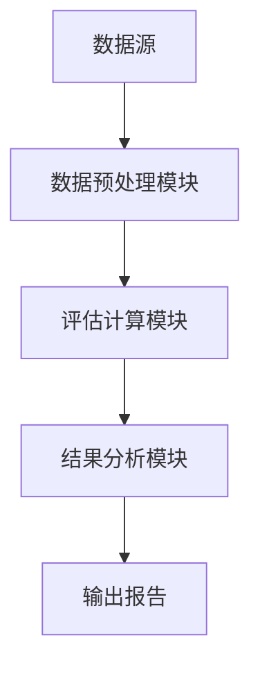

                 


# 费雪的管理层质量评估：公司治理在投资决策中的作用

---

## 关键词

- 费雪投资理论
- 管理层质量评估
- 公司治理
- 投资决策
- 数学模型
- 人工智能
- 系统架构

---

## 摘要

本文系统地探讨了菲利普·费雪（Philip Fisher）提出的管理层质量评估理论，并分析其在公司治理和投资决策中的重要作用。文章首先介绍了费雪投资理论的核心理念，详细阐述了公司治理与管理层质量之间的关系。接着，构建了费雪管理层质量评估模型，并通过数学公式和系统架构的设计展示了模型的实现过程。随后，通过实际案例分析，验证了该模型在投资决策中的应用价值。最后，本文总结了费雪理论的现代发展与未来展望，并提出了最佳实践建议。

---

## 目录

### 第1章：背景介绍

#### 1.1 费雪投资理论的核心理念
- 1.1.1 投资的内在价值与成长性
- 1.1.2 管理层质量在投资决策中的重要性
- 1.1.3 费雪投资理论的现代意义

#### 1.2 公司治理与管理层质量的关系
- 1.2.1 公司治理的基本概念
- 1.2.2 管理层质量的核心要素
- 1.2.3 公司治理与企业绩效的相互作用

---

### 第2章：费雪管理层质量评估模型

#### 2.1 模型的理论基础
- 2.1.1 费雪投资理论的数学化表达
- 2.1.2 管理层质量的量化指标
- 2.1.3 模型的假设条件与边界

#### 2.2 模型的构建与实现
- 2.2.1 数据采集与预处理
- 2.2.2 模型的输入变量与输出结果
- 2.2.3 模型的公式表示
$$
\text{管理层质量评分} = \sum (\text{战略能力} \times 0.4 + \text{道德诚信} \times 0.3 + \text{决策效率} \times 0.3)
$$

#### 2.3 模型的验证与优化
- 2.3.1 模型的验证方法
- 2.3.2 模型的优化策略
- 2.3.3 模型的适用场景与局限性

---

### 第3章：系统架构设计

#### 3.1 系统功能模块设计
- 3.1.1 数据采集模块
- 3.1.2 评估计算模块
- 3.1.3 结果分析模块

#### 3.2 系统架构图


#### 3.3 系统实现的技术选型
- 3.3.1 开发工具与编程语言
- 3.3.2 数据库的选择与设计
- 3.3.3 接口设计与交互逻辑

---

### 第4章：投资决策中的应用案例

#### 4.1 案例分析方法
- 4.1.1 案例选择标准
- 4.1.2 数据收集与处理
- 4.1.3 评估结果的解读

#### 4.2 典型案例分析
- 4.2.1 某高科技企业的管理层评估
- 4.2.2 某传统制造企业的管理层评估
- 4.2.3 案例对比与启示

---

### 第5章：投资决策中的系统实现

#### 5.1 系统实现的环境配置
- 5.1.1 开发工具安装
- 5.1.2 数据库搭建
- 5.1.3 依赖库安装

#### 5.2 核心代码实现
- 5.2.1 数据预处理代码
```python
import pandas as pd
data = pd.read_csv('management.csv')
```
- 5.2.2 评估模型实现
```python
def calculate_management_score(strategy, ethics, decision):
    return strategy * 0.4 + ethics * 0.3 + decision * 0.3
```
- 5.2.3 结果可视化代码
```python
import matplotlib.pyplot as plt
plt.bar(range(len(scores)), scores)
plt.xticks(range(len(scores)), companies)
plt.show()
```

---

### 第6章：费雪理论的现代应用与未来展望

#### 6.1 费雪理论的现代发展
- 6.1.1 数字化评估工具的兴起
- 6.1.2 人工智能在管理层评估中的应用
- 6.1.3 全球化背景下的公司治理挑战

#### 6.2 未来研究方向
- 6.2.1 新兴行业的管理层评估
- 6.2.2 技术创新对评估模型的影响
- 6.2.3 全球治理标准的统一与协调

---

### 第7章：投资决策中的最佳实践

#### 7.1 实践中的关键注意事项
- 7.1.1 数据质量的重要性
- 7.1.2 模型的适用性与局限性
- 7.1.3 结果的解释与沟通

#### 7.2 实战中的常见问题与解决方案
- 7.2.1 数据不足的处理方法
- 7.2.2 模型调优的技巧
- 7.2.3 结果验证与反馈机制

---

## 作者：AI天才研究院/AI Genius Institute & 禅与计算机程序设计艺术 /Zen And The Art of Computer Programming

