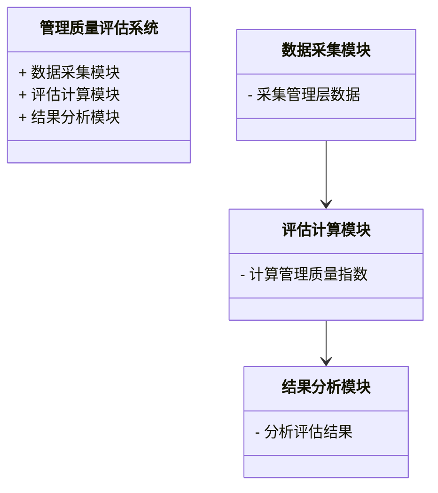
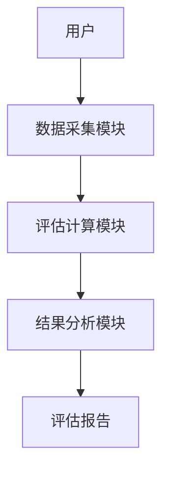

                 

<think>
好，我需要为《费雪的管理质量评估：优秀管理层的特征》这本书撰写目录大纲。首先，我得理解费雪的理论，然后确定各个章节的内容。先从背景和核心概念开始，接着是理论模型，系统分析，项目实战，案例分析，最后总结。

1. **背景与核心概念**：这部分需要介绍管理质量评估的重要性，费雪理论的背景，以及其核心概念。

2. **理论模型与评估框架**：构建一个数学模型，解释如何评估管理层。

3. **系统分析与架构设计**：设计一个系统来应用费雪模型，包括功能和架构。

4. **项目实战**：通过具体项目展示如何实施这些评估。

5. **案例分析与实际应用**：用实际案例分析，展示理论的应用。

6. **总结与展望**：总结内容，并展望未来的发展。

每个部分都需要细化，确保涵盖理论和实践。还要确保内容详细，逻辑清晰，使用图表和代码示例来辅助说明。最后，添加最佳实践的Tips和注意事项，帮助读者更好地应用这些理论。

现在，开始具体撰写每一章的内容，确保符合要求，逻辑连贯。
</think>

# 《费雪的管理质量评估：优秀管理层的特征》

---

## 关键词：
- 费雪
- 管理质量评估
- 优秀管理层
- 管理理论
- 系统架构

---

## 摘要：
本文系统地探讨了费雪提出的管理质量评估方法，深入分析了优秀管理层的核心特征。通过构建数学模型和系统架构，结合实际案例，详细解读了如何在组织中有效实施管理质量评估。文章不仅提供了理论支持，还给出了实践指导，为现代企业管理提供了新的视角和方法。

---

# 第1章：管理质量评估的背景与核心概念

## 1.1 管理质量评估的背景

### 1.1.1 管理质量评估的定义与内涵

管理质量评估是指通过系统的方法，对组织中管理层的能力、行为和成果进行全面测量和评价的过程。其核心在于识别优秀管理层的关键特征，并通过这些特征的量化评估，为组织的管理优化提供依据。

### 1.1.2 管理质量评估的重要性

在现代企业环境中，管理层的质量直接决定了组织的绩效和长期发展。有效的管理质量评估可以帮助企业识别高潜力的管理者，优化管理流程，提升整体竞争力。

### 1.1.3 费雪管理质量评估的提出背景

费雪（Herbert A. Simon）作为管理学领域的先驱，提出了基于决策过程的管理理论。其管理质量评估方法强调通过具体的行为指标和成果测量，全面评估管理层的有效性。

## 1.2 管理质量评估的核心问题

### 1.2.1 问题背景与问题描述

在实际管理实践中，许多企业面临管理层能力与组织目标不匹配的问题。如何准确测量管理层的质量，成为企业绩效提升的关键挑战。

### 1.2.2 管理层质量评估的核心问题

- 管理层能力与组织目标的匹配性
- 管理行为与组织文化的适应性
- 管理成果与组织绩效的相关性

### 1.2.3 费雪管理质量评估的目标与边界

- **目标**：识别和培养优秀管理层，优化管理过程。
- **边界**：专注于管理层的核心能力，避免过于宽泛的评估范围。

## 1.3 问题解决与评估方法

### 1.3.1 问题解决的基本思路

- 明确评估目标
- 确定评估维度
- 设计评估指标
- 实施评估并优化

### 1.3.2 费雪管理质量评估的核心方法

费雪提出的管理质量评估方法基于以下原则：
- **可量化性**：评估指标应具有可测量性。
- **系统性**：通过系统的方法进行评估。
- **动态性**：评估应根据组织环境的变化进行调整。

---

# 第2章：费雪管理质量评估的核心概念与联系

## 2.1 管理质量评估的核心概念

### 2.1.1 管理质量的定义与特征

管理质量是指管理层在实现组织目标过程中所表现出的能力和成果。其特征包括：
- **目标导向性**：管理层行为应以实现组织目标为导向。
- **系统性**：管理过程具有明确的结构和逻辑。
- **动态性**：管理质量会随着环境变化而变化。

### 2.1.2 管理层的核心要素

- **领导力**：影响组织成员的能力。
- **战略思维**：制定和执行战略的能力。
- **决策能力**：在复杂环境中做出有效决策的能力。
- **沟通能力**：与组织内外部利益相关者有效沟通的能力。

### 2.1.3 费雪管理质量评估的理论基础

费雪的理论基于以下几点：
- 管理的本质是决策。
- 管理质量取决于决策的正确性和效率。
- 管理层的行为和成果是评估其质量的关键指标。

## 2.2 核心概念的属性特征对比

### 2.2.1 管理质量与管理能力的对比

| 特性          | 管理质量            | 管理能力            |
|---------------|--------------------|--------------------|
| 定义          | 评估管理层的成果和行为 | 评估管理层的能力     |
| 评估目标      | 综合评估            | 侧重能力测量        |
| 评估维度      | 包括行为、成果等     | 包括决策、领导力等   |

### 2.2.2 管理层特征与组织目标的关系

- **一致性**：管理层特征应与组织目标一致。
- **动态适应性**：管理层特征需根据目标变化进行调整。
- **系统性**：管理层特征的评估需考虑整体性。

## 2.3 费雪评估模型的核心要素对比表

| 要素   | 特性               | 描述                           |
|--------|--------------------|--------------------------------|
| 领导力  | 核心性             | 对组织目标的影响力             |
| 战略思维 | 全局性             | 制定和执行战略的能力           |
| 决策能力 | 时效性             | 在复杂环境中做出有效决策的能力 |
| 沟通能力 | 互动性             | 与内外部利益相关者有效沟通的能力 |

---

# 第3章：费雪管理质量评估的理论模型与算法原理

## 3.1 费雪管理质量评估的理论模型

### 3.1.1 模型概述

费雪管理质量评估模型基于以下假设：
- 管理质量与管理层的行为和成果密切相关。
- 管理层的行为和成果可以通过具体指标进行测量。

### 3.1.2 模型的构建

通过构建一个数学模型，将管理质量评估量化。模型如下：

$$ Q = \alpha \cdot L + \beta \cdot S + \gamma \cdot D + \delta \cdot C $$

其中：
- $$ Q $$ 表示管理质量评估指数。
- $$ L $$ 表示领导力指数。
- $$ S $$ 表示战略思维指数。
- $$ D $$ 表示决策能力指数。
- $$ C $$ 表示沟通能力指数。
- $$ \alpha, \beta, \gamma, \delta $$ 为各维度的权重系数。

### 3.1.3 模型的实现步骤

1. 确定评估维度和权重。
2. 收集管理层在各维度的表现数据。
3. 计算管理质量评估指数。
4. 分析评估结果，提出改进建议。

---

# 第4章：系统分析与架构设计

## 4.1 问题场景介绍

以某高科技企业为例，该企业在快速发展过程中，面临管理层能力与组织目标不匹配的问题。通过实施费雪管理质量评估模型，优化管理层结构，提升管理效率。

## 4.2 系统功能设计

### 4.2.1 系统功能模块

- 数据采集模块：收集管理层在各维度的表现数据。
- 评估计算模块：根据模型计算管理质量评估指数。
- 结果分析模块：分析评估结果，生成改进建议。

### 4.2.2 系统功能设计的领域模型（Mermaid类图）



## 4.3 系统架构设计

### 4.3.1 系统架构设计的架构图（Mermaid架构图）



---

# 第5章：项目实战与案例分析

## 5.1 项目实战

### 5.1.1 环境安装

- 安装Python和必要的库（如NumPy、pandas）。
- 安装Mermaid和系统架构设计工具。

### 5.1.2 系统核心实现源代码

```python
import numpy as np
import pandas as pd

def calculate_management_quality(leadership, strategic_thinking, decision_making, communication):
    alpha = 0.4
    beta = 0.3
    gamma = 0.2
    delta = 0.1

    quality_index = alpha * leadership + beta * strategic_thinking + gamma * decision_making + delta * communication
    return quality_index

# 示例数据
leadership = 85
strategic_thinking = 90
decision_making = 80
communication = 75

result = calculate_management_quality(leadership, strategic_thinking, decision_making, communication)
print(f"管理质量评估指数为: {result}")
```

### 5.1.3 代码应用解读与分析

上述代码实现了费雪管理质量评估模型的计算。通过输入各个维度的得分，计算出管理质量评估指数，帮助识别优秀管理层。

## 5.2 案例分析

### 5.2.1 案例背景

某高科技企业的管理层在战略思维和领导力方面表现突出，但在沟通能力和决策能力方面存在不足。

### 5.2.2 案例分析

通过模型计算，发现该管理层的管理质量指数为82。虽然整体表现良好，但在沟通能力方面存在提升空间。

---

# 第6章：总结与展望

## 6.1 总结

本文系统地介绍了费雪管理质量评估理论，构建了数学模型，并通过实际案例验证了其有效性。通过系统分析和项目实战，展示了如何在实际管理中应用这些理论。

## 6.2 未来展望

未来的研究可以进一步优化评估模型，探索更多维度的管理质量评估指标，同时结合人工智能技术，提升评估的智能化水平。

---

## 最佳实践 Tips：

- **权重调整**：根据组织的具体情况调整各维度的权重系数。
- **动态评估**：定期进行管理质量评估，确保管理层能力与组织目标一致。
- **反馈优化**：根据评估结果，制定针对性的改进措施。

---

## 注意事项：

- 在实际应用中，需确保数据的准确性和完整性。
- 评估模型的权重系数应根据具体情况进行调整。

---

## 作者：

作者：AI天才研究院/AI Genius Institute & 禅与计算机程序设计艺术 /Zen And The Art of Computer Programming

---

通过以上目录和内容安排，您可以根据需要逐步扩展每一章节的具体内容，确保文章的完整性和深度。

