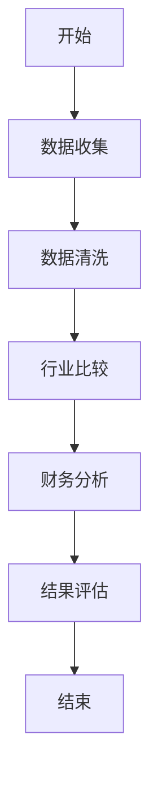
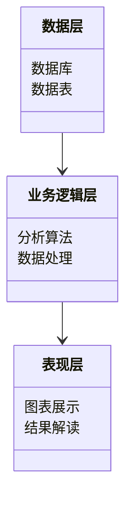

                 


# 费雪的行业分析方法

## 关键词
费雪、行业分析、投资分析、行业评估、财务指标

## 摘要
费雪的行业分析方法是一种系统性评估行业投资潜力的方法，通过分析行业结构、竞争态势和财务指标，识别具备持续增长潜力的行业。本文将逐步解析费雪方法的背景、原理、算法流程，并通过案例展示其应用，帮助投资者有效评估行业投资价值。

---

# 第一部分：行业分析背景与概述

## 第1章：行业分析概述

### 1.1 费雪行业分析方法的起源
- **投资分析的历史演变**：从基本面分析到行业分析的演变历程。
- **费雪方法的核心思想**：关注行业长期增长潜力，而非短期波动。

### 1.2 行业分析的重要性
- **在投资决策中的作用**：行业分析是评估企业投资价值的基础。
- **费雪方法的独特价值**：通过识别行业潜力，优化投资组合。

### 1.3 费雪分析方法的基本框架
- **核心要素**：行业生命周期、竞争结构、财务表现。
- **适用范围**：适用于长期投资决策。

---

# 第二部分：行业分析的核心概念与原理

## 第2章：行业分析的核心概念

### 2.1 行业分析的定义与特征
- **行业的定义**：一组企业提供类似产品或服务的企业集合。
- **关键属性**：市场结构、竞争态势、成长潜力。

### 2.2 费雪分析方法的原理
- **数据驱动分析**：利用行业数据和财务指标评估行业健康度。
- **关键成功因素识别**：识别影响行业长期增长的关键因素。

### 2.3 行业分析与财务分析的结合
- **财务指标的应用**：如PE、ROE等。
- **独特视角**：将行业分析与企业分析相结合。

---

# 第三部分：费雪分析方法的算法原理

## 第3章：费雪分析方法的步骤与流程

### 3.1 数据收集与处理
- **数据来源**：政府报告、行业报告、企业财报。
- **数据清洗**：处理缺失值、异常值。

### 3.2 行业比较与评估
- **横向比较**：不同行业的PE、ROE对比。
- **纵向分析**：行业历史数据趋势分析。

### 3.3 财务指标分析
- **关键指标**：如PE（市盈率）、ROE（净资产收益率）。
- **指标计算与评估**：通过公式计算并解读结果。

## 第4章：算法流程图



---

# 第四部分：系统分析与架构设计

## 第5章：系统分析框架

### 5.1 系统架构设计
- **数据层**：存储行业数据。
- **业务逻辑层**：执行分析算法。
- **表现层**：展示分析结果。

### 5.2 系统交互设计
- **用户界面**：简洁直观。
- **交互流程图**：展示用户操作流程。

## 第6章：系统架构图



---

# 第五部分：项目实战

## 第7章：项目实战分析

### 7.1 项目介绍
- **项目背景**：选择一个具体行业进行分析。
- **项目目标**：评估行业投资潜力。

### 7.2 核心实现
- **代码实现**：使用Python进行数据处理和分析。
- **代码示例**：

```python
import pandas as pd

# 数据收集
data = pd.read_csv('industry_data.csv')

# 数据清洗
data.dropna(inplace=True)

# 行业比较
pe_ratio = data['PE'].mean()
```

### 7.3 案例分析
- **行业选择**：假设选择科技行业。
- **分析步骤**：收集数据、清洗、计算PE、ROE等指标。
- **结果解读**：评估行业潜力。

---

# 第六部分：最佳实践与总结

## 第8章：总结与建议

### 8.1 最佳实践
- **数据源选择**：确保数据的准确性和及时性。
- **模型调整**：根据市场变化动态调整分析模型。
- **持续学习**：关注行业动态和新技术的发展。

### 8.2 注意事项
- 避免过度依赖单一指标。
- 结合宏观经济因素进行综合分析。

### 8.3 未来研究方向
- 结合大数据和机器学习优化行业分析。
- 探索新的行业指标和分析方法。

---

# 结语

费雪的行业分析方法为投资者提供了系统化评估行业潜力的工具。通过本文的详细讲解，读者可以掌握从数据收集到结果解读的全过程，为投资决策提供有力支持。

---

# 作者：AI天才研究院/AI Genius Institute & 禅与计算机程序设计艺术 /Zen And The Art of Computer Programming

