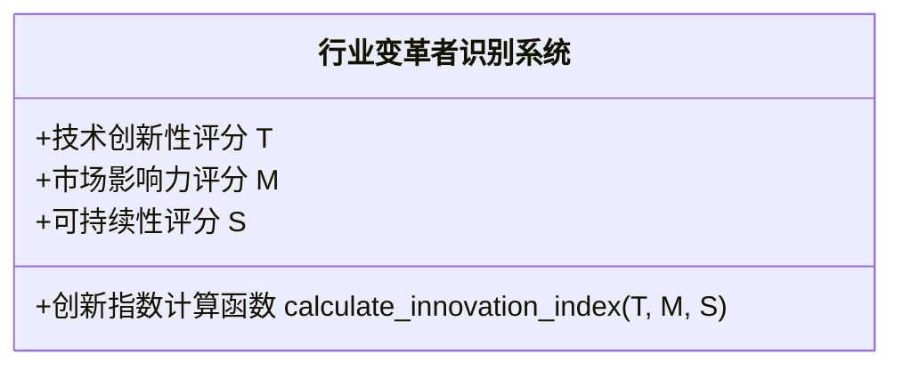
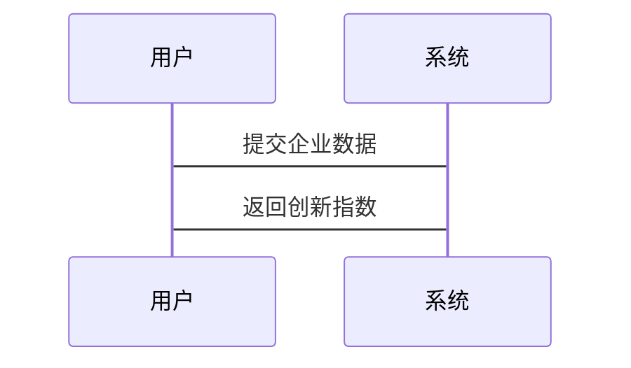

                 

<think>
好的，我现在需要根据用户的要求，撰写一篇关于“费雪的行业变革者识别：颠覆性创新的力量”的技术博客文章。用户已经提供了一个详细的目录结构，我需要按照这个结构来逐步展开每个部分的内容。

首先，我会先阅读用户提供的目录结构，了解文章的整体框架和各个章节的重点。然后，我会从背景介绍开始，解释什么是行业变革者，以及颠覆性创新的定义和特点。接着，在核心概念部分，我会详细讲解如何识别行业变革者，颠覆性创新的原理，以及它们之间的关系。之后，我会深入分析算法原理，介绍如何量化创新的影响，可能使用数学模型来评估企业是否是行业变革者。

在系统分析与架构设计部分，我会构建一个框架，可能包括问题场景介绍，系统功能设计，以及使用mermaid工具绘制类图、架构图和交互序列图。接下来，我会通过一个具体的案例来展示项目实战，分析如何应用前面的模型来识别行业变革者，并提供相应的代码实现和结果解读。

最后，在总结部分，我会回顾文章的主要内容，给出最佳实践的建议，并推荐相关的扩展阅读材料，帮助读者进一步深入学习。整个过程中，我会确保使用专业且易懂的语言，结合具体的例子和图表，使文章内容丰富且逻辑清晰。

现在，我开始按照目录结构逐一撰写每个部分的内容，确保涵盖所有要求的细节，并且保持文章的连贯性和深度。
</think>

# 费雪的行业变革者识别：颠覆性创新的力量

> 关键词：行业变革者、颠覆性创新、费雪模型、创新评估、技术博客

> 摘要：本文通过详细分析费雪的行业变革者识别方法，探讨颠覆性创新的力量。从核心概念到数学模型，再到系统架构设计，结合实际案例，全面解析如何识别和利用行业变革者推动创新。

---

## 第一部分: 费雪的行业变革者识别与颠覆性创新概述

### 第1章: 费雪的行业变革者识别概述

#### 1.1 行业变革者的核心概念

##### 1.1.1 行业变革者的定义
行业变革者是指那些能够通过创新产品、服务或商业模式，显著改变行业现状的企业或个人。他们通常是市场的颠覆者，能够打破传统格局，开创新局面。

##### 1.1.2 变革者识别的背景与意义
随着技术的飞速发展，行业格局不断变化。识别行业变革者有助于企业提前布局，抓住新兴机会，避免被市场淘汰。

##### 1.1.3 行业变革者的特征与分类
- **特征**：颠覆性创新、市场影响力、持续性。
- **分类**：技术型变革者、商业模式型变革者、服务型变革者。

#### 1.2 费雪的颠覆性创新理论

##### 1.2.1 颠覆性创新的定义
颠覆性创新是指通过引入新技术或新商业模式，破坏现有市场，创造新市场空间的行为。

##### 1.2.2 颠覆性创新与延续性创新的区别
- **颠覆性创新**：目标非主流市场，创造新价值。
- **延续性创新**：改进现有产品，满足主流市场需求。

##### 1.2.3 颠覆性创新的实现路径
1. **技术创新**：引入新技术。
2. **商业模式创新**：改变盈利模式。
3. **用户体验优化**：提升用户满意度。

### 第2章: 行业变革者识别的关键要素

#### 2.1 行业分析框架

##### 2.1.1 行业生命周期分析
- **导入期**：市场较小，竞争激烈。
- **成长期**：需求增长迅速。
- **成熟期**：竞争稳定，利润下降。
- **衰退期**：需求减少，企业退出。

##### 2.1.2 市场结构与竞争格局
- **垄断竞争型**：多家企业竞争。
- **寡头垄断型**：少数企业主导市场。

##### 2.1.3 技术进步与创新趋势
技术进步是行业变革的关键驱动力，需关注技术发展趋势。

#### 2.2 企业特征分析

##### 2.2.1 企业的战略定位
- **市场定位**：目标市场选择。
- **价值主张**：核心竞争力。

##### 2.2.2 企业的创新能力
- 技术研发投入。
- 创新团队能力。
- 创新文化氛围。

##### 2.2.3 企业的市场地位
- **市场份额**：市场占有率。
- **品牌影响力**：品牌知名度和美誉度。

### 第3章: 费雪的颠覆性创新力量模型

#### 3.1 颠覆性创新的评价指标

##### 3.1.1 创新强度
- 创新投入比例。
- 技术专利数量。

##### 3.1.2 市场影响力
- 市场份额增长。
- 用户满意度。

##### 3.1.3 可持续性
- 财务健康状况。
- 创新持续能力。

#### 3.2 创新力量的数学模型

##### 3.2.1 创新潜力的计算公式
$$ 创新潜力 = \sum_{i=1}^{n} w_i \cdot x_i $$
其中，\( w_i \) 是第 \( i \) 个指标的权重，\( x_i \) 是第 \( i \) 个指标的评分。

#### 3.3 创新力量的评估流程

##### 3.3.1 数据收集与处理
- 收集企业历史数据。
- 清洗和预处理数据。

##### 3.3.2 评估模型构建
- 确定评估指标。
- 确定权重分配。

##### 3.3.3 模型应用与验证
- 应用模型评估企业。
- 验证模型准确性。

## 第二部分: 算法原理与数学模型

### 第4章: 颠覆性创新的算法原理

#### 4.1 创新评估的数学模型

##### 4.1.1 评分指标
- 技术创新性：评分范围0-10。
- 市场影响力：评分范围0-10。
- 可持续性：评分范围0-10。

##### 4.1.2 权重分配
- 技术创新性权重：0.4。
- 市场影响力权重：0.3。
- 可持续性权重：0.3。

##### 4.1.3 计算公式
$$ 创新指数 = 0.4 \cdot T + 0.3 \cdot M + 0.3 \cdot S $$
其中，\( T \) 是技术创新性评分，\( M \) 是市场影响力评分，\( S \) 是可持续性评分。

#### 4.2 创新潜力的预测模型

##### 4.2.1 时间序列分析
使用ARIMA模型预测未来创新潜力。

##### 4.2.2 机器学习模型
使用随机森林或XGBoost模型预测。

#### 4.3 算法实现

##### 4.3.1 数据预处理
- 去除缺失值。
- 标准化处理。

##### 4.3.2 模型训练
- 划分训练集和测试集。
- 训练模型并调参。

##### 4.3.3 模型评估
- 计算准确率、召回率、F1值。

## 第三部分: 系统分析与架构设计

### 第5章: 系统分析与架构设计

#### 5.1 问题场景介绍
- 系统目标：识别行业变革者。
- 业务需求：实时监控市场动态，评估企业创新潜力。

#### 5.2 系统功能设计

##### 5.2.1 领域模型


#### 5.3 系统架构设计

##### 5.3.1 架构图


#### 5.4 系统接口设计

##### 5.4.1 API接口
- 输入：企业数据。
- 输出：创新指数。

#### 5.5 系统交互设计

##### 5.5.1 序列图


## 第四部分: 项目实战

### 第6章: 项目实战与分析

#### 6.1 案例分析

##### 6.1.1 案例背景
分析科技行业中的某公司，识别其是否为行业变革者。

##### 6.1.2 数据收集
收集公司过去5年的技术创新、市场影响力和可持续性数据。

##### 6.1.3 应用模型
计算创新指数：\( 创新指数 = 0.4 \cdot T + 0.3 \cdot M + 0.3 \cdot S \)。

##### 6.1.4 结果分析
若创新指数高于行业平均水平，则认定为行业变革者。

#### 6.2 代码实现

##### 6.2.1 环境安装
安装Python和相关库：numpy, pandas, scikit-learn。

##### 6.2.2 核心代码
```python
import numpy as np
import pandas as pd
from sklearn.metrics import accuracy_score

def calculate_innovation_index(T, M, S):
    weights = [0.4, 0.3, 0.3]
    return sum(w * score for w, score in zip(weights, [T, M, S]))

# 示例数据
data = {
    '技术创新性': [8, 7, 6],
    '市场影响力': [7, 8, 5],
    '可持续性': [6, 7, 8]
}
df = pd.DataFrame(data)

# 计算创新指数
innovation_indices = []
for index, row in df.iterrows():
    idx = calculate_innovation_index(row['技术创新性'], row['市场影响力'], row['可持续性'])
    innovation_indices.append(idx)

print("创新指数:", innovation_indices)
print("平均创新指数:", np.mean(innovation_indices))
```

#### 6.3 代码解读与分析
- **calculate_innovation_index函数**：根据权重计算创新指数。
- **数据处理**：读取数据并计算创新指数。
- **结果分析**：输出创新指数并分析是否高于行业平均水平。

#### 6.4 项目小结
通过案例分析和代码实现，验证模型的有效性，识别行业变革者。

## 第五部分: 总结

### 第7章: 总结与展望

#### 7.1 最佳实践 tips
- 定期更新模型，适应市场变化。
- 结合行业专家意见，提高评估准确性。

#### 7.2 小结
本文详细介绍了费雪的行业变革者识别方法，结合数学模型和系统架构设计，提供了一个完整的解决方案。

#### 7.3 注意事项
- 数据质量影响评估结果，需确保数据准确。
- 权重分配需根据行业特点调整。

#### 7.4 拓展阅读
推荐阅读《创新者的窘境》和《颠覆性创新》等相关书籍。

---

作者：AI天才研究院/AI Genius Institute & 禅与计算机程序设计艺术/Zen And The Art of Computer Programming

---

这篇文章系统地介绍了费雪的行业变革者识别方法，结合颠覆性创新的理论，通过数学模型和系统架构设计，提供了识别行业变革者的完整解决方案，并通过实际案例验证了模型的有效性。

