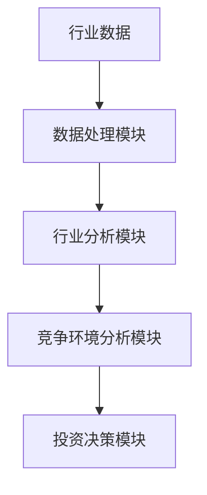

                 


# 费雪的行业研究方法：了解公司的竞争环境

## 关键词：行业研究，竞争环境，费雪分析法，系统分析，数学模型

## 摘要：本文深入探讨了费雪的行业研究方法，分析了其核心概念、系统架构和算法原理。通过实际案例分析，展示了如何将费雪的理论应用于投资决策，帮助投资者更好地理解公司的竞争环境，做出明智的投资决策。

---

## 第一部分: 费雪的行业研究方法概述

### 第1章: 行业研究的重要性

#### 1.1 行业研究的基本概念

##### 1.1.1 行业研究的定义

行业研究是对特定行业内的企业、市场、竞争环境、发展趋势等进行全面分析的过程。它旨在帮助企业或投资者更好地理解行业动态，制定有效的战略决策。

##### 1.1.2 行业研究的核心作用

- **识别行业趋势**：分析行业的增长潜力、周期性变化和未来发展方向。
- **评估竞争环境**：了解行业内主要竞争者的优势和劣势，帮助企业制定竞争策略。
- **支持投资决策**：投资者通过行业研究可以评估行业的投资价值，选择具有潜力的企业进行投资。

##### 1.1.3 行业研究的适用场景

- **企业战略规划**：帮助企业制定市场进入、产品开发等战略。
- **投资决策**：投资者用于评估企业的投资价值。
- **政策制定**：政府用于制定行业发展政策。

#### 1.2 费雪的基本面分析方法

##### 1.2.1 费雪分析法的起源

菲利普·费雪（Philip Fisher）是投资领域的先驱，他提出的基本面分析方法强调长期投资和对公司基本面的深入研究。他的方法不同于传统的市盈率估值，而是更关注公司的成长性和竞争优势。

##### 1.2.2 费雪分析法的核心思想

- **长期投资**：关注企业的长期增长潜力，而非短期价格波动。
- **竞争优势**：分析公司的竞争优势，如技术、品牌、市场份额等。
- **管理团队**：重视公司的管理团队，认为优秀的管理是企业成功的关键。

##### 1.2.3 费雪分析法与现代投资分析的结合

现代投资分析结合了费雪的理论和新的工具，如财务指标分析、行业趋势分析等，使行业研究更加系统化和数据化。

---

### 第2章: 费雪行业研究的核心概念

#### 2.1 行业结构与竞争环境

##### 2.1.1 行业结构的定义

行业结构是指行业内企业的组织形式和竞争格局。常见的行业结构包括完全竞争、垄断竞争、寡头垄断和完全垄断。

##### 2.1.2 行业结构的分类

- **完全竞争**：行业内有许多企业，产品同质化，价格由市场决定。
- **垄断竞争**：行业内企业数量较多，产品存在差异。
- **寡头垄断**：行业内企业数量有限，市场由少数几家企业控制。
- **完全垄断**：市场由单一企业控制，没有替代品。

##### 2.1.3 行业结构对竞争环境的影响

行业结构决定了企业的竞争策略和盈利能力。例如，在完全竞争行业中，企业难以通过差异化竞争获得优势，而在垄断竞争行业中，企业可以通过产品差异化来提高市场份额。

#### 2.2 竞争环境分析框架

##### 2.2.1 竞争环境的构成要素

- **主要竞争对手**：行业内主要的企业及其市场份额。
- **市场进入壁垒**：行业内新进入者的难度，如专利、品牌忠诚度等。
- **市场需求**：市场的规模、增长速度和消费者偏好。

##### 2.2.2 竞争环境的分析维度

- **市场集中度**：行业内主要企业的市场份额集中程度。
- **竞争强度**：行业内竞争的激烈程度。
- **替代品威胁**：替代品对企业的影响。

##### 2.2.3 竞争环境的评估指标

- **市场份额**：企业占市场的比例。
- **利润率**：企业的盈利能力。
- **增长潜力**：行业的未来增长空间。

#### 2.3 费雪分析法的核心要素

##### 2.3.1 费雪分析法的三大支柱

- **行业分析**：了解行业的整体情况和竞争格局。
- **公司分析**：分析企业的财务状况、竞争优势和管理团队。
- **投资决策**：基于以上分析做出投资决策。

##### 2.3.2 费雪分析法的逻辑关系

行业分析 → 公司分析 → 投资决策。

##### 2.3.3 费雪分析法的数学模型

费雪分析法的核心是通过分析企业的ROE（净资产收益率）来评估其盈利能力。公式如下：

$$
ROE = \frac{\text{净利润}}{\text{股东权益}}
$$

---

## 第二部分: 费雪行业研究方法的系统分析

### 第3章: 行业研究的系统分析框架

#### 3.1 行业研究的系统分析方法

##### 3.1.1 系统分析的基本概念

系统分析是一种通过分析系统的各个组成部分及其相互关系，以达到优化系统整体性能的方法。

##### 3.1.2 系统分析在行业研究中的应用

- **行业趋势分析**：通过系统分析预测行业的未来发展趋势。
- **竞争优势分析**：通过系统分析识别企业的竞争优势。

##### 3.1.3 系统分析的步骤与流程

1. **问题定义**：明确分析的目标。
2. **数据收集**：收集行业的相关数据。
3. **模型建立**：建立系统的数学模型。
4. **分析与优化**：通过模型分析系统的问题并提出优化方案。
5. **验证与实施**：验证模型的准确性并实施优化方案。

#### 3.2 行业研究的系统架构设计

##### 3.2.1 行业研究的系统架构图



##### 3.2.2 系统架构的设计原则

- **模块化**：系统分为数据处理、行业分析、竞争环境分析和投资决策四个模块。
- **可扩展性**：系统应支持未来数据的扩展和功能的增加。
- **可维护性**：系统设计应便于维护和升级。

##### 3.2.3 系统架构的实现方式

- **数据处理模块**：负责收集和清洗行业数据。
- **行业分析模块**：对行业数据进行初步分析，识别行业趋势。
- **竞争环境分析模块**：分析行业内主要竞争者的优势和劣势。
- **投资决策模块**：基于前几个模块的分析结果，做出投资决策。

#### 3.3 行业研究的系统接口设计

##### 3.3.1 系统接口的定义

系统接口是系统与其他模块或外部系统交互的接口。

##### 3.3.2 系统接口的设计原则

- **明确性**：接口的功能和参数应明确。
- **一致性**：接口的设计应与系统整体设计一致。
- **可测试性**：接口应支持测试，确保其功能正常。

##### 3.3.3 系统接口的实现方式

- **数据接口**：通过API接口获取行业数据。
- **用户界面**：提供友好的用户界面，方便用户输入和查看结果。

---

### 第4章: 行业研究的算法原理

#### 4.1 费雪分析法的算法原理

##### 4.1.1 费雪分析法的数学模型

费雪分析法的核心是通过分析企业的ROE来评估其盈利能力。公式如下：

$$
ROE = \frac{\text{净利润}}{\text{股东权益}}
$$

##### 4.1.2 费雪分析法的算法流程

1. **收集数据**：收集企业的财务数据，包括净利润和股东权益。
2. **计算ROE**：使用上述公式计算企业的ROE。
3. **分析结果**：根据ROE的高低判断企业的盈利能力。

##### 4.1.3 费雪分析法的实现代码

```python
def calculate_roe(net_profit, shareholders_equity):
    return net_profit / shareholders_equity

# 示例数据
net_profit = 1000000  # 净利润
shareholders_equity = 5000000  # 股东权益

ro

