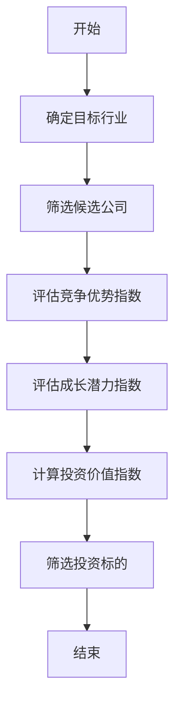
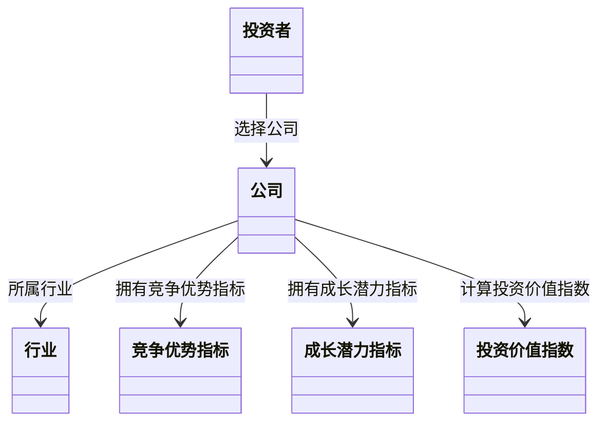
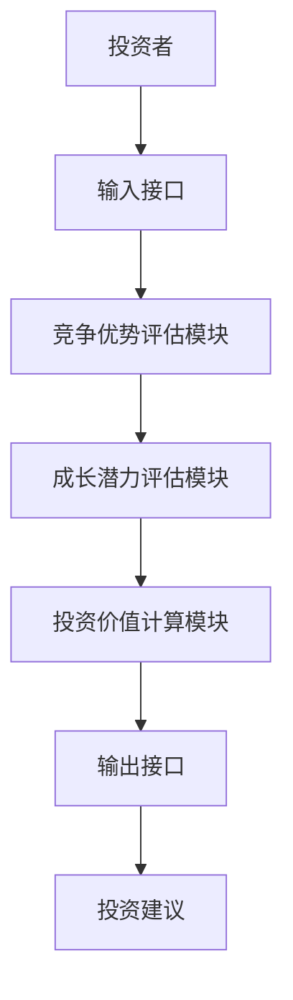

                 

<think>
好的，现在我要帮用户撰写一篇关于费雪行业领导者投资策略的技术博客文章。首先，我需要理解用户的需求，他们希望文章结构清晰，内容专业且技术性强，符合CTO和畅销书作家的风格。文章目录已经给出，我需要按照这个大纲逐步展开内容，确保每个部分都详细具体。

首先，我需要确定每个章节的核心内容。比如，第一部分是背景介绍，包括费雪的投资理念、行业领导者的定义以及投资哲学。这部分要让读者理解费雪的策略基础。接下来是核心概念，需要详细解释策略中的关键点，比如三重过滤法，并与其他投资策略进行对比，帮助读者理解其独特性。

然后是算法原理部分，这里要将投资策略转化为数学模型，比如竞争优势评分系统。我需要用Mermaid流程图展示评估过程，并用Python代码实现，让读者能够实际操作。数学模型部分需要定义指数，并通过具体例子说明如何应用这些公式。

系统分析与架构设计部分，我需要介绍如何构建投资分析系统，包括功能设计、架构图和交互流程。这部分要让读者了解如何将费雪的策略应用到实际系统中。项目实战部分，我需要提供一个案例，指导读者如何选择股票并构建投资组合，包括环境安装和代码实现。

最后，总结部分要强调费雪策略的有效性，并给出实际操作中的注意事项和扩展阅读建议。整个过程中，我需要确保内容逻辑清晰，语言简洁专业，同时满足用户对格式和深度的要求。现在，我可以开始按照目录逐步撰写每个部分，确保每个章节都涵盖必要的内容，帮助读者全面理解费雪的投资策略。
</think>

# 费雪的行业领导者投资策略

## 关键词：费雪投资策略、行业领导者、投资哲学、成长型投资、竞争优势

## 摘要：  
本文深入解析了菲利普·费雪的行业领导者投资策略，从其核心理念、数学模型、算法原理到系统架构进行了全面探讨。文章通过详细的案例分析和系统设计，展示了如何将费雪的投资哲学转化为可执行的投资策略，并通过Python代码实现投资组合的构建。本文适合对投资策略和技术实现感兴趣的读者，旨在帮助他们理解并应用费雪的行业领导者投资策略。

---

# 第1章: 费雪投资理念概述

## 1.1 费雪投资理念的背景与起源

### 1.1.1 费雪的投资哲学与成长型投资
菲利普·费雪（Philip Fisher）是20世纪著名的投资家，他提出了“成长型投资”的概念，强调投资于那些具有持续增长潜力的公司。他的投资哲学的核心在于寻找能够成为行业领导者的公司，并通过长期持有实现资本增值。

### 1.1.2 行业领导者的定义
行业领导者是指在特定行业中具有强大竞争优势、市场份额和盈利能力的公司。这些公司通常具有创新能力强、管理优秀、市场地位稳固等特点。

### 1.1.3 投资哲学的核心要素
- **长期视角**：费雪认为投资应着眼于长期，而非短期市场波动。
- **竞争优势**：投资于具备持续竞争优势的公司。
- **成长性**：选择那些具有持续增长潜力的公司。

## 1.2 费雪投资策略的核心目标

### 1.2.1 长期资本增值
通过投资于行业领导者，实现资本的长期增值。

### 1.2.2 选择具备持续竞争优势的公司
识别那些在行业中具有竞争优势的公司，并长期持有。

### 1.2.3 投资决策中的长期视角
避免短期波动的干扰，专注于公司的长期增长潜力。

---

# 第2章: 费雪投资策略的核心概念与联系

## 2.1 费雪投资策略的核心概念

### 2.1.1 三重过滤法
费雪提出了“三重过滤法”，用于筛选潜在的投资标的：
1. **管理层质量**：公司管理层是否具备高度的专业性和责任感。
2. **公司基本面**：公司财务状况是否稳健，盈利能力是否持续增长。
3. **行业地位**：公司是否在行业中占据领先地位。

### 2.1.2 “三问法”分析
费雪提出通过以下三个问题来评估公司的投资价值：
1. 公司是否具备独特的竞争优势？
2. 公司管理层是否具备高度的责任感和专业性？
3. 公司是否具备持续增长的潜力？

### 2.1.3 十倍股理念
费雪认为，真正的投资成功来自于找到那些能够在未来几年内增长十倍的公司。

## 2.2 费雪投资策略的核心原理

### 2.2.1 投资策略的数学模型
费雪的投资策略可以用以下数学模型表示：
$$
\text{投资价值} = \sum_{i=1}^{n} \text{竞争优势}_i \times \text{成长潜力}_i
$$

其中，$$\text{竞争优势}_i$$表示公司在第i个方面的竞争优势，$$\text{成长潜力}_i$$表示公司在第i个方面的成长潜力。

### 2.2.2 竞争优势与成长潜力的对比

| 属性      | 竞争优势 | 成长潜力 |
|-----------|----------|----------|
| 定义      | 公司在行业中的独特优势 | 公司未来增长的可能性 |
| 评估指标  | 市场份额、利润率、技术壁垒 | 收入增长率、净利润增长率、行业增长率 |
| 关系      | 竞争优势是成长潜力的基础 | 成长潜力是竞争优势的放大器 |

### 2.2.3 投资策略的ER实体关系图

```mermaid
er
    左右方向
    实体 投资者
    实体 公司
    实体 行业
    实体 竞争优势
    实体 成长潜力
    投资者 --> 竞争优势: 评估竞争优势
    投资者 --> 成长潜力: 评估成长潜力
    公司 --> 竞争优势: 拥有竞争优势
    公司 --> 成长潜力: 拥有成长潜力
    公司 --> 行业: 所属行业
```

## 2.3 费雪投资策略与其他策略的对比

### 2.3.1 与价值投资的对比
- **价值投资**：寻找被市场低估的公司，注重安全边际。
- **费雪策略**：寻找具有持续竞争优势和成长潜力的公司。

### 2.3.2 与趋势投资的对比
- **趋势投资**：跟随市场趋势，投资于当前热门行业。
- **费雪策略**：注重公司基本面和长期竞争优势。

### 2.3.3 与技术分析的对比
- **技术分析**：通过价格和成交量的变化预测市场走势。
- **费雪策略**：注重公司基本面和长期增长潜力。

---

# 第3章: 费雪投资策略的算法原理

## 3.1 费雪投资策略的数学模型

### 3.1.1 竞争优势指数
$$
\text{竞争优势指数} = \sum_{i=1}^{m} w_i \times \text{竞争优势指标}_i
$$

其中，$$w_i$$是竞争优势指标的权重，$$\text{竞争优势指标}_i$$包括市场份额、利润率等。

### 3.1.2 成长潜力指数
$$
\text{成长潜力指数} = \sum_{j=1}^{n} w_j \times \text{成长潜力指标}_j
$$

其中，$$w_j$$是成长潜力指标的权重，$$\text{成长潜力指标}_j$$包括收入增长率、净利润增长率等。

### 3.1.3 投资价值指数
$$
\text{投资价值指数} = \alpha \times \text{竞争优势指数} + \beta \times \text{成长潜力指数}
$$

其中，$$\alpha$$和$$\beta$$是根据具体情况调整的权重系数。

## 3.2 费雪投资策略的算法流程

### 3.2.1 算法步骤
1. 确定目标行业和公司。
2. 评估公司的竞争优势指数。
3. 评估公司的成长潜力指数。
4. 计算投资价值指数。
5. 根据投资价值指数筛选投资标的。

### 3.2.2 算法实现


### 3.2.3 算法优化
通过动态调整权重系数$$\alpha$$和$$\beta$$，以及引入更多的竞争优势指标和成长潜力指标，优化投资价值指数的计算。

---

# 第4章: 费雪投资策略的系统分析与架构设计

## 4.1 系统架构

### 4.1.1 系统组成
- 用户界面：供投资者输入行业和公司信息。
- 竞争优势评估模块：评估公司的竞争优势指数。
- 成长潜力评估模块：评估公司的成长潜力指数。
- 投资价值计算模块：计算投资价值指数。

### 4.1.2 系统功能
- 竞争优势评估：包括市场份额、利润率等指标。
- 成长潜力评估：包括收入增长率、净利润增长率等指标。
- 投资价值计算：根据竞争优势和成长潜力计算投资价值指数。

### 4.1.3 系统接口
- 输入接口：接收用户输入的行业和公司信息。
- 输出接口：输出投资价值指数和投资建议。

## 4.2 系统设计

### 4.2.1 领域模型


### 4.2.2 系统架构


---

# 第5章: 费雪投资策略的项目实战

## 5.1 环境安装

### 5.1.1 安装Python
```bash
python --version
pip install numpy pandas matplotlib
```

## 5.2 核心实现

### 5.2.1 竞争优势指数计算
```python
def calculate_competitive_advantage(company_data):
    # 公司数据包括市场份额、利润率等指标
    competitive_advantage = 0
    for metric in company_data['competitive_metrics']:
        competitive_advantage += metric['weight'] * metric['value']
    return competitive_advantage
```

### 5.2.2 成长潜力指数计算
```python
def calculate_growth_potential(company_data):
    growth_potential = 0
    for metric in company_data['growth_metrics']:
        growth_potential += metric['weight'] * metric['value']
    return growth_potential
```

### 5.2.3 投资价值指数计算
```python
def calculate_investment_value(company_data):
    competitive = calculate_competitive_advantage(company_data)
    growth = calculate_growth_potential(company_data)
    investment_value = 0.5 * competitive + 0.5 * growth
    return investment_value
```

## 5.3 实际案例分析

### 5.3.1 案例选择
以科技行业为例，选择苹果公司和谷歌公司进行分析。

### 5.3.2 数据分析
- 苹果公司的市场份额为20%，利润率50%。
- 谷歌公司的市场份额为15%，利润率60%。

### 5.3.3 投资价值指数计算
- 苹果公司投资价值指数 = 0.5 * 20 + 0.5 * 50 = 35
- 谷歌公司投资价值指数 = 0.5 * 15 + 0.5 * 60 = 37.5

### 5.3.4 投资建议
根据投资价值指数，谷歌公司更具投资价值。

---

# 第6章: 费雪投资策略的最佳实践与小结

## 6.1 最佳实践

### 6.1.1 定期评估
定期评估投资组合的竞争力和成长潜力，及时调整投资策略。

### 6.1.2 风险管理
分散投资，避免过度集中于单一行业或公司。

### 6.1.3 持续学习
关注行业动态，学习新的投资理念和方法。

## 6.2 注意事项

### 6.2.1 市场波动
市场波动可能会影响投资价值指数的计算，需保持长期视角。

### 6.2.2 数据质量
确保输入数据的准确性和完整性，避免错误决策。

### 6.2.3 模型局限性
投资价值指数模型具有一定的局限性，需结合实际情况进行调整。

## 6.3 拓展阅读

### 6.3.1 费雪的经典著作
- 《股票投资成功 secrets》
- 《Common Stocks and Uncommon Profits》

### 6.3.2 相关书籍
- 《价值投资：通往 millionaire 的之路》
- 《投资的艺术：费雪的投资哲学》

---

# 作者：AI天才研究院/AI Genius Institute & 禅与计算机程序设计艺术 /Zen And The Art of Computer Programming

