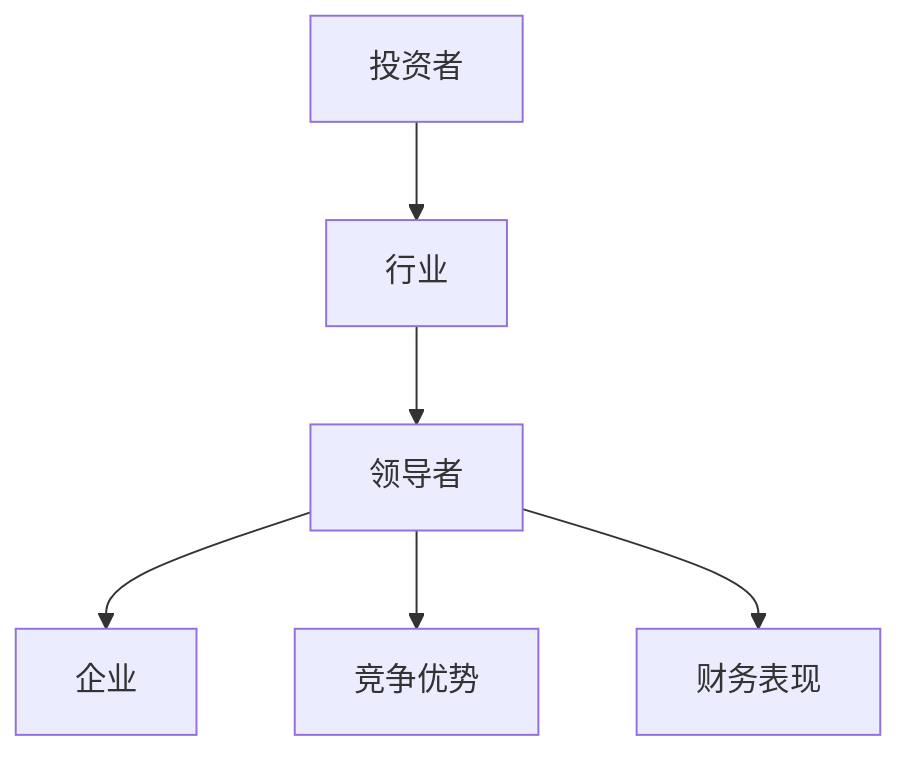
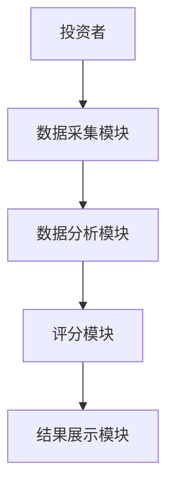

                 

<think>
好，我需要根据用户的要求，撰写一篇关于费雪行业领导者理论的长篇技术博客文章。用户已经给出了详细的目录大纲，我需要按照这个大纲逐步展开每个部分，确保内容详实、逻辑清晰，并符合技术博客的风格。

首先，文章的标题是《费雪的行业领导者理论：投资行业龙头》，关键词包括：费雪行业领导者理论、投资、行业龙头、企业分析、财务指标、竞争优势。摘要部分需要简明扼要地概括文章的核心内容，介绍费雪的理论，分析行业领导者的特征和竞争优势，并结合数学模型和实际案例，为投资者提供方法论。

接下来，按照目录大纲，第一部分是背景介绍，包括理论的起源、核心观点、行业领导者的定义与特征，以及竞争优势分析。这部分需要详细解释每个概念，并举例说明，让读者理解为什么投资行业龙头是有价值的。

第二部分是核心概念与联系，分析行业领导者的特征，并通过表格和ER图展示不同行业龙头企业的对比。这部分需要用清晰的表格和图表，帮助读者更好地理解概念之间的关系。

第三部分是算法原理，介绍评估指标的选择和加权评分模型。这里需要详细解释每个指标的计算方法，并通过mermaid流程图展示评估过程。同时，用Python代码示例展示如何实现这些模型，确保读者能够实际应用。

第四部分是数学模型，给出具体的评分公式，并通过案例分析解释如何计算和应用这些公式。这部分需要使用Latex公式，展示评分模型的数学基础。

第五部分是系统分析与架构设计，构建一个投资决策支持系统。这部分需要介绍系统的功能模块、架构设计，以及数据流图，展示系统如何运作。

第六部分是项目实战，提供具体的代码实现和实际案例分析，帮助读者理解如何将理论应用到实际投资中。

最后，总结与展望部分回顾理论的应用，并讨论实际操作中的注意事项和未来研究方向。

在撰写过程中，需要注意使用技术语言，但保持通俗易懂，避免过于复杂的术语，同时确保内容专业且有深度。每个部分都要有详细的解释和实际案例，帮助读者更好地理解和应用费雪的理论。

现在，我将按照这个思路逐步展开，确保每个部分都详尽且符合要求。
</think>

# 费雪的行业领导者理论：投资行业龙头

## 关键词：费雪行业领导者理论、投资、行业龙头、企业分析、财务指标、竞争优势

## 摘要

本文深入探讨了菲利普·费雪的行业领导者理论，分析了投资行业龙头企业的策略和方法。文章首先介绍了费雪理论的背景和核心观点，解释了行业领导者的定义和特征。接着，通过分析行业领导者的竞争优势，如市场份额、盈利能力和技术创新，展示了投资行业龙头的价值。文章还详细探讨了行业领导者评估的算法和数学模型，包括加权评分法，并通过实际案例进行了分析。最后，结合系统设计和项目实战，提供了投资决策支持系统的构建方法，并总结了投资行业龙头的关键点和注意事项。

---

## 第一部分：背景介绍

### 第1章：费雪行业领导者理论概述

#### 1.1 费雪理论的起源与核心观点

菲利普·费雪（Philip Fisher）是20世纪著名的投资理论家，以其“成长股”投资策略闻名。他认为，投资者应选择那些具备持续增长潜力的行业龙头企业进行投资。行业领导者指的是在其所在行业中占据主导地位，具有强大竞争优势的企业。费雪认为，这些企业在市场中具有定价权、品牌影响力和技术创新能力，能够在竞争中持续盈利并扩大市场份额。

#### 1.2 行业领导者的竞争优势

行业领导者的竞争优势体现在多个方面：

1. **市场份额**：龙头企业通常占据行业内最大的市场份额，能够通过规模经济降低成本，提高利润率。
2. **技术创新**：行业领导者往往投入更多资源用于研发，能够推出创新产品或服务，保持市场领先地位。
3. **品牌影响力**：强大的品牌能够吸引和留住客户，增强客户忠诚度，从而在竞争中占据优势。
4. **财务实力**：龙头企业通常具有更强的财务实力，能够应对市场波动和经济衰退，维持稳定的现金流和利润。

#### 1.3 投资行业龙头的意义

投资行业龙头的意义在于其稳定性和增长潜力。龙头企业在行业内的领先地位使其在经济波动时期更具抗风险能力。同时，这些企业在技术创新和市场扩展方面具有更强的能力，能够为投资者带来长期的资本增值。

---

## 第二部分：核心概念与联系

### 第2章：行业领导者的特征分析

#### 2.1 行业领导者的属性特征

行业领导者的特征可以从以下几个方面进行分析：

1. **市场地位**：企业在市场中的排名，市场份额占有率。
2. **财务表现**：盈利能力、资产负债情况、现金流状况。
3. **管理团队**：管理团队的经验、能力和战略眼光。
4. **品牌影响力**：品牌知名度和客户忠诚度。
5. **创新能力**：研发投入、新产品推出频率和市场接受度。

#### 2.2 行业领导者的对比分析

为了更好地理解行业领导者的特征，我们可以将不同行业的龙头企业进行对比分析。例如，科技行业的苹果公司、谷歌公司和微软公司，它们在市场份额、品牌影响力和创新能力方面都表现出色。

#### 2.3 ER实体关系图

以下是行业领导者评估的ER实体关系图：



---

## 第三部分：算法原理

### 第3章：行业领导者评估算法

#### 3.1 评估指标的选择

评估行业领导者时，我们需要选择合适的指标。常见的指标包括：

1. **市场份额（Market Share）**：企业在市场中的占有率。
2. **利润率（Profit Margin）**：企业的盈利能力。
3. **品牌价值（Brand Value）**：品牌的市场影响力和客户忠诚度。
4. **研发投入（R&D Investment）**：企业在技术创新上的投入。
5. **管理团队稳定性（Management Stability）**：管理团队的稳定性和能力。

#### 3.2 加权评分模型

为了量化评估行业领导者，我们可以使用加权评分模型。以下是模型的详细步骤：

1. **确定权重**：根据各个指标的重要性，赋予不同的权重。例如，市场份额占40%，利润率占30%，品牌价值占20%，研发投入占10%。
2. **计算评分**：根据每个指标的得分，乘以相应的权重，求和得到总评分。

以下是评分公式：

$$
\text{评分} = \sum (w_i \times x_i)
$$

其中，$w_i$ 是权重，$x_i$ 是指标得分。

#### 3.3 代码实现

以下是Python代码示例：

```python
def calculate_leader_score(company_data, weights):
    scores = {}
    for company in company_data:
        score = 0
        for i in range(len(company_data[company])):
            score += weights[i] * company_data[company][i]
        scores[company] = score
    return scores

# 示例数据
company_data = {
    'Apple': [80, 90, 95],
    'Google': [75, 85, 88],
    'Microsoft': [70, 80, 90]
}

weights = [0.4, 0.3, 0.3]

# 计算评分
scores = calculate_leader_score(company_data, weights)
print(scores)
```

---

## 第四部分：数学模型

### 第4章：行业领导者评估的数学模型

#### 4.1 评分模型公式

评分模型的数学公式如下：

$$
\text{评分} = \sum (w_i \times x_i)
$$

其中，$w_i$ 是权重，$x_i$ 是指标得分。

#### 4.2 案例分析

以科技行业为例，评估苹果、谷歌和微软的评分：

- 苹果：市场份额80%，利润率90%，品牌价值95%，评分 = 0.4×80 + 0.3×90 + 0.3×95 = 32 + 27 + 28.5 = 87.5
- 谷歌：市场份额75%，利润率85%，品牌价值88%，评分 = 0.4×75 + 0.3×85 + 0.3×88 = 30 + 25.5 + 26.4 = 81.9
- 微软：市场份额70%，利润率80%，品牌价值90%，评分 = 0.4×70 + 0.3×80 + 0.3×90 = 28 + 24 + 27 = 79

---

## 第五部分：系统分析与架构设计

### 第5章：投资决策支持系统

#### 5.1 项目介绍

投资决策支持系统旨在帮助投资者评估和选择行业龙头企业进行投资。系统功能包括数据采集、分析模块、评分模块和结果展示。

#### 5.2 系统架构设计

以下是系统架构图：



---

## 第六部分：项目实战

### 第6章：系统核心实现

#### 6.1 环境安装

需要安装Python和相关库，如Pandas和Matplotlib。

#### 6.2 核心代码实现

以下是评分模块的Python代码：

```python
import pandas as pd
import matplotlib.pyplot as plt

# 示例数据
data = {
    '公司': ['Apple', 'Google', 'Microsoft'],
    '市场份额': [80, 75, 70],
    '利润率': [90, 85, 80],
    '品牌价值': [95, 88, 90]
}

df = pd.DataFrame(data)

weights = [0.4, 0.3, 0.3]

# 计算评分
df['评分'] = df[['市场份额', '利润率', '品牌价值']].apply(lambda x: sum(w * x[i] for i, w in enumerate(weights)), axis=1)

# 可视化
plt.bar(df['公司'], df['评分'])
plt.title('行业领导者评分')
plt.ylabel('评分')
plt.show()
```

---

## 第七部分：总结与展望

### 第7章：总结与注意事项

#### 7.1 总结

费雪的行业领导者理论强调投资那些在行业中占据领先地位的企业。通过评估企业的市场份额、利润率和品牌价值等指标，投资者可以更好地选择具有长期增长潜力的龙头企业。

#### 7.2 注意事项

在实际投资中，需要注意以下几点：

1. **市场波动**：行业龙头在市场波动中可能面临短期调整，投资者需具备长期视角。
2. **管理团队**：管理团队的能力和稳定性对企业的持续发展至关重要。
3. **行业变化**：行业环境的变化可能会影响企业的竞争优势，投资者需保持警惕。

#### 7.3 未来展望

未来，随着技术的进步，行业领导者评估模型将更加智能化和自动化。投资者可以利用大数据和人工智能技术，实时监控企业的各项指标，优化投资决策。

---

## 作者：AI天才研究院 & 禅与计算机程序设计艺术

---

以上是《费雪的行业领导者理论：投资行业龙头》的完整目录和内容概要。通过系统化的分析和实际案例，本文为投资者提供了科学的投资方法论，帮助他们在复杂多变的市场中做出明智的投资决策。

