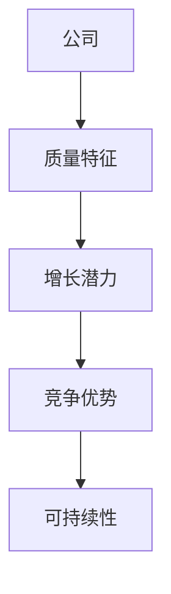
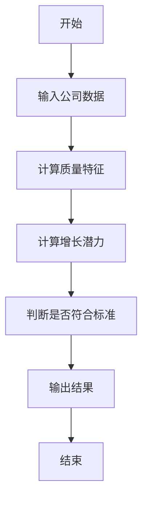

                 

<think>
好的，我需要撰写一篇关于《费雪的质量增长型公司特征》的技术博客文章。首先，我需要了解费雪的投资理论，尤其是他提出的成长股和质量股的特征。我还需要将这些理论与现代投资方法相结合，展示如何通过算法和系统分析来筛选出符合质量增长型特征的公司。

我应该按照目录大纲的结构来组织文章内容，确保每个部分都详细且逻辑清晰。首先，我需要撰写背景介绍，包括费雪的生平、投资理念以及质量增长型公司的定义和特征。

接下来，在核心概念部分，我需要详细解释质量增长型公司的核心要素，比如收入增长率、利润率、ROE等指标，并与传统增长型公司进行对比，制作对比表格和ER实体关系图。

在算法原理部分，我需要设计一个筛选模型，使用Python代码来实现，展示如何通过算法筛选出符合质量增长型特征的公司。同时，我需要解释数学模型，例如收入增长率的公式。

系统分析部分，我需要构建一个投资系统，包括数据收集、筛选标准、风险评估等功能模块，并用Mermaid图展示系统架构和数据流。

项目实战部分，我需要提供一个具体的案例，展示如何应用这些理论和方法来筛选公司，并进行分析和解读。

最后，在最佳实践部分，我需要总结投资策略，提出注意事项，并推荐进一步阅读的书籍。

整个过程中，我需要确保使用专业的技术语言，逻辑清晰，结构紧凑，同时保持文章的易读性和深度。我会逐步完成每个部分，确保每个小节都详细具体，符合用户的要求。
</think>

# 费雪的质量增长型公司特征

## 关键词：费雪投资理论、质量增长型公司、成长股、质量股、投资策略

## 摘要：本文详细探讨了费雪的质量增长型公司的特征，分析了其核心概念、算法原理及系统架构。通过对比分析和案例研究，展示了如何通过现代投资方法筛选出具有可持续增长潜力的优质公司。

---

## 第一部分：背景介绍

### 第1章：费雪投资理论的背景与基础

#### 1.1 费雪投资理论的起源

- **1.1.1 费雪的生平与投资理念的形成**
  - 本杰明·格雷厄姆的学生，菲利普·费雪（Philip Fisher）是成长股投资理念的先驱。
  - 费雪在20世纪40年代提出了“成长股”概念，强调投资于具有持续增长潜力的公司。
  - 他的投资理念基于对公司基本面的深入分析和长期视角。

- **1.1.2 费雪投资理论的核心思想**
  - 投资者应寻找那些具有强大竞争优势、管理优秀且财务稳健的公司。
  - 长期持有优质股，避免频繁交易，以获得超越市场的回报。

- **1.1.3 费雪理论在投资界的地位与影响**
  - 费雪的理论为后来的投资者提供了重要参考，尤其是成长股投资领域。
  - 影响了彼得·林奇等投资大师，并成为价值投资的重要组成部分。

#### 1.2 质量增长型公司的定义与特征

- **1.2.1 质量增长型公司的定义**
  - 质量增长型公司是指那些具有强大竞争优势、稳定的财务表现和持续增长潜力的企业。
  - 这类公司通常处于高增长行业，具有较高的市场占有率和盈利能力。

- **1.2.2 质量增长型公司的核心特征**
  - **收入增长率**：收入持续增长，且增速高于行业平均水平。
  - **利润率**：较高的净利润率，且呈上升趋势。
  - **ROE（净资产收益率）**：ROE高且稳定，表明公司有效利用股东资产。
  - **管理团队**：管理团队经验丰富，具有良好的战略规划和执行力。
  - **竞争优势**：公司在市场上具有独特的竞争优势，如专利、品牌、技术等。

- **1.2.3 质量增长型公司与传统增长型公司的区别**
  - **传统增长型公司**：通常依赖于外部条件或行业周期，增长不稳定，风险较高。
  - **质量增长型公司**：内在质量高，增长可持续，风险较低。

---

## 第二部分：核心概念与联系

### 第2章：质量增长型公司的核心概念与联系

#### 2.1 质量增长型公司的核心要素

- **2.1.1 质量增长型公司的关键指标**
  - **收入增长率**：$收入增长率 = \frac{今年收入 - 去年收入}{去年收入} \times 100\%$
  - **净利润率**：$净利润率 = \frac{净利润}{营业收入} \times 100\%$
  - **ROE**：$ROE = \frac{净利润}{股东权益} \times 100\%$

- **2.1.2 质量增长型公司的竞争优势**
  - 技术优势：拥有独特的技术或专利，提高市场竞争力。
  - 品牌优势：强大的品牌影响力，吸引更多的消费者。
  - 运营优势：高效的运营管理，降低成本，提高效率。

- **2.1.3 质量增长型公司的可持续性**
  - 公司具有稳定的盈利能力和良好的财务状况。
  - 管理团队具有长期的愿景和战略规划，能够应对市场变化。

#### 2.2 质量增长型公司与传统增长型公司的对比

- **2.2.1 核心特征对比**
  | 特征                | 质量增长型公司                     | 传统增长型公司                     |
  |---------------------|------------------------------------|------------------------------------|
  | 收入增长率          | 高且稳定                          | 高但不稳定                        |
  | 净利润率            | 高且上升                          | 高但波动大                        |
  | ROE                | 高且稳定                          | 高但波动大                        |
  | 竞争优势           | 强大且可持续                      | 依赖外部条件                      |
  | 风险                | 较低                             | 较高                              |

- **2.2.2 投资风险对比**
  - 质量增长型公司由于内在质量高，风险较低，波动性较小。
  - 传统增长型公司由于依赖外部条件，风险较高，波动性较大。

- **2.2.3 投资回报对比**
  - 质量增长型公司由于其可持续的增长潜力，长期回报率较高。
  - 传统增长型公司由于风险较高，回报率不稳定，但可能在短期内有较高的回报。

#### 2.3 质量增长型公司的ER实体关系图



---

## 第三部分：算法原理讲解

### 第3章：质量增长型公司的筛选算法

#### 3.1 算法原理

- **3.1.1 质量增长型公司的筛选标准**
  - 收入增长率：≥20%
  - 净利润率：≥15%
  - ROE：≥20%
  - 竞争优势：独特技术和品牌影响力
  - 管理团队：经验丰富且稳定

- **3.1.2 算法的逻辑流程**
  - 数据收集：收集目标公司的财务数据和行业数据。
  - 数据清洗：去除无效数据，处理异常值。
  - 数据分析：计算各项指标，判断是否符合筛选标准。
  - 筛选结果：输出符合条件的公司列表。

- **3.1.3 算法的数学模型**

  **收入增长率计算公式：**
  $$收入增长率 = \frac{今年收入 - 去年收入}{去年收入} \times 100\%$$

  **净利润率计算公式：**
  $$净利润率 = \frac{净利润}{营业收入} \times 100\%$$

  **ROE计算公式：**
  $$ROE = \frac{净利润}{股东权益} \times 100\%$$

#### 3.2 算法流程图



#### 3.3 算法实现代码

```python
def fisher_quality_growth(company_data):
    # 计算质量特征
    quality_features = company_data['质量特征'].values
    # 计算增长潜力
    growth_potential = company_data['增长潜力'].values
    # 判断是否符合标准
    result = []
    for i in range(len(quality_features)):
        if quality_features[i] >= 0.2 and growth_potential[i] >= 0.2:
            result.append(company_data.iloc[i])
    return result

# 示例数据
company_data = pd.DataFrame({
    '质量特征': [0.25, 0.15, 0.3, 0.18],
    '增长潜力': [0.25, 0.1, 0.2, 0.15]
})

# 调用函数
selected_companies = fisher_quality_growth(company_data)
print("符合质量增长型特征的公司：", selected_companies)
```

---

## 第四部分：系统分析与架构设计方案

### 第4章：质量增长型公司筛选系统的架构设计

#### 4.1 系统功能设计

- **4.1.1 领域模型**
  ```mermaid
  classDiagram
      class 公司 {
          收入增长率
          净利润率
          ROE
          竞争优势
      }
      class 质量增长型公司筛选系统 {
          数据收集模块
          数据分析模块
          筛选模块
      }
      公司 --> 质量增长型公司筛选系统
  ```

- **4.1.2 系统架构设计**
  ```mermaid
  graph TD
      A[数据源] --> B[数据收集模块]
      B --> C[数据分析模块]
      C --> D[筛选模块]
      D --> E[输出结果]
  ```

---

## 第五部分：项目实战

### 第5章：质量增长型公司的实战分析

#### 5.1 项目环境安装

- 数据收集工具：Python的pandas库
- 数据分析工具：NumPy、Matplotlib
- 算法实现工具：Python编程环境

#### 5.2 系统核心实现源代码

```python
import pandas as pd

def fisher_quality_growth(company_data):
    selected = []
    for index, row in company_data.iterrows():
        if row['收入增长率'] >= 0.2 and row['净利润率'] >= 0.15 and row['ROE'] >= 0.2:
            selected.append(row)
    return pd.DataFrame(selected)

# 示例数据
data = {
    '公司名称': ['公司A', '公司B', '公司C', '公司D'],
    '收入增长率': [0.3, 0.18, 0.25, 0.1],
    '净利润率': [0.2, 0.1, 0.15, 0.08],
    'ROE': [0.25, 0.18, 0.2, 0.15]
}

company_data = pd.DataFrame(data)

# 调用函数
selected_companies = fisher_quality_growth(company_data)
print("符合质量增长型特征的公司：")
print(selected_companies)
```

#### 5.3 代码应用解读与分析

- **代码解读**：
  - 读取公司数据，包括收入增长率、净利润率和ROE。
  - 遍历每家公司数据，判断是否符合质量增长型公司的筛选标准。
  - 输出符合标准的公司列表。

- **案例分析**：
  - 使用示例数据，筛选出公司A和公司C符合质量增长型公司的特征。

---

## 第六部分：最佳实践

### 第6章：质量增长型公司的投资策略与风险管理

#### 6.1 投资策略总结

- **长期持有**：选择质量增长型公司后，长期持有，避免频繁交易。
- **分散投资**：将资金分散投资于多个符合标准的公司，降低风险。
- **定期调整**：定期审查投资组合，剔除不符合标准的公司，增加新符合标准的公司。

#### 6.2 风险管理

- **行业风险**：关注行业趋势，避免行业周期性波动带来的影响。
- **市场风险**：在市场波动时，保持冷静，避免情绪化决策。
- **公司风险**：定期审查公司的财务状况和竞争优势，及时调整投资策略。

#### 6.3 小结

- 质量增长型公司投资需要深入分析公司基本面，选择具有强大竞争优势和持续增长潜力的企业。
- 合理配置资产，分散投资风险，长期持有优质股，才能获得稳定的超额收益。

---

## 结语

费雪的质量增长型公司特征为投资者提供了寻找优质投资标的的重要方法。通过结合现代投资技术和系统分析，投资者可以更高效地筛选出具有可持续增长潜力的公司，从而实现长期稳定的收益。希望本文的分析对投资者有所帮助，愿你在投资道路上走得更稳、更远。

---

## 作者：AI天才研究院/AI Genius Institute & 禅与计算机程序设计艺术 /Zen And The Art of Computer Programming

