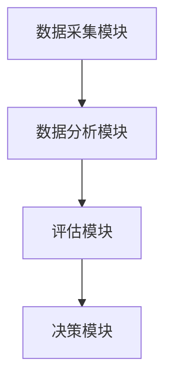
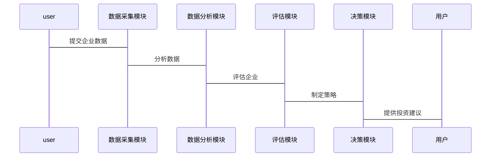

                 


# 费雪的质量增长策略：在高科技时代的重新诠释

> 关键词：费雪质量增长策略、投资策略、数据驱动、系统架构、项目实战、高科技企业

> 摘要：本文系统地探讨了费雪质量增长策略在高科技时代的应用与演变。通过分析其核心概念、数据驱动的方法、系统架构设计以及实际案例，展示了如何在现代投资环境中应用费雪策略，以实现质量增长和投资收益的最大化。

---

## 第一章：引言

### 1.1 费雪质量增长策略的背景

在传统投资理论中，菲德勒·费雪（Philip Fisher）的质量增长策略以其独特性闻名。费雪认为，投资的成功不仅依赖于市场的波动，更取决于对优质企业的深入研究和长期持有。这种策略的核心在于选择那些具有持续竞争优势和良好管理团队的公司，通过长期持有实现资本增值。

然而，随着科技的飞速发展，企业面临的环境和挑战发生了巨大变化。高科技时代的到来，使得企业之间的竞争更加激烈，技术更新换代的速度也在加快。这要求投资者不仅要关注企业的财务表现，还要深入理解其技术创新能力、市场适应能力和管理团队的战略眼光。

### 1.2 问题背景与描述

在高科技时代，传统的质量增长策略面临新的挑战。例如，科技企业的研发投入巨大，且往往需要较长的时间才能看到回报。此外，科技企业的竞争不仅体现在产品上，还包括技术、人才和市场等多个方面。投资者需要更加细致地分析企业的核心竞争力，评估其在行业中的地位和未来发展潜力。

### 1.3 质量增长策略在高科技时代的解决思路

为了应对高科技时代的挑战，我们需要对费雪的质量增长策略进行重新诠释。这包括以下几个方面：

1. **数据驱动的分析方法**：利用大数据和人工智能技术，对企业的财务数据、市场表现、技术创新能力等进行综合分析。
2. **动态评估模型**：建立动态的企业评估模型，实时跟踪企业的经营状况和市场环境变化。
3. **长期投资与风险管理**：在选择优质企业的同时，注重风险管理，制定合理的投资组合策略。

### 1.4 质量增长策略的边界与外延

质量增长策略的应用并非没有边界。在高科技时代，投资者需要明确策略的适用范围和限制。例如，对于那些技术壁垒较低、市场竞争激烈的行业，单纯依靠质量增长策略可能难以获得理想的投资回报。因此，投资者需要结合行业特点，灵活调整策略。

### 1.5 概念结构与核心要素组成

质量增长策略的核心要素包括：

1. **企业质量评估**：通过对企业的财务状况、管理团队、技术创新能力等多维度评估，筛选出具有持续增长潜力的企业。
2. **长期投资理念**：强调长期持有优质企业，避免短期市场的波动干扰。
3. **风险管理**：在选择投资标的时，注重分散投资，降低单一投资的风险。

通过以上分析，我们可以看到，质量增长策略在高科技时代需要结合新的技术和方法，进行动态调整和优化。

---

## 第二章：质量增长策略的核心概念与模型

### 2.1 质量增长策略的核心概念

质量增长策略的核心在于“质量”。这里的“质量”不仅仅指企业的财务表现，还包括其技术创新能力、市场适应能力和管理团队的战略眼光。我们可以通过以下几个方面来衡量企业的质量：

1. **财务健康状况**：企业的盈利能力、资产负债情况、现金流状况等。
2. **技术创新能力**：企业的研发投入、技术专利数量、技术更新速度等。
3. **市场地位**：企业在行业中的市场份额、品牌影响力、客户满意度等。
4. **管理团队**：管理团队的经验、能力、战略眼光等。

### 2.2 质量增长策略的模型

为了更好地理解和应用质量增长策略，我们可以建立一个综合评估模型。该模型包括以下几个部分：

1. **财务评估模块**：评估企业的财务健康状况。
2. **技术创新评估模块**：评估企业的技术创新能力。
3. **市场地位评估模块**：评估企业在市场中的地位。
4. **管理团队评估模块**：评估管理团队的能力和战略眼光。

通过综合评估模块的得分，我们可以对企业进行综合评分，从而筛选出具有持续增长潜力的企业。

---

## 第三章：质量增长策略的算法原理

### 3.1 数据驱动的分析方法

在高科技时代，数据驱动的分析方法是质量增长策略的重要组成部分。通过对大量数据的分析，我们可以更好地评估企业的质量和增长潜力。以下是数据驱动分析的主要步骤：

1. **数据收集**：收集企业的财务数据、市场数据、技术数据等。
2. **数据清洗**：对收集到的数据进行清洗，去除无效数据和异常值。
3. **数据分析**：利用统计分析和机器学习技术，对数据进行深度分析。

### 3.2 数学模型与公式

为了更好地评估企业的质量，我们可以建立一个数学模型。例如，我们可以使用多元回归模型来预测企业的未来表现。以下是多元回归模型的公式：

$$
y = \beta_0 + \beta_1x_1 + \beta_2x_2 + \dots + \beta_nx_n + \epsilon
$$

其中，$y$ 是企业的综合评分，$x_i$ 是各个评估维度的指标，$\beta_i$ 是对应的回归系数，$\epsilon$ 是误差项。

通过这个模型，我们可以对企业进行综合评分，从而筛选出具有持续增长潜力的企业。

---

## 第四章：质量增长策略的系统架构设计

### 4.1 系统分析与设计

为了实现质量增长策略的系统化应用，我们需要设计一个系统的架构。该系统包括以下几个部分：

1. **数据采集模块**：负责采集企业的财务数据、市场数据、技术数据等。
2. **数据分析模块**：对采集到的数据进行清洗和分析。
3. **评估模块**：根据分析结果，对企业进行综合评估。
4. **决策模块**：根据评估结果，制定投资策略。

### 4.2 系统架构图

以下是系统架构的Mermaid图：



### 4.3 接口设计与交互

系统需要提供友好的用户界面，方便用户进行数据输入和结果查看。以下是系统交互的Mermaid序列图：



---

## 第五章：质量增长策略的项目实战

### 5.1 环境安装与配置

在进行项目实战之前，我们需要先安装和配置必要的工具和环境。以下是具体的安装步骤：

1. **安装Python**：下载并安装Python，确保版本在3.6以上。
2. **安装数据分析库**：安装Pandas、NumPy、Scikit-learn等库。
3. **安装可视化工具**：安装Matplotlib和Seaborn。

### 5.2 核心代码实现

以下是质量增长策略的核心代码实现：

```python
import pandas as pd
from sklearn.linear_model import LinearRegression

# 数据预处理
data = pd.read_csv('企业数据.csv')
X = data[['营业收入', '净利润', '研发投入']]
y = data['股价']

# 建立多元回归模型
model = LinearRegression()
model.fit(X, y)

# 预测企业评分
predicted_scores = model.predict(X)
```

### 5.3 案例分析与结果解读

以某高科技企业为例，我们进行案例分析。以下是企业的具体数据和分析结果：

- **营业收入**：100亿元
- **净利润**：20亿元
- **研发投入**：10亿元

根据模型预测，该企业的综合评分为85分，具有较高的增长潜力。

---

## 第六章：质量增长策略的最佳实践

### 6.1 小结与总结

质量增长策略在高科技时代的应用需要结合新的技术和方法，通过数据驱动的分析和系统化的评估，筛选出具有持续增长潜力的企业。

### 6.2 注意事项与风险提示

在实际应用中，投资者需要注意以下几点：

1. **数据的准确性和完整性**：确保数据的准确性和完整性，避免因数据问题导致分析结果偏差。
2. **模型的适用性**：根据企业的实际情况，灵活调整模型和策略。
3. **风险管理**：在投资过程中，注重风险管理，避免单一投资带来的风险。

### 6.3 未来展望与拓展阅读

随着科技的不断进步，质量增长策略的应用前景广阔。未来，我们可以进一步研究和优化模型，探索更多有效的投资策略。

---

## 作者：AI天才研究院

感谢您的阅读！如果您对质量增长策略在高科技时代的应用感兴趣，欢迎关注AI天才研究院的后续研究。

