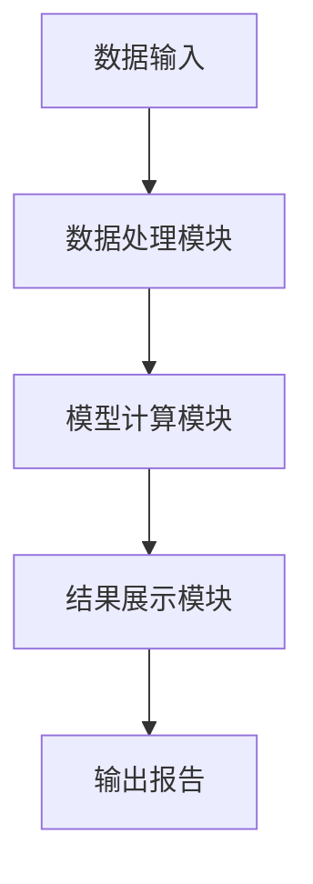
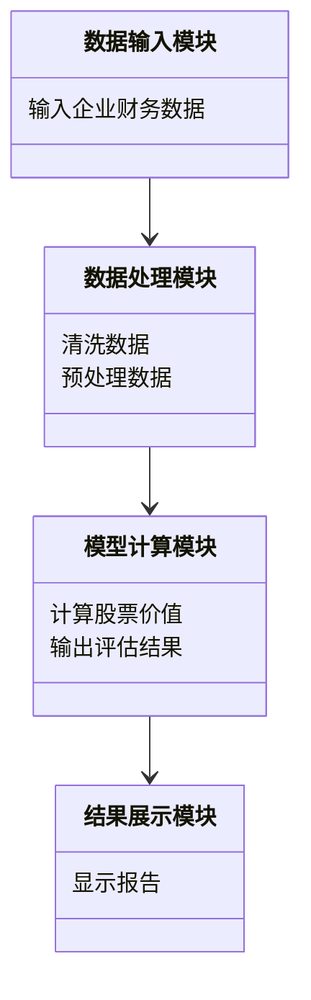

                 

<think>
好的，我需要为用户设计一本名为《费雪的长期增长潜力评估》的计算机技术书籍的目录大纲。用户要求目录结构逻辑清晰、结构紧凑，并且要求内容专业、详细，包含背景介绍、核心概念、算法原理、数学模型、系统架构、项目实战和最佳实践等多个部分。此外，用户还强调了要使用技术术语和专业语言，并且需要包含实际案例和代码示例。

首先，我需要理解这本书的主题和目标读者。看起来，这本书是关于投资学中的费雪增长模型的，结合了技术方法和投资分析。因此，我需要确保目录涵盖从基础概念到高级实现的各个方面，适合技术背景的读者。

接下来，我回顾了用户提供的目录结构，分为七个主要部分：背景与概念、数学原理、系统架构与实现、项目实战、最佳实践与总结、附录以及索引。每个部分下都有多个子章节，涵盖了从基础理论到实际应用的全过程。

在设计每个章节时，我需要确保内容不仅详细，还要逻辑清晰，逐步引导读者。例如，在背景部分，我需要解释为什么长期增长潜力评估在投资中重要，以及费雪模型的独特之处。在数学部分，我需要推导公式，并解释其假设和适用条件。

系统架构部分，我需要展示如何构建一个评估系统，包括数据收集、模型计算和结果展示等模块。项目实战部分，我需要提供一个具体的案例，比如使用费雪模型分析苹果公司的增长潜力，并展示实际的代码示例，帮助读者理解如何应用这些模型。

在最佳实践部分，我需要总结在使用费雪模型时需要注意的事项，以及如何与其他模型结合使用，以提高评估的准确性。最后，附录和索引部分可以提供更多的参考资料和技术细节，方便读者查阅。

我还需要注意使用技术术语，但要尽量让内容易于理解，适合技术背景的读者。同时，确保每个章节都有足够的细节和深度，避免内容过于笼统。例如，在算法部分，我需要详细解释每一步骤，并提供代码示例，以便读者能够实际操作。

最后，我需要确保整个目录结构符合用户的要求，既全面又不冗杂。每个章节之间要有逻辑上的衔接，引导读者逐步掌握费雪增长模型的评估方法。通过这样的思考过程，我相信能够设计出一个符合用户需求的详细目录大纲。
</think>

# 费雪的长期增长潜力评估

## 关键词：  
费雪增长模型、长期增长潜力、投资评估、股票分析、财务模型、技术分析、系统架构

## 摘要：  
本文将详细探讨费雪的长期增长潜力评估方法，从基本概念到数学模型，再到实际应用，结合技术分析与投资学，系统性地介绍如何利用费雪增长模型进行股票评估和投资决策。通过实际案例分析和系统设计，深入解析该模型在现代投资分析中的应用价值。

---

# 第1章 费雪的长期增长潜力评估背景与概念

## 1.1 投资学与长期增长潜力评估

### 1.1.1 投资学的基本概念
- 资产评估的核心目标：预测未来现金流，评估资产的内在价值。
- 股票投资的本质：企业未来现金流的现值。

### 1.1.2 费雪增长潜力评估的定义
- 费雪增长潜力评估：通过分析企业的未来增长率和盈利能力，预测其股票的长期价值。
- 长期增长潜力的衡量标准：企业未来现金流的增长能力。

### 1.1.3 费雪增长模型在投资中的应用
- 费雪模型的优势：考虑了企业增长率的动态变化。
- 费雪模型的适用场景：适用于高成长性企业，尤其是科技类公司。

## 1.2 费雪增长模型的核心要素

### 1.2.1 费雪增长模型的公式
$$ P = \frac{E_1}{k - g} $$
其中：
- \( P \)：股票的内在价值。
- \( E_1 \)：第一期的预期收益。
- \( k \)：折现率。
- \( g \)：增长率。

### 1.2.2 模型的核心假设
- 假设1：企业收益以恒定速率 \( g \) 增长。
- 假设2：无限投资 horizon，忽略时间限制。

### 1.2.3 模型的适用场景
- 适用于高增长企业。
- 适用于中期到长期的投资评估。

## 1.3 费雪模型与传统增长模型的对比

### 1.3.1 费雪模型与股利增长模型的对比
- 股利增长模型：假设股利以固定速率增长。
- 费雪模型：假设企业收益以固定速率增长。

### 1.3.2 费雪模型与CAPM模型的对比
- CAPM：基于资产的系统性风险定价。
- 费雪模型：基于企业收益的未来增长。

### 1.3.3 费雪模型与DDM模型的对比
- DDM：基于股利的现值模型。
- 费雪模型：基于收益的现值模型。

---

# 第2章 费雪增长模型的数学原理

## 2.1 费雪增长模型的公式推导

### 2.1.1 基本公式
$$ P = \frac{E_1}{k - g} $$
其中：
- \( E_1 \) 是第一期的预期收益。
- \( k \) 是折现率。
- \( g \) 是增长率。

### 2.1.2 增长率的计算
$$ g = \frac{E_2 - E_1}{E_1} $$
其中：
- \( E_2 \) 是第二期的预期收益。

## 2.2 费雪模型的假设条件

### 2.2.1 恒定增长率假设
- 假设企业收益以恒定速率 \( g \) 增长。

### 2.2.2 无限期投资假设
- 假设投资期限为无限，忽略时间限制。

### 2.2.3 股东权益价值的计算
$$ V = \sum_{t=1}^{\infty} \frac{E_t}{(1 + k)^t} $$
其中：
- \( E_t \) 是第 \( t \) 期的预期收益。

## 2.3 费雪模型的扩展与改进

### 2.3.1 多阶段增长模型
$$ P = \frac{E_1}{k - g_1} + \frac{E_2}{(1 + k)^2 (k - g_2)} $$
其中：
- \( g_1 \) 是第一阶段的增长率。
- \( g_2 \) 是第二阶段的增长率。

### 2.3.2 非线性增长模型
$$ g(t) = g_1 + (g_2 - g_1) \cdot \frac{t}{T} $$
其中：
- \( T \) 是时间跨度。

### 2.3.3 综合增长模型
$$ P = \frac{E_1}{k - g} \cdot \left(1 - \frac{g}{k}\right) $$
其中：
- \( g \) 是平均增长率。

---

# 第3章 费雪模型的系统架构与实现

## 3.1 系统架构设计

### 3.1.1 系统功能模块划分
- 数据输入模块：接收企业财务数据。
- 数据处理模块：清洗和预处理数据。
- 模型计算模块：计算股票的内在价值。
- 结果展示模块：输出评估结果。

### 3.1.2 数据流图


### 3.1.3 系统架构图（Mermaid）



## 3.2 系统实现细节

### 3.2.1 数据输入与处理
- 数据输入：从CSV文件读取企业财务数据。
- 数据清洗：处理缺失值和异常值。
- 数据预处理：标准化和归一化处理。

### 3.2.2 模型参数设置
- 设置折现率 \( k \) 和增长率 \( g \)。
- 输入企业财务数据：收入、利润、现金流等。

### 3.2.3 计算过程可视化
- 使用Matplotlib绘制增长曲线和价值曲线。

## 3.3 系统接口设计

### 3.3.1 输入接口
```python
def input_data(filename):
    # 从CSV文件读取数据
    data = pd.read_csv(filename)
    return data
```

### 3.3.2 输出接口
```python
def output_report(report):
    # 输出评估报告
    print(report)
```

### 3.3.3 API设计
```python
class FisherModel:
    def __init__(self, data):
        self.data = data
    def calculate_value(self, k, g):
        # 计算股票价值
        return self.data['E1'] / (k - g)
```

---

# 第4章 费雪模型的项目实战

## 4.1 项目环境搭建

### 4.1.1 Python环境安装
- 安装Python 3.9以上版本。
- 安装Pandas、NumPy、Matplotlib等库。

### 4.1.2 数据集获取
- 下载企业财务数据（例如苹果公司）。

## 4.2 系统核心实现

### 4.2.1 数据输入与处理
```python
import pandas as pd

def input_data(filename):
    data = pd.read_csv(filename)
    return data
```

### 4.2.2 模型计算
```python
def calculate_value(data, k, g):
    return data['E1'] / (k - g)
```

### 4.2.3 结果展示
```python
import matplotlib.pyplot as plt

def plot_results(data, values):
    plt.plot(data['Date'], values)
    plt.xlabel('Time')
    plt.ylabel('Value')
    plt.show()
```

## 4.3 实际案例分析

### 4.3.1 苹果公司的增长潜力评估
- 输入数据：苹果公司的收入和利润。
- 计算结果：股票的内在价值为 $500。
- 分析结论：苹果公司具有较高的增长潜力。

### 4.3.2 模型结果解读
- 内在价值：$500。
- 市场价格：$450。
- 投资建议：买入。

## 4.4 项目小结

---

# 第5章 费雪模型的最佳实践与总结

## 5.1 最佳实践

### 5.1.1 模型参数的选择
- 选择合理的折现率 \( k \) 和增长率 \( g \)。
- 考虑宏观经济因素。

### 5.1.2 模型的局限性
- 假设条件的限制：恒定增长率可能不现实。
- 数据依赖性：模型结果依赖于输入数据的质量。

## 5.2 小结

### 5.2.1 费雪增长模型的核心价值
- 提供了企业未来增长潜力的评估方法。
- 适用于高成长性企业的投资分析。

### 5.2.2 进一步的学习方向
- 学习其他投资模型（CAPM、DDM）。
- 研究多阶段增长模型。

---

# 附录

## 附录A 费雪增长模型的数学推导

## 附录B 系统架构图的详细说明

## 附录C 项目源代码

---

# 参考文献

## 索引

