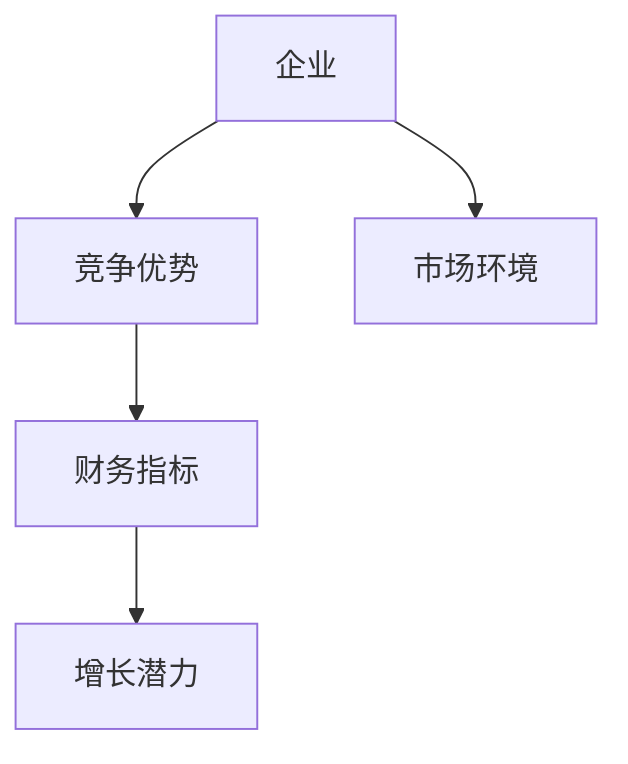
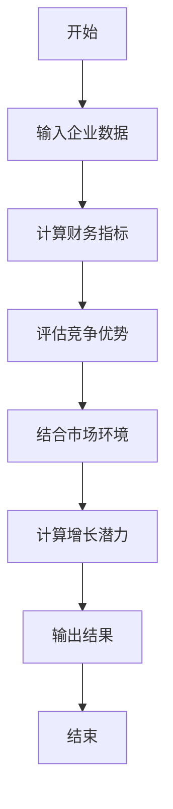
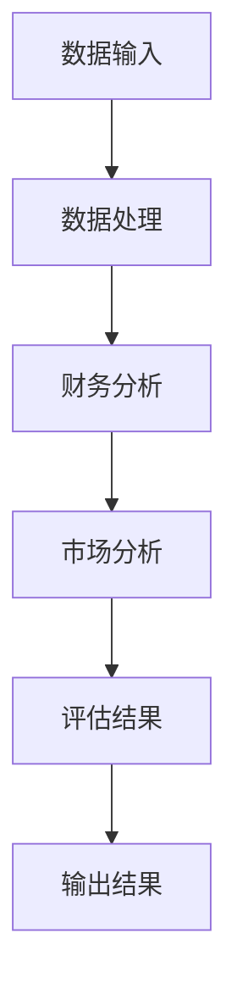
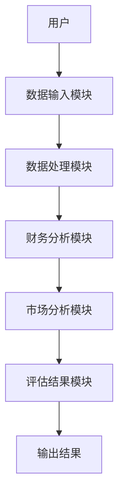

                 

<think>
好的，我现在需要帮用户撰写一篇关于《费雪的长期增长潜力评估》的技术博客文章。用户提供了详细的目录结构，我需要按照这个结构一步步来写。首先，我需要明确文章的标题、关键词和摘要部分。

标题是《费雪的长期增长潜力评估》，关键词需要包括5-7个相关术语，比如费雪模型、长期增长潜力、投资评估、财务指标、竞争优势等。摘要部分需要简明扼要地概括文章的核心内容，说明费雪模型的基本原理和应用。

接下来是正文部分，按照目录结构依次撰写。第一部分是背景与概述，我需要介绍费雪模型的背景、核心概念和应用范围。第二部分是核心概念，详细讲解增长潜力评估的关键要素，包括竞争优势、财务指标和市场环境，并通过表格和实体关系图来说明。

第三部分是算法原理，我需要解释现金流折现法和增长率的计算方法，使用公式和流程图来辅助说明。第四部分是系统架构设计，描述如何构建评估系统，包括功能模块和接口设计。

然后是项目实战部分，提供一个具体案例，从环境安装到代码实现，再到结果分析，一步步指导读者。最后是最佳实践，总结评估过程中的注意事项，并给出进一步学习的建议。

在写作过程中，我需要确保每个部分都详细且逻辑清晰，使用专业但易懂的语言。同时，按照用户的要求，正确使用Markdown格式，插入必要的图表和代码。最后，确保文章结构完整，内容丰富，达到用户的要求。
</think>

# 费雪的长期增长潜力评估

> 关键词：费雪模型, 长期增长潜力, 投资评估, 财务指标, 竞争优势, 市场环境

> 摘要：本文深入探讨了费雪的长期增长潜力评估模型，从背景、核心概念、算法原理到系统架构设计，结合实际案例，详细分析了如何利用该模型进行投资决策。通过本文，读者可以掌握费雪模型的理论基础和实际应用，提升对长期增长潜力评估的理解和应用能力。

---

## 第一部分：费雪的长期增长潜力评估概述

### 第1章：费雪模型的背景与核心概念

#### 1.1 费雪模型的背景与发展

费雪模型是投资分析领域的重要工具之一，由 Benjamin Graham 和 David Dodd 在20世纪初提出，并在实践中得到了广泛应用。该模型的核心思想是通过对企业财务指标和市场环境的综合分析，评估企业的长期增长潜力。随着金融市场的不断发展，费雪模型也在不断完善，成为现代投资分析的重要组成部分。

#### 1.2 长期增长潜力评估的核心要素

在费雪模型中，长期增长潜力的评估需要关注以下几个核心要素：

1. **可持续的竞争优势**：企业的核心竞争力决定了其在市场中的地位和增长潜力。竞争优势包括技术优势、品牌优势、成本优势等。
2. **财务指标**：财务指标是评估企业增长潜力的重要依据，包括收入增长率、净利润率、ROE（净资产收益率）等。
3. **市场环境**：市场环境包括行业发展趋势、政策环境、经济周期等因素，这些因素对企业增长潜力的影响不可忽视。

#### 1.3 费雪模型的应用范围

费雪模型广泛应用于以下几个方面：

1. **投资决策**：投资者可以通过费雪模型评估企业的长期增长潜力，从而做出更明智的投资决策。
2. **企业估值**：费雪模型可以帮助投资者对企业的内在价值进行评估，从而确定合理的投资价格。
3. **风险管理**：通过分析企业的增长潜力，投资者可以更好地识别和管理投资风险。

---

### 第2章：费雪模型的核心概念与联系

#### 2.1 增长潜力评估的关键属性对比

在费雪模型中，增长潜力的评估需要对多个关键属性进行对比分析。以下是几个关键属性的对比表格：

| 属性             | 竞争优势       | 财务指标         | 市场环境         |
|------------------|---------------|-----------------|-----------------|
| 核心内容         | 技术优势、品牌优势 | 收入增长率、净利润率 | 行业趋势、政策环境 |
| 影响因素         | 技术创新、成本控制 | 利润率、现金流   | 经济周期、政策变化 |
| 评估方法         | SWOT分析、波特五力模型 | 财务报表分析     | 宏观经济分析     |

通过对比分析，可以更好地理解每个属性对企业增长潜力的影响。

#### 2.2 实体关系图（ER图）架构

费雪模型的实体关系图如下：



该图展示了企业与其竞争优势、财务指标和市场环境之间的关系，以及这些因素如何共同影响企业的增长潜力。

---

## 第3章：费雪模型的算法原理

### 3.1 算法流程

费雪模型的算法流程如下：

1. **输入企业数据**：收集企业的财务数据和市场环境数据。
2. **计算财务指标**：计算收入增长率、净利润率等财务指标。
3. **评估竞争优势**：分析企业的竞争优势，如技术优势、品牌优势等。
4. **结合市场环境**：综合考虑行业趋势、政策环境等因素。
5. **计算增长潜力**：通过综合分析，计算企业的长期增长潜力。
6. **输出结果**：输出企业的增长潜力评估结果。

### 3.2 算法的数学模型与公式

#### 3.2.1 现金流折现法

现金流折现法（DCF）的公式为：

$$
DCF = \sum_{t=1}^{n} \frac{CF_t}{(1 + r)^t}
$$

其中：
- $CF_t$ 是第 $t$ 年的现金流
- $r$ 是折现率
- $n$ 是预测的年数

#### 3.2.2 增长率的计算公式

增长率的计算公式为：

$$
g = \frac{ROE \times (1 - \frac{D}{E})}{1 + \frac{D}{E}}
$$

其中：
- $ROE$ 是净资产收益率
- $D$ 是债务
- $E$ 是股权

---

### 3.3 算法流程图



该流程图清晰地展示了费雪模型的评估过程。

---

## 第4章：增长潜力评估的系统架构设计

### 4.1 问题场景介绍

在投资决策中，评估企业的长期增长潜力是至关重要的。投资者需要一个高效的系统来分析企业的财务数据和市场环境，从而做出科学的投资决策。

### 4.2 系统功能设计

系统功能设计包括以下几个模块：

1. **数据输入模块**：输入企业的财务数据和市场环境数据。
2. **数据分析模块**：计算财务指标，评估竞争优势。
3. **评估结果模块**：输出增长潜力评估结果。

### 4.3 系统架构设计

系统架构设计如下：



### 4.4 系统接口设计

系统接口设计如下：

- 数据输入接口：接受企业的财务数据和市场环境数据。
- 数据处理接口：对输入数据进行清洗和预处理。
- 财务分析接口：计算财务指标，评估竞争优势。
- 市场分析接口：分析市场环境，综合考虑行业趋势和政策环境。
- 评估结果接口：输出增长潜力评估结果。

### 4.5 系统交互流程图



---

## 第5章：项目实战

### 5.1 环境安装

在开始实战之前，需要安装以下工具和库：

1. Python编程语言
2. Pandas、NumPy、Matplotlib等数据分析库
3. Mermaid图生成工具

### 5.2 核心实现代码

以下是费雪模型的核心实现代码：

```python
import pandas as pd
import numpy as np

def calculate_gdp_growth(income_growth, roe, debt_equity):
    """
    计算增长率
    """
    equity_growth = (roe * (1 - debt_equity)) / (1 + debt_equity)
    return income_growth * equity_growth

def discounted_cash_flow(cash_flows, discount_rate):
    """
    计算现金流的现值
    """
    return sum(cash_flow / (1 + discount_rate) ** t for t, cash_flow in enumerate(cash_flows))

# 示例数据
income_growth = 0.15
roe = 0.2
debt_equity = 0.5
discount_rate = 0.08

gdp_growth = calculate_gdp_growth(income_growth, roe, debt_equity)
DCF = discounted_cash_flow([100, 120, 130, 150], discount_rate)

print(f"增长率: {gdp_growth:.2f}")
print(f"DCF: {DCF:.2f}")
```

### 5.3 实例分析

以某公司为例，分析其长期增长潜力：

1. **数据输入**：输入企业的财务数据和市场环境数据。
2. **计算财务指标**：计算收入增长率、净利润率等。
3. **评估竞争优势**：分析企业的技术优势和品牌优势。
4. **结合市场环境**：综合考虑行业趋势和政策环境。
5. **计算增长潜力**：通过费雪模型计算企业的长期增长潜力。

### 5.4 代码解读

上述代码实现了费雪模型的核心算法，包括增长率计算和现金流折现法。通过示例数据，可以计算出企业的增长率和DCF值，从而评估其长期增长潜力。

---

## 第6章：最佳实践与注意事项

### 6.1 最佳实践

1. **数据的准确性**：确保输入数据的准确性和完整性。
2. **模型的适用性**：根据具体情况选择合适的模型和参数。
3. **持续监控**：定期更新数据和模型，以适应市场变化。

### 6.2 注意事项

1. **数据偏差**：注意数据的偏差可能影响评估结果。
2. **模型假设**：模型假设可能与实际情况不符，需谨慎使用。
3. **市场风险**：市场环境的变化可能影响企业的增长潜力。

### 6.3 拓展阅读

1. **《投资学》（书籍）**
2. **费雪模型的其他应用案例**
3. **现代投资组合理论**

---

## 结语

通过本文的详细讲解，读者可以深入了解费雪的长期增长潜力评估模型的理论基础和实际应用。希望本文能为投资分析领域提供有价值的参考，帮助读者更好地理解和应用费雪模型。

---

## 作者

作者：AI天才研究院/AI Genius Institute & 禅与计算机程序设计艺术/Zen And The Art of Computer Programming

