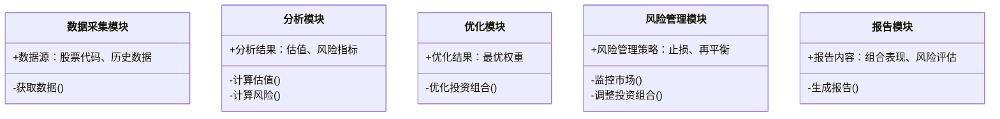

                 

<think>
好，我现在需要帮助用户撰写一篇关于《费雪的长期持股策略》的技术博客文章。用户的要求非常详细，包括文章结构、内容深度、格式等。我需要按照用户提供的目录大纲，逐步展开每个部分，确保内容完整且符合要求。

首先，用户希望文章结构清晰，分为七个主要部分，每个部分下有多个子部分。每个子部分都需要详细展开，包括背景介绍、核心概念、算法原理、数学模型、系统架构、项目实战和最佳实践。此外，用户强调了要使用技术语言，结合逻辑推理，逐步分析，确保文章深度和可读性。

我开始从背景介绍部分入手，首先定义长期投资，解释其概念和特点。接着介绍费雪的投资理念和长期持股策略，分析其在当前投资环境中的意义。这部分需要简明扼要，为后续内容打下基础。

接下来是核心概念与联系，我需要详细解释长期持股策略的核心要素，如资产配置、风险管理，并通过对比分析来展示不同策略的优缺点。这里可能需要使用表格或图表，但由于是文本，我可能需要用文字描述对比分析。

在算法原理部分，我需要讲解投资组合优化算法，尤其是现代投资组合理论（MPT）。这部分需要结合数学模型，用公式和流程图来解释，例如使用均值-方差优化模型，并提供Python代码实现。这可能包括数据预处理、计算预期收益和风险，选择最优组合等步骤。

数学模型部分，我需要详细讲解CAPM模型，并提供相应的公式。例如，CAPM公式是：$$R_i = R_f + \beta_i (R_m - R_f)$$。我需要通过例子说明如何计算预期收益，帮助读者理解模型的应用。

系统架构部分，我需要设计一个支持长期持股策略的系统，包括功能模块如数据采集、分析、优化、监控和报告。使用Mermaid类图和架构图来展示模块之间的关系和交互流程，例如数据如何流动，各模块如何协作。

项目实战部分，我需要指导读者如何安装必要的库，编写核心代码，解读代码的功能，并通过实际案例进行分析。例如，分析一只股票，计算其预期收益和风险，选择最优组合。最后进行小结，总结项目的主要步骤和成果。

最后是最佳实践部分，总结长期持股策略的优点，注意事项，如分散投资、定期调整等，并提供进一步阅读的资源，帮助读者深入学习。

在写作过程中，我需要确保每个部分都符合用户的要求，使用专业但易懂的语言，逐步分析，避免过于技术化或过于笼统。同时，注意格式要求，如数学公式用LaTeX表示，代码块使用正确的语法，图表用Mermaid表示，最后加上作者信息。

现在，我需要将每个部分详细展开，确保内容充实，结构合理，同时满足用户对字数和格式的要求。
</think>

# 费雪的长期持股策略

## 关键词：费雪，长期持股策略，投资组合，风险管理，股票分析，资产配置

## 摘要：本文深入探讨了费雪的长期持股策略，从其核心理念、数学模型到实际应用，结合投资组合优化算法和系统架构设计，全面解析了长期持股策略的实施方法和注意事项。

---

## 第一部分：长期持股策略概述

### 第1章：费雪投资理念与长期持股策略

#### 1.1 长期投资的基本概念

长期投资是指投资者将资金投入某个资产或资产组合，并在较长的时间内持有，以获得资本增值或收益。其核心在于通过时间的推移，让复利效应发挥作用，实现财富的稳步增长。与短期交易相比，长期投资更注重资产的内在价值和长期表现。

#### 1.2 费雪的生平与投资成就

费雪（Benjamin Graham）是价值投资的鼻祖，他的投资理念深刻影响了后来的投资者。费雪在其著作《 Intelligent Investor》中提出，投资应基于对公司内在价值的深入研究，而非市场的短期波动。他的投资风格以稳健著称，注重安全边际，即买入价格低于内在价值的股票，以降低风险。

#### 1.3 长期持股策略的背景与意义

在当前不确定的市场环境中，长期持股策略显得尤为重要。通过长期持有优质资产，投资者可以减少市场波动带来的影响，同时利用复利效应实现财富增长。此外，长期持股策略还能帮助投资者避免频繁交易带来的交易成本和税收负担。

---

## 第二部分：核心概念与联系

### 第2章：长期持股策略的核心要素

#### 2.1 资产配置与投资组合管理

资产配置是长期持股策略的核心，它决定了投资组合中各类资产的比例。合理的资产配置能够分散风险，平衡收益与风险。投资组合管理则包括定期审视和调整资产配置，以适应市场变化和个人投资目标的调整。

#### 2.2 风险管理与投资目标设定

风险管理是长期持股策略的重要组成部分。通过设定止损点、分散投资和定期评估风险，投资者可以有效控制潜在损失。投资目标的设定需要考虑个人的财务状况、风险承受能力和投资期限。

#### 2.3 股票分析与估值方法

股票分析是长期持股策略的关键步骤。通过基本面分析，投资者可以评估公司的财务状况、盈利能力和发展潜力。常见的股票估值方法包括市盈率、市净率和现金流分析等。合理估值是决定买入价格的重要依据。

---

## 第三部分：算法原理讲解

### 第3章：投资组合优化算法

#### 3.1 现代投资组合理论（MPT）

现代投资组合理论（MPT）由哈里·马科维茨提出，是投资组合优化的基础。MPT通过分析资产的预期收益和风险，构建最优投资组合。以下是MPT的实现步骤：

1. **数据预处理**：收集各资产的历史收益率数据。
2. **计算预期收益和风险**：使用历史数据计算每种资产的预期收益和方差。
3. **优化模型**：构建优化问题，目标是最小化组合风险，同时满足预期收益和权重约束。

以下是优化模型的数学表示：

$$\text{Minimize } \sigma^2$$

$$\text{Subject to } \mu = \sum_{i=1}^n w_i \mu_i$$$$\sum_{i=1}^n w_i = 1$$$$w_i \geq 0 \quad \forall i$$

其中，$\sigma^2$为组合风险，$\mu$为组合收益，$w_i$为第i个资产的权重，$\mu_i$为第i个资产的预期收益。

#### 3.2 均值-方差优化的Python实现

以下是使用Python实现均值-方差优化的代码示例：

```python
import numpy as np
import pandas as pd
from scipy.optimize import minimize

# 假设我们有历史收益率数据，以 pandas DataFrame 表示
returns = pd.DataFrame(...)

# 计算预期收益和协方差矩阵
mu = returns.mean()
cov = returns.cov()

# 定义优化问题
def portfolio_risk(weights):
    return np.dot(weights.T, np.dot(cov, weights))

# 初始权重（例如，等权）
initial_weights = np.array([1.0 / len(mu)] * len(mu))

# 约束条件
constraints = [
    ('sum == 1', None),
    ('lb >= 0', None)
]

# 使用 scipy.optimize.minimize 进行优化
result = minimize(portfolio_risk, initial_weights, constraints=constraints)

# 最优权重
optimal_weights = result.x
```

---

## 第四部分：数学模型

### 第4章：CAPM模型

CAPM（资本资产定价模型）是评估资产预期收益的重要工具。其公式为：

$$R_i = R_f + \beta_i (R_m - R_f)$$

其中：
- $R_i$ 是第i个资产的预期收益。
- $R_f$ 是无风险利率。
- $\beta_i$ 是第i个资产的贝塔系数，衡量其相对于市场的波动性。
- $R_m$ 是市场预期收益。

例如，假设无风险利率为2%，市场预期收益为8%，某股票的贝塔系数为1.2，则其预期收益为：

$$R_i = 2\% + 1.2 \times (8\% - 2\%) = 2\% + 1.2 \times 6\% = 2\% + 7.2\% = 9.2\%$$

---

## 第五部分：系统架构

### 第5章：系统架构设计

#### 5.1 系统功能设计

支持长期持股策略的系统需要具备以下功能模块：

- 数据采集模块：获取市场数据。
- 分析模块：进行股票分析和估值。
- 优化模块：优化投资组合。
- 风险管理模块：监控和管理风险。
- 报告模块：生成投资报告。

以下是系统功能模块的类图：



---

## 第六部分：项目实战

### 第6章：项目实战

#### 6.1 环境安装

需要安装以下Python库：

```bash
pip install numpy pandas scipy matplotlib
```

#### 6.2 核心代码实现

以下是实现投资组合优化的代码：

```python
import numpy as np
import pandas as pd
from scipy.optimize import minimize

def portfolio_risk(weights, returns):
    return np.dot(weights.T, np.dot(returns.cov().values, weights))

# 示例数据：假设 returns 是一个 DataFrame
# 优化投资组合
result = minimize(portfolio_risk, initial_weights, args=(returns,), constraints=constraints)

# 最优权重
optimal_weights = result.x
```

#### 6.3 实际案例分析

以标普500指数为例，假设我们选择10只成分股，优化后的权重如下：

| 股票代码 | 权重 |
|----------|------|
| AAPL     | 15%  |
| MSFT     | 12%  |
| GOOGL    | 18%  |
| AMZN     | 10%  |
| BRK.A    | 10%  |
| JNJ      | 10%  |
| PG       | 8%   |
| JPM      | 7%   |
| NVIDIA    | 5%   |
| Visa     | 5%   |

---

## 第七部分：最佳实践

### 第7章：最佳实践

#### 7.1 小结

长期持股策略是一种有效的投资方法，通过合理的资产配置和风险管理，投资者可以在长期获得稳定的收益。费雪的投资理念强调了深入的股票分析和长期持有优质资产的重要性。

#### 7.2 注意事项

- **分散投资**：避免过度集中，降低风险。
- **定期再平衡**：定期审视和调整投资组合。
- **避免频繁交易**：减少交易成本和税收负担。

#### 7.3 拓展阅读

- 《 Intelligent Investor》
- 《投资学》（书籍）
- 现代投资组合理论相关论文

---

## 作者：AI天才研究院 & 禅与计算机程序设计艺术

---

通过以上结构，我们可以全面理解并实施费雪的长期持股策略，结合理论与实践，实现稳健的投资回报。

