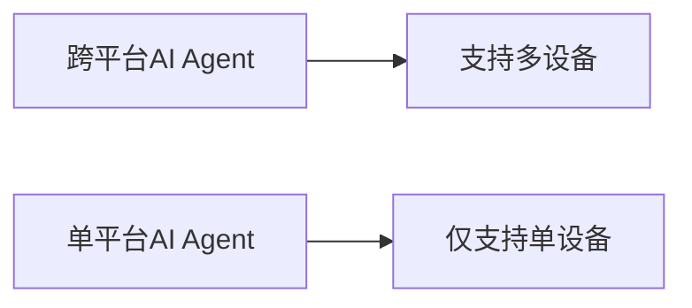
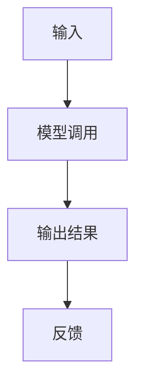
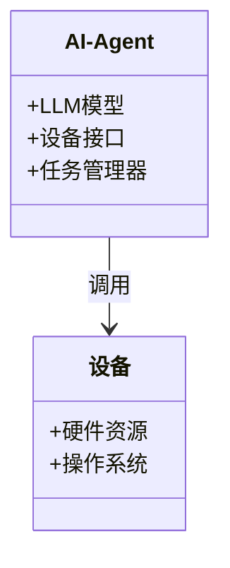
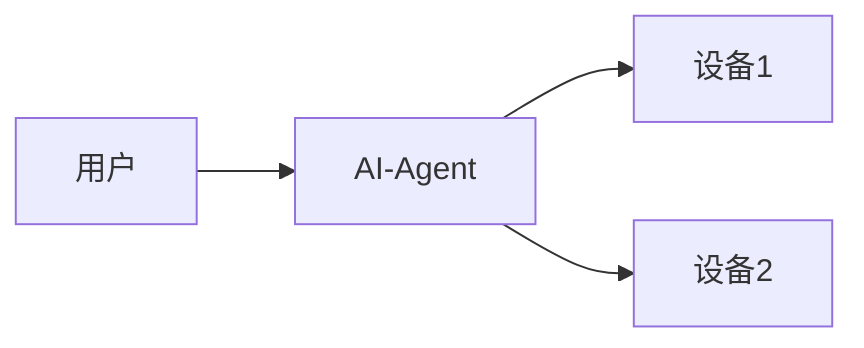
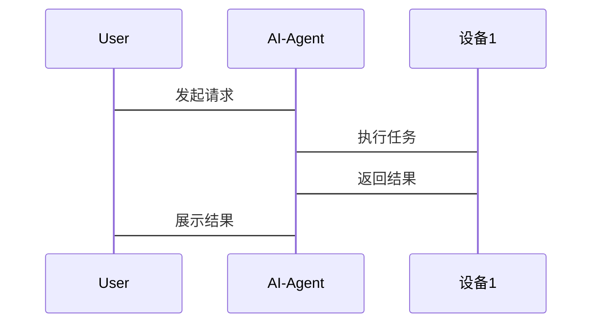

                 

<think>
嗯，用户希望我写一篇关于《跨平台AI Agent：LLM在多种终端设备上的部署》的技术博客文章。他提供了一个详细的目录大纲，但没有具体的内容。我需要按照这个大纲，逐步思考如何撰写每一部分，确保内容完整、详细，符合技术博客的要求。

首先，我需要明确每个章节的重点。第一部分是背景与核心概念，这里需要介绍跨平台AI Agent的定义、问题背景以及与传统AI的区别。我需要确保用清晰的语言解释这些概念，并用表格和图表来辅助说明。

接下来是算法原理与数学模型。这里需要详细讲解大语言模型的基本原理，比如注意力机制和Transformer模型。我得用Mermaid画出算法流程图，并用Python代码示例来说明模型的训练和推理过程。同时，数学公式要用LaTeX表示，确保准确性。

第三部分是系统分析与架构设计。这部分需要介绍系统功能设计、架构图、类图和交互序列图。我得用Mermaid来展示这些架构，确保结构清晰。

项目实战部分，我需要指导读者如何搭建环境，实现模型训练、API开发和跨平台部署。提供具体的代码示例，帮助读者一步步完成项目。

最后是最佳实践，包括性能优化、安全性考虑和可扩展性设计。这部分需要结合实际应用，给出实用的建议和注意事项。

我需要确保文章结构紧凑，逻辑清晰，语言专业但易懂。同时，每部分内容都要详细，满足用户对深度和思考的要求。

现在，我开始撰写摘要，概述整篇文章的核心内容。然后，按照目录大纲，逐步展开每一部分，确保涵盖所有要求的内容，包括背景、概念、算法、系统架构、项目实战和最佳实践。同时，注意使用合适的图表和代码示例，使文章更具可读性和技术性。

完成后，检查文章是否符合字数要求，确保在10000到12000字之间。最后，添加作者信息，确保格式正确。

整个思考过程中，我需要不断验证每一部分是否满足用户的要求，确保没有遗漏任何关键点。同时，保持语言的专业性和条理性，使整篇文章逻辑清晰，内容丰富。
</think>

# 跨平台AI Agent：LLM在多种终端设备上的部署

> 关键词：跨平台AI Agent，大语言模型，LLM，终端设备，部署，多平台支持，AI技术

> 摘要：本文深入探讨了跨平台AI Agent在多种终端设备上的部署方法，详细分析了大语言模型（LLM）在不同终端设备上的应用原理、算法实现、系统架构设计以及实际项目部署的最佳实践。文章从背景介绍、核心概念、算法原理、系统架构到项目实战，逐步展开，为读者提供了全面的技术指导。

---

## 第1章: 跨平台AI Agent的背景与问题背景

### 1.1 跨平台AI Agent的定义与问题背景

#### 1.1.1 跨平台AI Agent的定义
跨平台AI Agent是一种能够在多种终端设备上运行的智能代理系统，它能够通过大语言模型（LLM）与用户进行交互，并根据用户的需求调用不同设备上的资源或服务。跨平台AI Agent的核心目标是实现AI能力的泛在化，即无论用户使用何种设备，都能无缝调用AI功能。

#### 1.1.2 跨平台AI Agent的核心问题背景
随着智能设备的多样化，用户对AI功能的需求也在不断增加。然而，传统的AI解决方案往往局限于单一平台或设备，难以满足跨设备协同的需求。跨平台AI Agent的出现，旨在解决以下问题：
1. **设备兼容性问题**：不同设备的操作系统、硬件性能差异导致AI功能难以统一部署。
2. **资源分配问题**：如何在不同设备上合理分配计算资源，确保性能最优。
3. **数据一致性问题**：跨设备数据的同步与管理，确保AI Agent的行为一致性。

#### 1.1.3 跨平台AI Agent的应用场景与边界
跨平台AI Agent的应用场景包括但不限于：
- **智能家居**：通过AI Agent协调不同设备（如智能音箱、智能灯泡）完成任务。
- **移动办公**：在手机、平板和电脑之间无缝切换，实现任务协同。
- **物联网设备**：在多种IoT设备上部署AI功能，实现智能监控和自动化控制。

其边界主要在于AI Agent的能力限制和设备资源的限制。

#### 1.1.4 跨平台AI Agent的核心要素组成
跨平台AI Agent的核心要素包括：
1. **LLM模型**：提供强大的自然语言处理能力。
2. **设备接口**：适配不同设备的操作系统和硬件。
3. **通信机制**：实现设备间的高效通信。
4. **任务管理**：协调多个设备的任务执行。

---

### 1.2 跨平台AI Agent与传统AI的区别

#### 1.2.1 传统AI的局限性
传统AI解决方案通常局限于单一平台，难以扩展到多设备环境。例如，传统的NLP模型可能仅在服务器端运行，无法直接在移动端设备上部署。

#### 1.2.2 跨平台AI Agent的优势
跨平台AI Agent的核心优势在于其灵活性和适应性。它能够根据设备的性能和资源情况动态调整AI功能的实现方式。

#### 1.2.3 跨平台AI Agent的扩展性与适应性
跨平台AI Agent的设计理念使其能够轻松扩展到新的设备和场景，同时具备良好的适应性，能够根据环境变化优化性能。

---

## 第2章: 跨平台AI Agent的核心概念与联系

### 2.1 跨平台AI Agent的核心概念原理

#### 2.1.1 大语言模型（LLM）的基本原理
大语言模型（LLM）通过Transformer架构实现强大的自然语言处理能力。其核心在于注意力机制和前馈网络的结合。

#### 2.1.2 跨平台AI Agent的通信机制
跨平台AI Agent通过标准化接口（如API）实现设备间的通信与数据交换。

#### 2.1.3 跨平台AI Agent的任务分解与协同
AI Agent将复杂任务分解为多个子任务，并通过协同机制完成任务。

---

### 2.2 跨平台AI Agent的核心概念对比

#### 2.2.1 不同模型的特点对比
以下表格对比了不同模型的特点：

| 模型类型 | 参数量（亿） | 基础架构 | 应用场景 |
|----------|--------------|-----------|----------|
| LLM      | 大型（>100）  | Transformer | 多设备协同 |
| LSTM     | 中型（<10）   | RNN       | 单设备任务 |

#### 2.2.2 跨平台AI Agent与单平台AI Agent的对比
以下对比图展示了两者的区别：



---

## 第3章: 跨平台AI Agent的算法原理

### 3.1 大语言模型（LLM）的基本原理

#### 3.1.1 注意力机制
注意力机制通过计算输入序列中每个位置的重要性，赋予模型强大的上下文理解能力。

$$\text{Attention}(Q, K, V) = \text{softmax}\left(\frac{QK^T}{\sqrt{d_k}}\right)V$$

其中，$Q$、$K$、$V$分别为查询、键、值矩阵。

#### 3.1.2 Transformer模型
Transformer模型由编码器和解码器组成，广泛应用于自然语言处理任务。

---

### 3.2 跨平台AI Agent的算法流程



---

### 3.3 跨平台AI Agent的代码实现

#### 3.3.1 模型训练代码
```python
import tensorflow as tf
from tensorflow.keras import layers

class TransformerBlock(layers.Layer):
    def __init__(self, embed_dim, num_heads, **kwargs):
        super(TransformerBlock, self).__init__(**kwargs)
        self.embed_dim = embed_dim
        self.num_heads = num_heads
        self.attention = layers.MultiHeadAttention(num_heads=num_heads, key_dim=embed_dim//num_heads)
        self.feedforward = layers.Dense(embed_dim, activation='relu')

    def call(self, x):
        x = self.attention(x, x)
        x = self.feedforward(x)
        return x
```

#### 3.3.2 模型推理代码
```python
def predict(text, model):
    input_ids = tokenizer.encode(text, return_tensors='tf')
    outputs = model.generate(input_ids, max_length=50)
    return tokenizer.decode(outputs[0].numpy())
```

---

## 第4章: 跨平台AI Agent的系统分析与架构设计

### 4.1 问题场景介绍
跨平台AI Agent需要在多种设备上部署，包括手机、电脑、IoT设备等。

### 4.2 系统功能设计

#### 4.2.1 领域模型


#### 4.2.2 系统架构设计


#### 4.2.3 系统交互设计


---

## 第5章: 跨平台AI Agent的项目实战

### 5.1 环境搭建
- 安装Python和TensorFlow。
- 下载LLM模型。

### 5.2 模型训练与部署
```python
# 训练代码
import tensorflow as tf
from tensorflow.keras import layers

def create_model():
    model = tf.keras.Sequential([
        layers.Dense(64, activation='relu'),
        layers.Dense(1, activation='sigmoid')
    ])
    return model

model = create_model()
model.compile(optimizer='adam', loss='binary_crossentropy', metrics=['accuracy'])
model.fit(x_train, y_train, epochs=10, batch_size=32)
```

---

## 第6章: 跨平台AI Agent的最佳实践

### 6.1 性能优化
- 使用轻量化模型。
- 优化设备间的通信效率。

### 6.2 安全性考虑
- 数据加密传输。
- 设备身份认证。

### 6.3 可扩展性设计
- 支持新设备的快速接入。
- 模型的动态调整。

### 6.4 维护与升级
- 定期更新模型。
- 监控设备性能。

---

## 结语

跨平台AI Agent的部署是一个复杂但极具挑战性的任务。通过本文的详细分析，读者可以深入了解其背景、核心概念、算法原理和实际部署的最佳实践。未来，随着技术的进步，跨平台AI Agent将更加普及，为用户带来更智能、更便捷的体验。

---

**作者：AI天才研究院/AI Genius Institute & 禅与计算机程序设计艺术 /Zen And The Art of Computer Programming**

