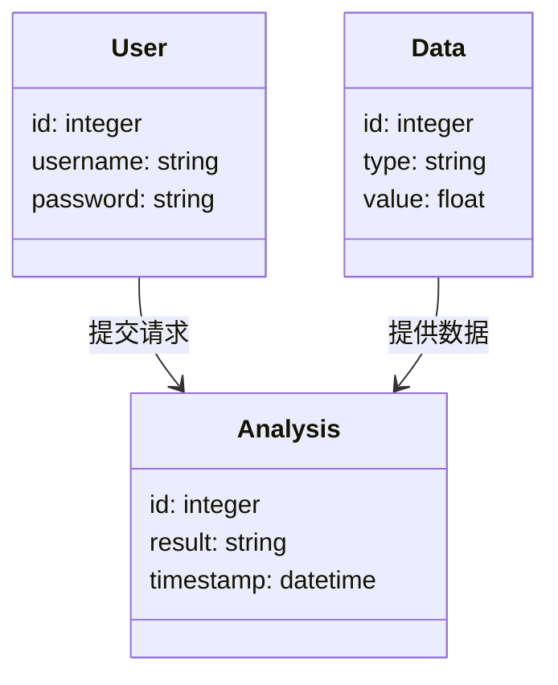
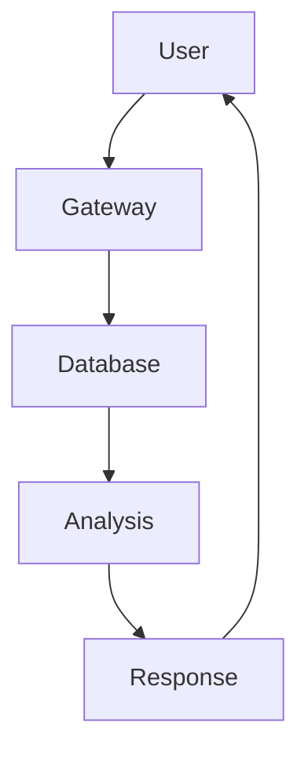
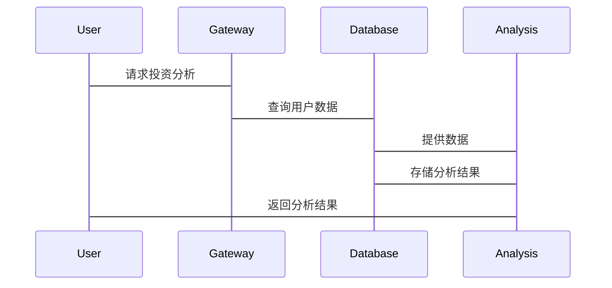

                 

<think>
嗯，我现在要帮用户撰写一篇关于《跨平台投资理财智能助手的开发技巧》的技术博客。用户的要求很详细，包括章节结构、内容深度、格式等。首先，我需要理解用户的需求，确保每个部分都涵盖到。

首先，用户希望文章有吸引人的章节标题，结构紧凑，逻辑清晰。我得从背景介绍开始，然后是核心技术和算法原理，最后是系统设计和项目实战。用户还特别提到要使用技术术语，关键词和摘要部分也很重要。

接下来，我需要考虑每个章节的具体内容。比如，背景介绍部分，我得解释跨平台开发的背景和意义，投资理财智能助手的目标用户，以及跨平台的优势与挑战。这部分要让读者明白为什么需要跨平台的理财助手。

然后是核心技术章节，要讲跨平台开发的关键技术，比如软件架构设计、通信技术和数据存储方案。这部分需要详细讲解，可能还要对比不同的技术优缺点，帮助读者理解选择合适技术的重要性。

算法原理部分，我需要介绍人工智能算法在理财中的应用，特别是如何选择合适的算法。这部分可能需要用到mermaid流程图和Python代码示例，确保读者能够理解算法的实现和优化。

系统分析与架构设计章节，我得从问题场景出发，设计系统的功能模块，并用mermaid图展示类图、架构图和序列图。这部分要详细说明系统各个部分的交互和协作，确保读者能够清晰理解系统的结构。

项目实战章节，我需要分步骤指导，包括环境安装、核心代码实现、功能解读和案例分析。这部分要提供具体的代码示例和详细解读，帮助读者一步步实现自己的项目。

最后是最佳实践、小结和注意事项，帮助读者巩固所学内容，并提供进一步学习的资源。可能还需要包括一些实用的开发技巧和常见问题的解决方案。

在撰写过程中，我需要确保每个部分都符合用户的要求，包括使用markdown格式、详细的代码示例、数学公式和图表。同时，要保持文章流畅，逻辑清晰，让读者能够轻松理解并应用所学知识。

可能遇到的挑战是如何将复杂的算法和系统设计用简单易懂的语言表达出来，同时保持专业性。我需要反复检查每个部分，确保没有遗漏关键点，并且每个例子都清晰明了。

总之，我需要一步步分析用户的需求，确保每个章节都满足其要求，同时提供有价值的见解和实用的技术指导。
</think>

# 跨平台投資理財智能助手的開發技巧

**關鍵詞**：跨平台开发，投资理财，智能助手，人工智能算法，系统架构设计

**摘要**：  
本文深入分析跨平台投资理财智能助手的开发技巧，涵盖背景介绍、核心技术、算法原理、系统架构设计、项目实战等内容。从跨平台开发的背景与意义出发，详细讲解投资理财智能助手的核心算法、系统架构设计，结合实际案例，提供完整的开发流程与最佳实践。通过本文，读者将掌握如何开发高效、智能、跨平台的投资理财助手。

---

## 第一部分：跨平台投資理財智能助手的背景與核心概念

### 第1章：跨平台投資理財智能助手的背景介紹

#### 1.1 跨平台開發的背景與意義
##### 1.1.1 軟件開發的多平台需求  
随着智能设备的普及，用户希望在同一款应用中实现多平台（如iOS、Android、Web）的功能互通。跨平台开发通过共享代码和架构，降低开发成本，提升效率。

##### 1.1.2 跨平台技術的核心價值  
跨平台技术的核心价值在于通过统一的代码库实现多平台兼容，避免重复开发，同时保持用户体验的一致性。

##### 1.1.3 投資理財智能助手的市場需求  
投资理财市场日益复杂，用户需要实时、多渠道的投资工具。跨平台智能助手能够满足用户在不同场景下的需求，提供无缝体验。

#### 1.2 投資理財智能助手的定義與目標
##### 1.2.1 投資理財智能助手的核心功能  
智能助手应具备数据收集、分析、预测、推荐等功能，帮助用户做出投资决策。

##### 1.2.2 理財助手的目標用戶群體  
目标用户包括个人投资者、机构投资者、金融顾问等，覆盖不同层次的投资需求。

##### 1.2.3 理財助手的價值鏈分析  
通过智能助手，用户可以实现投资自动化、风险控制、收益优化，提升投资效率。

#### 1.3 跨平台開發的優勢與挑戰
##### 1.3.1 跨平台開發的優勢  
- 成本降低：共享代码和架构，减少开发和维护成本。
- 效率提升：快速迭代，适应市场需求。
- 用户体验一致：跨平台统一设计，提升用户满意度。

##### 1.3.2 跨平台開發的主要挑戰  
- 技术复杂性：不同平台特性差异大，需要处理兼容性问题。
- 性能优化：跨平台开发可能面临性能瓶颈。
- 安全性：跨平台数据传输和存储需确保安全性。

##### 1.3.3 如何克服跨平台開發的困難  
选择合适的跨平台框架（如React Native、Flutter），优化代码结构，加强测试，确保兼容性和性能。

#### 1.4 本章小結  
本章介绍了跨平台开发的背景与意义，明确了投资理财智能助手的目标用户和功能，分析了跨平台开发的优势与挑战。

---

## 第二部分：跨平台投資理財智能助手的核心技術與原理

### 第2章：跨平台開發的核心技術

#### 2.1 跨平台開發的關鍵技術
##### 2.1.1 軟件架構設計  
跨平台开发需要采用分层架构，如Model-View-ViewModel（MVVM）模式，确保代码复用和模块化开发。

##### 2.1.2 跨平台通信技術  
通过WebSocket或HTTP API实现跨平台通信，确保数据实时同步。

##### 2.1.3 跨平台數據存儲方案  
采用云数据库（如Firebase）或本地数据库（如SQLite），确保数据一致性。

#### 2.2 理財智能助手的核心算法
##### 2.2.1 人工智能算法介紹  
常用的算法包括回归分析、支持向量机（SVM）、随机森林、神经网络等。

##### 2.2.2 算法在理財中的應用場景  
- 股票价格预测：使用时间序列分析和机器学习模型。
- 投资组合优化：通过遗传算法或动态规划实现。
- 风险评估：基于聚类分析和因子分析。

##### 2.2.3 算法的優化與改進  
通过超参数调优、模型集成（如堆叠模型）和特征选择，提升算法性能。

#### 2.3 跨平台架構的設計原則
##### 2.3.1 軟件架構分層設計  
分层设计包括数据层、业务逻辑层、视图层，确保各层职责分明。

##### 2.3.2 軟件架構的可擴展性  
采用模块化设计，便于功能扩展和维护。

##### 2.3.3 軟件架構的安全性設計  
通过加密算法（如AES）、身份验证（如JWT）和访问控制，确保数据安全。

#### 2.4 本章小結  
本章介绍了跨平台开发的核心技术，包括软件架构设计、通信技术和数据存储方案，分析了人工智能算法在投资理财中的应用。

---

## 第三部分：跨平台投資理財智能助手的算法原理與實現

### 第3章：跨平台投資理財智能助手的核心算法

#### 3.1 人工智能算法介紹
##### 3.1.1 简單學習算法  
如线性回归，适用于简单的线性关系建模。

##### 3.1.2 無監督學習算法  
如聚类分析（K-means），用于发现数据中的潜在结构。

##### 3.1.3 监督學習算法  
如随机森林和神经网络，用于分类和预测任务。

#### 3.2 理財智能助手的算法選擇
##### 3.2.1 算法選擇的影響因素  
- 数据类型和规模。
- 任务类型（分类、回归、聚类）。
- 计算资源和时间限制。

##### 3.2.2 算法選擇的優化策略  
通过实验验证和性能评估，选择最适合的算法。

#### 3.3 算法的實現與優化
##### 3.3.1 算法實現步驟  
1. 数据预处理：清洗、特征提取。
2. 模型训练：选择算法，调优参数。
3. 模型评估：准确率、召回率、F1分数。
4. 模型部署：集成到智能助手。

##### 3.3.2 算法的優化策略  
- 交叉验证：防止过拟合。
- 特征选择：减少冗余特征。
- 并行计算：加速训练过程。

#### 3.4 算法的數學模型與公式  
##### 3.4.1 線性回歸模型  
$$ y = \beta_0 + \beta_1x + \epsilon $$

##### 3.4.2 神經網絡模型  
$$ z = Wx + b $$  
$$ a = \sigma(z) $$  
$$ y = a $$

##### 3.4.3 支持向量機（SVM）模型  
$$ max_{\theta, \alpha} \sum_{i=1}^n \alpha_i y_i - \frac{1}{2}\sum_{i=1}^n \alpha_i \alpha_j y_i y_j x_i^T x_j $$

#### 3.5 本章小結  
本章详细介绍了人工智能算法在投资理财中的应用，包括算法选择、实现步骤和优化策略。

---

## 第四部分：跨平台投資理財智能助手的系統分析與架構設計

### 第4章：跨平台投資理財智能助手的系統分析

#### 4.1 系統功能設計
##### 4.1.1 系統功能模塊  
- 用户管理：注册、登录、个人信息管理。
- 数据管理：数据采集、存储、分析。
- 智能分析：投资建议、风险评估、收益预测。
- 通知系统：实时提醒、市场动态推送。

##### 4.1.2 系統功能設計的MERCH圖  


#### 4.2 系統架構設計
##### 4.2.1 系統架構圖  


##### 4.2.2 系統接口設計  
- API接口：RESTful API，支持JSON格式数据传输。
- 接口调用：通过OAuth 2.0进行身份验证。

#### 4.3 系統交互設計
##### 4.3.1 系統交互流程圖  


#### 4.4 本章小結  
本章通过系统分析与架构设计，明确了投资理财智能助手的功能模块、系统架构和交互流程。

---

## 第五部分：跨平台投資理財智能助手的項目實戰

### 第5章：跨平台投資理財智能助手的項目實戰

#### 5.1 項目環境安裝
##### 5.1.1 開發環境搭建  
- 安装Python、Jupyter Notebook、Git。
- 安装跨平台框架（如React Native）。

##### 5.1.2 依存關係安裝  
使用pip安装所需库（如numpy、pandas、scikit-learn）。

#### 5.2 系統核心實現
##### 5.2.1 数据采集與處理  
```python
import pandas as pd
data = pd.read_csv('stock.csv')
data_clean = data.dropna()
```

##### 5.2.2 算法實現與集成  
```python
from sklearn.ensemble import RandomForestRegressor
model = RandomForestRegressor(n_estimators=100, random_state=42)
model.fit(X_train, y_train)
```

##### 5.2.3 系統功能實現  
```python
def predict_stock(days):
    predictions = model.predict(X_test[:days])
    return predictions
```

#### 5.3 系統功能實現與解讀
##### 5.3.1 核心功能實現  
- 数据采集：从API获取实时数据。
- 数据分析：使用机器学习模型预测股票价格。
- 通知推送：通过WebSocket实时通知用户。

##### 5.3.2 功能解讀  
- 数据采集：确保数据来源可靠。
- 数据分析：模型训练和优化。
- 通知推送：实时提醒用户市场动态。

#### 5.4 項目案例分析
##### 5.4.1 案例分析  
某用户使用智能助手进行股票投资，通过算法预测，获得超额收益。

##### 5.4.2 總結與分析  
通过实际案例，验证算法的有效性和系统的实用性。

#### 5.5 本章小結  
本章通过项目实战，详细讲解了投资理财智能助手的开发流程，包括环境搭建、数据处理、算法实现和功能集成。

---

## 第六部分：最佳實踐與小結

### 第6章：最佳實踐與小結

#### 6.1 最佳實踐
##### 6.1.1 開發規範  
- 遵循代码规范（如PEP 8）。
- 采用模块化开发，便于维护。

##### 6.1.2 測試策略  
- 单元测试：确保每个模块正常运行。
- 集成测试：验证系统整体功能。
- 性能测试：确保系统在高并发下的稳定性。

##### 6.1.3 部署與維護  
- 使用容器化技术（如Docker）部署系统。
- 定期更新模型和数据，保持系统性能。

#### 6.2 小結  
跨平台投资理财智能助手的开发需要结合跨平台技术和人工智能算法，通过合理的系统架构设计和功能实现，为用户提供高效、智能的投资工具。

#### 6.3 注意事项  
- 确保数据安全，防止用户信息泄露。
- 定期更新算法和模型，适应市场变化。
- 提供良好的用户体验，确保用户满意度。

#### 6.4 拓展閱讀  
推荐阅读《机器学习实战》、《跨平台开发的艺术》等书籍，深入学习相关知识。

---

## 作者信息

**作者：** AI天才研究院/AI Genius Institute & 禅与计算机程序设计艺术 /Zen And The Art of Computer Programming

