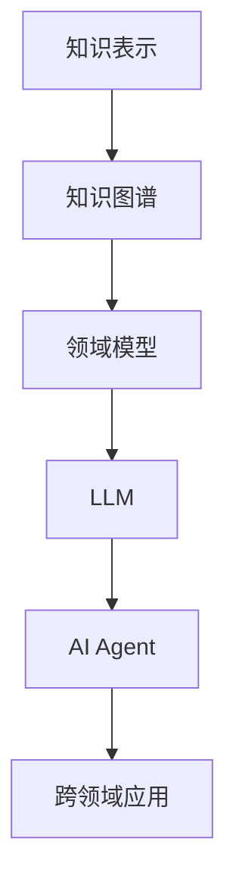
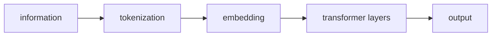
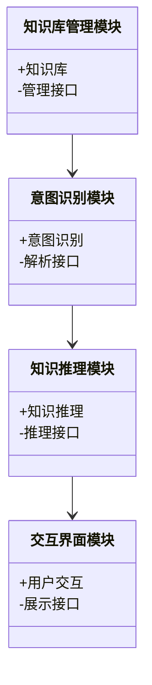

                 


# 跨领域知识融合AI Agent：LLM的跨学科应用

> 关键词：跨领域知识融合，AI Agent，大语言模型，LLM，知识图谱，跨学科应用

> 摘要：本文探讨了跨领域知识融合AI Agent的构建与应用，重点分析了大语言模型（LLM）在跨学科场景中的应用潜力。通过详细的技术分析、系统设计和项目实战，展示了如何利用LLM实现跨领域知识的高效整合与应用。

---

## 第1章: 背景介绍

### 1.1 跨领域知识融合的背景与问题背景

#### 1.1.1 跨领域知识融合的必要性
随着人工智能技术的快速发展，跨领域知识融合的重要性日益凸显。传统的单一领域AI系统难以应对复杂现实场景中的多样化需求，而跨领域知识融合可以通过整合多个领域的知识，提升AI系统的综合能力。

#### 1.1.2 问题背景的描述
在实际应用中，许多问题需要跨领域知识的支持。例如，在医疗领域，可能需要结合医学知识和患者行为数据；在金融领域，可能需要结合经济指标和市场情绪分析。这些问题的解决需要AI系统能够理解并整合多个领域的知识。

#### 1.1.3 问题解决的思路
跨领域知识融合的核心思路是将不同领域中的知识进行表示、整合和推理。通过构建统一的知识表示模型，AI系统可以更好地理解和处理跨领域问题。

#### 1.1.4 跨领域知识融合的边界与外延
跨领域知识融合的边界在于不同领域的知识如何有效整合，以及如何避免信息冲突。外延则包括从知识表示到实际应用的全过程。

#### 1.1.5 核心概念的结构与组成
跨领域知识融合的核心概念包括知识表示、知识图谱、AI Agent、LLM等。这些概念通过特定的算法和架构实现跨领域知识的融合与应用。

### 1.2 跨领域知识融合的核心要素

#### 1.2.1 知识表示与知识图谱
知识表示是跨领域知识融合的基础。知识图谱通过实体和关系的形式，将不同领域的知识整合到统一的语义空间中。

#### 1.2.2 领域模型与领域知识库
领域模型描述了特定领域的知识结构，领域知识库则存储了该领域的具体知识。

#### 1.2.3 大语言模型（LLM）的作用
LLM通过大规模预训练，具备处理多种语言和领域的能力，是实现跨领域知识融合的重要工具。

#### 1.2.4 AI Agent的定义与功能
AI Agent是一种能够感知环境、执行任务并进行决策的智能体。它通过整合跨领域知识，能够更好地完成复杂任务。

#### 1.2.5 跨领域知识融合的实现机制
跨领域知识融合的实现机制包括知识抽取、知识表示、知识推理和知识应用等步骤。

---

## 第2章: 跨领域知识融合的核心概念与联系

### 2.1 LLM与AI Agent的核心原理

#### 2.1.1 LLM的基本原理
LLM通过大规模数据训练，掌握了多种语言和领域的知识。其核心是基于Transformer的模型结构，能够进行自适应的学习和推理。

#### 2.1.2 AI Agent的定义与功能
AI Agent通过感知环境和执行任务，能够根据上下文进行决策。它需要整合跨领域知识来实现复杂任务。

#### 2.1.3 跨领域知识融合的实现机制
跨领域知识融合通过知识抽取、表示、推理和应用，将不同领域的知识整合到统一的模型中。

#### 2.1.4 知识表示与知识图谱的构建
知识表示通过图结构将实体和关系表示出来，知识图谱则是多个领域知识的整合。

### 2.2 核心概念的属性特征对比

| 比较维度       | LLM               | AI Agent          |
|----------------|-------------------|-------------------|
| 核心功能       | 处理自然语言      | 感知与执行任务    |
| 跨领域能力     | 强               | 强               |
| 知识表示方式     | 基于Transformer    | 基于知识图谱       |
| 应用场景       | 语言生成与理解    | 多领域任务处理    |

### 2.3 实体关系图与架构设计



---

## 第3章: 跨领域知识融合的算法原理

### 3.1 跨领域知识融合的算法原理

#### 3.1.1 知识表示与融合的算法选择
跨领域知识融合通常采用基于图的表示方法，结合注意力机制进行知识推理。

#### 3.1.2 LLM的训练与推理过程
使用Mermaid流程图展示LLM的训练和推理过程：



#### 3.1.3 算法的数学模型和公式
LLM的数学模型基于Transformer结构：

$$
\text{Encoder}(x) = \text{LayerNorm}(x + \text{Attention}(x))
$$

---

## 第4章: 系统分析与架构设计

### 4.1 问题场景介绍

#### 4.1.1 项目介绍
构建一个基于LLM的跨领域知识融合AI Agent，用于医疗、金融等领域的知识整合与应用。

### 4.2 系统功能设计

#### 4.2.1 系统功能模块
- 知识库管理模块
- 意图识别模块
- 知识推理模块
- 交互界面模块

#### 4.2.2 领域模型设计


---

## 第5章: 项目实战

### 5.1 环境安装

```bash
pip install transformers
pip install pymermaid
pip install matplotlib
```

### 5.2 系统核心实现

```python
from transformers import AutoTokenizer, AutoModelForMaskedLM
import torch

model_name = "bert-base-uncased"
tokenizer = AutoTokenizer.from_pretrained(model_name)
model = AutoModelForMaskedLM.from_pretrained(model_name)

def encode_plus(text):
    return tokenizer(text, padding=True, truncation=True, max_length=512, return_tensors='pt')

def decode_ids(ids):
    return tokenizer.decode(ids[0].tolist())

input_text = "The company [MASK] was founded in [MASK]."
inputs = tokenizer(input_text, return_tensors="pt", padding=True, truncation=True, max_length=512)
outputs = model(**inputs)
mask_token_indices = (inputs.input_ids == tokenizer.mask_token_id).nonzero().tolist()[0]

predicted_tokens = decode_ids(outputs.logits[mask_token_indices])
print(predicted_tokens)
```

### 5.3 代码功能解读

```python
# 输入文本编码
def encode_plus(text):
    return tokenizer(text, padding=True, truncation=True, max_length=512, return_tensors='pt')

# 解码函数
def decode_ids(ids):
    return tokenizer.decode(ids[0].tolist())

# 模型预测
input_text = "The company [MASK] was founded in [MASK]."
inputs = tokenizer(input_text, return_tensors="pt", padding=True, truncation=True, max_length=512)
outputs = model(**inputs)
mask_token_indices = (inputs.input_ids == tokenizer.mask_token_id).nonzero().tolist()[0]
predicted_tokens = decode_ids(outputs.logits[mask_token_indices])
print(predicted_tokens)
```

---

## 第6章: 最佳实践

### 6.1 小结

跨领域知识融合AI Agent的实现需要结合知识表示、LLM和系统架构设计。通过本文的分析，读者可以掌握跨领域知识融合的核心原理和实际应用方法。

### 6.2 注意事项

- 知识表示的质量直接影响融合效果。
- LLM的训练数据和模型选择会影响性能。
- 系统架构设计需要考虑扩展性和可维护性。

### 6.3 拓展阅读

推荐阅读以下文献：
1. Vaswani et al. "Attention Is All You Need"
2. Devlin et al. "BERT: Pre-training of Deep Bidirectional Transformers for NLP"

---

作者：AI天才研究院/AI Genius Institute & 禅与计算机程序设计艺术 /Zen And The Art of Computer Programming

